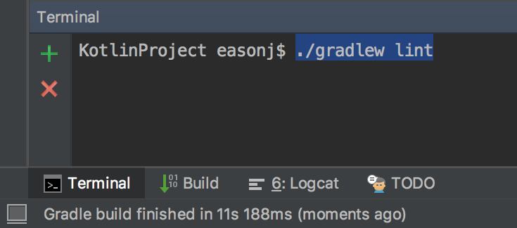
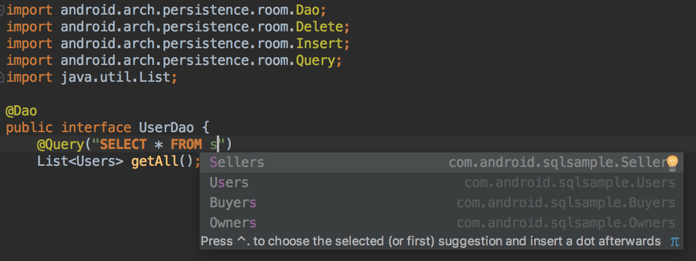
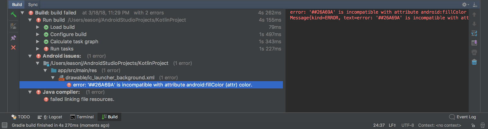
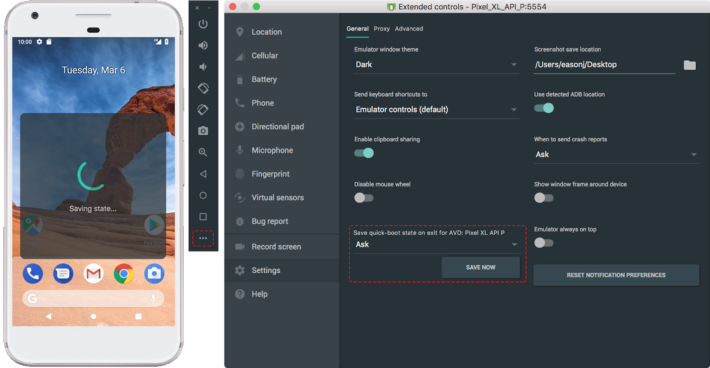
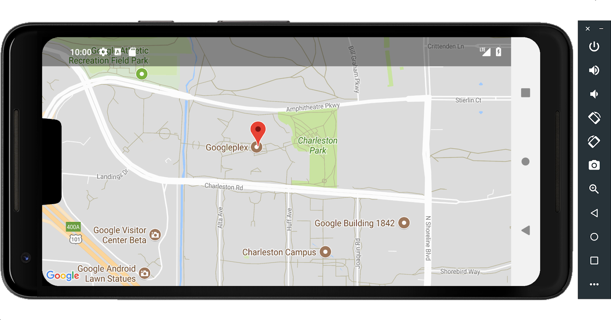
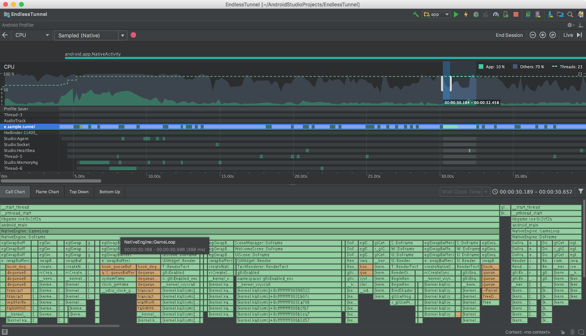
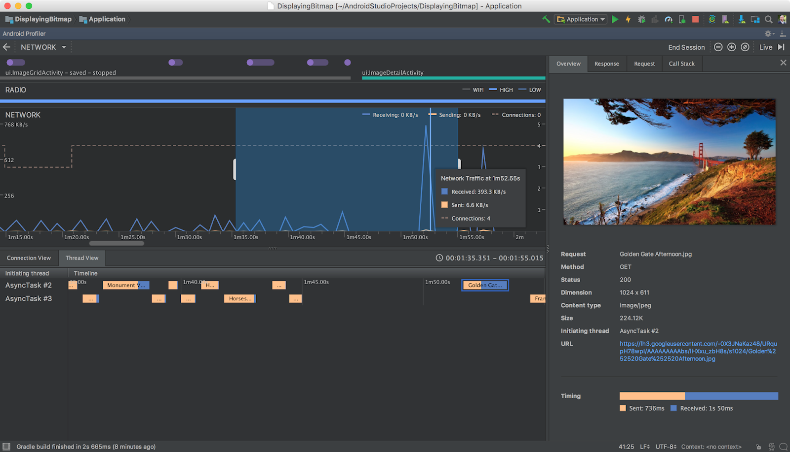

# Android Studio 3.1

原标题：Android Studio 3.1  
链接：[https://android-developers.googleblog.com/2018/03/android-studio-3-1.html](https://android-developers.googleblog.com/2018/03/android-studio-3-1.html)  
作者：[Jamal Eason](https://www.google.com/+JamalEason) (Android产品经理)  
翻译：[arjinmc](https:github.com/arjinmc)    

我们很高兴地宣布Android Studio 3.1现在可以在稳定版本频道[下载](https://developer.android.com/studio/index.html)。此版本的重点领域围绕产品质量和应用程序开发生产力。除了许多潜在的质量变化之外，我们在Android Studio 3.1中添加了几项新功能，你应该将其集成到开发流程中。

Android Studio 3.1新增了一款C++性能分析器，可帮助解决应用程序代码中的性能瓶颈问题。对于那些在你的应用中使用Room或SQLite数据库的人，我们添加了更好的代码编辑器支持来帮助你创建SQL表和查询创建语句。我们还为你的Kotlin代码添加了更好的lint支持，并使用带有Quick Boot的更新的Android模拟器加速了你的测试。如果这些功能中的任何一个听起来令人兴奋，或者你正在寻找Android Studio的下一个稳定版本，那么你应该立即下载Android Studio 3.1！

查看下面的Android Studio 3.1中的新功能列表，由关键开发者流程组织。

[视频介绍](https://youtu.be/nnnW0nehPEA)  
<i>Android Studio 3.1中的新功能</i>

## 开发

Kotlin Lint Checks - 自从去年在Android平台上宣布[官方Kotlin语言支持以来](https://android-developers.googleblog.com/2017/05/android-announces-support-for-kotlin.html)，我们将继续投资Android Studio中的Kotlin语言支持。在Android Studio 3.1中，我们增强了Lint代码质量检查，现在可以通过命令行和IDE运行它们。只需打开一个Android Studio项目，并<i>gradlew lint</i>通过命令行运行。[了解更多](https://developer.android.com/studio/write/lint.html#commandline)。

  
<i>Kotlin Lint通过命令行进行检查</i>

* <strong>数据库代码编辑</strong> - 在Android Studio 3.1中编辑Android项目中的内嵌SQL / Room数据库代码现在更容易。此版本在你的@[Query](https://developer.android.com/training/data-storage/room/accessing-data.html#query)声明中具有SQL代码完成，更好的SQL语句重构以及跨项目的SQL代码导航。[了解更多](https://developer.android.com/studio/releases/index.html#codingide)。

  
<i>Room数据库代码完成</i>

* <strong>IntelliJ平台更新</strong>：Android Studio 3.1包含IntelliJ 2017.3.3平台版本，其中包含许多新功能，如新的Kotlin语言意图和内置的SVG图像预览支持。[了解更多](https://www.jetbrains.com/idea/whatsnew/#v2017-3)。

## 构建

* <strong>D8 Dex Compiler</strong> - D8现在是Android Studio 3.1中的默认dex编译器。[替换传统的DX编译器](https://android-developers.googleblog.com/2017/08/next-generation-dex-compiler-now-in.html)，D8 dex是一种引导下的APK编译步骤，它可以缩小应用程序的尺寸，实现精确的步骤调试，并且多次提高构建速度。确保你的gradle.properties或者没有<i>android.enableD8</i>标志，或者确保它设置为true。 [了解更多](https://developer.android.com/studio/releases/gradle-plugin.html#D8)。

* <strong>新的构建输出窗口</strong> - Android Studio 3.1有一个更新的构建输出窗口，它在新的树视图中组织生成状态和错误。此更改还将传统的Gradle输出合并到此新窗口中。[了解更多](http://d.android.com/studio/run/index.html#gradle-console)。

  
<i>新建构建输出窗口</i>

## 测试

* <strong>快速启动</strong> - 快速启动允许你在6秒内恢复你的Android模拟器会话。Android模拟器上的慢启动时间是我们听到的一个主要难点，Quick Boot解决了这个问题。与实际的Android设备一样，仿真器必须执行初始冷启动，但后续启动很快。该功能默认为所有Android虚拟设备启用。此外，在本版本中，你可以更好地控制何时使用快速启动以及在模拟器设置页面下按需保存快速启动状态的功能。 [了解更多其他主要Android模拟器功能](https://android-developers.googleblog.com/2017/12/quick-boot-top-features-in-android.html)。

  
<i>快速启动按需设置</i>

* <strong>系统映像和无框设备外观</strong> - 最新版Android模拟器现在支持API 24（Nougat） - API 27（Oreo）仿真器系统映像以及P开发者预览版上的Google Play Store和Google API。此外，设备模拟器皮肤更新为以新的无框模式工作，这可以帮助你以[18：9屏幕宽高比](https://android-developers.googleblog.com/2017/03/update-your-app-to-take-advantage-of.html)或Android P开发者预览[DisplayCutout](https://developer.android.com/reference/android/view/DisplayCutout.html)API测试你的应用。[了解更多](https://developer.android.com/studio/releases/emulator.html#27-1-8)。

  
<i>Android模拟器中的无窗口模式</i>

## 优化

C++ CPU分析 - 去年，我们推出了一套全新的[Android分析器](http://d.android.com/studio/profile/android-profiler.html)，用于测量应用程序中的CPU，内存和网络活动。使用Android Studio 3.1，除了性能分析你的Kotlin和Java语言应用程序代码外，你现在可以在你的应用程序中剖析你的C++代码。使用[simpleperf](https://developer.android.com/ndk/guides/simpleperf.html)作为后台，C++分析器允许你记录C++方法跟踪。[了解更多](https://d.android.com/studio/profile/cpu-profiler.html)。

  
<i>C++ CPU分析器</i>

* <strong>网络分析器更新</strong>：线程和网络请求 - 为了协助分析应用程序中的网络流量，我们添加了一个新的网络线程视图来检查多线程网络流量，并且我们还添加了一个新的网络请求标签，以深入挖掘网络请求。通过Network Profiler的这些更新，你将拥有额外的工具来跟踪每个线程的网络流量，并通过网络调用堆栈一路下载网络请求。[了解更多](http://d.android.com/studio/profile/network-profiler.html)。

  
<i>支持线程的网络分析器</i>

回顾一下，Android Studio 3.1包含这些新的主要功能：

### 开发

* Kotlin Lint检查
* 数据库代码编辑
* IntelliJ平台更新

### 构建

* D8 Dex编译器
* 新建构建输出窗口

### 测试和调试

* Android模拟器快速启动
* 包含Google Play仿真器系统映像的API 27
* Android模拟器的窗口无框模式

### 优化

* C ++分析器
* 网络分析器 - 线程支持
* 网络分析器 - 请求支持

查看[发布说明](https://developer.android.com/studio/releases/index.html#3-1-0)以获取更多详细信息。

## 入门

### 下载

如果你使用的是旧版Android Studio，则可以立即升级到Android Studio 3.1，也可以从官方Android Studio[下载页面](https://developer.android.com/studio/index.html)下载更新。

我们非常感谢你所喜欢的事物，希望看到你的问题或功能的任何反馈。如果你发现错误或问题，请随时[提出问题](https://source.android.com/source/report-bugs#developer-tools)。请在我们的[Google+](https://plus.google.com/103342515830390186255)信息页或[Twitter](http://www.twitter.com/androidstudio)上与我们联系 - Android Studio开发团队。