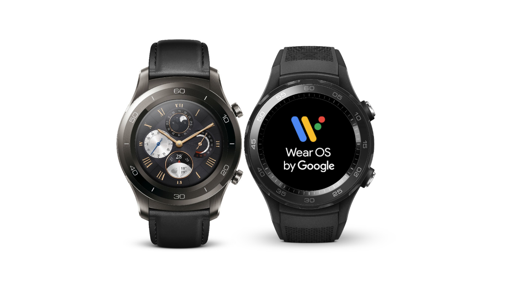

# Wear OS Google开发者预览版

原标题：Wear OS by Google developer preview  
链接：[https://android-developers.googleblog.com/2018/03/wear-os-by-google-developer-preview.html](https://android-developers.googleblog.com/2018/03/wear-os-by-google-developer-preview.html)  
作者：[Hoi Lam](https://twitter.com/hoitab) (Google Wear OS 开发者倡导者)   
翻译：[arjinmc](https://github.com/arjinmc)  

  

今天，我们通过Google开发者预览版发布了Wear OS，并将Android P平台功能带入可穿戴设备。开发者预览包括官方Android模拟器上更新的系统映像以及华为Watch Watch 2蓝牙或华为Watch Watch 2 Classic蓝牙的可下载系统映像。此初始版本仅供开发者使用，不适用于日常或消费者使用。因此，它只能通过手动下载和闪光。在[下载并刷新设备](https://developer.android.com/wear/releases/wear-preview-downloads.html)之前，请参阅[发布说明](https://developer.android.com/wear/releases/index.html)以了解已知问题。

在本发布版中，我们想强调开发者应该注意的以下功能：

* <strong>[与非SDK方法和字段有关的限制](https://g.co/dev/appcompat)</strong>：为了提高应用程序兼容性，Android P已经开始限制对非SDK方法和字段的访问。开发者应该制定计划从这些方面迁移出去。如果你的使用案例没有公共对等物，[请告诉我们](https://issuetracker.google.com/issues/new?component=328403&template=1027267)。  
* <strong>黑暗UI系统主题</strong>：为了增强可浏览性，自今年年初以来，Wear OS已切换为具有较暗/黑色背景的UI主题，用于通知流和系统启动器。这现在也是系统主题的默认设置，并且应该可以提高Wear应用程序的可浏览性。开发者应该在更改后检查应用程序UI的可访问性。
* <strong>有限的后台活动</strong>：为了提高功能，应用程序将不再被允许在后台运行，除非手表位于充电器上。开发者应该注意到Wear OS与其他一些外形因素相比，Android的[应用程序待机](https://developer.android.com/training/monitoring-device-state/doze-standby.html#understand_app_standby)功能还在继续。例外情况包括用户当前选择的[表盘](https://developer.android.com/training/wearables/watch-faces/index.html)和[复杂化](https://developer.android.com/training/wearables/watch-faces/exposing-data-complications.html)。此功能将在开发者预览中逐步推出，因此你可能无法立即在设备上看到它，但应通过移除后台服务来相应地构建你的应用程序。
* <strong>关闭机身时关闭收音机</strong>：为了提高电量，当手表长时间处于关闭状态时，将关闭蓝牙，WiFi和手机收音机。同样，此功能将逐渐推出，因此你最初可能无法在设备上看到它。如果此功能在你的开发过程中引发了挑战，则可以通过adb禁用该功能; 请按照[发布说明](https://developer.android.com/wear/releases/index.html)中的说明进行操作。
* <strong>断开BT时WiFi关闭</strong>：为了提高功率，断开蓝牙时，设备将不再自动连接到WiFi。例外情况包括如果应用程序请求高带宽网络或者手表在充电器上。此功能将逐渐推出，因此你最初可能无法在设备上看到它。

### 请将你的反馈意见给我们

我们希望在最终的产品发布前提供几个更新。如果发现的任何bug，请通过提交[Wear OS Google问题跟踪器](https://issuetracker.google.com/issues/new?component=192711&template=840908)。你提交的越早，我们可以在最终版本中包含修复程序的可能性就越高。