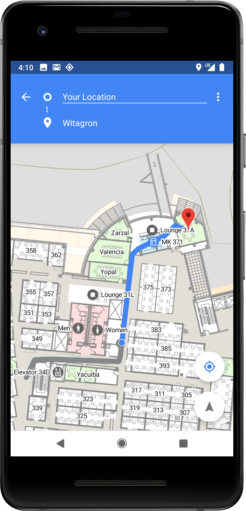
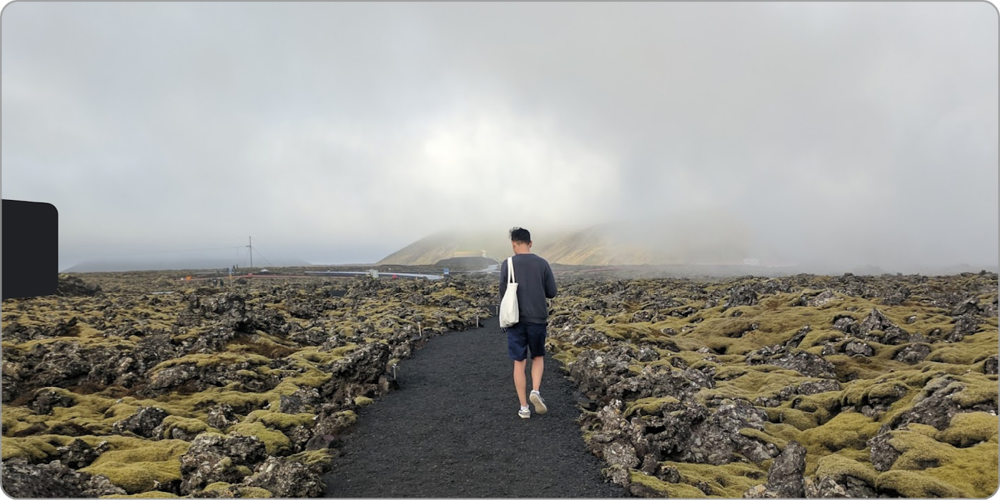
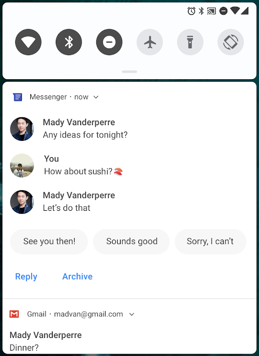
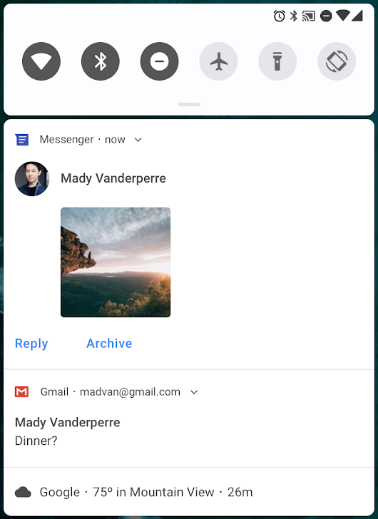
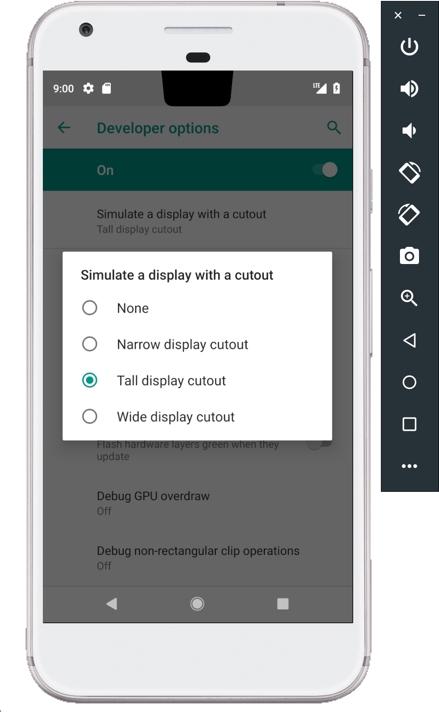

# 预览Android P

原标题：Previewing Android P  
链接：[https://android-developers.googleblog.com/2018/03/previewing-android-p.html](https://android-developers.googleblog.com/2018/03/previewing-android-p.html)  
作者：Dave Burke (工程副总裁)  
翻译：[arjinmc](https://github.com/arjinmc)  

上周在移动世界大会上，我们看到Android的开发者，设备制造商和芯片合作伙伴的生态系统继续为全球用户带来惊喜的体验。

展望未来，今天我们将分享最新版本系统[Android P](https://developer.android.com/preview/index.html)的首个开发者预览。这是仅为开发者提供的早期基线构建 - 你是我们最值得信赖的审阅者和测试人员;-)我们开发者社区的早期反馈对帮助我们发展平台以满足你的需求至关重要。我们很乐意让你开始练习P中的新功能和API，并且一如既往，我们依靠你的早期反馈和想法，请[给我们你的建议](https://developer.android.com/preview/feedback.html)！

Android P的首次开发者预览仅仅是一个开始 - 我们将在5月份在[Google I / O](https://events.google.com/io/)上分享更多内容，请继续关注！

## 在你的应用中尝试的新功能

以下是我们希望你尝试并[反馈](https://developer.android.com/preview/feedback.html)的Android P第一次预览中的一些很酷的功能。

### 带有Wi-Fi RTT的室内定位

  

精确的室内定位一直是一个长期的挑战，为定位服务开创了新的机遇。Android P增加了对IEEE 802.11mc WiFi协议的平台支持 - 也称为WiFi往返时间（RTT） - 可让你充分利用应用中的室内定位。

在支持硬件支持，位置权限和位置的Android P设备上，你的应用可以使用[RTT API](https://developer.android.com/reference/android/net/wifi/rtt/package-summary.html)来测量与附近WiFi接入点（AP）的距离。设备不需要连接到接入点以使用RTT，并且为了保持隐私，只有电话能够确定距离，而不是接入点。

知道与3个或更多接入点的距离，你可以以1到2米的精度计算设备位置。有了这个准确性，你可以创建新的体验，如建筑物内的导航; 细粒度的基于位置的服务，如消除语音控制（例如，“开灯”）; 和基于位置的信息（例如，'这个产品是否有特别优惠？'）。

### 显示Cutout支持

现在应用程序可以充分利用全屏幕内容的最新设备屏幕。我们在平台中添加了展示剪辑，以及可用于管理内容展示方式的API。

Cutout支持可以无缝地应用于应用程序，系统管理状态栏高度可将你的内容与剪贴画分离。如果你有紧贴，环绕的内容，则还可以使用[新的API](https://developer.android.com/reference/android/view/DisplayCutout.html)检查剪切形状并请求围绕它的全屏布局。你可以通过调用[getDisplayCutout()](https://developer.android.com/reference/android/view/WindowInsets.html#getDisplayCutout())来检查当前设备是否具有剪切区域，然后使用[DisplayCutout](https://developer.android.com/reference/android/view/DisplayCutout.html)确定剪切区域的位置和形状。新的窗口布局属性[layoutInDisplayCutoutMode](https://developer.android.com/reference/android/view/WindowManager.LayoutParams.html#layoutInDisplayCutoutMode)允许你告诉系统如何以及何时将你的内容相对于切割区域进行布局。细节在[这里](https://developer.android.com/preview/features.html#cutout)。

为了更容易在你的应用中构建和测试剪切支持，我们添加了一个开发者选项，可在任何设备上模拟剪切。我们建议你在启用了显示剪切工具的情况下测试你的现有应用，以确保你的内容正确显示

  
<small>环绕的内容应用程序可以在具有显示切断的设备上全屏显示内容。</small>

### 改进的消息通知

在Android P中，我们优先考虑改进通知中的可见性和功能。尝试使用新的[MessagingStyle](https://developer.android.com/reference/android/app/Notification.MessagingStyle.html)通知样式 - 它突出显示谁正在发送消息以及如何回复。你可以显示对话，附上照片和表情，甚至智能答复。在[这里](https://developer.android.com/preview/features.html#notifications)看到细节。

  
<small>在MessagingStyle通知中，你现在可以显示对话和智能答复[左]，甚至可以添加图片和表情[右]。</small>

### 多相机API

现在，你可以从运行Android P的设备上的[两个或更多物理摄像头](https://developer.android.com/reference/android/hardware/camera2/CameraMetadata.html#REQUEST_AVAILABLE_CAPABILITIES_LOGICAL_MULTI_CAMERA)同时访问。在具有双前置或双后置摄像头的设备上，你可以创建不只是单个摄像头实现的创新功能，例如无缝缩放，散景，和立体视觉。该API还允许你调用逻辑或融合的相机流，以便在两台或更多台相机之间自动切换。我们期待看到你的新产品和令人兴奋的创意，因为支持多个摄像头的Android P设备将在未来一年内推向市场。

相机的其他改进包括：有助于减少初始捕捉过程中延迟的新[会话参数](https://developer.android.com/reference/android/hardware/camera2/params/SessionConfiguration.html)以及允许相机客户端处理各种使用情况而无需停止和启动相机流的Surface共享。我们还添加了基于显示的[闪光灯支持](https://developer.android.com/reference/android/hardware/camera2/CameraMetadata.html#CONTROL_AE_MODE_ON_EXTERNAL_FLASH)以及访问应用程序级图像稳定和特殊效果的[OIS时间戳](https://developer.android.com/reference/android/hardware/camera2/CaptureResult.html#STATISTICS_OIS_TIMESTAMPS)的API等。

### ImageDecoder用于位图和绘图

Android P为你提供了一种将图像解码为位图或可绘制的更简单方法 - [ImageDecoder](https://developer.android.com/reference/android/graphics/ImageDecoder.html)，[BitmapFactory](https://developer.android.com/reference/android/graphics/BitmapFactory.html)过期。ImageDecoder允许你从字节缓冲区，文件或URI创建位图或绘图。它比BitmapFactory提供了几个优点，包括对精确缩放，对硬件存储器的单步解码，对解码后处理的支持以及对动画图像的解码。

只需调用[setResize()](https://developer.android.com/reference/android/graphics/ImageDecoder.html#setResize(int, int))和目标尺寸，就可以解码并缩放到一个确切的大小。你还可以调用[getSampledSize()](https://developer.android.com/reference/android/graphics/ImageDecoder.html#getSampledSize(int))以特定采样率获取图像尺寸，然后缩放到这些尺寸。如果你想要后处理图像 - 例如应用圆角蒙版或更复杂的效果 - 你可以传递ImageDecoder任何[android.graphics.PostProcessor](https://developer.android.com/reference/android/graphics/ImageDecoder.html#setPostProcessor(android.graphics.PostProcessor))。你也可以使用[ImageDecoder.decodeDrawable()](https://developer.android.com/reference/android/graphics/ImageDecoder.html#decodeDrawable(android.graphics.ImageDecoder.Source, android.graphics.ImageDecoder.OnHeaderDecodedListener))直接创建Drawable 。如果编码图像是动画GIF或WebP，则Drawable将成为新[AnimatedImageDrawable](https://developer.android.com/reference/android/graphics/drawable/AnimatedImageDrawable.html)的一个实例。

### HDR VP9视频，HEIF图像压缩和媒体API

Android P增加了对HDR VP9 Profile 2的内置支持，因此你现在可以通过支持HDR的设备将YouTube，Play电影和其他来源的HDR电影提供给用户。

我们很高兴为平台添加[HEIF](https://developer.android.com/reference/android/media/MediaFormat.html#MIMETYPE_IMAGE_ANDROID_HEIC)（heic）图像编码。HEIF是一种流行的照片格式，可提高压缩率以节省存储空间和网络数据。借助Android P设备上的平台支持，你可以轻松发送和利用来自后端服务器的HEIF图像。一旦确定你的应用程序与此数据格式兼容以供共享和显示，请在你的应用程序中尝试将HEIF作为图像存储格式。你可以使用[ImageDecoder](https://developer.android.com/reference/android/graphics/ImageDecoder.html)或[BitmapFactory](https://developer.android.com/reference/android/graphics/BitmapFactory.html)执行jpeg-to-heic转换以从jpeg获取位图，并且你可以在新支持库alpha中使用[HeifWriter](https://developer.android.com/reference/androidx/heifwriter/HeifWriter.html)从YUV字节缓冲区，曲面或位图写入HEIF静止图像。

我们还在加强和重构媒体API，使它们更易于开发和集成 - 观看今年晚些时候的细节。

### JobScheduler中的数据成本敏感度

[JobScheduler](https://developer.android.com/reference/android/app/job/JobScheduler.html)是Android的中心服务，可帮助你管理计划任务或跨[Doze](https://developer.android.com/training/monitoring-device-state/doze-standby.html#understand_doze)，[App Standby](https://developer.android.com/training/monitoring-device-state/doze-standby.html#understand_app_standby)和[Background Limits](https://developer.android.com/about/versions/oreo/background.html)更改工作。在Android P中，JobScheduler更好地为用户处理与网络相关的作业，并协调运营商分别提供的网络状态信号。

Job现在可以声明其估计的数据大小，预取信号，并指定详细的网络要求 - 运营商可以将网络报告为拥塞或未计量。然后，JobScheduler根据网络状态管理工作。例如，当网络拥塞时，JobScheduler可能推迟大型网络请求。如果没有计量，它可以运行预取作业来提高用户体验，例如通过预读标题。

当你添加Job时，请尝试使用[setEstimatedNetworkBytes()](https://developer.android.com/reference/android/app/job/JobInfo.Builder.html#setEstimatedNetworkBytes(long))，[setIsPrefetch()](https://developer.android.com/reference/android/app/job/JobInfo.Builder.html#setIsPrefetch(boolean))和[setRequiredNetwork()](https://developer.android.com/reference/android/app/job/JobInfo.Builder.html#setRequiredNetwork(android.net.NetworkRequest))让JobScheduler正确处理工作。执行Job时，请务必使用由[JobParameters.getNetwork()](https://developer.android.com/reference/android/app/job/JobParameters.html#getNetwork())返回的Network对象，否则你将隐式使用设备的默认网络，这可能不符合你的要求，从而导致意外的数据使用。

### 神经网络API 1.1

我们在Android 8.1中引入了[Neural Networks API](https://developer.android.com/ndk/guides/neuralnetworks/index.html)，以加速Android上的设备上机器学习。在Android P中，我们扩展并改进了这个API，增加了对9个新操作的支持 - Pad，BatchToSpaceND，SpaceToBatchND，Transpose，Stripped Slice，Mean，Div，Sub和Squeeze。如果你拥有Pixel 2设备，则DP1版本现在包含一个Qualcomm Hexagon HVX驱动程序，用于量化模型的加速。

### 自动填充改进

在Android P中，我们将继续根据用户和开发者的反馈改进自动填充框架。除了主要的bug修正之外，此版本还包含新的API，允许密码管理员改进Autofill用户体验，如更好的[数据集筛选](https://developer.android.com/preview/features/autofill.html#aff-dataset-filtering)，[输入清理](https://developer.android.com/preview/features/autofill.html#af-sanitization)和[兼容模式](https://developer.android.com/preview/features/autofill.html#compat-mode)。特别是兼容性模式对最终用户有很大影响，因为它允许密码管理员在还没有完全自动填充支持的应用程序中采用基于辅助功能的方法，但不会影响性能或安全性。在[这里](https://developer.android.com/preview/features/autofill.html)查看所有新功能的详细信息。

### 开放用于NFC支付和安全交易的移动API

Android P添加了[GlobalPlatform Open Mobile API](https://www.globalplatform.org/)。在支持的设备上，应用程序可以使用[OMAPI API](https://developer.android.com/reference/android/se/omapi/package-summary.html)访问安全元素（SE），以启用智能卡支付和其他安全服务。硬件抽象层（HAL）提供底层API来枚举可用的各种安全元素（eSE，UICC和其他）。

## 加强Android的基础

在Android P中，我们正在继续进行长期投资，以使Android成为开发者的最佳平台。

### 应用程序的安全

在Android P中，我们正在转向更一致的UI，以跨应用程序和设备进行指纹身份验证。Android现在提供了一个标准系统对话框，以提示用户触摸指纹传感器，根据设备管理文本和位置。应用程序可以使用新的[FingerprintDialog](https://developer.android.com/reference/android/hardware/fingerprint/FingerprintDialog.html)API触发系统指纹对话框。我们建议尽快切换到新的系统对话框。

作为将所有网络流量从明文（未加密的HTTP）移至TLS的更大改进的一部分，我们还将更改[Network Security Configuration](https://developer.android.com/training/articles/security-config.html)的默认设置以阻止所有明文流量。你现在需要通过TLS建立连接，除非你明确选择明文为特定的域。

### 用户隐私

为了更好地确保隐私，Android P仅限于空闲应用程序访问麦克风，摄像头和所有[SensorManager](https://developer.android.com/reference/android/hardware/SensorManager.html#getSensors())传感器。当你的应用程序的UID空闲时，麦克风会报告空音频和传感器停止报告事件。应用程序使用的摄像头断开连接，如果应用程序尝试使用它们，则会生成错误。在大多数情况下，这些限制不应该为现有应用引入新问题，但我们建议你从应用中移除这些请求。

我们还将启用带有客户端加密的Android备份加密。该功能仍在积极开发中，并将在未来的Android P预览版中发布。

从长远来看，我们正在努力为相关MAC地址的每个网络随机化提供支持。在运行Android P的受支持设备上，你可以通过实验方式启用此功能以作为新的开发者选项进行测试

Android P通过将其置于[READ_PHONE_STATE](https://developer.android.com/reference/android/Manifest.permission.html#READ_PHONE_STATE)权限后，还允许用户控制访问平台的build.serial标识符。自[Android 8.0以来，直接访问此标识符已被弃用](https://developer.android.com/about/versions/oreo/android-8.0-changes.html#o-pri)。为了访问build.serial标识符，你应该使用该[Build.getSerial()](https://developer.android.com/reference/android/os/Build.html#getSerial())方法。

### 艺术表现

我们正在努力通过ART运行时为所有应用程序提高性能和效率。我们扩展了ART对执行配置文件的使用，以优化应用程序并减少已编译应用程序代码的内存占用量。ART现在使用配置文件信息在设备上重写DEX文件，在各种流行的应用程序中减少高达11％。我们期望这些与系统DEX内存使用量的减少和应用程序的更快启动时间密切相关。

### 优化Kotlin

Kotlin是[Android上的一级语言](https://developer.android.com/kotlin/index.html)，如果你还没有尝试过，你应该试试！我们对Android中的Kotlin做出了持久的承诺，并继续扩展支持，包括优化Kotlin代码的性能。在P中，你会看到这项工作的第一个结果 - 我们改进了一些编译器优化，特别是那些针对循环的编译器优化，以提取更好的性能。我们还继续与JetBrains合作来优化Kotlin生成的代码。只需保持Android Studio的Kotlin插件处于最新状态，即可获得Kotlin的所有最新性能改进。

### 电源效率

在Android P中，我们继续改进[Doze](https://developer.android.com/training/monitoring-device-state/doze-standby.html#understand_doze)，[App备用](https://developer.android.com/training/monitoring-device-state/doze-standby.html#understand_app_standby)和[后台限制](https://developer.android.com/about/versions/oreo/background.html)以进一步延长电池寿命; 请务必使用这些应用试用你的应用并发送反馈。

### 针对modern Android

Android P由我们的长期计划所塑造，旨在现代化Android的基础和运行它的应用程序。正如我们[最近](https://android-developers.googleblog.com/2017/12/improving-app-security-and-performance.html)宣布的那样，Google Play将要求所有应用更新于2018年11月之前针对Android Oreo（[targetSdkVersion](https://developer.android.com/guide/topics/manifest/uses-sdk-element.html#target) 26或更高版本），并支持2019年的64位硬件。

为了适应这些变化，Android P会在安装针对Android 4.2之前平台的应用程序（targetSdkVersion小于17）时通过对话框向用户发出警告，未来的平台版本将继续增加该下限。我们鼓励每位Android开发者开始计划迁移到现在的API 26，并尽快开始迁移工作。这里有一份关于帮助和支持的[资源清单](https://developer.android.com/distribute/best-practices/develop/target-sdk.html) - 我们期待着你的应用能够充分利用现代Android。

### 通过公共API提高应用程序兼容性

用户和开发者面临的一个关键问题是应用程序兼容性 - 确保应用程序随时可用于新平台版本，而无需用户崩溃和开发者紧急部署的风险。使用来自SDK或NDK的Android公共API的应用程序可以兼容，但使用专用Android接口和库的应用程序则不适用。

因此，对于Android P，我们开始[逐步限制](https://android-developers.googleblog.com/2018/02/improving-stability-by-reducing-usage.html)对选定的非SDK接口的访问，并要求开发者（包括Google内部的应用程序团队）使用公共代替方案。如果你的使用案例没有公共代替方案，请[告诉我们](https://b.corp.google.com/issues/new?component=328403&template=1027267) - 我们希望确保此过程对开发者来说尽可能顺利，因此我们将使用你的反馈来确保首次部署只影响到开发者可以轻松迁移到公共选择的API。更多关于[限制的信息在这里](https://developer.android.com/preview/behavior-changes.html#compat)。

### 几个简单的步骤开始

首先，<strong>让你的应用程序兼容</strong>，让你的用户无缝过渡到Android P。只需下载[设备系统映像](https://developer.android.com/preview/download.html)或模拟器系统映像，安装你当前的应用程序并测试 - 应用程序应该运行并且看起来很棒，并正确处理[行为更改](https://developer.android.com/preview/behavior-changes.html)。在你做出必要更新后，我们建议你立即发布到Google Play，而不必更改应用的平台定位。

请记住，你不需要受支持的Pixel设备在Android P上进行测试或开发。对于大多数用途，我们强烈建议你在<strong>Android Emulator</strong>上[设置Android虚拟设备](https://developer.android.com/preview/setup-sdk.html#run-emulator)作为测试环境。如果你最近没有尝试过仿真器，你会发现它的速度非常快，在6秒内启动，使用方便，甚至可以为下一代屏幕建模 - 例如长屏幕和带摄像头切割的屏幕。

 

接下来，将你应用的目标更改为“P”，并使用完整的Android P体验进行运行。将你的应用程序的targetSdkVersion设置为'P'，然后将sdkVersion编译为android-P，编译并测试。请务必阅读针对P的应用的行为更改，以查找你想要测试并可能需要调整的区域。

准备就绪后，<strong>深入Android P</strong>并了解可在你的应用中使用的许多[新功能和API](https://developer.android.com/preview/api-overview.html)。为了更方便地探索新的API，请查看[API差异报告](https://developer.android.com/sdk/api_diff/p-dp1/changes.html)以及[Android P API参考](https://developer.android.com/reference/packages.html)。有关[预览时间表](https://developer.android.com/preview/overview.html)和[支持资源](https://developer.android.com/preview/feedback.html)的详细信息，请访问[P Developer Preview站点](https://developer.android.com/preview/index.html)。还可以看看[这个视频](https://youtu.be/LBBqTd6uOd4)，突出显示Android P为开发者提供的新功能。

要开始构建Android P，请将P Developer Preview SDK和工具下载到Android Studio 3.1或使用最新的[Android Studio 3.2](https://developer.android.com/preview/setup-sdk.html#get-studio) Canary版本。我们还发布了[支持库28.0.0的alpha版本](https://developer.android.com/topic/libraries/support-library/revisions.html)供给你试用。

### 什么是未来？

Android P开发者预览版包含一个带有系统映像的更新SDK，用于在官方Android模拟器和Pixel，Pixel XL Pixel 2和Pixel 2 XL设备上进行测试。

我们计划在整个预览中定期更新预览系统映像和SDK。此初始版本仅供开发者使用，不适用于日常或消费者使用，因此我们通过<strong>手动下载和刷机</strong>。[下载和说明在这里](https://developer.android.com/preview/download.html)。

随着我们接近最终产品，我们将邀请消费者尝试，并且当时我们将通过Android Beta开放注册。请继续关注细节，但现在请注意，Android Beta目前不适用于Android P。

与往常一样，你的反馈意见非常重要，所以请[让我们知道你的想法](https://developer.android.com/preview/feedback.html) - 我们收到你的回复越早，我们可以整合的反馈越多。当你发现问题时，请在[这里报告](https://developer.android.com/preview/bug)。我们为[平台问题](https://b.corp.google.com/issues/new?component=190602&template=1024208)，[应用程序兼容性问题](https://b.corp.google.com/issues/new?component=190602&template=1024202)和[第三方SDK问题](https://b.corp.google.com/issues/new?component=190602&template=1024212)提供单独的列表。