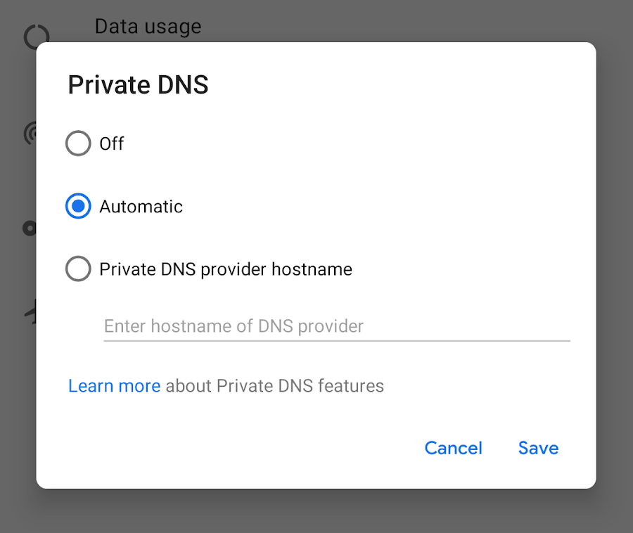

# Android P开发者预览版支持DNS over TLS

原标题：DNS over TLS support in Android P Developer Preview  
链接：[https://android-developers.googleblog.com/2018/04/dns-over-tls-support-in-android-p.html](https://android-developers.googleblog.com/2018/04/dns-over-tls-support-in-android-p.html)  
作者：Erik Kline (Android软件工程师) 和Ben Schwartz (Jigsaw软件工程师)  
翻译：[arjinmc](https://github.com/arjinmc)  

几乎所有连接互联网的第一步都是[DNS](https://en.wikipedia.org/wiki/Domain_Name_System)查询。客户端（例如智能手机）通常使用由Wi-Fi或蜂窝网络提供的DNS服务器。客户要求这个DNS服务器将域名（如www.google.com）转换为IP地址，如2607：f8b0：4006：80e :: 2004。一旦客户端拥有IP地址，它就可以连接到预定的目的地。

当20世纪80年代设计DNS协议时，互联网是一个更小，更简单的地方。在过去的几年中，互联网工程任务组（[IETF](https://ietf.org/about/)）一直致力于定义一种新的DNS协议，为用户提供最新的安全和隐私保护。该协议被称为“DNS over TLS”（标准化为[RFC 7858](https://tools.ietf.org/html/rfc7858)）。

与HTTPS一样，DNS over TLS使用[TLS](https://en.wikipedia.org/wiki/Transport_Layer_Security)协议建立到服务器的安全通道。安全通道建立后，其他任何可能监控连接的人都无法读取或修改DNS查询和响应。（安全通道仅适用于DNS，因此它不能保护用户免受其他类型的安全和隐私侵害。）

## P中的DNS over TLS

Android P开发者预览版包括对内置DNS over TLS的内置支持。我们为网络和互联网设置添加了<strong>私有DNS</strong>模式。

默认情况下，如果网络的DNS服务器支持，设备会自动升级到DNS over TLS。但是，不希望使用DNS over TLS的用户可以关闭它。

如果用户想使用私人DNS提供商，用户可以输入主机名。然后，Android通过安全通道将所有DNS查询发送到此服务器，或者如果网络无法访问服务器，则将网络标记为“无法访问Internet”。（出于测试目的，请参阅此[社区维护](https://dnsprivacy.org/wiki/display/DP/DNS+Privacy+Test+Servers)的兼容服务器列表。）

  

DNS over TLS模式会自动保护系统中所有应用程序的DNS查询。但是，执行自己的DNS查询而不是使用系统API的应用程序必须确保在系统具有安全连接时不会发送不安全的DNS查询。应用可以使用新的API获取这些信息：[LinkProperties.isPrivateDnsActive()](https://developer.android.com/reference/android/net/LinkProperties.html#isPrivateDnsActive())。

借助Android P开发者预览版，我们很自豪能够提供对DNS over TLS的内置支持。未来，我们希望所有操作系统都将包含DNS安全传输，以便为每个新连接上的所有用户提供更好的保护和隐私保护。

