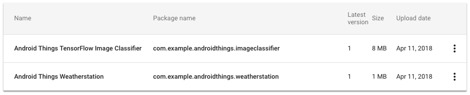
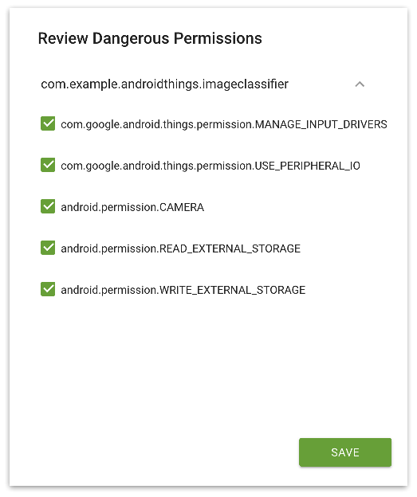

# Android Things发布候选

原标题：Android Things Release Candidate  
链接：[https://android-developers.googleblog.com/2018/04/android-things-release-candidate.html](https://android-developers.googleblog.com/2018/04/android-things-release-candidate.html)  
作者：Dave Smith (物联网开发者倡导者)  
翻译：[arjinmc](https://github.com/arjinmc)  

今年早些时候在CES上，我们展示了由联想，LG，JBL，iHome和索尼等合作伙伴提供[Android Things的消费产品](https://android-developers.googleblog.com/2018/01/new-products-at-ces-powered-by-android.html)。我们很高兴看到Android Things支持更广泛的开发者生态系统。今天，在即将到来的稳定版发布之前，我们宣布Android Things，Developer Preview 8的最终预览版。

## 功能完整的SDK

开发者预览版8代表即将发布的稳定版Android Android支持库中公开的最终API表面。在SDK稳定版v1.0发布之前，不会有更多突破性API更改。有关DP8中包含的所有API更改的详细信息，请参阅[发布说明](https://developer.android.com/things/preview/releases.html)。请参阅更新的[SDK参考](https://developer.android.com/things/reference/index.html)，以查看最终SDK中的类和方法。

此版本还在Android Things开发者控制台中引入了新功能，可以更轻松地构建和管理生产设备。这里有一些值得注意的更新：

## 以生产为中心的增强控制台功能

随着即将发布的LTS发布，构建和发布生产设备，我们已经对Android Things开发者控制台进行了多次更新：

* <strong>增强型OTA</strong>：在现场发现问题时取消发布当前的OTA版本。
* <strong>可视化存储布局</strong>：配置分配给每个构建的应用程序和数据的设备存储，并概述你的应用程序需要多少存储空间。
* <strong>字体/区域设置控件</strong>：配置打包到每个构建中的一组支持的字体和区域设置。
* <strong>小组分享</strong>：产品分享已扩展至包括对Google小组的支持。

## 应用程序库

新的应用程序库使你可以更轻松地管理APK，而无需将它们打包在单独的压缩包中。跟踪各个版本，查看权限，并与其他控制台用户分享你的应用。查看[应用程序库文档](https://developer.android.com/things/console/manage-apps.html)以获取更多详细信息

  

## 权限

在移动设备上，应用程序[在运行时请求权限](https://developer.android.com/training/permissions/requesting.html)，最终用户授予它们权限。在之前的预览中，Android Things将这些相同的权限自动授予设备启动时的应用程序。从DP8开始，这些权限在开发者控制台中使用新界面授予，使开发者能够更好地控制其设备上的应用使用的权限。

  

此更改不会影响开发，因为Android Studio默认授予所有权限。使用命令行的开发者可以将该<i>-g</i>标志附加到该<i>adb install</i>命令以获得相同的行为。要测试设备上的应用程序如何在取消某些权限的情况下运行，请使用以下<i>pm</i>命令：

```code
$ adb shell pm [grant|revoke] <permission-name> ...
```

## 应用启动行为

嵌入式设备需要在设备引导后自动启动主应用程序，并在应用程序意外终止时重新启动。在之前的预览中，设备上的主要应用程序可以侦听自定义<i>IOT_LAUNCHER</i> intent来启用此行为。从DP8开始，这个类别被标准的[CATEGORY_HOME](https://developer.android.com/reference/android/content/Intent.html#CATEGORY_HOME) intent所取代。

```code
<activity android:name=".HomeActivity">
    ...

    <!-- Launch activity automatically on boot, relaunch on termination. -->
    <intent-filter>
        <action android:name="android.intent.action.MAIN"/>
        <category android:name="android.intent.category.HOME"/>
        <category android:name="android.intent.category.DEFAULT"/>
    </intent-filter>
</activity>
```        
    
包含<i>IOT_LAUNCHER</i> intent过滤器的应用程序将不再在启动时被触发。更新你的应用程序以改为使用[CATEGORY_HOME](https://developer.android.com/reference/android/content/Intent.html#CATEGORY_HOME)。

## 反馈

感谢开发者社区中的所有人在整个开发者预览中与我们分享你的反馈。通过Google+加入[Google的物联网开发者社区](https://g.co/iotdev)，让我们知道你使用Android Things构建的内容，以及我们如何在未来的版本中改进平台，以帮助你大规模构建连接设备！