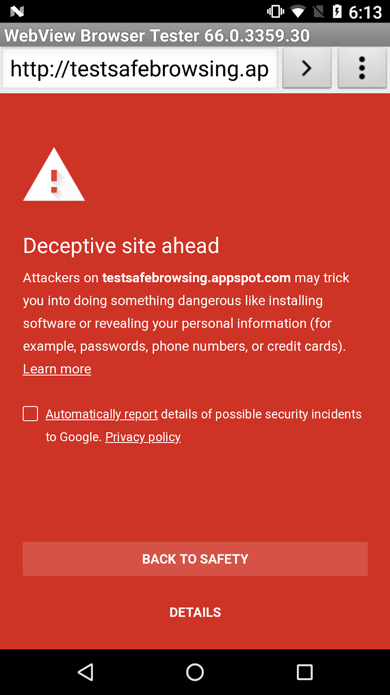

# 通过安全浏览保护WebView

原标题：Protecting WebView with Safe Browsing  
链接：[https://android-developers.googleblog.com/2018/04/protecting-webview-with-safe-browsing.html](https://android-developers.googleblog.com/2018/04/protecting-webview-with-safe-browsing.html)  
作者：Nate Fischer (软件工程师)  
翻译：[arjinmc](https://github.com/arjinmc)  

自2007年以来，Google安全浏览一直在保护网络上的用户免受网络钓鱼和恶意软件攻击。它可以防范越来越多的威胁，[保护超过30亿台设备](https://www.blog.google/topics/safety-security/safe-browsing-protecting-more-3-billion-devices-worldwide-automatically/)，现在还包括桌面和移动平台上不需要的软件。今天，我们宣布Google Play Protect默认将安全浏览功能引入WebView，从2018年4月开始发布WebView 66。

使用WebView的Android应用程序开发者无需再进行任何更改，即可从此保护中受益。WebView中的安全浏览功能自Android 8.0（API 26）开始提供，使用与[Android上的Chrome](https://security.googleblog.com/2015/12/protecting-hundreds-of-millions-more.html)相同的底层技术。当安全浏览被触发时，应用程序将显示警告并收到网络错误。为API等级27及以上构建的应用程序可以使用[新的API](https://developer.android.com/reference/android/webkit/WebView.html)进行自定义安全浏览。

  
<small>安全浏览检测到危险站点时显示的警告示例。警告的样式和内容取决于WebView的大小。</small>

你可以在[Android API文档](https://developer.android.com/reference/android/webkit/WebView.html)中了解有关自定义和控制安全浏览的更多信息，并且你可以通过访问安全浏览测试网址(chrome://safe-browsing/match?type=malware)来测试你的应用程序，同时[使用当前的WebView测试版](https://www.chromium.org/developers/androidwebview/android-webview-beta)。
