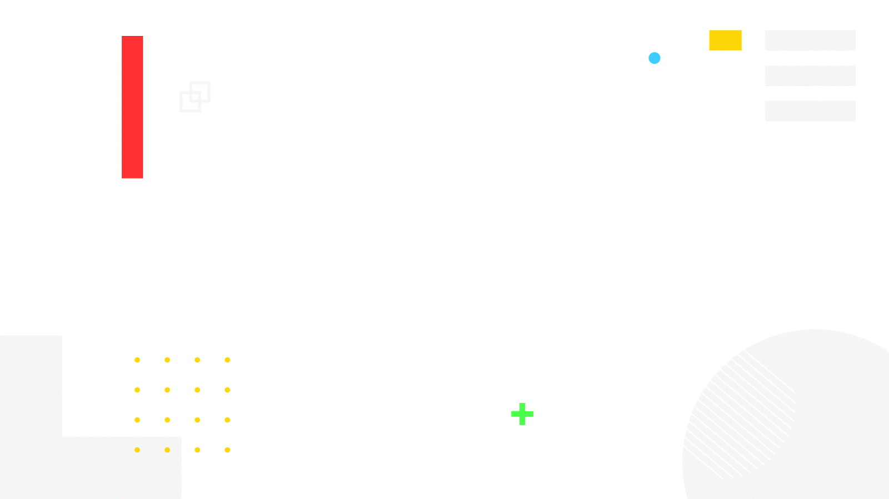

# 祝贺2018年Google Play大奖提名

原标题：Time to celebrate the 2018 Google Play Award nominees  
链接：[https://android-developers.googleblog.com/2018/04/time-to-celebrate-2018-google-play.html](https://android-developers.googleblog.com/2018/04/time-to-celebrate-2018-google-play.html)  
作者：Purnima Kochikar (Google Play的Apps和游戏业务开发总监)  
翻译：[arjinmc](https://github.com/arjinmc)  

  

今年的Google Play大奖将于5月7日星期一举行，开启Google I / O周。庆祝我们的第三年，我们很高兴突出九个类别; 一些你可能会认识到的往年，以及新的增加突出增长领域和我们关注的趋势，如建设新兴市场。

Google Play大奖每年都会在Google Play上认出顶级应用和游戏。它们代表了Android上的一些最佳体验，重点在于整体质量，强大的设计，技术性能和创新。这些被提名的人被谷歌各种团队选中，并且都符合高星级评定标准，Android标志，并且自2017年4月以来已经推出或重大更新。

祝贺今年的提名者，不要忘记在Google Play商店的[g.co/play/gpa2018](https://g.co/play/gpa2018)上查看。

### 突出的体验应用程序

应用程序赋予人们生活的最佳版本，同时展示负责任的设计和参与策略

* [Clue](https://play.google.com/store/apps/details?id=com.clue.android) by BioWink GmbH
* [Fabulous](https://play.google.com/store/apps/details?id=co.thefabulous.app) by TheFabulous
* [Headspace](https://play.google.com/store/apps/details?id=com.getsomeheadspace.android) by Headspace, Inc.
* [Lifesum](https://play.google.com/store/apps/details?id=com.sillens.shapeupclub) by Lifesum
* [Simple Habit](https://play.google.com/store/apps/details?id=com.simplehabit.simplehabitapp) by Simple Habit, Inc.

### 最佳的无障碍体验

应用程序或游戏以创新方式实现设备互动，为残障人士或特殊需求提供服务

* [Audio Game Hub](https://play.google.com/store/apps/details?id=com.AUT.AudioGameHub) by Sonnar Interactive
* [Be My Eyes](https://play.google.com/store/apps/details?id=com.bemyeyes.bemyeyes) by Be My Eyes
* [Open Sesame](https://play.google.com/store/apps/details?id=com.sesame.phone_nougat) by Sesame Enable
* [Universal Copy](https://play.google.com/store/apps/details?id=com.camel.corp.universalcopy) by Camel Corporation
* [Voice Volume Catcher](https://play.google.com/store/apps/details?id=jp.co.litalico.voicevolumecatcher) by LITALICO lnc.

### 最佳社会影响

在世界各地为社区带来积极影响的应用程序或游戏（专注于健康，教育，危机应对，难民，财务健康和筹款职能）

* [Forest](https://play.google.com/store/apps/details?id=cc.forestapp) by forestapp.cc
* [Khan Academy](https://play.google.com/store/apps/details?id=org.khanacademy.android&e=-EnableAppDetailsPageRedesign) by Khan Academy
* [Otsimo](https://play.google.com/store/apps/details?id=com.otsimo.app&e=-EnableAppDetailsPageRedesign) by Otsimo
* [Tala](https://play.google.com/store/apps/details?id=com.inventureaccess.safarirahisi&e=-EnableAppDetailsPageRedesign) by Tala Mobile
* [TODXS](https://play.google.com/store/apps/details?id=com.todxs&e=-EnableAppDetailsPageRedesign) by TODXS

### 突出独立

来自独立开发者的游戏专注于艺术设计，游戏机制和整体抛光

* [Agent A](https://play.google.com/store/apps/details?id=co.yakand.agentaapuzzleindisguise) by Yak & Co
* [Bridge Constructor Portal](https://play.google.com/store/apps/details?id=com.headupgames.bridgeconstructorportal) by Headup Games
* [Flipping Legend](https://play.google.com/store/apps/details?id=com.noodlecake.flippinglegend) by Noodlecake Studios Inc
* [Old Man's Journey](https://play.google.com/store/apps/details?id=es.brokenrul.oldmansjourney&e=-EnableAppDetailsPageRedesign) by Broken Rules Interactive Media GmbH
* [OPUS: Rocket of Whispers](https://play.google.com/store/apps/details?id=com.sigono.heaven01) by Sigono Inc.

### 最佳社区建设游戏

建立连接游戏玩家的游戏，鼓励社交互动和社区建设

* [Clash Royale](https://play.google.com/store/apps/details?id=com.supercell.clashroyale&e=-EnableAppDetailsPageRedesign) by Supercell
* [Episode](https://play.google.com/store/apps/details?id=com.episodeinteractive.android.catalog) by Pocket Gems
* [Lineage 2: Revolution](https://play.google.com/store/apps/details?id=com.netmarble.lin2ws) by Netmarble Corporation
* [Pokémon GO](https://play.google.com/store/apps/details?id=com.nianticlabs.pokemongo) by Niantic, Inc.
* [PUBG MOBILE](https://play.google.com/store/apps/details?id=com.tencent.ig) by Tencent Games

### 最佳AR或VR体验

应用程序或游戏提供极具吸引力和身临其境的体验，并最佳使用ARCore或Daydream UI

* [ASTEROIDS!](https://play.google.com/store/apps/details?id=com.baobab.asteroidsdaydream&e=-EnableAppDetailsPageRedesign) by Baobab Studios
* [BBC Earth: Life in VR](https://play.google.com/store/apps/details?id=com.bbc.lifeinvr01&e=-EnableAppDetailsPageRedesign) by BBC Worldwide (Ltd)
* [Brickscape](https://play.google.com/store/apps/details?id=com.fiveminlab.brickscape&e=-EnableAppDetailsPageRedesign) by 5minLab
* [Figment AR](https://play.google.com/store/apps/details?id=com.viro.figment&e=-EnableAppDetailsPageRedesign) by Viro Media
* [Porsche Mission E](https://play.google.com/store/apps/details?id=com.porsche.missionear&e=-EnableAppDetailsPageRedesign) by Dr. Ing. h.c. F. Porsche AG

### 超过数十亿用户的体验突出的构建

为新兴市场优化性能，本地化和文化化的应用或游戏

* [Cricbuzz](https://play.google.com/store/apps/details?id=com.cricbuzz.android&e=-EnableAppDetailsPageRedesign) by Cricbuzz.com
* [Flipkart](https://play.google.com/store/apps/details?id=com.flipkart.android&e=-EnableAppDetailsPageRedesign) by Flipkart
* [Mercado Libre](https://play.google.com/store/apps/details?id=com.mercadolibre&e=-EnableAppDetailsPageRedesign&sticky_source_country=US) by Mercado Libre
* [Moovit](https://play.google.com/store/apps/details?id=com.tranzmate&e=-EnableAppDetailsPageRedesign) by Moovit
* [Viki](https://play.google.com/store/apps/details?id=com.viki.android&e=-EnableAppDetailsPageRedesign) by Viki, Inc

### 突出的创业

来自新开发人员的应用程序可提供独特的体验，同时实现有机安装增长。

* [Astro](https://play.google.com/store/apps/details?id=com.helloastro.android) by Astro Technology
* [Canva](https://play.google.com/store/apps/details?id=com.canva.editor) by Canva
* [Drops](https://play.google.com/store/apps/details?id=com.languagedrops.drops.international) by Language Drops
* [Kredivo](https://play.google.com/store/apps/details?id=com.finaccel.android&e=-EnableAppDetailsPageRedesign&sticky_source_country=US) by FinAccel Pte Ltd
* [N26](https://play.google.com/store/apps/details?id=de.number26.android) by N26

### 最佳热门

具有出色整体设计，用户体验，参与和保留以及强大的安装健康增长的新应用或游戏

* [Animal Crossing: Pocket Camp](https://play.google.com/store/apps/details?id=com.nintendo.zaca&e=-EnableAppDetailsPageRedesign) by Nintendo Co., Ltd.
* [Cooking Craze](https://play.google.com/store/apps/details?id=com.bigfishgames.cookingcrazegooglef2p) by Big Fish Games
* [Empires & Puzzles](https://play.google.com/store/apps/details?id=com.smallgiantgames.empires) by Small Giant Games
* [Final Fantasy XV Pocket Edition](https://play.google.com/store/apps/details?id=com.square_enix.android_google.ffxvpe&e=-EnableAppDetailsPageRedesign) by SQUARE ENIX Co., Ltd.
* [PUBG MOBILE](https://play.google.com/store/apps/details?id=com.tencent.ig) by Tencent Games

5月7日星期一我们在回来宣布获奖者，在此之前，请务必通过[g.co/play/gpa2018](https://g.co/play/gpa2018)在Google Play上试用这些优秀的应用和游戏。
