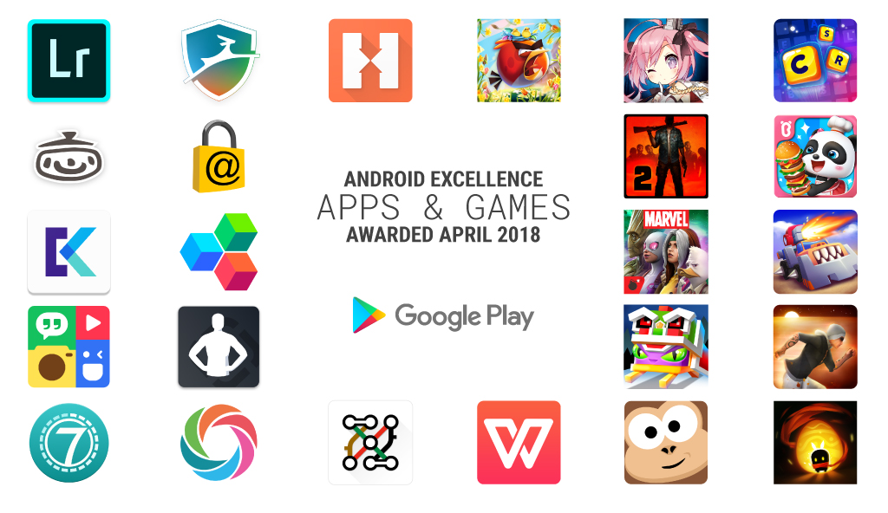

# 在Google Play上推出新的Android卓越应用和游戏

原标题：Introducing new Android Excellence apps and games on Google Play  
链接：[https://android-developers.googleblog.com/2018/04/introducing-new-android-excellence-apps.html](https://android-developers.googleblog.com/2018/04/introducing-new-android-excellence-apps.html)  
作者：Kacey Fahey (Google Play开发者营销)  
翻译：[arjinmc](https://github.com/arjinmc)  

祝贺Google Play上Android卓越计划中推出的最新[应用](https://play.google.com/store/apps/topic?id=campaign_editorial_3002b4f_android_excellence_apps&hl=en)和[游戏](https://play.google.com/store/apps/topic?id=campaign_editorial_3002b50_android_excellence_games&hl=en)。提醒一下，这些系列产品每三个月更新一次，并承认为高品质，出色用户体验和强大技术性能设定标准的应用和游戏。

  

如果你正在寻找一些新的应用程序，这里有一些亮点。

* [Adobe Photoshop Lightroom CC](https://play.google.com/store/apps/details?id=com.adobe.lrmobile)：在你的移动设备上使用Lightroom的强大功能捕获，编辑和分享你的照片。使用预设进行快速简单的编辑，或使用高级编辑工具。
* [Seven - 7 Minute Workout Training Challenge](https://play.google.com/store/apps/details?id=se.perigee.android.seven)：使用这个应用程序，适应你繁忙的生活方式七分钟的锻炼。抓住你的手机，甚至你的Wear OS设备随时随地工作。继续取得成就，加入7俱乐部，获得更多支持。
* [SoloLearn: Learn to Code for Free](https://play.google.com/store/apps/details?id=com.sololearn)：通过加入数以百万计的社区，学习众多新编码语言之一。接受全天候的同伴支持，或创建自己的课程，成为社区的影响者。

这里有一些我们最喜欢的新游戏加入合集。

* [CodyCross: Crossword Puzzles](https://play.google.com/store/apps/details?id=com.fanatee.cody)：尝试这个游戏有趣的新风格的填字游戏。在冒险模式下免费玩游戏或订阅特殊主题包，每周添加不同的难度级别和新鲜内容。
* [MARVEL Contest of Champions](https://play.google.com/store/apps/details?id=com.kabam.marvelbattle)：在Marvel Universe的标志性地点与你最喜爱的Marvel超级英雄和超级坏蛋一起玩。组装你的冠军队伍，通过激动人心的故事情节，甚至与你的朋友建立联盟。
* [Orbital 1](https://play.google.com/store/apps/details?id=com.etermax.orbital1)：在这个实时多人游戏中用美丽的3D图形测试你的技能。收集和升级战士和武器，建立你的完美阵容，进行快速的战斗和新的日常任务。

查看Android卓越应用和游戏的完整列表。

<u>新的Android卓越应用程序</u>

[Adobe Photoshop Lightroom CC](https://play.google.com/store/apps/details?id=com.adobe.lrmobile)

[Dashlane](https://play.google.com/store/apps/details?id=com.dashlane)

[Holstelworld](https://play.google.com/store/apps/details?id=com.hostelworld.app)

[iCook](https://play.google.com/store/apps/details?id=com.polydice.icook)

[Keeper Password Manager](https://play.google.com/store/apps/details?id=com.callpod.android_apps.keeper)

[Keepsafe Photo Vault](https://play.google.com/store/apps/details?id=com.kii.safe)

[Mobisystems OfficeSuite](https://play.google.com/store/apps/details?id=com.mobisystems.office)

[PhotoGrid](https://play.google.com/store/apps/details?id=com.roidapp.photogrid&ddl=1&pcampaignid=web_ddl_1&e=-EnableAppDetailsPageRedesign)

[Runtastic Results](https://play.google.com/store/apps/details?id=com.runtastic.android.results.lite&sticky_source_country=US&e=-EnableAppDetailsPageRedesign)

[Seven - 7 Minute Workout Training Challenge](https://play.google.com/store/apps/details?id=se.perigee.android.seven)

[SoloLearn: Learn to Code for Free](https://play.google.com/store/apps/details?id=com.sololearn)

[Tube Map](https://play.google.com/store/apps/details?id=com.mxdata.tube.Market)

[WPS Office](https://play.google.com/store/apps/details?id=cn.wps.moffice_eng)

<u>新的Android卓越游戏</u>

[Angry Birds 2](https://play.google.com/store/apps/details?id=com.rovio.baba&hl=en&e=-EnableAppDetailsPageRedesign)

[Azur Lane](https://play.google.com/store/apps/details?id=com.YoStarJP.AzurLane&hl=en&e=-EnableAppDetailsPageRedesign)アズールレーン

[CodyCross](https://play.google.com/store/apps/details?id=com.fanatee.cody)

[Into the Dead 2](https://play.google.com/store/apps/details?id=com.pikpok.dr2.play&e=-EnableAppDetailsPageRedesign)

[Little Panda Restaurant](https://play.google.com/store/apps/details?id=com.sinyee.babybus.restaurant)

[MARVEL Contest of Champions](https://play.google.com/store/apps/details?id=com.kabam.marvelbattle)

[Orbital 1](https://play.google.com/store/apps/details?id=com.etermax.orbital1)

[Rooms of Doom](https://play.google.com/store/apps/details?id=com.yodo1.roda)

[Sky Dancer Run](https://play.google.com/store/apps/details?id=pine.game.skydancer)

[Sling Kong](https://play.google.com/store/apps/details?id=com.protostar.sling)

[Soul Knight](https://play.google.com/store/apps/details?id=com.ChillyRoom.DungeonShooter)

在Google Play 的[编辑选择](https://play.google.com/store/apps/topic?id=editors_choice)模块探索其他优秀的应用和游戏，并发现最佳实践，帮助你制作高质量的应用和游戏。