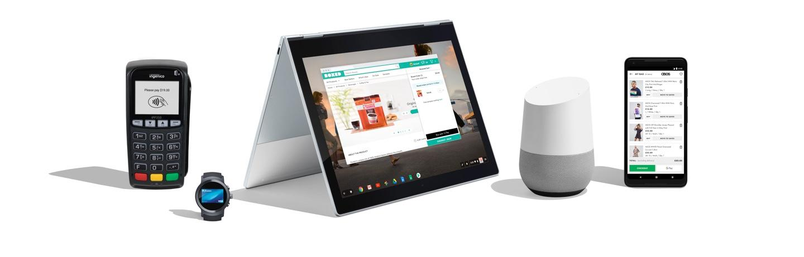
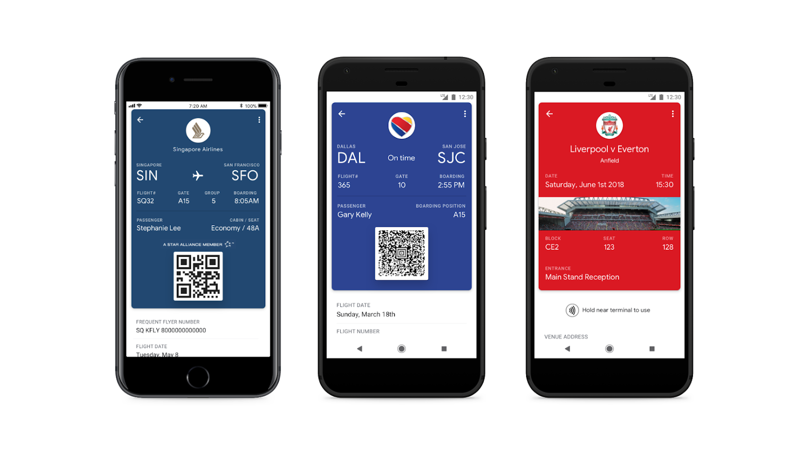

# 使用Google Pay构建

原标题：Building with Google Pay  
链接：[https://android-developers.googleblog.com/2018/05/building-with-google-pay.html](https://android-developers.googleblog.com/2018/05/building-with-google-pay.html)  
作者：Gerardo Capiel和Varouj Chitilian（Google Pay）  
翻译：[arjinmc](https://github.com/arjinmc)  

无论是订购杂货还是购买一双新鞋，现在的顾客都希望比以往更快地完成订单。借助Google Pay，我们希望确保结帐不会降低他们（或你的转换），同时在每一步都能增强客户体验。

上周在[Google I / O](https://goo.gl/sQxRxX)上，我们宣布了一些令人兴奋的新功能。我们还分享了开发者使用Google Pay的最新方式，以便在结帐时提供最佳体验，而且所有API均可免费使用。以下是一些亮点以及如何充分利用它们。

[视频介绍](https://youtu.be/YT1JfH71k_k)  

## 更多的地方可以供客户在线查看

无论你使用的是哪种浏览器或设备，我们都已开始支持使用Google Pay进行结账。这意味着客户可以在任何设备的大多数主流浏览器上使用Google Pay付款。

  

在你的应用程序和网站中启用此功能非常简单。观看Google Pay软件工程师Tony Chen[进行网站集成](https://youtu.be/7dUzh2_mC8c?t=11m49s)，然后使用我们的[开发者文档](https://developers.google.com/pay/api/)自行尝试。

但让你的客户更容易结账不仅适用于他们的付款方式。Chrome浏览器自动填充功能可帮助客户自动填写表单，以便他们可以加速整个结帐流程，而不会因打字而陷入困境。为确保你的购物者通过Chrome浏览器自动填充获得最快速的结帐体验，我们建议你查看我们的新的[最佳实践](https://developers.google.com/web/fundamentals/design-and-ux/input/forms/#use_metadata_to_enable_auto-complete)指南。

我们还将通过将此功能添加到我们的iOS和桌面体验中，让客户更轻松地管理他们在Google Pay中的付款方式。新功能将允许用户随时随地添加卡片并查看交易，从而让你访问一组能够在你的应用和网站中使用Google Pay的客户。这也意味着从笔记本电脑添加卡片的客户可以将这些卡片与iOS设备上的Google Pay一起使用。（在[g.co/pay/demo](https://g.co/pay/demo)上自己试试。）

这项新功能即将推出，你可以了解更多关于[创建Google Pay](https://www.youtube.com/watch?v=YT1JfH71k_k&t=0s&list=PLFa7PFwgkjzhHjLCL6kD27ts6mIZpWNJZ&index=1)会话的信息。

## 使用Google Pay API的移动票证和通行证

借助我们新推出的[预付运输通行证](https://blog.google/topics/shopping-payments/google-pays-got-your-transit-ticket/)支持，我们现在还支持通过我们的Google Pay API通行证保存和管理通行证的新途径。这可以让你创建移动活动门票和登机牌，客户可以将其保存到Google Pay Android应用。我们已经与Southwest，Fortress GB和Ticketmaster一起试用了这个功能，并且很快有更多的合作伙伴加入。想要登上？[注册以获取更多信息](https://support.google.com/pay/merchants/contact/interest)。

  

## Google Action的转换

通过[Google Action](https://developers.google.com/actions/)，开发者可以通过开发action并将其与日益增长的意图目录链接起来，让数十亿用户在Google 助手以及Google搜索通过[action使用Google Play](https://www.youtube.com/watch?v=XqEkkiAefSc&list=PLFa7PFwgkjzhHjLCL6kD27ts6mIZpWNJZ&index=4&t=5s)，Android和其他表面上吸引数十亿用户。我们的一个会话向你展示了如何在你[启用Google Pay，以便你的客户可以通过其助理跨多个界面进行购买，包括移动设备，Google Home以及即将推出的智能显示器。交易现已在澳大利亚，加拿大，日本，法国，德国，美国和英国提供。（我们很快就会把它们带到巴西，印度，意大利和西班牙。）

  

另外，我们现在开始开发者预览版，你现在可以启用在Google助手上转换销售数字内容。这包括应用内购买，订阅，游戏，体验和高级内容。

我们迫不及待地想知道你使用Google Pay的所有创新方式如何[扩大你的业务](https://pay.google.com/about/business/)并为你的客户打造更好的结账体验。请务必查看[我们所有的I / O会话](https://www.youtube.com/playlist?list=PLFa7PFwgkjzhHjLCL6kD27ts6mIZpWNJZ)以获取更多的想法，工具和技巧。与此同时，我们将努力开发新功能，继续为你和你的客户创造可能的最佳体验。