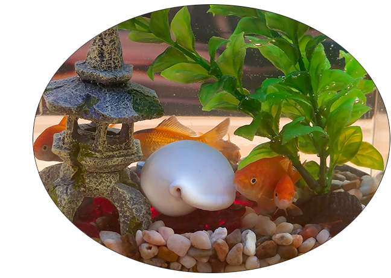

# 通过新的Kotlin Bootcamp课程快速学习Kotlin

原标题：Learn Kotlin Fast with new Kotlin Bootcamp course  
链接：[https://android-developers.googleblog.com/2018/05/learn-kotlin-fast-with-new-bootcamp.html](https://android-developers.googleblog.com/2018/05/learn-kotlin-fast-with-new-bootcamp.html)  
作者：Aleks Haecky (培训开发者和Word艺术家，[Google+](https://plus.google.com/u/3/114727626576864626844)，[LinkedIn](https://www.linkedin.com/in/vhaecky)，[Medium](https://medium.com/@alekshaecky))  
翻译：[arjinmc](https://github.com/arjinmc)  

[Udacity(优达学城)的Kotlin Bootcamp 课程](https://classroom.udacity.com/courses/ud9011)当然是免费的，在线自学课程，教你Kotlin编程语言的基础知识。Kotlin简介是由谷歌专家与Udacity合作创建的，适用于已经知道如何编程的人。

[视频介绍](https://youtu.be/tReVEvyLsLM)

Kotlin语言让你可以在更短的时间内创建应用程序，编写更少的代码并减少错误。

这种现代的面向对象语言提供了强大的类型系统，类型推断，无效安全，属性，lambda表达式，扩展，协同程序，高阶函数和许多其他功能。Kotlin非常简洁，你可以使用一行代码创建完整的数据类。

Kotlin正式支持构建Android应用程序，与Java编程语言和库完全互操作，并且包含在IntelliJ和Android Studio中。

在本课程中，你将学习Kotlin编程所需的一切，其中包括：

1. 基础知识：使用可为空和不可为空的变量，数据类型，运算符和控制结构，在IntelliJ REPL Kotlin解释器中编写Kotlin语句和表达式。
2. 函数：创建main()函数，使用默认参数和可变参数创建和调用函数，将函数作为参数传递给过滤器，编程简单lambda表达式，函数类型和简洁的单表达式函数。
3. 类：用方法和属性创建一个类。实现构造函数和init()。了解继承，接口和抽象类。使用特殊目的类的数据，对象，枚举和密封。
4. 基础之外：深入分析Pair，集合和常量。了解如何编写扩展名，实现泛型，应用注释以及使用带标签的中断。
5. 功能操作：探索更多关于lambda，高阶函数和内联的知识。

你将学习如何使用扩展函数为现有类添加有用的功能。

扩展内置类型：

```code
fun Int.print() = println(this)
5.print() // prints 5
```

扩展Android类：

```code
fun Context.toast(text: CharSequence, duration: Int = Toast.LENGTH_SHORT): Toast {
   return Toast.makeText(this, text, duration).apply { show() }
}
toast("Hello Toast")
```  
     
扩展你自己的类：

```code
class AquariumPlant(
       val color: String)

fun AquariumPlant.print() =
       println("Pretty Aquarium Plant")

val plant = AquariumPlant("green")
plant.print()
// prints -> Pretty Aquarium Plant
```

  

完成课程后，你将能够在Kotlin中创建程序，充分利用Kotlin独特的功能和功能。

Udacity在线免费提供该课程; 按照自己的节奏在你自己的时间中进行。

请访问[https://www.udacity.com/course/ud9011](https://www.udacity.com/course/ud9011)，了解如何使用更少的代码构建应用程序。