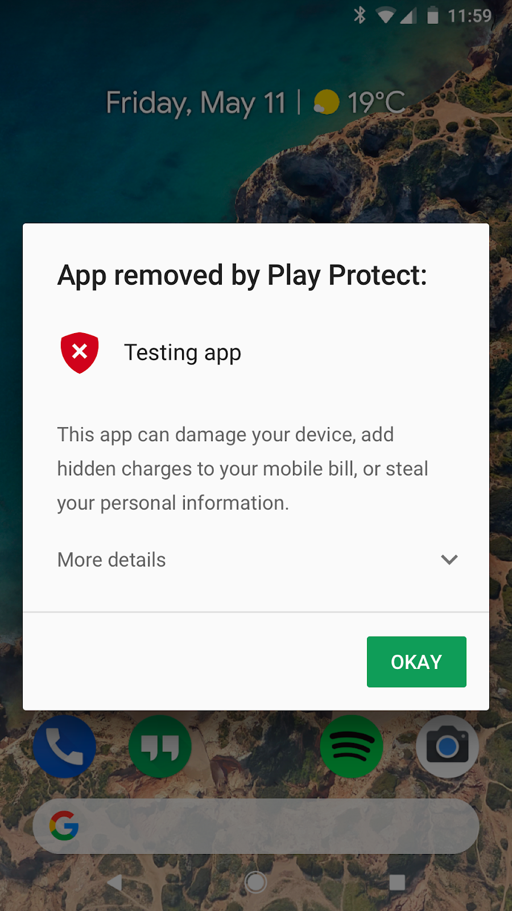
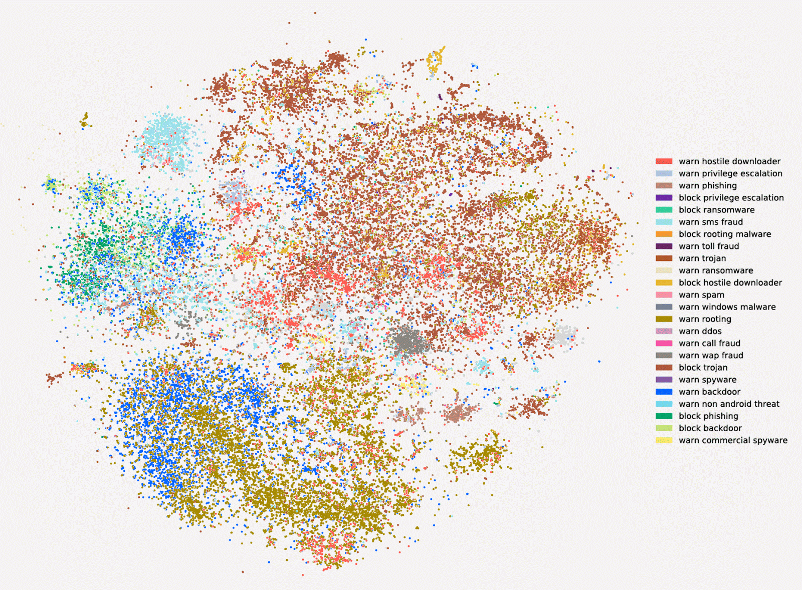

# 通过机器学习保护20亿个Android设备的安全

原标题：Keeping 2 billion Android devices safe with machine learning  
链接：[https://android-developers.googleblog.com/2018/05/keeping-2-billion-android-devices-safe.html](https://android-developers.googleblog.com/2018/05/keeping-2-billion-android-devices-safe.html)  
作者：Sai Deep Tetali (Google Play Protect软件工程师)  
翻译：[arjinmc](https://github.com/arjinmc)  

在2017年Google I / O大会上，我们推出了[Google Play Protect](http://android.com/play-protect)，这是我们全面的Android安全服务。虽然名称是新的，但支持Play Protect的智能已经保护了Android用户多年。

Google Play Protect的移动威胁防护套件已内置于20多亿个Android设备中，自动在后台采取行动。我们不断更新这些保护措施，因此你不必考虑安全问题：只会发生。通过将机器学习元素添加到Google Play保护中，我们的保护功能变得更加智能化。

## 安全规模 

 

Google Play Protect可提供对潜在有害应用程序（PHA）的即时保护，但Google的保护功能较早开始。

在Google Play发布之前，我们的安全系统和Android安全专家会对所有应用进行严格分析。由于这一过程，仅从Google Play下载应用的Android设备获得PHA的可能性比从其他来源下载应用的设备低9倍。

安装应用程序后，Google Play Protect会继续通过定期扫描你的设备以确保所有应用程序正常运行，继续保持设备安全。如果Google Play保护程序发现某个应用程序行为异常，则会通知你，或者直接删除有害应用程序以确保设备安全。

我们的系统每天扫描超过500亿个应用程序。为了保持安全的最前沿，我们以各种方式寻找新的风险，例如识别表示不良行为的特定代码路径，调查行为模式以关联不良应用，以及与我们的安全专家一起检查可能的PHA。

2016年，我们将机器学习作为一种新的检测机制加入其中，并很快成为我们系统和工具的重要组成部分。

## 训练我们的机器

在最基本的术语中，机器学习意味着训练计算机算法来识别行为。为了训练算法，我们给了它训练了成千上万的这种行为的例子。

    

就Google Play Protect而言，我们正在开发算法，以了解哪些应用“可能有害”，哪些应用“安全”。要了解PHA，机器学习算法将分析我们的整个应用程序目录。然后，我们的算法将数百个信号与匿名数据结合起来，比较整个Android生态系统中的应用行为以找到PHA。他们寻找PHA常见的行为，例如尝试与设备上的其他应用程序交互，访问或共享你的个人数据，在你不知情的情况下下载内容，连接到钓鱼网站或绕过内置安全功能的应用程序。

当我们发现应用显示类似的[恶意行为](https://source.android.com/security/reports/Google_Android_Security_PHA_classifications.pdf)时，我们将它们分组为家庭。通过对这些PHA家族进行可视化，可以帮助我们发现与已知不良应用有共同点的应用，但这些应用仍然存在于我们的视线之内。
    
                                                                                           

在我们确定新的PHA后，我们通过专家安全评估来确认我们的发现。如果有问题的应用程序是PHA，Google Play Protect会对应用程序执行操作，然后将有关该PHA的信息反馈给我们的算法，以帮助查找更多PHA。

## 加倍安全

到目前为止，我们的机器学习系统已成功检测到2017年Google Play Protect识别出的恶意软件的60.3％。

在2018年，我们投入大量的计算能力和人才来创建，维护和改进这些机器学习算法。我们不断利用人工智能和来自Google各地的高技能研究人员和工程师，寻找新的方法来保持Android设备的安全。除了我们优秀的团队外，我们还与来自世界各地的最重要的[安全专家和研究人员](https://source.android.com/security/overview/acknowledgements)合作。这些研究人员提供了更多的数据和见解，使Google Play Protect始终处于移动安全的前沿。

要查看Google Play保护，请打开Goog​​le Play应用，然后点按左侧面板中的<strong>Play Protect</strong>。

鸣谢：本作品是由Google Play Protect, 安全浏览 and Play Abuse团队的贡献者包括：Andrew Ahn, Hrishikesh Aradhye, Daniel Bali, Hongji Bao, Yajie Hu, Arthur Kaiser, Elena Kovakina, Salvador Mandujano, Melinda Miller, Rahul Mishra, Damien Octeau, Sebastian Porst, Chuangang Ren, Monirul Sharif, Sri Somanchi, Sai Deep Tetali, Zhikun Wang, and Mo Yu

