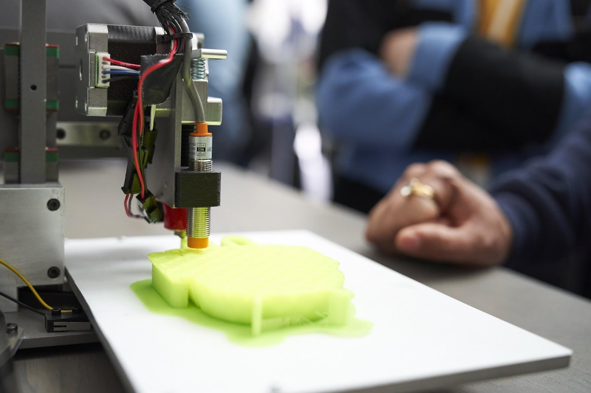

# Google I / O中的所有（Android）Things

原标题：All the (Android) Things at Google I/O  
链接：[https://android-developers.googleblog.com/2018/05/all-android-things-at-google-io.html](https://android-developers.googleblog.com/2018/05/all-android-things-at-google-io.html)  
作者：Melissa Daniels (Android Things项目经理)  
翻译：[arjinmc](https://github.com/arjinmc)  

Android Things使你能够大规模地构建和维护物联网设备。为生产设备提供长期支持，我们最近发布了[Android Things 1.0](https://android-developers.googleblog.com/2018/05/say-hello-to-android-things-10.html)，因此你可以轻松将物联网设备从原型设备转移到商业产品。

今年我们将Google I / O包装为Android Things内容，以激发开发者社区的力量，从对话和代码到交互式演示以及寻宝游戏。这里仔细看看我们展示的有趣东西，你不会在零售商店的货架上看到。

## Demo

我们在I / O上推出了一些新的互动Android Things Demo，展示了该平台的AI和ML功能，因此如果今年没有机会参加，我们的一些收藏 - 适合探索无论你来自世界哪个角落！

<strong>智能花: Flos Mobilis</strong>

  

当你将机器学习，Android Things和机器人技术结合在一起时，你会得到什么？Flos Mobilis是一个连续机器人，每个花都有一个[i.MX7D开发板](https://androidthings.withgoogle.com/#!/kits/starter-kit)和一个摄像头来运行嵌入式神经网络模型，以控制花朵的运动。这一切都是在离线状态下完成的，不存储或传输数据。

<strong>智能花：Flos Affectus</strong>

  

如果一个机器人能够回应你的感受，会怎么样？[Flos Affectus](https://www.hackster.io/sprihabaruah/flos-affectus-4bbbb0)是一组机器人花朵，根据用户脸部检测到的表情“开花”和“不开花”。4种广义表达式Flos Affectus经过训练可以发现：快乐，伤心，生气，惊讶。使用嵌入在alpha 花的头部的相机，花簇能够检​​测用户的面部并推断面部情绪。花簇离线运行，没有数据存储或传输，并展示移动功能和设备上的机器学习模型。

<strong>Rosie the Android</strong>

  

最初由谷歌工程师团队为年度Grace Hopper[初创设计](https://www.hackster.io/team-rosie-the-android/rosie-the-android-f57109)的，Rosie the Android是一款5英尺自拍机器人，具有机器学习功能。受到Rieter的启发，她是一个完全可控的机器人，可以拍照，回应命令，四处转动并与周围的人互动。

I / O与Rosie一起拍照吗？在g.co/rosie获取你的唯一访问代码

<strong>智能投影仪</strong>
  

[智能投影机](https://www.hackster.io/team-rosie-the-android/rosie-the-android-f57109)构建在Lantern上，这是一个Android Things项目，探索表面和内容之间的关系 - 用可浏览的有意义的数据增强真实世界的对象和环境。它利用被称为快速绘画的Google Experiments项目，使用世界上最大的涂鸦数据集，该数据集已公开分享，可帮助进行机器学习研究。

要了解更多关于Lantern或开始建立你自己的，[从这里](https://experiments.withgoogle.com/lantern)开始。

<strong>3D打印机</strong>

  

这款经过修改的[Printrbot Smalls 3D打印机](https://printrbot.com/project/getting-started-with-your-assembled-printrbot-smalls/)使用了一个实时子系统，展现了Android Things的灵活性 - 微控制器执行低延迟电机控制，而Android Things处理OpenGL渲染。通过将大部分逻辑保留在Android等高级平台上，你可以更轻松地进行开发和调试，这要归功于Android的出色工具。

3D打印的未来？使实时控制与其他Android Ting一样简单便捷。

## Codelabs

唷！这只是演示冰山的一角。有了这么多的演示和使用Android Things的很多方法，很容易开始想象你可以构建的所有东西！在I / O上，我们帮助很多开发者开始使用[Android Things入门套件](https://androidthings.withgoogle.com/#!/kits/starter-kit)构建他们的第一款Android Things设备。我们正在编写这些代码库，这样你就可以随时找到它们，或者建立自己的代码库。

## 影片

错过了I / O会谈？抓住每个Android的事情谈话的录音，所以你可以开始，暂停和倒带在自己的闲暇时间。或者，只需[回顾](https://www.youtube.com/playlist?list=PLOU2XLYxmsIJQgQfgYDuH8V31HZTtWUBp)，并全部观看。

[Android Things中的新功能](https://www.youtube.com/watch?v=e_PI_Npb3-U&list=PLOU2XLYxmsIJQgQfgYDuH8V31HZTtWUBp&index=2&t=0s)

[在Android上构建有效的OEM级应用程序](https://www.youtube.com/watch?v=dVtYVjGGYmE&list=PLOU2XLYxmsIJQgQfgYDuH8V31HZTtWUBp&index=5&t=0s)

[使用Android Things构建真正的消费设备](https://www.youtube.com/watch?v=zBpP2kxDa2M&list=PLOU2XLYxmsIJQgQfgYDuH8V31HZTtWUBp&index=6&t=0s)

[Android系统模块上的电子设计](https://www.youtube.com/watch?v=cyphkm5XluA&list=PLOU2XLYxmsIJQgQfgYDuH8V31HZTtWUBp&index=7&t=0s)

[女性Techmakers小组：在Android Things上发展的经验](https://www.youtube.com/watch?v=ffxkzgvn_1Q&list=PLOU2XLYxmsIJQgQfgYDuH8V31HZTtWUBp&index=9&t=0s)

[产品设计：如何用Android Things打造更好的产品](https://www.youtube.com/watch?v=DVLhr9C3q90&list=PLOU2XLYxmsIJQgQfgYDuH8V31HZTtWUBp&index=10&t=0s)

[Android Things的设备配置和身份验证](https://www.youtube.com/watch?v=gkjV-TWLkIc&list=PLOU2XLYxmsIJQgQfgYDuH8V31HZTtWUBp&index=12&t=0s)

[使用Android Things Console更新现场生产设备](https://www.youtube.com/watch?v=PDBG9U-oNXY&list=PLOU2XLYxmsIJQgQfgYDuH8V31HZTtWUBp&index=13&t=1s)

## 开始建设！

除了我们刚刚提到的所有资源之外，我们还提供了关于[开发者文档](http://developers.android.com/things)的信息，以及我们的新[社区网站](http://androidthings.withgoogle.com/)，你可以在其中看到更多鼓舞人心的项目，甚至提交自己的项目。你还在等什么？拿起一个[Android的Things入门套件](https://androidthings.withgoogle.com/#!/kits/starter-kit)，并开始建设今天！