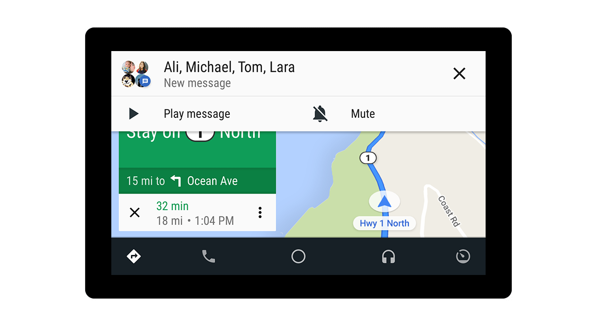

# 自动驾驶的建设：Google I / O 2018的一次窥探

原标题：Building for Automotive: A sneak peek at Google I/O 2018  
链接：[https://android-developers.googleblog.com/2018/05/building-for-automotive-sneak-peek-at.html](https://android-developers.googleblog.com/2018/05/building-for-automotive-sneak-peek-at.html)  
作者：John Posavatz (Android Auto的产品经理)  
翻译：[arjinmc](https://github.com/arjinmc)   

自2015年以来，Android开发者一直在构建和发展优秀的汽车应用。驾驶员受益于精心设计的应用程序，无论他们驾驶的是多款安卓自动兼容汽车之一还是在手机上使用Android Auto应用程序，都可以提供安全无缝的连接体验。

今天，全球30多个国家/地区的数百万名驾驶者可以通过Google Play商店获得数千款适用于Android Auto的应用。而且，由于Google Assistant(谷歌助手)可在Android Auto上使用，因此开发者可以在其应用中创建[语音驱动的体验](https://developers.google.com/actions/)，让驾驶者在完成目标的同时完成任务。

但它并没有结束 - 伟大的驾驶应用程序很快就会超越Android Auto用户。去年，汽车制造商沃尔沃汽车和奥迪[宣布](https://blog.google/products/android/smarter-cars-powered-android/)开发由Android支持的新型连接汽车。作为重要的下一步，我们现在正在与沃尔沃汽车合作，将Play商店和Google Assistant以及Google地图直接带入下一代汽车。开发者的机会无穷无尽 - 他们的应用程序今天能够接触到数百万的Android Auto用户，以及未来Android驱动汽车的驱动程序。

本周在Google I / O上，我们将分享一些更新，帮助开发者构建更好的车载体验，并成为不断发展的生态系统的一部分。我们将通过与iHeartRadio，Pandora，Pocket Casts，Spotify，Telegram，WhatsApp以及Google自己的应用程序（包括Android Messages，Play Books和Play Music）合作，在我们的沙盒中展示这些变化。

## 新的视觉模板

首先，全新的设计使媒体应用程序能够通过新的可视化模板更容易地访问其内容。例如，只要打开应用程序，便可将可浏览的内容放置在正面和中间，使你能够轻松识别并快速开始收听歌曲和播客。

  

## 媒体搜索增强

其次，新的搜索功能可让媒体应用直接将其结果集成到Android Auto中。这使得驾驶者可以快速发现与他们当前收听的内容相关的曲目，例如歌曲的现场版本，或者来自不同艺术家的同名歌曲。

  

## 组消息和RCS

最后，我们现在支持群组消息和RCS。使用Google Assistant，你可以轻松地与一群朋友进行交流，同时保持双手放在一边。

 

如果你正在参加I / O，请在5月9日太平洋标准时间上午9:30 检查Google I / O上的[自动驾驶会议](https://events.google.com/io/schedule/?section=may-9&sid=f813d3b0-1782-4f8f-9329-45e002200ef7)。我们还将在Sandbox区域展示三款车型，展示现实生活中的不同整合，包括在当前XC40中展示沃尔沃未来信息娱乐系统的预览。如果你不在I / O，你仍然可以捕捉到会话的直播。随着我们发布更多信息，开发者还可以[注册](https://goo.gl/forms/FfK104glgu1zx5DG3)以了解有关媒体和消息更新的更多信息。