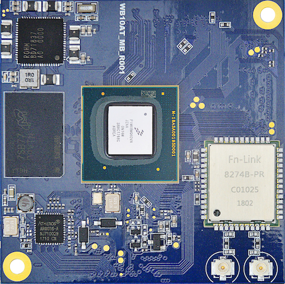
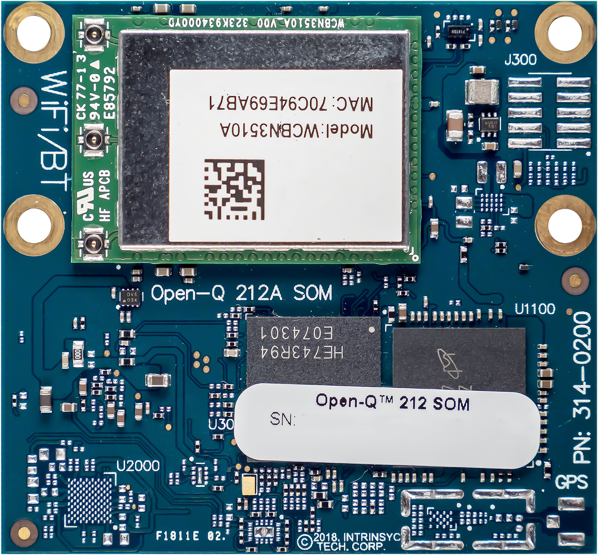
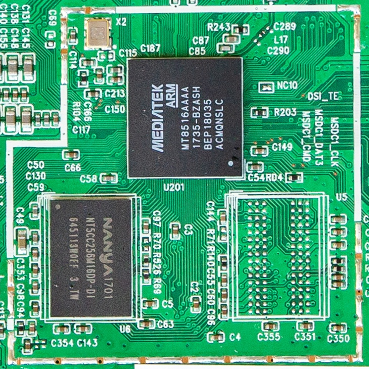
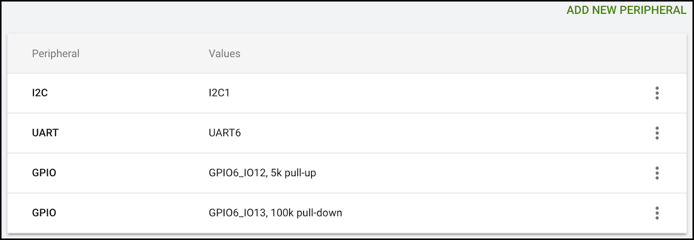

# Android Things 1.0发布

原标题：Say Hello to Android Things 1.0  
链接：[https://android-developers.googleblog.com/2018/05/say-hello-to-android-things-10.html](https://android-developers.googleblog.com/2018/05/say-hello-to-android-things-10.html)  
作者：[Dave Smith](https://google.com/+DaveSmithDev) (物联网开发者倡导者)  
翻译：[arjinmc](https://github.com/arjinmc)  

Android Things是Google托管的操作系统，可让你按比例构建和维护物联网设备。我们提供了一个强大的平台，通过使用经过认证的硬件，丰富的开发者API以及使用Google后端基础架构的安全托管软件更新来完成繁重的工作，因此你可以专注于构建产品。

在开发者预览了超过10万次SDK下载后，我们现在向开发者发布Android Things 1.0，并对生产设备提供长期支持。开发者反馈和参与在我们迈向1.0的过程中发挥了至关重要的作用，我们感谢超过10,000名开发者通过问题跟踪器，研讨会活动以及Google+社区向我们提供反馈。

## 强大的生产硬件

今天，我们宣布支持基于NXP i.MX8M，Qualcomm SDA212，Qualcomm SDA624和MediaTek MT8516硬件平台的新型模块系统（SoM）。这些模块已通过生产使用认证，并有三年的长期支持保证，使原型产品更容易上市。这些SoM的开发硬件和参考设计将在未来几个月内推出。

  
<i>来自恩智浦，高通和联发科的新SoM</i>

Raspberry Pi 3 Model B和NXP i.MX7D设备将继续作为开发者硬件来支持你的原型和测试你的产品创意。对恩智浦i.MX6UL器件的支持将不会继续。有关生产和原型硬件之间差异的更多详细信息，请参阅更新的[支持平台](https://developer.android.com/things/hardware/index.html)页面。

## 确保软件更新

Android Things的核心原则之一是推动长期保持安全的设备。及时提供无线软件更新（OTA）是其中的一个基本部分。生产硬件平台支持稳定性修补程序和安全修补程序，默认情况下会为所有设备启用[自动更新](https://developer.android.com/things/console/update.html#auto-update)。对于每个长期支持版本，Google将提供三年的免费稳定性修补程序和安全修补程序，并提供扩展支持的其他选项。即使官方支持窗口结束后，你仍然可以继续将应用更新推送到你的设备。有关软件更新支持的更多详细信息，请参阅[计划策略](https://developer.android.com/things/terms/program-policies)。

使用Android Things Console进行软件更新仅限于100个用于非商业用途的有源设备。有意发布运行Android Things的商业产品的开发者必须与Google 签署[分发协议](https://developer.android.com/things/terms/distribution-agreement)，以取消设备限制。查看Android Things [SDK许可协议](https://developer.android.com/things/terms/)和[控制台服务条款](https://developer.android.com/things/terms/console)中的更新条款。

## 硬件配置

所述的[Android Things控制台](https://developer.android.com/things/console/index.html)包括一个新的界面来配置硬件外围设备，从而使建立的时间控制[外围I / O](https://developer.android.com/things/sdk/pio/index.html)连接提供和设备性能如GPIO电阻和I2C总线速度。该功能将在未来的版本中继续扩展，以涵盖更多外设硬件配置。

  

## 生产就绪

在过去几个月中，我们与合作伙伴密切合作，将基于Android产品的产品推向市场。其中包括来自[LG](http://www.lg.com/us/smart-speakers)和[iHome](https://www.ihomeaudio.com/)的智能扬声器，[联想](http://blog.lenovo.com/en/blog/seeing-is-believing-on-the-new-lenovo-smart-display-with-the-google-assista)的智能显示器，LG和JBL展示了像Google助手和Google Cast等强大的功能。从现在到夏季结束，这些产品正在上架。

初创公司和代理机构也正在使用Android Things来创建各种用例的创新想法。以下是我们非常兴奋的一些例子：

* [Byteflies](https://www.byteflies.com/product)：将可穿戴健康数据安全地传输到云端的网站
* [Mirego](https://www.mirego.com/en/)：由蒙特利尔市中心的公共照相亭驱动的大型照片显示器网络

如果你正在构建一个由Android Things支持的新产品，我们也想和你一起工作！我们正在推出一项特殊的有限计划，与Android Things团队合作提供技术指导和支持构建你的产品。空间有限，我们不能接受每个人。如果贵公司有兴趣了解更多信息，请[在此](https://g.co/androidthings/partnerapply)告诉我们。

## 其他资源

查看Android Things 1.0 的完整版本[发布说明](https://developer.android.com/things/versions/releases)，然后前往[Android Things Console](https://partner.android.com/things/console)开始使用1.0系统映像验证设备的生产。访问[开发者网站](https://developer.android.com/things)，了解关于该平台的更多信息，并探索[androidthings.withgoogle.com](https://androidthings.withgoogle.com/)以开始使用工具包，示例代码和社区项目。最后，加入Google+上的[Google物联网开发者社区](https://g.co/iotdev)，让我们知道你使用Android Things构建的内容！