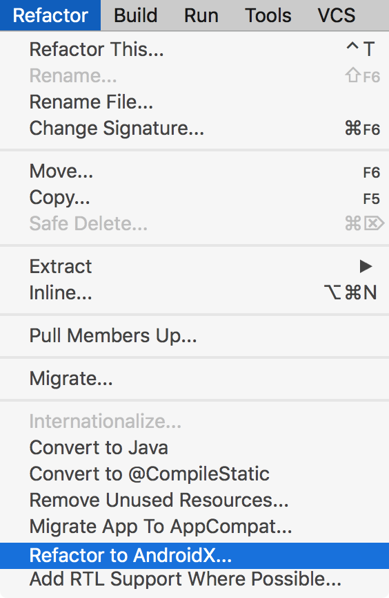

# 你好，AndroidX库

原标题：Hello World, AndroidX  
链接：[https://android-developers.googleblog.com/2018/05/hello-world-androidx.html](https://android-developers.googleblog.com/2018/05/hello-world-androidx.html)  
作者：Alan Viverette([@alanviverette](https://www.reddit.com/user/alanviverette))，Kathy Kam([@kathykam](https://twitter.com/kathykam?lang=en))，Lukas Bergstrom([@lukasb](https://twitter.com/lukasb?lang=en))  
翻译：[arjinmc](https://github.com/arjinmc)  

今天，我们推出了新的Android扩展库（AndroidX）的早期预览版，它代表了支持库的新时代。请[预览变更](https://developer.android.com/topic/libraries/support-library/androidx-rn.html)并向我们​​提供反馈。由于这是早期预览，因此我们不建议在任何生产项目上尝试此操作，因为存在一些[已知问题](https://developer.android.com/topic/libraries/support-library/androidx-rn#1.0.0a1-ki)。

支持库在超过7年前开始提供向后兼容框架API。多年来，该库已经发展到包含特定于设备的UX，调试，测试和其他实用程序。支持库的采用非常突出; 大多数Android应用程序今天使用支持库。我们希望增加在这方面的投资，而且我们打下稳定的基础至关重要。

在这方面，我们退后一步，并与你们中的许多人聊天。反馈意见一致而且一致; 图书馆的有机增长变得令人困惑。当我们支持的最小SDK级别是14时，有组件和名为“v7”的软件包！我们希望让你了解与平台捆绑在一起的API之间的区别，以及哪些应用程序开发者可以在不同版本的Android上工作的静态库。

考虑到这一点，请将“Hello World”改为“AndroidX”。正如之前在[Android KTX公告](https://android-developers.googleblog.com/2018/02/introducing-android-ktx-even-sweeter.html)中指出的那样，我们在这个包下添加了新功能，并更新了一些现有的功能。

android.*<strong>vs</strong> androidx.*<strong>命名空间</strong>  

编写Android应用程序意味着取决于两种类别：

* 类像PackageManager，这是捆绑在操作系统中，可以针对不同的Android版本不同的API和行为
* 类像AppCompatActivity或类似的类从操作系统ViewModel中分离出来，并在你的apk中发布。编写这些库是为了提供一个单一的API表面，其行为在Android版本中尽可能一致。

很多时候，非捆绑的库可能是更好的选择，因为它们跨不同的Android版本提供单个API表面。这个重构将非捆绑的库（包括所有支持库和[体系结构组件](https://developer.android.com/topic/libraries/architecture/index.html)移动到AndroidX包中，以清楚地知道要包含哪些依赖关系。

## 修改了包和Maven构件的命名

我们重新设计了包装结构以鼓励更小，更集中的库，以减轻不使用Proguard或Multidex的应用程序和测试的压力。Maven groupIds和artifactIds已更新以更好地反映库的内容，并且我们已将它们的groupId作为前缀库包的前缀，以便在你正在使用的类和它所来自的Maven工件之间创建明显的链接。

通常，你可以期望从旧到新包的通过以下映射：

旧 | 新
--- | ---
android.support.** | androidx.@
android.databinding.** | androidx.databinding.@
android.design.** | com.google.android.material.@
android.support.test.**	|（在未来的版本中）androidx.test.@

体系结构组件库也已被移入其中，androidx并简化了它们的软件包名称以反映它们与核心库的集成。这些库的更改示例：

旧 | 新
--- | ---
android.arch.**	| androidx.@
android.arch.persistence.room.** | androidx.room.@
android.arch.persistence.** | androidx.sqlite.@

此外，在Android 的[Material Components](https://developer.android.com/design/material/index.html)的 28.0.0-alpha1中作为[设计库](https://developer.android.com/topic/libraries/support-library/packages.html#design)的替代品推出之后，我们重构了设计包以反映它的新方向。

有关从28.0.0-alpha1（android.support）到1.0.0-alpha1（androidx）的完整映射列表，请参阅完整的[AndroidX重构映射](https://developer.android.com/androidx/refactor.html)。请注意，在alpha阶段可能会对此映射进行较小的更改。

## 每件产品严格的语义版本控制

从AndroidX重构开始，库版本从28.0.0重置为1.0.0。未来的更新将按照每个库的版本进行版本控制，遵循严格的语义版本控制规则，其中主要版本指示二进制兼容性。例如，这意味着可以将一项功能添加到RecyclerView中，并在你的应用程序中使用该功能，而无需更新你的应用程序使用的每个其他库。这也意味着库依赖于androidx可能提供与未来版本的AndroidX的二进制兼容性的合理保证 - 对1.5.0版本的依赖关系在1.7.0下运行时仍然可以工作，但可能不会对2.0.0版本工作。

## 从28.0.0-alpha1迁移

将你的应用程序android.support移至已androidx打包的依赖关系有两个主要部分：源重构和依赖关系转换。

  

源重构更新你的Java代码，XML资源和Gradle配置，以引用重构的类和Maven工件。此功能适用于[Android Studio Canary 14](https://developer.android.com/studio/preview/index.html)，适用于Android P的应用程序。

如果你依赖引用旧版支持库的库，则Android Studio将androidx通过依赖关系转换将该库更新为引用。Android Gradle Plugin 3.2.0-alpha14会自动应用依赖关系转换，它会重写JAR和AAR依赖项（以及传递依赖项）的字节码和资源，以引用新的已androidx包装类和工件。我们还将提供一个独立的翻译工具作为JAR。

## 下一步是什么？

我们知道这是对现有项目和代码库的一个重大改变。我们的目标是提供一个强大的基础，为Android的库项目提供更可持续的增长，更好的模块化和更小的代码大小。

我们希望这些变化还能让开发者更轻松地发现功能并在更短的时间内实施高质量的应用程序; 然而，我们知道迁移需要时间，可能不适合每个人的生产进度。出于这个原因，我们将继续android.support在P预览SDK时间范围内提供并行更新到一个-packaged库集。这些更新将继续以2018年3月[28.0.0-alpha1](https://developer.android.com/topic/libraries/support-library/revisions.html#28-0-0-alpha1)开始的28.0.0版本化方案，并且它们将继续与依赖于该android.support包的现有项目进行源代码兼容。

28.0.0的稳定版本将成为最终的功能版本android.support。所有后续功能版本将仅作为androidx包装的工件提供。

我们很乐意听取你的意见，因为我们正在迭代这个令人兴奋的未来。通过发布下面的评论向我们发送反馈，并请提交你在AOSP上遇到的[任何bug](https://source.android.com/setup/contribute/report-bugs)。

我们期待Android库的新时代！