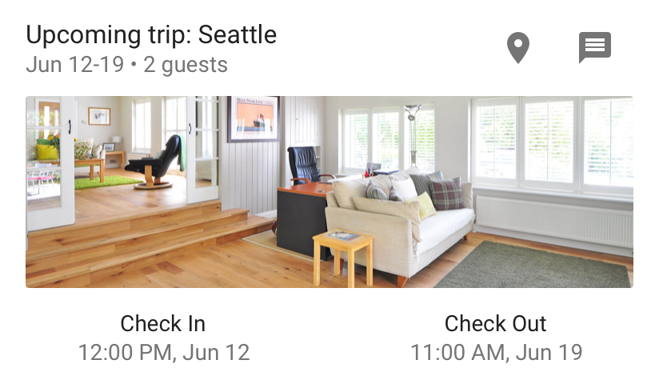
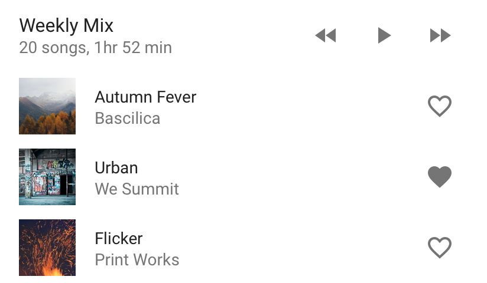
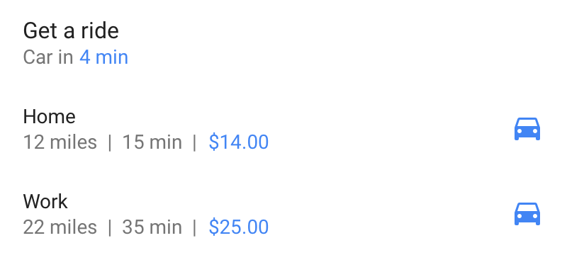
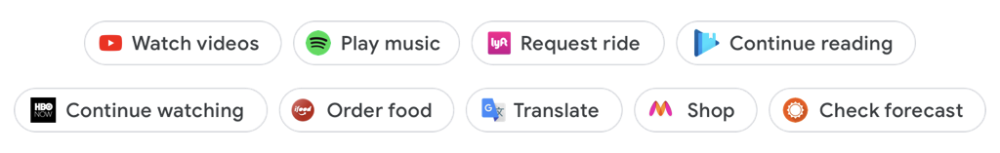
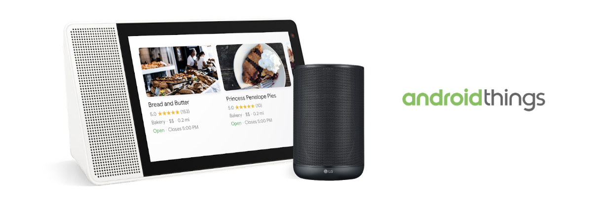

# Google I / O 2018：Android有什么新功能

原标题：Google I/O 2018: What’s new in Android  
链接：[https://android-developers.googleblog.com/2018/05/google-io-2018-whats-new-in-android.html](https://android-developers.googleblog.com/2018/05/google-io-2018-whats-new-in-android.html)  
作者：Stephanie Cuthbertson (Android产品管理总监)  
翻译：[arjinmc](https://github.com/arjinmc)  

随着Android在过去十年中呈指数级增长，我们也看到了我们的开发者社区急剧增长。在中国，印度和巴西等国家，使用我们IDE的开发者数量几乎增长了两倍 - 仅用了两年时间。随着这种增长，我们感到投资开发者体验的责任更大。在你的反馈意见的指导下，我们将工作重点放在快速简便地进行移动开发，通过使应用程序大大缩小来帮助你获得更多用户，并提高参与度以保持用户回归。我们也非常高兴地看到Android Things发展到1.0，为你开发新的机会 - 从主要消费设备到凉爽的遥控车辆！随着Google I / O的第一天开始，让我们仔细看看[Developer Keynote](https://www.youtube.com/watch?v=flU42CTF3MQ)中的这些主要主题：

## 开发：使移动开发变得快速和简单

* <strong>Android Jetpack</strong> - 今天，我们宣布推出[Android Jetpack](http://developer.android.com/jetpack)，旨在加速你的应用程序开发。Android Jetpack是下一代Android组件，将支持库的好处 - 向后兼容性和即时更新 - 集合到更多的组件中，使构建健壮的高质量应用程序变得轻松快捷。Android Jetpack管理诸如后台任务，导航和生命周期管理等活动，因此你可以消除样板代码并专注于使你的应用程序出色的功能。Android Jetpack旨在与Kotlin配合使用，为Android KTX节省更多代码。今天发布的新型Android Jetpack组件包括WorkManager，Paging，Navigation和Slices。

[视频介绍](https://youtu.be/LmkKFCfmnhQ)

* <strong>Kotlin</strong> - 自从去年宣布支持Kotlin以来，开发者社区已经接受了这种语言。最重要的是，95％的开发者告诉我们，他们对使用Kotlin进行Android开发非常满意。而且，越多的开发者使用它，数量越多。使用Kotlin的Play商店应用数量在去年增长了6倍。专业开发者有35％使用它，而且这个数字每个月都在增长。我们将继续改进我们的库，工具，运行时，文档和培训中的Kotlin开发者体验。[Android KTX](https://developer.android.com/kotlin/ktx)今天作为Android Jetpack的一部分推出，以优化Kotlin开发者体验。使用Android Studio，Lint支持和R8优化，工具不断改进。我们甚至在Android P中调整了Android运行时（ART），因此使用Kotlin构建的应用程序可以运行得更快。我们在官方文档中推出了Kotlin代码片段，并且今天发布了Kotlin版本的[API参考文档](https://developer.android.com/reference/kotlin/packages)。本周早些时候，我们在[Udacity上推出了一款新的Kotlin Bootcamp](https://www.udacity.com/course/kotlin-bootcamp-for-programmers--ud9011)，这对于Kotlin新手的开发者来说是一个很好的资源。最后，我们现在在[Google开发者专家计划](https://developers.google.com/experts/)中拥有Kotlin专长。如果你还没有使用Kotlin，我希望你[试试看](http://developer.android.com/kotlin)。

* <strong>Android Studio 3.2 Canary</strong> - [Android Studio 3.2](https://developer.android.com/studio/preview/)为Android Jetpack提供工具，包括一个可视导航编辑器和新的代码重构工具。该canary版本还包括用于创建新的Android App Bundle格式的构建工具，用于快速启动时间的Android模拟器中的快照，用于较小下载和安装应用代码大小的新R8优化器，用于测量应用对电池寿命的影响的新型Energy Profiler等等。你可以从cannary频道[下载页面](https://developer.android.com/studio/preview/)下载最新版本的Android Studio 3.2 。

### 分布：使应用程序从根本上变小

  

* <strong>Android应用套件和Google Play动态传递</strong> - 介绍Android的新应用模型。使用新的发布格式 - Android应用程序捆绑软件大幅降低应用程序大小。在Android Studio中，你现在将构建一个应用程序包，其中包含应用程序需要的所有设备的所有语言，每种设备屏幕大小以及每种硬件体系结构。然后，当用户下载你的应用程序时，Google Play的新动态传递将仅提供与用户设备匹配的代码和资源。人们在Play商店中看到较小的安装尺寸，可以更快地下载你的应用，并节省设备空间。 

  
（左）通过旧版APK传递到设备的所有资源的示例。  
（右）动态传递的一个例子就是为设备提供什么。

* <strong>通过Android App Bundle的动态功能</strong> - Android App Bundle还支持模块化，以便你可以按需提供功能，而不是在安装期间。你可以在最新的Android Studio canary版本中构建动态功能模块。加入我们的[测试计划](https://g.co/play/dynamicdeliverybeta)，在Google Play上发布。
* <strong>Google Play控制台</strong> - [Play控制台](https://g.co/play/console)的新功能报告将帮助你提高应用程序的性能和拓展业务。[阅读有关](https://android-developers.googleblog.com/2018/04/io-2018-everything-new-in-google-play.html)仪表板，统计信息，Android重要信息，预启动报告，采集报告和订阅仪表板的改进。你还可以使用我们的新发布格式（Android App Bundle）上传，测试和发布应用。
* <strong>Google Play Instant</strong> - 在GDC[发布](https://android-developers.googleblog.com/2018/03/our-big-bet-on-mobile-games-at-game.html)测试版后，今天我们宣布所有游戏开发者都可以制作免安装应用程序，我们非常高兴地欢迎[Candy Crush Saga](https://play.google.com/store/apps/details?id=com.king.candycrushsaga&hl=en_US)。通过Play商店，搜索，社交网站和大多数地方你可以点击链接，全球超过10亿个设备上都可以使用Google Play Instant。为了让免安装应用程序更容易构建，本周我们将推出与Cocos创作者的Unity插件和测试版集成。最近，我们已开始测试Google Play与AdWords的即时兼容性，允许用户直接从广告中试用通过[Universal App广告系列](https://adwords.googleblog.com/2018/05/google-io-grow-and-earn-with-adwords.html)覆盖的所有渠道的游戏。

### 参与：让用户回来越来越多。

* Slice - Slice是UI模板，可在你的应用中显示丰富的动态和交互式内容，适用于Android和Google表面。Slice可以包含实时数据，滚动内容，内联动作以及深入链接到你的应用程序，以便用户可以从播放音乐到检查预订更新。Slice还可以包含交互式控件，如toggle和slider。你今天可以[开始](https://developer.android.com/guide/slices/getting-started)制作Slice，并且它们很快就会开始向用户展示。

* <strong>Action</strong> - Action是让应用程序的功能和内容更易于访问的一种新方式，以便人们可以在适当的时机轻松找到它。[App Action](http://developer.android.com/guide/actions/)将根据使用情况和相关性在多个Google和Android界面（例如Google搜索应用，Play商店，Google助手和Launcher）中向用户展示。App Action将适用于所有开发者去试用，如果你希望收到通知，[请在此注册](https://docs.google.com/forms/d/e/1FAIpQLSfzg7DrFtD8S_tHrYYoWpmsfFzLuduukoQQY6A2AtHsxTHgKg/viewform)。你也可以选择建立一个[会话Action](https://developers.google.com/actions/)作为伴随体验到你的应用程序。这适用于各种支持助手(Google Assistant)的设备，例如扬声器和智能显示器。这两种类型的操作都使用的新的通用目录[意图](intents)。

 

### 更智能的设备：物联网设备的强大平台

* <strong>Android Things 1.0</strong> - [Android Things](https://developer.android.com/things/)是Google的托管操作系统，可让开发者按比例构建和维护物联网设备。今年早些时候在美国消费电子展上，我们宣布联想，哈曼，LG和iHome都在开发基于Android Things的[助手产品](https://android-developers.googleblog.com/2018/01/new-products-at-ces-powered-by-android.html)。 

 

在开发者预览了超过10万个SDK的下载以及来自10,000多个开发者的反馈后，我们在本周宣布了[Android Things 1.0](https://android-developers.googleblog.com/2018/05/say-hello-to-android-things-10.html)。该平台现在支持四个新的模块化系统（SoM），并保证三年的长期支持以及扩展支持的附加选项，从而更轻松地从原型转向生产。为了使产品开发比以往更加无缝，随附的Android Things Console也准备投入生产。它可帮助开发者使用Google提供的最新稳定性修补程序和安全更新轻松管理和更新设备。

要开始使用Android Things，请访问我们的[开发者网站](https://developer.android.com/things/)和新的[社区中心](https://androidthings.withgoogle.com/)，以探索工具包，示例代码，社区项目以及加入[Google的物联网开发者社区](https://g.co/iotdev)以保持更新。我们推出了一项有限的计划，与Android Things团队合作提供技术指导和支持构建你的产品。如果贵公司有兴趣，请注册我们的[OEM合作伙伴计划](https://services.google.com/fb/forms/androidthingspartner/)。

除了所有这些新发展之外，我们还在140多个国家开展工作，通过[女性技术人员](https://www.womentechmakers.com/)和Google开发者组（[GDG](https://developers.google.com/groups/)）等计划发展壮大开发者社区。我们正在投资于[Google Developers认证](https://developers.google.com/training/certification/)等培训计划，通过Udacity和其他合作伙伴构建更多课程，以帮助开发者加深技术能力。今天，来自15个国家/地区的[50家代理机构](https://developers.google.com/agency/directory/)的225位Google Developers Agency计划成员获得了Android认证。作为Google开发者专家计划的一部分，我们现在也拥有[90多位Android开发专家 ](https://developers.google.com/experts/all/technology/android)在世界各地积极支持开发商，初创公司和公司构建和推出创新应用程序。

我们也继续认可顶级应用和游戏开发者的出色工作。今年，我们举办了第三届年度Google Play大奖。提名代表了Android上的一些最佳体验，重点在于整体质量，强大的设计，技术性能和创新。查看[获奖者和提名人](https://g.co/play/gpa2018)。

在[Google I / O](https://events.google.com/io/)期间，与会者和观众有机会深入探索48个Android＆Play分会论坛。感谢你提供所有你的精彩反馈，并请继续向我们提供你下一步要走的建议。