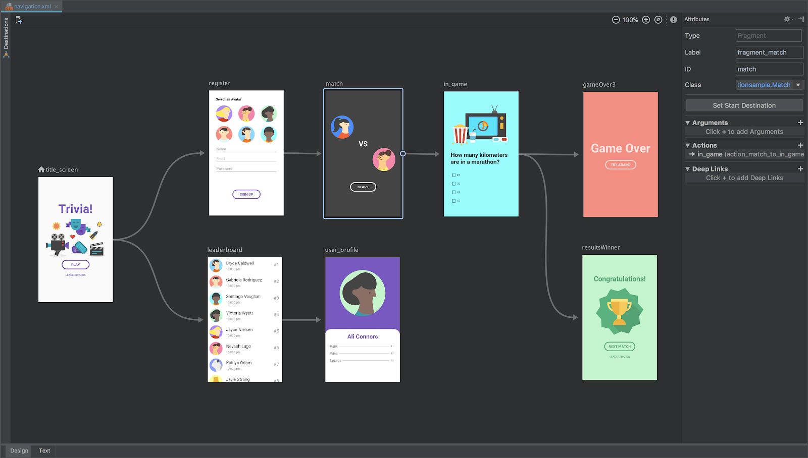
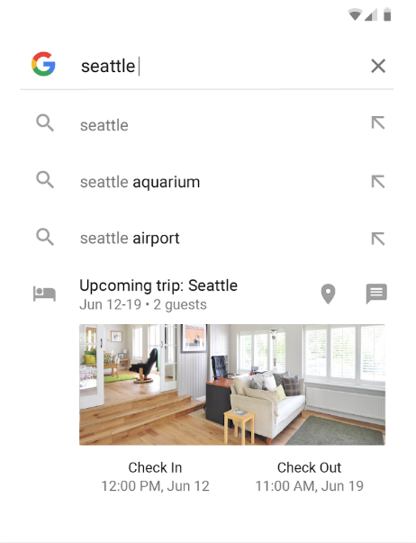
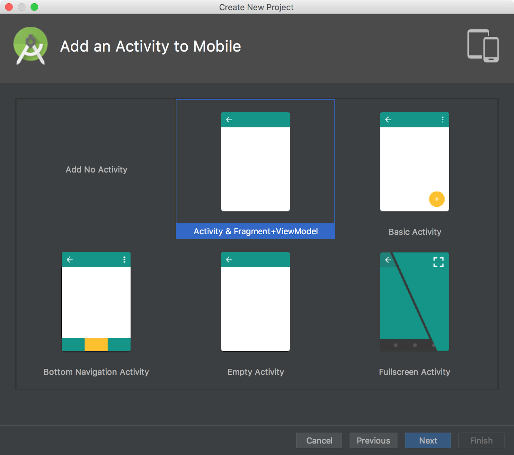

# 使用Android Jetpack加速你的应用程序开发

原标题：Use Android Jetpack to Accelerate Your App Development  
链接：[https://android-developers.googleblog.com/2018/05/use-android-jetpack-to-accelerate-your.html](https://android-developers.googleblog.com/2018/05/use-android-jetpack-to-accelerate-your.html)  
作者：Chris Sells， Benjamin Poiesz，Karen Ng (Android开发者工具产品经理)  
翻译：[arjinmc](https://github.com/arjinmc)  

今天，我们很高兴地介绍Android Jetpack，这是下一代组件，工具和架构指南，可加速你的Android应用开发。

[视频介绍](https://youtu.be/LmkKFCfmnhQ)

Android Jetpack受到支持库的启发，支持库是一组组件，可以轻松利用新的Android功能，同时保持向后兼容性; 目前Play商店中每个应用的99％都使用它。继成功之后，我们推出了[体系结构组件](https://irina-dot-devsite.googleplex.com/jetpack/arch)，旨在使面对更改和应用程序生命周期复杂性时处理数据变得更加轻松。自从我们在一年前在I / O上引入这些组件后，绝大多数人都采用了它们。诸如LinkedIn，Zillow和iHeartRadio等公司正在看到更少的错误，更高的可测试性以及更多时间专注于使其应用独一无二的原因。

Android开发者社区已经很清楚 - 你不仅喜欢我们对这些现有组件所做的工作，但我们知道你需要更多！你得到的东西也越多。

## 什么是Android Jetpack？

Android Jetpack是一套组件，工具和指导，可以制作出优秀的Android应用程序。Android Jetpack组件将现有的支持库和体系结构组件结合在一起，并将它们分为四类：

  

Android Jetpack组件是作为“非捆绑”库提供的，它们不是底层Android平台的一部分。这意味着你可以在自己的时间以自己的速度采用每个组件。当新的Android Jetpack功能可用时，你可以将其添加到你的应用中，将你的应用部署到Play商店，并在一天内为用户提供所有新功能（如果你快速的话）！非捆绑的Android Jetpack的图书馆已全部搬入新<i>androidx.* </i>的命名空间（如详细描述在这个[帖子](http://todo/)）。

另外，你的应用程序可以在各种版本的平台上运行，因为Android Jetpack组件的构建是为了提供独立于任何特定版本的功能，从而提供向后兼容性。

此外，Android Jetpack建立在现代设计实践之上，如关注点和可测试性分离以及Kotlin集成等生产力特性。这使得使用更少的代码构建健壮，高质量的应用程序变得更加容易。虽然Android Jetpack的组件可以协同工作，例如生命周期感知和实时数据，但你不必全部使用它们 - 你可以集成解决问题的Android Jetpack部件，同时保留应用的各个部分那就可以了。

我们知道这些好处对你来说很重要，因为这样的反馈：

“我们一直在考虑在我们的代码库中尝试使用MVVM，Android Architecture Components为我们提供了一个简单的模板来实现它，这也有助于我们的代码更好地测试;单元测试ViewModels的能力确实提高了代码的健壮性。

-[Zillow](https://irina-dot-devsite.googleplex.com/stories/apps/zillow)高级工程师Sumiran Pradhan

如果你想了解更多关于公司如何使用Android Jetpack组件的信息，可以阅读Android开发者网站上的[开发者故事](https://irina-dot-devsite.googleplex.com/stories/)。

最后，从上面的Android Jetpack图表中可以看到，今天我们还宣布了新组件。

## 新的什么

Android Jetpack包含五个新组件：

* WorkManager Alpha版本
* 导航alpha版本
* 分页稳定版本
* Slices(切片) alpha释放
* Android KTX（Kotlin Extensions）alpha版本

### WorkManager

WorkMananager组件是一个功能强大的新库，为需要保证执行的基于约束的后台作业提供一站式解决方案，取代了使用诸如作业或SyncAdapter之类的东西的需要。WorkManager提供了一个简化的现代化API，可以在带有或不带有Google Play服务的设备上工作，可以创建工作图形以及查询工作状态。早期的反馈非常令人鼓舞，但我们很乐意确保你的使用案例也得到了覆盖。你可以看到我们目前为止的内容，并提供关于[WorkManager组件](https://d.android.com/arch/workmanager) Alpha的反馈。

### 导航

虽然Activity是系统为应用程序的用户界面提供的入口点，但当它们在彼此之间共享数据和转换时，它们的灵活性使其成为构建应用程序内导航的理想架构。今天，我们将导航组件作为构建应用内UI的框架加以介绍，重点在于将单个Activity应用作为首选体系结构。通过对Fragments的开箱即用支持，你可以获得Lifecycle和ViewModel等所有体系结构组件的好处，同时允许导航为你处理FragmentTransactions的复杂性。此外，导航组件允许你声明我们为你处理的转换，自动构建正确的向上和向后行为，包括对深层链接的全面支持，并提供帮助将导航连接到相应的UI小部件，如导航抽屉和底部导航。但那不是全部！导航编辑器[Android Studio 3.2](https://developer.android.com/studio/preview/)允许你以可视方式查看和管理导航属性：

  
该[导航组件](https://d.android.com/arch/navigation)也是alpha版，我们期待你的反馈意见。

### 分页

加载应用程序中显示的数据可能很大并且代价高昂，因此一次避免下载，创建或呈现太多很重要。[分页组件](https://d.android.com/arch/paging)版本1.0.0可以很容易地加载和现在的大数据集与你RecyclerView快速，无限滚动。它可以从本地存储，网络或两者加载分页数据，并且可以让你定义如何加载内容。它可以与Room，LiveData和RxJava一起使用。

### Slices

最后，为了完成Android Jetpack首次亮相的一系列新功能，它是Slices组件。作为搜索的结果，“切片”是一种在Google Assistant内部展示应用UI的方法：

  

你可以[了解有关Slices组件的所有信息](http://todo/)，以及如何将它集成到Android开发者网站上的应用程序中。

### Android KTX

最后但并非最不重要的一点，Android Jetpack的一个目标是利用Kotlin语言功能，使你的工作效率更高。Android KTX 可让你像这样转换Kotlin代码：

```code
view.viewTreeObserver.addOnPreDrawListener(
  object : ViewTreeObserver.OnPreDrawListener {
    override fun onPreDraw(): Boolean {
      viewTreeObserver.removeOnPreDrawListener(this)
      actionToBeTriggered()
      return true
    }
});
```    

转换成更简洁的Kotlin代码，如下所示：

```code
view.doOnPreDraw { actionToBeTriggered() }
```

这只是将Kotlin支持带给Android Jetpack组件的第一步; 我们的目标是让Android Jetpack非常适合Kotlin开发者（当然还有Java开发者！）。你可以在Android Developer网站上[阅读有关Android KTX的更多信息](https://developer.android.com/kotlin/ktx)。

## 入门

你可以在[developer.android.com/jetpack](http://developer.android.com/jetpack)上开始使用Android Jetpack。你可以找到Android Jetpack的文档和视频，查看Android Jetpack组件的新功能，参与社区并向我们提供反馈。我们还创建了专门用于Android Jetpack的YouTube播放列表，因此你可以收听有关Android Jetpack，组件，工具和最佳实践的信息。

[Android Jetpack入门](http://todo/)将告诉你如何将Android Jetpack组件带入现有的应用程序，并帮助你开始使用新的Android Jetpack应用程序。Android Studio 3.2对Android Jetpack具有很好的工具支持。为了构建新的应用程序，请使用可以从File | New | New Project 添加的Activity＆Fragment + ViewData activity 到Android Studio中的新项目：

  

## 下一步是什么

借助Android Jetpack，我们将利用支持库和体系结构组件的优势，将新组件，Android Studio集成和Kotlin支持带入一个新高度。虽然Android Jetpack提供了下一代组件，工具和指导来加速你的Android开发，但我们还有更多想做的事情，我们希望得到你的帮助。请转到[developer.android.com/jetpack](http://developer.android.com/jetpack)，让我们知道我们可以做些什么来使你的Android应用程序的体验更加完美。