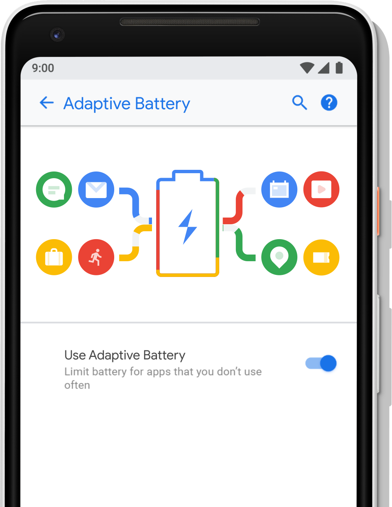
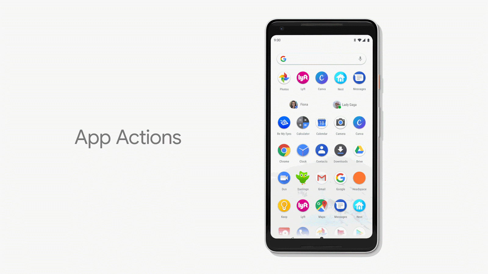
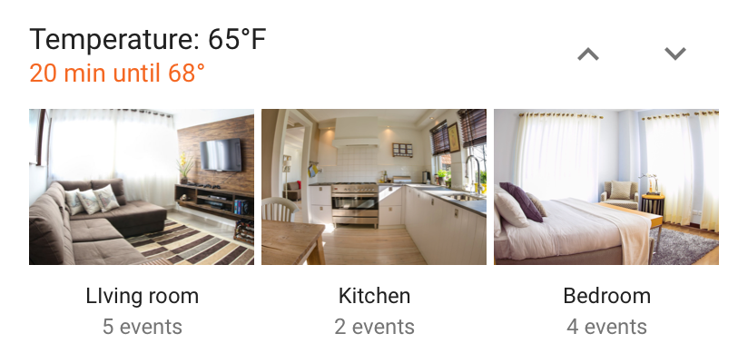
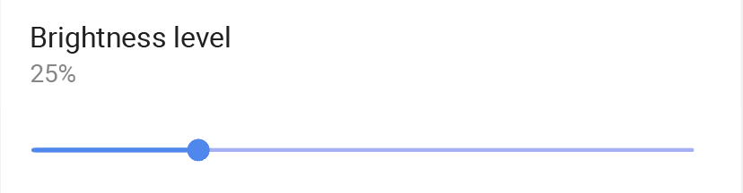
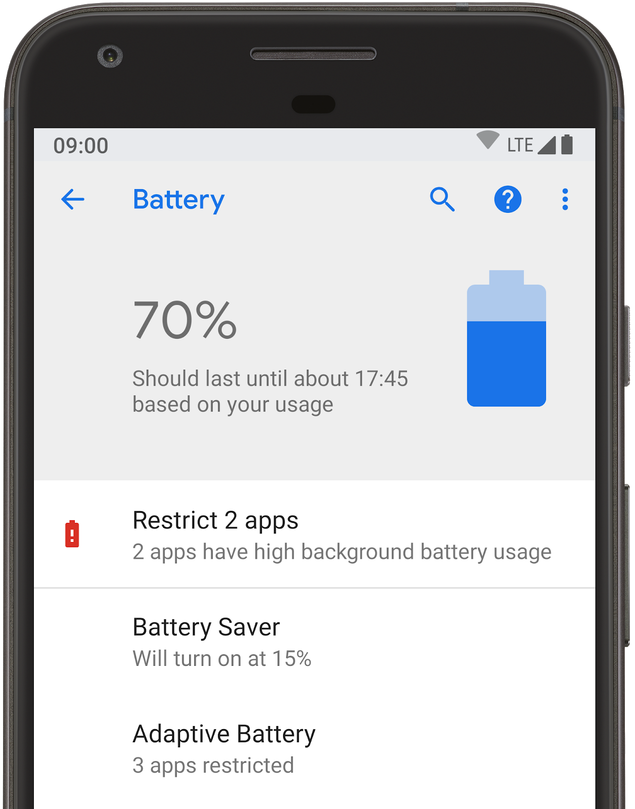
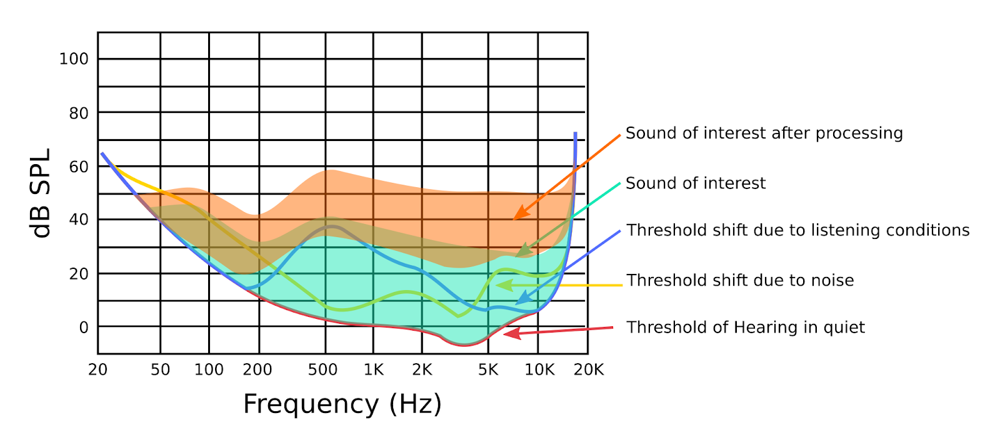
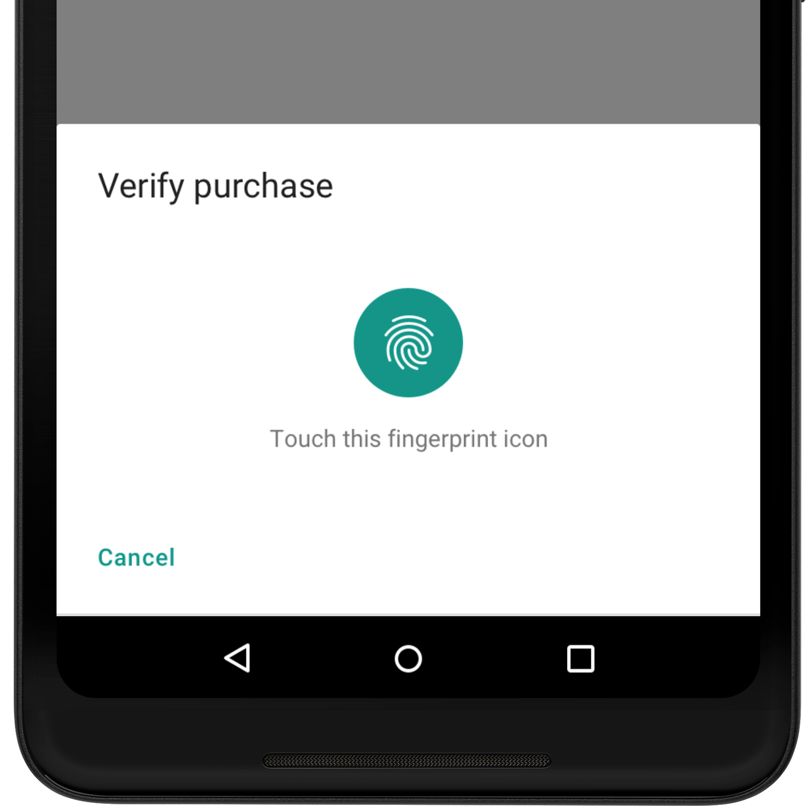

# Android P Beta中的新功能

原标题：What’s new in Android P Beta  
链接：[https://android-developers.googleblog.com/2018/05/whats-new-in-android-p-beta.html](https://android-developers.googleblog.com/2018/05/whats-new-in-android-p-beta.html)  
作者：Dave Burke (工程副总裁)
翻译：[arjinmc](https://github.com/arjinmc)  

今天早些时候，我们推出了Android的下一个版本Android P的Android P的测试版。Android P将AI作为操作系统的核心，专注于智能和简单的体验。你可以在[这里](https://blog.google/products/android/android-p)阅读有关新的用户功能的更多信息。

对于开发者来说，Android P beta提供了一系列利用这些新智能的方法，特别是当涉及到增加对应用程序的参与度时。

通过[在此注册](https://www.google.com/android/beta)，你可以在Pixel设备上获得Android P测试版。此外，由于[Project Treble](https://android-developers.googleblog.com/2017/05/here-comes-treble-modular-base-for.html)，你现在可以从[我们的合作伙伴那里获得顶级设备](https://android.com/beta)上的测试版 - Essential，诺基亚，OPPO，索尼，Vivo和小米，以及其他。

访问[android.com/beta](https://android.com/beta)获取设备的完整列表，以及如何在设备上获取Android P beta的详细信息。要开始使用Android P beta进行开发，请访问[developer.android.com/preview](https://developer.android.com/preview/index.html)。

## 智能智能手机，以机器学习为核心

Android P使智能手机变得更加智能，帮助它学习并适应用户。你的应用程序可以利用最新的机器智能来帮助你接触更多用户并提供新的体验。

## 自适应电池

无论使用何种设备，电池都是我们从手机用户那里听到的头号优先事项。在Android P中，我们与[DeepMind](https://deepmind.com/)合作开发了一项新功能，我们称其为Adaptive Battery，可优化应用程序使用电池的方式。

  

自适应电池使用机器学习为用户最关心的应用优先访问系统资源。它使用四个新的“应用程序备用存储区”级别，从“活动”到“罕见” ，将运行的应用程序放入具有[不同限制的组](http://go/dac-stage/preview/features/power)中。应用会随着时间的推移而改变存储空间，而未处于“活动”存储空间的应用将对job，闹钟，网络和高优先级的Firebase云端消息具有限制。

如果你的应用程序针对[Doze](https://developer.android.com/training/monitoring-device-state/doze-standby#understand_doze)，[应用程序待机](https://developer.android.com/training/monitoring-device-state/doze-standby#understand_app_standby)和[后台限制](https://developer.android.com/about/versions/oreo/background)进行了优化，则自适应电池应该适合你的开箱即用。我们建议在四个存储桶中的每一个中测试你的应用程序。查看详细信息的[文档](http://go/dac-stage/preview/features/power)。

## App Action

App Action(应用操作)是一种新的方式，可以在用户开始执行任务时提高应用的可见性。他们将应用程序的核心功能置于用户面前，作为处理其任务的建议，从启动器和智能文本选择，Google Play，Google搜索应用程序和助手等系统中的关键接触点开始。

Action使用机器学习根据用户的上下文或最近的交互来为用户展示恰当的应用程序。由于Actions会在最相关的时间和地点突出显示你的应用，因此它们是接触新用户并重新与现有用户互动的好方法。

  

要支持应用程序操作，只需将你的应用程序的功能定义为[语义意图](https://developers.google.com/actions/)即可。应用操作使用共同的同一目录意图作为对话的行动为谷歌助手，它可以控制声控音箱，智能显示器，汽车，电视，耳机等。App Actions不需要API表面，因此它们可以在任何受支持的Android平台版本上运行。

操作将很快提供给开发者尝试， 如果你希望收到通知，请在这里[注册](https://docs.google.com/forms/d/e/1FAIpQLSfzg7DrFtD8S_tHrYYoWpmsfFzLuduukoQQY6A2AtHsxTHgKg/viewform)。

## Slices

  

除App动作外，我们还推出了Slices，这是你的应用向用户提供远程内容的新方式。借助Slices，你可以在Google搜索和助手等展示丰富的，模板化的用户界面。Slices是互动的，支持动作，切换，滑块，滚动内容等。

  

Slices是吸引用户的一种很好的新方式，我们希望它们尽可能广泛地提供。我们在Android P中添加了平台支持，并且我们将开发者API和模板构建到[Android Jetpack](https://developer.android.com/jetpack)中，这是我们用于构建优秀应用程序的新库和工具集。通过Jetpack，你的Slices实施可以将用户一直定位到Kitkat - 跨95％的活动Android设备。我们还可以定期更新模板以支持新的用例和交互（如文本输入）。

  

查看[入门指南](https://developer.android.com/guide/slices/getting-started)以了解如何使用Slices进行构建 - 你可以使用SliceViewer工具查看Slice的外观。随着时间的推移，我们计划扩大Slices可以出现的位置数量，包括其他应用程序中的远程显示。

## 通知的智能回复

Gmail和Inbox中的智能回复功能是机器智能如何积极改变应用体验的绝佳示例。在Android P中，我们将带有API的智能回复带到了通知中，以便你为用户提供此优化。为了便于在通知中填入回复，你很快就可以使用ML Kit了 - 详情请参阅[developers.google.com/mlkit](http://developers.google.com/mlkit)。

## 文本分类器

在Android P中，我们扩展了标识内容或文本输入实体的ML模型，以支持日期和航班号等更多类型，并且我们正在通过[TextClassifier](https://developer.android.com/reference/android/view/textclassifier/package-summary) API向开发者提供这些改进。我们还在更新[Linkify API](https://developer.android.com/reference/android/text/util/Linkify)，该API可自动创建链接以充分利用这些TextClassification模型，并丰富了用户用于快速执行操作的选项。开发者将具有将TextClassifier服务所识别的任何实体链接起来的附加选项。智能Linkify在检测和性能的准确度和精度方面有显着的改进。

更好的是，这些模型现在可以直接从Google Play进行更新，因此你的应用可以利用使用相同API的模型改进。一旦安装了更新的模型，所有的实体识别都将在设备上进行并且数据不会通过网络发送。

## 简单

我们特别强调Android P的简单性，发展Android的UI以简化和增强用户任务。对于开发者来说，这些更改有助于改进用户查找，使用和管理应用程序的方式。

## 新的系统导航

我们在Android P中引入了新的系统导航，使用户可以通过每个屏幕上的单个按钮更轻松地访问主页，概览和助手。新的导航功能简化了多任务处理，并使得发现相关应用程序变得更容易。在概述中，用户对他们离开每个应用程序时所做的操作有更大的看法，这使得查看和恢复活动变得更加容易。该概述还提供对搜索，预测应用程序和应用程序操作的访问权限，并通过另一次刷卡将用户带到所有应用程序。

  

## 文本放大镜

在Android P中，我们还添加了一个新的[Magnifier小部件](https://developer.android.com/reference/android/widget/Magnifier)，用于更容易地选择文本并操纵文本中的文本光标。默认情况下，扩展TextView的类会自动支持放大镜，但是你可以使用[Magnifier](https://developer.android.com/reference/android/widget/Magnifier)API将其附加到任何自定义视图，这可以可以打开各种用途。

## 后台限制

  

我们正在简化用户识别和管理在后台使用电池的应用程序。从我们关于Android Vitals的工作中，Android可以检测电量耗尽的应用行为，例如过度唤醒锁等。现在在Android P中，“电池设置”列出了这些应用程序，并允许用户通过一次点击即可限制其后台活动。

当应用程序受到限制时，其后台作业，闹钟，服务和网络访问都会受到影响。要不在列表中，请注意Play管理中心中的[Android Vitals仪表板](http://developer.android.com/vitals)，它可以帮助你了解性能和电池问题。

后台限制可确保开发者为跨设备和制造商构建的基线行为。尽管设备制造商可以在核心设备上添加限制，但他们必须通过电池设置提供用户控制。

我们添加了一个标准API来让应用程序[检查它们是否受限制](https://developer.android.com/reference/android/app/ActivityManager#isbackgroundrestricted)，以及新的ADB命令，以便你可以手动将限制应用于应用程序进行测试。详情请参阅[文档](https://developer.android.com/preview/features/power#bg-restrict)。我们还计划在未来向你的Play Console Android Vitals仪表板添加限制相关指标。

## 使用动态处理增强音频

Android P在音频框架中引入了新的动态处理效果，可让开发者提高音频质量。通过动态处理，你可以分离特定的频率，降低响度或增加柔和的声音，以提高应用程序的声音质量。例如，你的应用可以改善在大声，遥远或声学极具挑战性的环境中安静地说话的人的声音。

在[Dynamics Processing(动态处理)](https://developer.android.com/reference/android/media/audiofx/DynamicsProcessing)API，你可以访问包括预均衡器，多频段压缩器，后均衡器和一个链接的限制器的多级，多频带动态处理的效果。它允许你修改Android设备发出的音频，并根据收听者的偏好或环境条件对其进行优化。频段和激活阶段的数量是完全可配置的，大多数参数可以实时控制，如增益，攻击/释放时间，阈值等。

要了解可以使用动态处理效果做什么，请参阅[文档](https://ideveloper.android.com/reference/android/media/audiofx/DynamicsProcessing)。

  

## 安全

### 生物识别提示

  

Android P为越来越多的生物识别传感器提供标准的身份验证体验。应用程序可以使用新的[BiometricPrompt](https://developer.android.com/reference/android/hardware/biometrics/BiometricPrompt) API，而不是显示自己的生物特征验证对话框。这个新的API取代了DP1中添加的FingerprintDialog API。除了支持指纹（包括显示内传感器）之外，它还支持Face和Iris身份验证，提供全系统一致的体验。有一个[USE_BIOMETRIC](https://developer.android.com/reference/android/Manifest.permission#USE_BIOMETRIC)权限涵盖了所有设备支持的生物识别技术。FingerprintManager和相应的USE_FINGERPRINT权限已被弃用，所以请尽快切换到[BiometricPrompt](https://developer.android.com/reference/android/hardware/biometrics/BiometricPrompt)。

## 受保护的确认

Android P引入了[Android Protected Confirmation](https://developer.android.com/preview/features/security#android-protected-confirmation)，它使用可信执行环境（TEE）来保证给定的提示字符串被用户显示和确认。只有在成功的用户确认后，TEE才会签署应用程序可以验证的提示字符串。

## 更强大的私钥保护

我们已经将StrongBox添加为新的[KeyStore](https://developer.android.com/reference/java/security/KeyStore)类型，为设备提供API支持，这些设备通过隔离的CPU，RAM和安全闪存提供防篡改硬件中的密钥存储。你可以设置你的密钥是否应受[KeyGenParameterSpec](https://developer.android.com/reference/android/security/keystore/KeyGenParameterSpec)中 StrongBox安全芯片的保护。

## Android P Beta

为用户带来新版Android需要谷歌，芯片制造商（SM），设备制造商（OEM）和运营商共同努力。这个过程在技术上是具有挑战性的，需要时间 - 为了更容易，我们去年推出了[Project Treble](https://android-developers.googleblog.com/2017/05/here-comes-treble-modular-base-for.html)作为Android Oreo的一部分。从那以后，我们一直在与合作伙伴一起合作，现在我们看到了Treble能够做什么的证据。

今天我们宣布，我们的顶级合作伙伴中有6家加入我们，在其设备上发布[Android P Beta](http://android.com/beta) - <strong>索尼Xperia XZ2</strong>，<strong>小米Mi Mix 2S</strong>，<strong>诺基亚7 Plus</strong>，<strong>Oppo R15 Pro</strong>，<strong>Vivo X21UD和X21</strong>以及<strong>Essential PH-1</strong>。我们正在邀请世界各地的早期使用者和开发者在任何这些设备上尝试Android P Beta，以及<strong>Pixel 2</strong>，<strong>Pixel 2 XL</strong>，<strong>Pixel</strong>和<strong>Pixel XL</strong>。

你可以在[android.com/beta](https://android.com/beta)上看到支持的合作伙伴和Pixel设备的完整列表。对于每个设备，你都可以找到规范和指向制造商专用站点的下载，支持和报告问题的链接。对于Pixel设备，你现在可以[将设备注册到Android Beta程序](https://google.com/android/beta)中，并自动通过无线方式接收最新的Android P Beta。

立即在你最喜爱的设备上[试用Android P Beta](http://android.com/beta)，并让我们知道你的反馈！请继续关注Project Treble即将推出的更新。

## 使你的应用程序兼容

随着越来越多的用户开始在他们的设备上使用Android P测试版，现在是时候测试应用程序的兼容性，解决任何问题并尽快发布更新。请参阅[迁移指南](https://developer.android.com/preview/migration.html)了解步骤和建议的时间表。

要测试兼容性，只需将你当前的Google Play应用安装到运行Android P Beta 的设备或[模拟器](https://developer.android.com/studio/run/managing-avds.html)上，然后处理用户流。该应用应该运行并且看起来很棒，并且正确处理Android P [行为更改](https://developer.android.com/preview/behavior-changes)。尤其要注意[自适应电池](http://go/dac-stage/preview/features/power)，[Wi-Fi权限更改](https://developer.android.com/preview/features/security-behav#wi_fi_permissions)，[后台使用摄像头和传感器的限制](https://developer.android.com/preview/behavior-changes#input-data-privacy)，应用程序[数据的更严格的SELinux策略](https://developer.android.com/preview/features/security-behav#per-app-selinux)以及[默认启用的TLS](https://developer.android.com/preview/features/security-behav#per-app-selinux#tls-enabled)更改以及[Build.SERIAL限制](http://device-serial-access/)。

## 通过公共API进行兼容

测试你的应用程序以使用非SDK界面非常重要。正如[前面所提到的](https://android-developers.googleblog.com/2018/02/improving-stability-by-reducing-usage.html)，在Android的P我们开始一个渐进的过程，以限制对选定的非SDK接口，要求开发商-包括谷歌内部应用团队-使用公共等价物来代替。

如果你的应用使用私人Android界面和库，则应该转而使用Android SDK或NDK中的公共API。第一个开发开发者预览显示了使用非SDK界面的警告 - 从Android P Beta开始，<strong>使用非豁免的非SDK界面会在你的应用程序中产生错误</strong> - 因此你现在将会抛出异常的警告。

为了帮助你识别非SDK API的反射使用情况，我们在StrictMode中添加了两种新方法。你可以使用[detectNonSdkApiUsage()](https://developer.android.com/reference/android/os/StrictMode.VmPolicy.Builder#detectNonSdkApiUsage())来警告你的应用何时通过反射或JNI访问非SDK API，并且可以使用[permitNonSdkApiUsage()](https://developer.android.com/reference/android/os/StrictMode.VmPolicy.Builder#permitNonSdkApiUsage())来禁止针对这些访问的StrictMode警告。这可以帮助你了解你的应用对非SDK API的使用情况 - 即使此时可以免除这些API，最好为未来做计划并消除其使用。

如果没有符合你使用情况的公开API，请[立即通知我们](https://issuetracker.google.com/issues/new?component=328403&template=1027267)。我们希望确保初始部署只影响开发者可以轻松迁移到公共选择的界面。关于[限制的更多信息在这里](https://developer.android.com/preview/behavior-changes.html#compat)。

## 测试与显示剪影

使用<strong>显示切口测试你的应用</strong>也很重要。现在，你可以使用我们[几款合作伙伴的设备运行Android Beta](https://developer.android.com/preview/devices)，确保你的应用在显示屏上保持最佳状态。你还可以通过开发者选项使用任何Android P设备上提供的模拟剪切支持。

## 开始使用Android P

准备就绪后，深入Android P并了解可在你的应用中使用的许多[新功能和API](https://developer.android.com/preview/api-overview.html)。为了便于探索新的API，请参阅API差异报告（[API 27-> DP2](https://developer.android.com/sdk/api_diff/p-dp2/changes.html)，[DP1-> DP2](https://developer.android.com/sdk/api_diff/p-dp2-incr/changes.html)）以及[Android P API参考](https://developer.android.com/reference/packages.html)。有关详细信息，请访问[Developer Preview网站](https://developer.android.com/preview/index.html)。还可以看看这个[突出显示 Android P Beta开发者的新功能](https://www.youtube.com/watch?v=ZXyvgHJ6c4w)的视频。

要开始使用Android P，请将P Developer Preview SDK和工具下载到Android Studio 3.1或使用最新版本的[Android Studio 3.2](https://developer.android.com/preview/setup-sdk.html#get-studio)。如果你没有[运行Android P Beta的设备](https://android.com/beta)，则可以[使用Android模拟器](https://developer.android.com/studio/run/managing-avds.html)运行并测试你的应用。

与往常一样，你的反馈意见很重要，所以请[让我们知道你的想法](https://developer.android.com/preview/feedback.html) - 我们收到你的回复越早，我们可以整合的反馈越多。当你发现问题时，请[在这里报告](https://developer.android.com/preview/bug)。我们为[平台问题](https://issuetracker.google.com/issues/new?component=190602&template=1024208)，[应用程序兼容性问题](https://issuetracker.google.com/issues/new?component=190602&template=1024202)和[第三方SDK问题](https://issuetracker.google.com/issues/new?component=190602&template=1024212)提供单独的列表。