# Android Studio 3.2 Canary

原标题：Android Studio 3.2 Canary  
链接：[https://android-developers.googleblog.com/2018/05/android-studio-3-2-canary.html](https://android-developers.googleblog.com/2018/05/android-studio-3-2-canary.html)  
作者：Android团队
翻译：[arjinmc](https://github.com/arjinmc)  

今天在Google I / O 2018上，我们宣布了Android Studio 3.2的最新预览，其中包括一组支持[Android P开发者预览](https://developer.android.com/preview/)，新的[Android App Bundle](http://d.android.com/appbundle)和[Android Jetpack](http://developer.android.com/jetpack)的令人兴奋的功能。立即从我们的Canary发布频道[下载](https://developer.android.com/studio/preview/)Android Studio 3.2，探索今年最具功能丰富的版本之一。

Android Jetpack是一套库，开发者工具和体系结构指南，可帮助你轻松快捷地构建优质的Android应用程序。它提供了常见的基础架构代码，因此你可以专注于使你的应用独一无二的原因 Android Studio 3.2包含一系列支持Jetpack的工具，这些工具使用导航API，Android Slices API模板，重构工具迁移到Jetpack - AndroidX中新的Android支持库，从而支持Jetpack。

Android Studio 3.2的Canary 14版本还支持新的Android应用程序模型，即APK格式Android App Bundle的演变。无需更改代码，Android Studio 3.2将帮助你创建新的Android应用程序包并准备在Google Play上发布。

此版Android Studio中有20个主要功能，从超快速Android模拟器快照，布局编辑器中的示例数据到全新的Energy Profiler，以测量应用程序对电池的影响。如果这些功能中的任何一个听起来很有趣，请立即[下载](https://developer.android.com/studio/preview/)Android Studio 3.2的预览版。

要查看这些演示中的功能并获得我们正在开发的其他功能的高峰，请查看Google I / O 2018大会 - [Android开发工具中的新增功能](https://events.google.com/io/schedule/?section=may-8&sid=73ae7d40-d81a-43e6-a1b9-6013bc6d3397)。

以下是Android Studio 3.2中由关键开发者流程组织的新功能的完整列表。

## 开发

* <strong>导航编辑器</strong> - 作为Jetpack的一部分，Android Studio 3.2提供了一种新的方式来设计应用程序屏幕之间的导航结构。导航编辑器是一个可视化编辑器，它允许你构建支持在Jetpack中使用新导航组件的XML资源。

  
导航编辑器

* <strong>支持AndroidX重构</strong> - Jetpack的一个组件正在重新考虑并将Android支持库重构为新的Android扩展库（AndroidX）命名空间。作为AndroidX早期预览的一部分，Android Studio 3.2可帮助你通过新的重构操作完成此迁移。要使用该功能，请导航至：<strong>Refactor</strong> → <strong>Refactor to AndroidX</strong>。作为重构过程的一个额外增强，如果你有任何未迁移到AndroidX名称空间的Maven依赖关系，Android Studio构建系统也会自动转换这些项目依赖关系。你可以通过手动控制gradle.properties文件的<i>android.enableJetifier = true</i> 标志。尽管重构操作支持常见的项目配置，但我们建议你在重构之前保存项目的备份。[了解更多](https://android-developers.googleblog.com/2018/05/hello-world-androidx.html)。

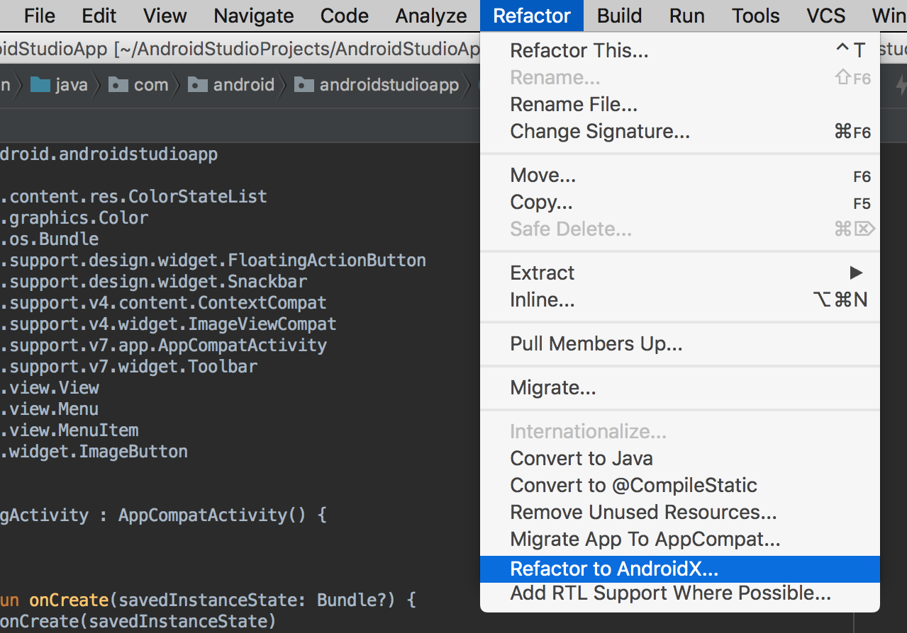  
AndroidX重构支持

* <strong>示例数据</strong> - 许多Android布局具有运行时数据，这使得在应用程序开发的设计阶段难以可视化布局的外观和感觉。布局编辑器中的示例数据允许你使用占位符数据来帮助你设计应用程序。从RecyclerView，ImageView到TextView，你可以添加内置示例数据，以通过布局编辑器中的弹出窗口填充这些视图。要试用此功能，请将RecyclerView添加到新布局，然后单击新工具设计时属性图标，然后从样本数据模板传送带中选择一个选择。

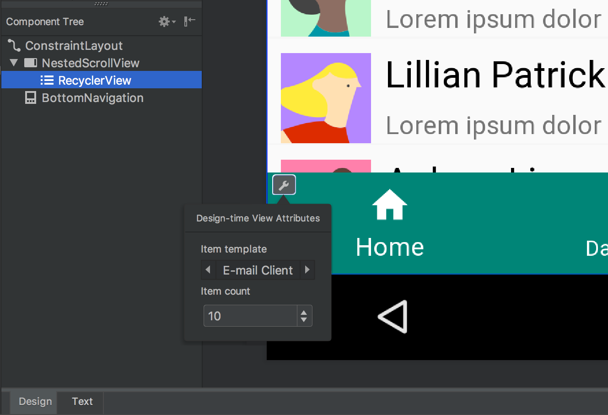  
设计时间示例数据

* <strong>Material Design更新</strong> - Material Design不仅继续发展成为设计系统，而且还在Android上实施。当你开始从Android设计支持库迁移到新的MaterialComponents应用程序主题和库时，Android Studio 3.2将为你提供对BottomAppBar，按钮，卡片，文本字段，新字体样式等更新的新部件的访问。[了解更多](https://material.io/components/android/)。

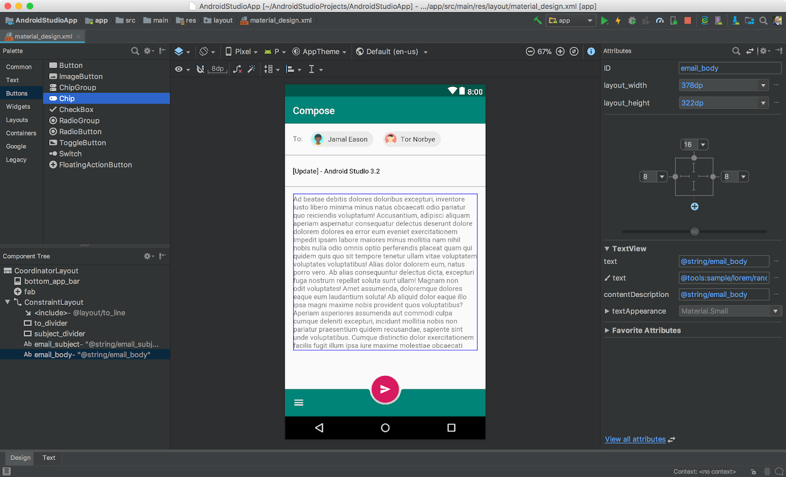  
新的Material Design组件

* <strong>Slice支持</strong> - Slice是在Android操作系统的其他用户界面表面中嵌入部分应用内容的新方式。Slice向后兼容Android 4.4 KitKat（API 19），可让你在Google搜索建议中显示应用内容。Android Studio 3.2内置模板，可帮助你使用新的Slice Provider API以及新的lint检查扩展你的应用程序，以确保你在构建Slice时遵循最佳实践。要开始右键单击项目文件夹，并导航到<strong>New</strong> → <strong>Other</strong> → <strong>Slice Provider</strong>。通过查阅[入门指南](https://developer.android.com/guide/slices/getting-started)，了解如何测试Slice交互。

  
Slice Provider模板

* <strong>CMakeList编辑支持</strong> - Android Studio为你的应用程序的C / C ++代码支持[CMake构建脚本](https://developer.android.com/studio/projects/configure-cmake)。通过此版本的Android Studio 3.2，代码完成和语法突出显示现在可用于常见的CMakeList命令。

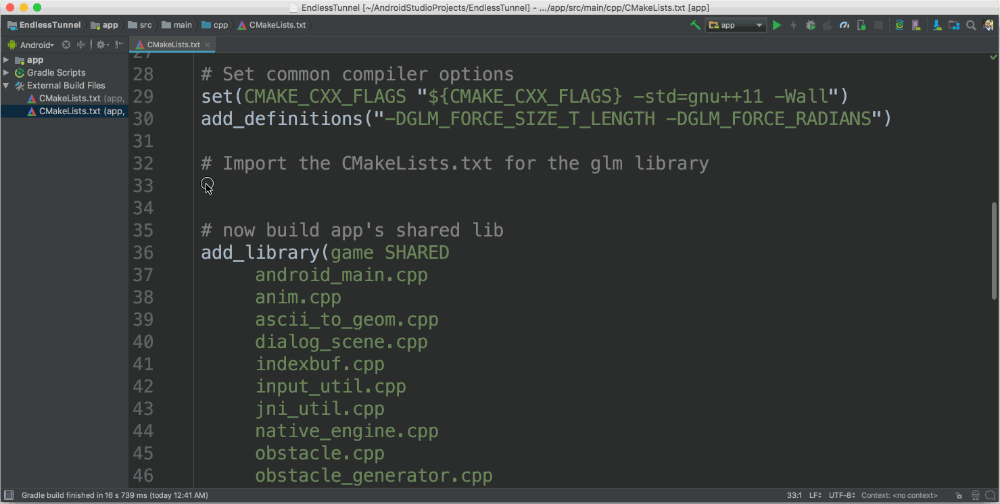  
CMakeList代码完成

* <strong>新的助手</strong> - Android Studio 3.2有一个新的助手面板，可在更新后自动打开，以通知你有关IDE的最新更改。你还可以通过导航到<strong>Help</strong> → <strong>What's New in Android Studio</strong>来打开面板。

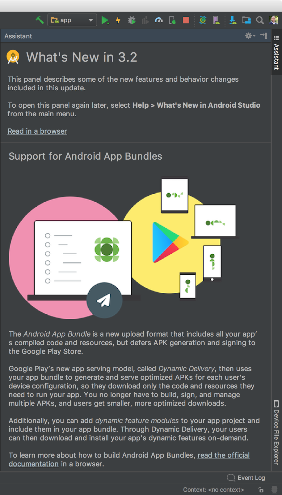  
什么是新的助手

* <strong>IntelliJ平台更新</strong> --Android Studio 3.2包含IntelliJ 2018.1平台版本，其中包含许多新功能，如数据流分析，部分Git提交支持以及大量新的代码分析增强功能。[了解更多](https://www.jetbrains.com/idea/whatsnew/#v2018-1)。

## 构建

* <strong>Android App Bundle</strong> - Android App Bundle是新的应用发布格式，旨在帮助你向用户提供更小的APK。Google Play有一个全新的动态投放平台，可以接受你的Android应用套装，并且只提供你在特定设备上需要的APK。Android Studio 3.2使你能够创建和测试Android应用程序包。只要你运行最新的Android Gradle插件（<i>com.android.tools.build:gradle:3.2.0-alpha14</i>），你就可以重新构建代码作为应用程序包，并根据语言，屏幕密度和ABI获得小型APK的好处，而不会更改你的应用程序代码。要开始，请导航到<strong>Build</strong> → <strong>Build Bundle / APK</strong> 或<strong>Build</strong> → <strong>Generate Signed Bundle / APK</strong> [了解更多](http://d.android.com/appbundle)。

  
构建Android应用程序包

* <strong>D8 Desugaring</strong> - 在某些情况下，新的Java语言功能需要新的字节码和语言API，但较旧的Android设备可能不支持这些功能。Desugaring允许你在构建过程中通过替换旧的字节码和语言API来在较旧的设备上使用这些功能。Desugaring最初是作为一个单独的工具与Android Studio 3.0一起引入的，在Android Studio 3.1中，我们将脱钩步骤作为实验功能集成到D8工具中，从而缩短了整体构建时间。现在Android Studio 3.2默认打开D8 desugaring。你现在可以使用大多数最新的语言更改，同时定位旧设备。

* <strong>R8优化器</strong> - 在应用程序构建过程中，Android Studio历史上使用ProGuard来优化和缩小Java语言字节码。从Android Studio 3.2开始，我们开始转向使用R8作为ProGuard的替代品。要试用R8，请添加<i>android.enableR8=true</i>到你的gradle.properties文件中。R8仍然是实验性的，所以我们不建议使用R8发布你的应用程序。[了解更多](https://r8.googlesource.com/r8)。

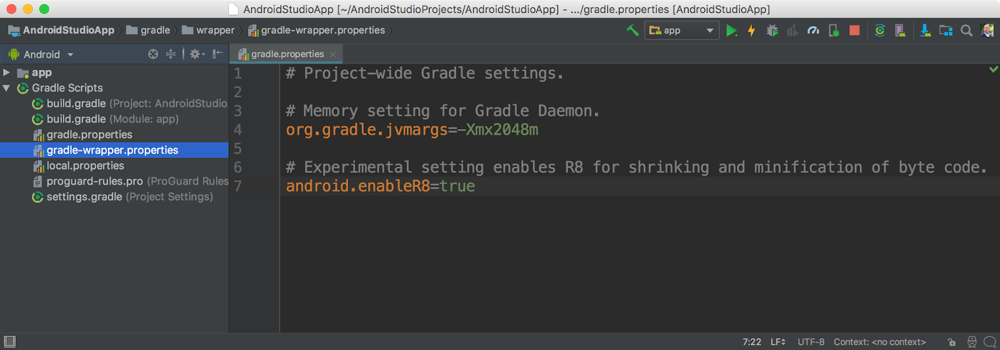  
在Android Studio中启用R8

## 测试

* <strong>模拟器快照</strong> - 随着[QuickBoot](https://android-developers.googleblog.com/2017/12/quick-boot-top-features-in-android.html)工具在Android模拟器，我们使你能够启动仿真器在不到6秒。借助Android Studio 3.2，我们扩展了此功能，使你能够在任何模拟器状态下创建快照，并在2秒内启动它们。在测试和开发你的应用程序时，你可以预先配置一个Android虚拟设备（AVD）快照，其中包含所需的预设，应用程序，数据和设置，然后重复回到同一快照。快照在2秒内加载，你可以从Android模拟器扩展控件面板，命令行（<i> ./adb emu avd snapshot load snap_2018-04-29_00-01-12</i>）或Android Studio内启动特定快照。

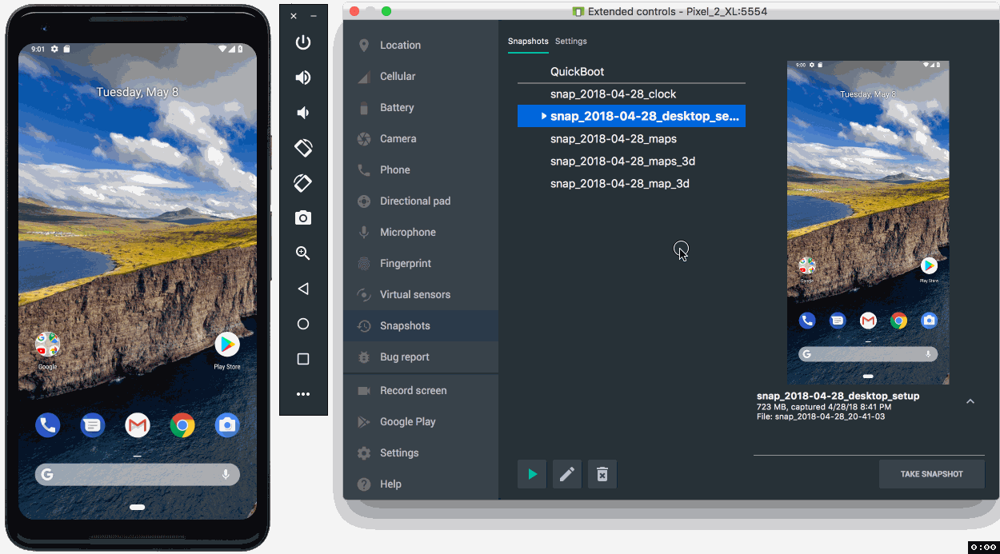  
Android模拟器快照

* <strong>Android模拟器中的屏幕记录</strong> - 通常情况下，创建应用屏幕的屏幕录制仅适用于Android 4.4 KitKat（API 19）及更高版本，无音频，且仅限Android模拟器支持。使用最新的Android模拟器（v27.3 +），你可以在任何API级别上使用音频进行屏幕录制。此外，还有一个内置的转换功能可以输出到GIF和WebM。你可以通过Android模拟器扩展控件面板，命令行（<i> ./adb emu screenrecord start --time-limit 10 /sample_video.webm </i> ）和[Android Studio](https://developer.android.com/studio/debug/am-video)触发新的屏幕记录功能。

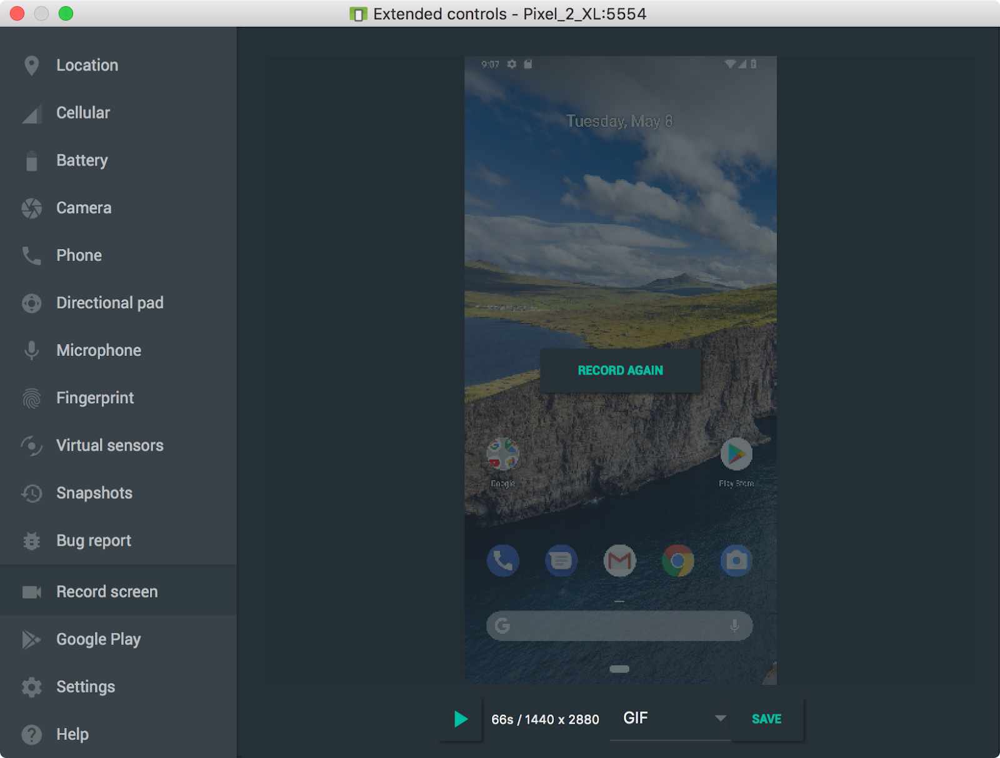
Android模拟器中的屏幕记录

* <strong>适用于Android模拟器的虚拟场景相机</strong> - 使用新的虚拟场景相机可以更轻松地开发和测试使用[ARCore](https://developers.google.com/ar/discover/)的应用程序，该相机可让你在虚拟环境中迭代你的增强现实（AR）体验。该模拟器经过校准可与AR应用程序的ARCore API一起使用，并允许你注入虚拟场景位图图像。虚拟场景摄像机也可以用作普通的[HAL3兼容](https://source.android.com/devices/camera/camera3)摄像机。在Android模拟器中打开内置的Android相机应用程序即可开始使用。默认情况下，新的虚拟场景摄像头是使用Android Studio 3.2创建的全新Android虚拟设备的后置摄像头。[了解更多](https://developers.google.com/ar/develop/java/emulator)。

    
Android模拟器中的虚拟场景相机

* <strong>ADB连接助手</strong> - 为了帮助通过ADB排除Android设备连接的故障，Android Studio 3.2提供了一个新助手。ADB连接助理将引导你通过常见的故障排除步骤将你的Android设备连接到开发计算机。你可以从运行对话框中触发助手，或导航到<strong>Tools</strong> → <strong>Connection Assistant</strong>。

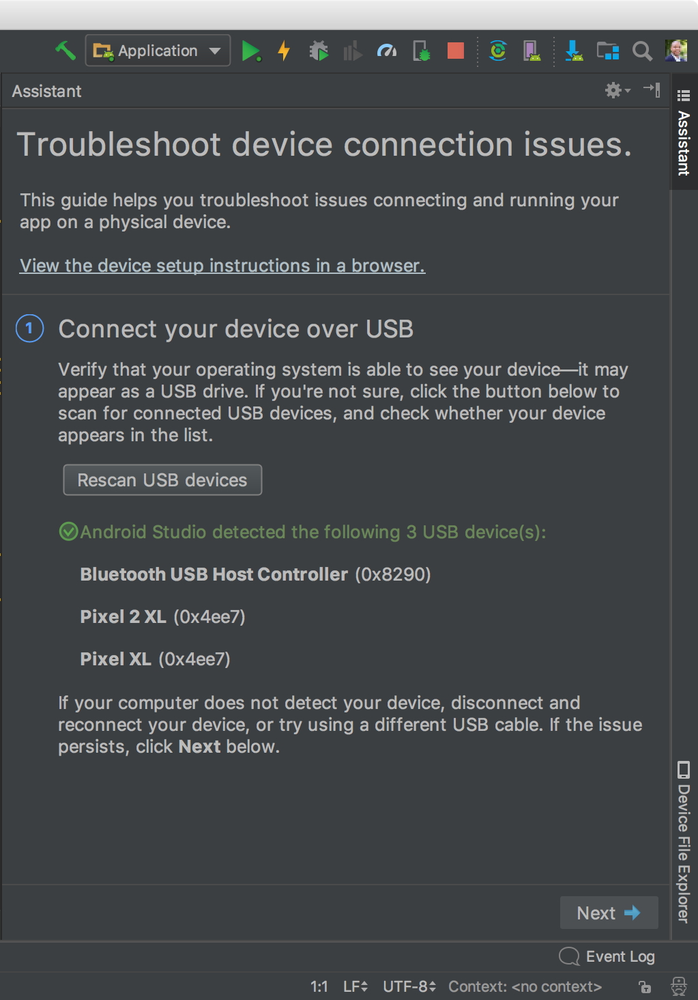  
ADB连接助手

## 优化

* <strong>能量分析仪</strong> - 电池寿命是许多手机用户关心的一个关键问题，而且你的应用可能会比你意识到的更多地影响电池寿命。Performance Profiler套件中新增的Energy Profiler可帮助你了解应用程序对Android设备的能量影响。你现在可以查看系统组件估计的能源使用情况，并检查可能导致电池消耗的背景事件。要使用能源分析器，请确保你已连接到运行Android 8.0 Oreo（API 26）或更高版本的Android设备或模拟器。了解更多。

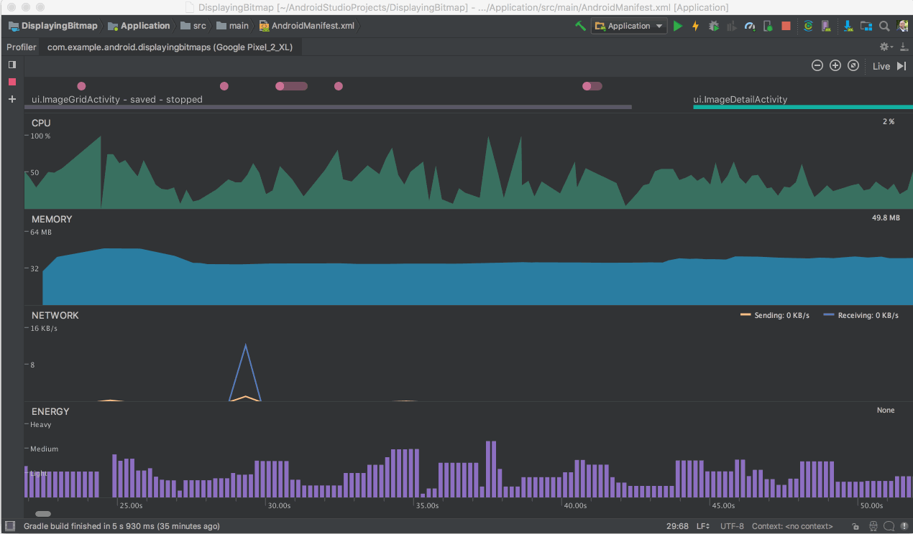  
能源分析器

* <strong>系统跟踪</strong> - CPU Profiler中的新系统跟踪功能使你可以检查应用程序如何以细节细节与系统资源交互。检查线程状态的确切时间和持续时间，可视化所有内核中CPU瓶颈的位置，并添加自定义跟踪事件以进行分析。要使用系统跟踪，请开始分析你的应用程序，单击进入CPU分析器，然后选择<strong>系统跟踪</strong>记录配置。[了解更多](https://developer.android.com/studio/preview/features/#system_trace)。

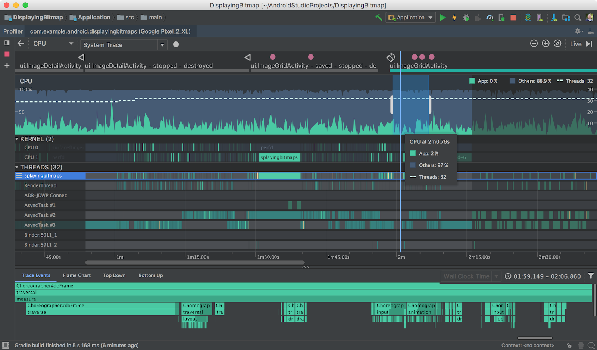  
系统跟踪

* <strong>Profiler Sessions</strong> - 我们现在会自动将分析器数据保存为“Sessions”，以便在Android Studio打开时重新访问和检查。我们还增加了导入和导出CPU记录和堆转储的功能，以供以后分析或使用其他工具进行检查。

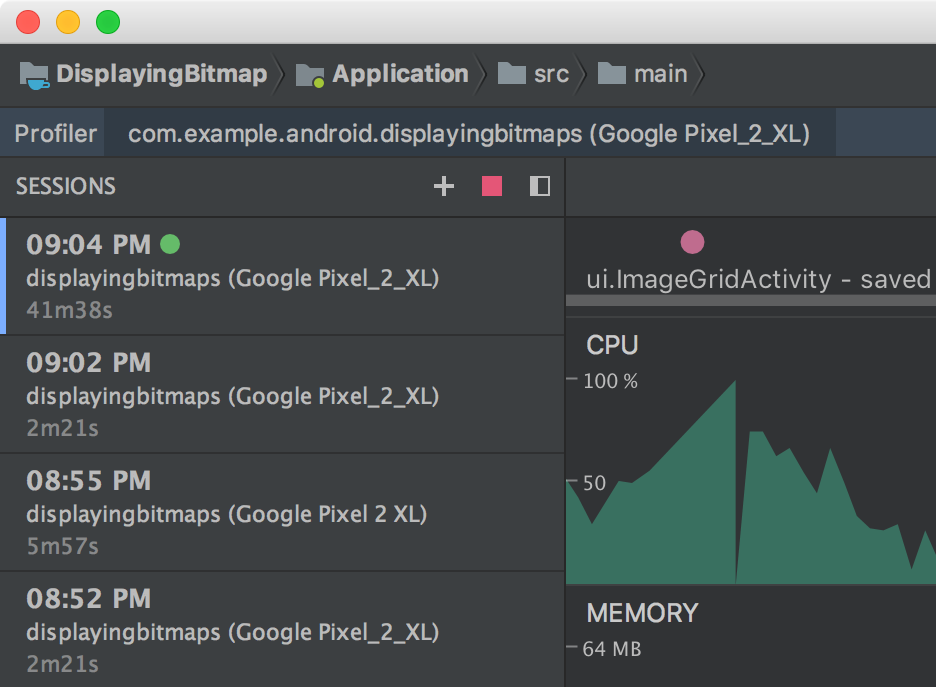  
分析器Session

* <strong>自动CPU记录</strong> - 你现在可以使用[Debug API](https://developer.android.com/reference/android/os/Debug)自动记录CPU活动。将应用程序部署到设备后，配置程序会在应用程序调用时自动开始记录CPU活动[startMethodTracing(String tracePath)](https://developer.android.com/reference/android/os/Debug#startMethodTracing(java.lang.String))，并在应用程序调用时停止记录[stopMethodTracing()](https://developer.android.com/reference/android/os/Debug#stopMethodTracing())。同样，你现在也可以通过在运行配置中启用此选项来自动开始在应用程序启动时记录CPU活动。

* <strong>JNI参考跟踪</strong> - 对于那些在Android应用程序中拥有C / C ++代码的人，Android Studio 3.2现在允许你检查Memory Profiler中JNI代码的内存分配。只要你将应用程序部署到运行Android 8.0 Oreo（API 26）及更高版本的设备，你就可以从JNI参考中深入分配调用堆栈。要使用该功能，请启动内存分析器会话，然后从Live Allocation(实时分配)下拉菜单中选择JNI堆。

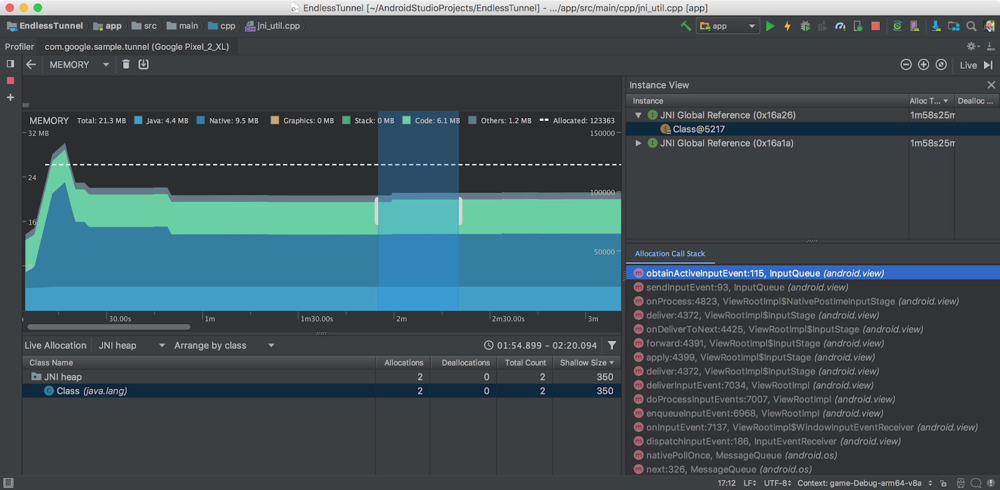  
JNI参考跟踪

回顾一下，Android Studio 3.2最新的Canary包含了这些新的主要功能：

#### 开发
* 导航编辑器
* AndroidX重构
* 示例数据
* Material Design 更新
* Android Slice
* CMakeList编辑
* 什么是新的助理
* 新的Lint检测
* Intellij平台更新

#### 构建

* Android应用程序包Bundle
* D8 Desugaring
* R8优化器

#### 测试

* Android模拟器快照
* Android模拟器中的屏幕记录
* 虚拟场景Android模拟器相机
* ADB连接助手

#### 优化

* 能量分析器
* 系统跟踪
* 分析器会话
* 自动CPU记录
* JNI参考跟踪

查看[预览版本发布说明](https://developer.android.com/studio/preview/features/)以获取更多详细信息。

## 入门

### 下载

从canary频道[下载页面](https://developer.android.com/studio/preview/)下载最新版本的Android Studio 3.2 。如果你正在使用之前的Android Studio canary版本，请确保你更新至Android Studio Canary 14或更高版本。如果你想要维护稳定版本的Android Studio，则可以同时运行Android Studio的稳定版本和加那利版本。[了解更多](https://developer.android.com/studio/preview/install-preview)。

要使用上述Android模拟器功能，请确保至少运行Android Emulator v27.3+，并通过Android Studio SDK Manager下载。

我们非常感谢你早期提供有关你喜欢的事物的反馈，以及你希望看到的问题或功能。请注意，为确保我们保持产品质量，你在Canary频道中看到的功能可能无法在下一个稳定版本频道中使用，直到它们可以稳定使用为止。如果你发现bug或问题，请随时[提出问题](https://source.android.com/source/report-bugs#developer-tools)。请在我们的[Google+](https://plus.google.com/103342515830390186255)信息页或[Twitter](http://www.twitter.com/androidstudio)上与我们Android Studio开发团队联系。