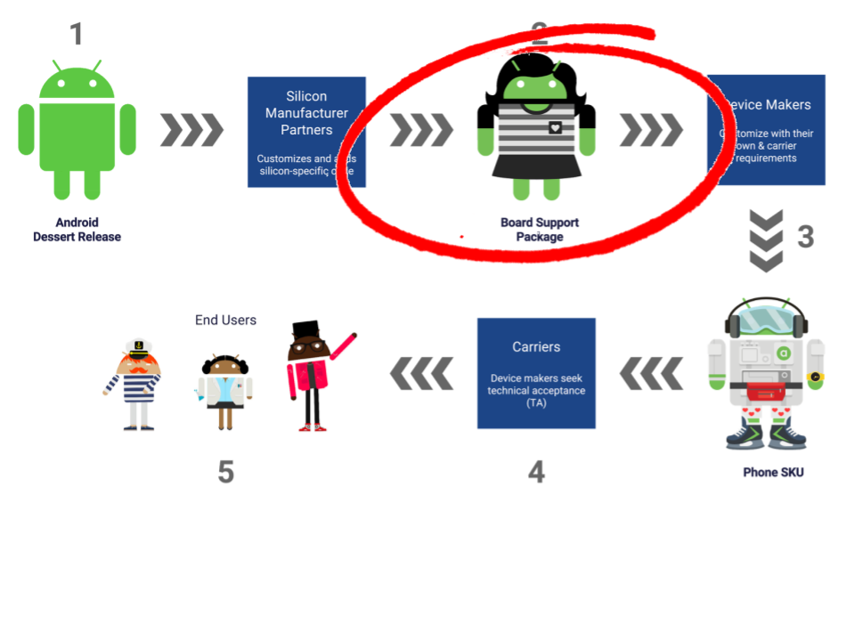
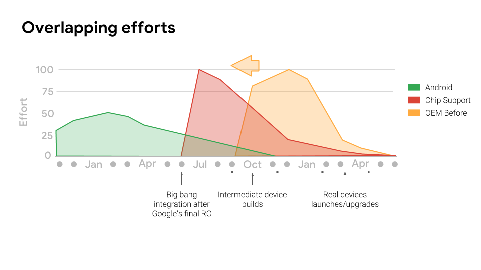
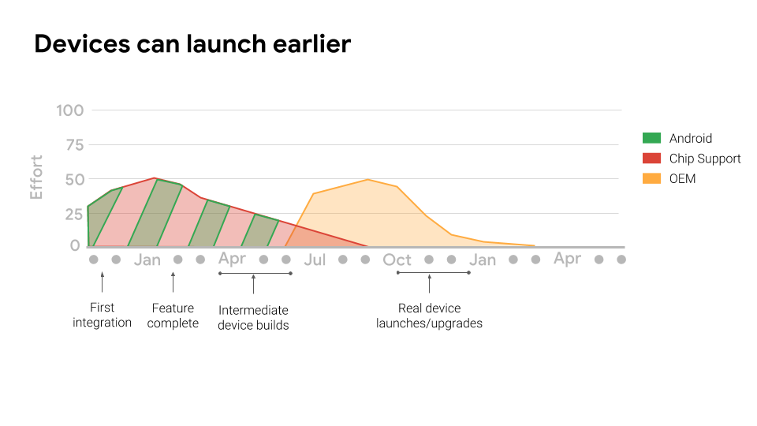

# 使用Project Treble快速适配项目

原标题：Faster Adoption with Project Treble  
链接：[https://android-developers.googleblog.com/2018/05/faster-adoption-with-project-treble.html](https://android-developers.googleblog.com/2018/05/faster-adoption-with-project-treble.html)  
作者：Iliyan Malchev (Project Treble架构师)  
翻译：[arjinmc](https://github.com/arjinmc)  

Android P Beta可在[android.com/beta](http://android.com/beta)上找到

随着Android的不断发展，操作系统的每个新版本都带来了新功能，新用户体验以及更好的安全性。这些新版本尽快找到通向移动设备的途径非常重要。

昨天，我们宣布除了Pixel和Pixel 2之外，下列设备现在支持[Android P Beta](http://android.com/beta)：<strong>索尼Xperia XZ2，小米Mi Mix 2S，诺基亚7 Plus，Oppo R15 Pro，Vivo X21，OnePlus 6和Essential PH-1</strong>。Android P Beta为世界各地的开发者和早期使用者提供了尝试最新的Android版本，测试他们的应用并提供反馈的机会。

在这篇文章中，我们提供了Project Treble的更新和技术，让我们今年可以将Android Beta带到更多手机。

## 建立资源

Google，硅片制造商（SM），设备制造商（OEM）和运营商共同努力，将新的Android版本快速交付给用户。这个过程在技术上具有挑战性，并且需要调整我们的行业合作伙伴之间的时间表。

为了减少技术难题，我们启动了[Project Treble](https://android-developers.googleblog.com/2017/05/here-comes-treble-modular-base-for.html)作为Android Oreo的一部分。

## 硅制造商

接下来，为了充分利用我们建立的基础，我们与硅片制造商密切合作，制造Android设备的旅程始终始于此。

任何带有最新Android版本的设备都必须基于[SoC](https://en.wikipedia.org/wiki/System_on_a_chip)以及适当的软件支持。该软件通常被称为板级支持包（BSP），不仅包含特定于芯片的供应商实现，还包含所有Android开放源代码项目（AOSP）以及AOSP本身缺少的框架部分（例如，运营商特定的电话功能）。

  

这些BSP是所有设备启动的起点。原始设备制造商（OEM）将供应商实施调​​整到他们的硬件并添加他们自己的定制框架组件

虽然芯片制造商总是希望在他们的BSP中使用最新版本的Android，但成本一直很高。通过使更新的AOSP框架可以在已经发布的较早的供应商实现上运行，Project Treble显着减少了对旧版芯片的持续投资以支持每个Android版本的需求。硅制造商只需要一次完成所有这些工作，而不是每次安装新版本。

## 解决时间问题

不过，这还是第一次发生。下面是一个图表，说明了各个角色在每次发布时都花费的时间。你可以将其视为随着时间流逝的代码流失或bug计数。

 

该图表显示了Google，硅片制造商和OEM厂商在这一年的时间很短。任何阶段之间的重叠都会导致代码流失并带来重大的进度风险。对于定位于假日季节的原始设备制造商而言，在具有一年或更早的Android版本的旧BSP上启动通常更安全。这一动态一直是最新Android版本发布缓慢的核心，即使是在旗舰设备上。

 

为了解决这个问题，我们与高通，联发科和三星SLSI密切合作，共同开发他们的BSP，从Android P开始。他们的BSP现在已经为加速的时间安排提供了Android P，大大减少了整体工作量。这些硅制造商现在能够比以前更早地提供稳定的高质量版本，从而使原始设备制造商能够将最新的Android创新技术带给全球的客户。

  

这是加速采用Android版本的重要一步，为我们的合作伙伴，用户和Android开发者带来诸多好处。我们期待看到更多合作伙伴推出或升级Android P的设备。
