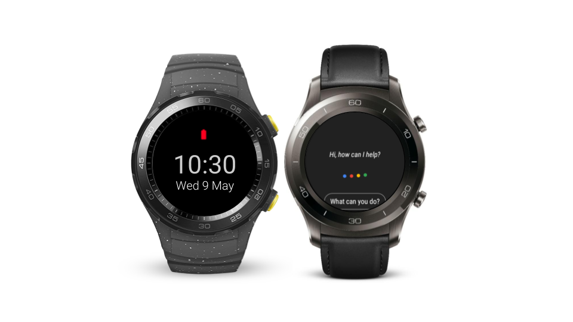

# Google Wear OS：AoG支持和新的增强型电池保护模式

原标题：Wear OS by Google: AoG support and new enhanced battery saver mode  
链接：[https://android-developers.googleblog.com/2018/05/wear-os-by-google-aog-support.html](https://android-developers.googleblog.com/2018/05/wear-os-by-google-aog-support.html)  
作者：Hoi Lam (Google穿戴OS开发者倡导者)  
翻译：[arjinmc](https://github.com/arjinmc)  

  

在Google I / O上，我们发布了Google Wear OS 开发者预览版2。此更新增加了对Google操作（AoG）和更多电源相关增强功能的支持，其中包括新的节电模式。

此开发者预览包括更新的Android模拟器图像以及华为Watch Watch 2蓝牙或华为Watch Watch 2 Classic蓝牙的可下载系统映像。此预览版仅供开发者使用，不适用于日常或消费者使用。因此，预览版本只能通过手动下载和刷机进行。在[下载并刷设备](https://developer.android.com/wear/releases/wear-preview-downloads.html)之前，请参阅[发布说明](https://developer.android.com/wear/releases/index.html)以了解已知问题。

## 支持Google Actions

我们修改了[Wear OS上的Google Assistant](https://www.blog.google/products/wear-os/get-more-done-google-assistant-wear-os-google/)，以支持诸如视频卡，后续建议芯片和文本到语音的功能。对于开发者，我们增加了对Google Wear上的[Google Action](https://developers.google.com/actions/)的支持，现有的Actions可以在Wear操作系统上使用。请务必遵守Google上采取行动的最佳实践，以获得最佳效果，如简短对话并采用视觉和声音反馈。此功能不依赖于Android P，并正在向所有Wear 2.0用户推出。

## 增强节电模式

在这个Android P开发者预览中，我们启动了增强型电池保护模式。手表处于此模式时，手表将显示节能表盘，并关闭一系列服务，包括无线电，触摸屏和倾斜唤醒。用户可以通过按侧面按钮来获得时间。长按允许用户切换回完全操作模式，并执行诸如使用NFC付费或回复消息等任务。开发者应该假设他们的应用程序，表盘和复杂数据提供程序在增强型节电模式下不可用。

## 节电功能更新

我们在最近的开发者预览中收到了很多有关节能功能的反馈。因此，我们对两个功能进行了更新：

* <strong>BT断开时关闭Wi-Fi</strong>：为了提高功耗，最后的开发者预览在与蓝牙断开连接时不会连接到Wi-Fi。仔细听取用户和开发者的反馈后，我们决定回滚此更改。
* <strong>有限的后台活动和前台服务</strong>：许多健康和健身开发者表示，他们的应用需要全天监控用户的运动和其他重要事件。开发者表示，如果后台服务无法设置闹钟和job，他们的应用程序无法执行后台监控。对于这些类型的特殊用例，我们建议应用程序使用前台服务来锚定闹钟和job。对于其他使用情况，开发者应该查看[前台服务](https://developer.android.com/guide/components/services#Foreground)以及在手表充电时限制job和闹钟。我们仍在很好地调整此功能，你的反馈和使用案例将对帮助我们实现这一目标发挥最大作用。

## 针对桥接通知的智能回复

一段时间以来，智能回复功能已启用来自用户智能手机的桥接通知。通过最新的开发者预览版，我们为中国用户推出简体中文支持。此功能由使用[TensorFlow Lite](https://www.tensorflow.org/mobile/tflite/)的设备型号驱动，该型号针对低内存，低功耗设备进行了优化。

要使用此功能，开发者应将[setAllowGeneratedReplies](https://developer.android.com/reference/android/support/v4/app/NotificationCompat.Action.Builder.html#setAllowGeneratedReplies(boolean))回复操作设置为true。下面是一个示例代码片段，其中重要部分以粗体突出显示：

```code
NotificationCompat.Action action =
    new NotificationCompat.Action.Builder(R.drawable.ic_reply_white_24dp,
        replyLabel, replyPendingIntent)
        .addRemoteInput(remoteInput)
        .setAllowGeneratedReplies(true) // <--- true to enable smart replies
        // Wear OS requires a hint to display the reply action inline.
        .extend(new NotificationCompat.Action.WearableExtender()
            .setHintDisplayActionInline(true))
        .build();
```      

另外，对于通讯应用程序，我们建议开发者使用[MessagingStyle](https://developer.android.com/reference/android/support/v4/app/NotificationCompat.MessagingStyle)通知。这可以为该算法提供一个更加结构化的数据集，以便根据这些数据集来推荐它

## 请给我们你的反馈意见

我们希望在最终的产品发布前提供更多的更新。请通过[Google问题跟踪器提交Wear OS](https://issuetracker.google.com/issues/new?component=192711&template=840908)发现的任何bug。你提交的越早，我们可以在最终版本中包含修复程序的可能性就越高。
