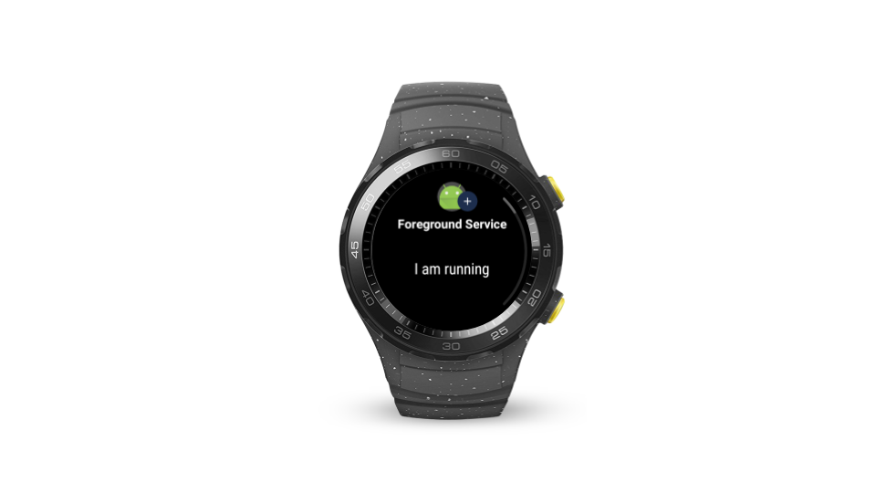

# Wear OS开发者预览版：后台服务的重启闹钟和job

原标题：Wear OS developer preview reenabling alarms and jobs for background apps  
链接：[https://android-developers.googleblog.com/2018/06/wear-os-developer-preview-reenabling.html](https://android-developers.googleblog.com/2018/06/wear-os-developer-preview-reenabling.html)  
作者：[Hoi Lam](https://twitter.com/hoitab) (Google Wear OS 开发者倡导者)  
翻译：[arjinmc](https://github.com/arjinmc)  

  

从Google开发者预览版Wear OS开始，电池寿命一直是主要关注领域。当我们与开发者社区交谈时，最新最多反馈的是禁用后台应用程序的闹钟和job。听取开发者的反馈意见并查看电池统计数据后，我们正在扭转这种变化。这应该反映在所有连接的Wear OS预览设备中，因此不需要重新刷新设备。

## App Standby Buckets

我们在回顾反馈意见后发现，严格的开/关设置会阻止合理使用并促进反模式。展望未来，我们计划利用Android P中的[App Standby Buckets(备用桶)](https://developer.android.com/preview/features/power#buckets)功能为Wear OS设备调整合适的设置。后台应用的闹钟和job的确切设置仍在迭代中。建议开发者遵循最佳实践，以确保其应用程序的性能良好，无论应用程序处于哪个位置。

## 后台应用程序中的输入和数据隐私

开发者应该关注的另一个领域是[加强Android P中后台应用程序的输入和数据隐私](https://developer.android.com/preview/behavior-changes#input-data-privacy)。根据应用程序的需求，开发者可能需要使用前台服务来全天访问设备传感器。

## 请您给我们的反馈意见

我们希望在最终的产品发布前提供更多的更新。请通过[Google Wear OS问题跟踪器](https://issuetracker.google.com/issues/new?component=192711&template=840908)提交发现的任何错误。您提交的越早，我们可以在最终版本中包含修复程序的可能性就越高。

