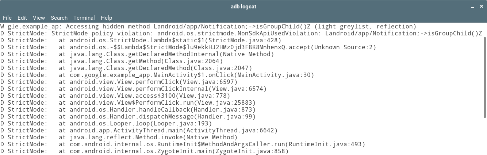

#  Android P中非SDK限制的更新

原标题：An Update on non-SDK restrictions in Android P  
链接：[https://android-developers.googleblog.com/2018/06/an-update-on-non-sdk-restrictions-in.html](https://android-developers.googleblog.com/2018/06/an-update-on-non-sdk-restrictions-in.html)  
作者：David Brazdil和Nicolas Geoffray (软件工程师)  
翻译：[arjinmc](https://github.com/arjinmc)  

在Android中，我们非常重视为用户和开发者提供最佳体验。在每个操作系统版本中，新功能使您能够为用户提供惊人的体验; 然而，我们注意到一些应用程序开发者一直在使用非SDK接口，这会导致用户崩溃导致开发者紧急部署。我们希望做得更好，并需要您的帮助，以确保每个新操作系统的Android都稳定。

三个月前，我们宣布计划[开始限制在Android P中使用非SDK接口](https://android-developers.googleblog.com/2018/02/improving-stability-by-reducing-usage.html)。我们知道这些限制可能会影响您的发布工作流程，我们希望确保您有工具来检测非SDK接口的使用情况，以及计划中的时间以适应新政策并向我们提供反馈。

在开发者预览版和测试版1中，我们提供了多种方式让您查看这些限制对您的应用程序的影响。在[开发者预览版](https://developer.android.com/preview/)中，使用受限制的API显示在日志和Toast消息中，在Beta 1中，我们提供了一个[StrictMode策略](https://developer.android.com/reference/android/os/StrictMode)，允许您以编程方式查找这些限制并进行自己的日志记录。例如：

  

我们了解，应用程序想要使用非SDK接口的原因有多种，并确保您的应用程序将继续在Android P中运行对我们非常重要。你们中许多人通过我们的[问题跟踪器](https://issuetracker.google.com/issues/new?component=328403&template=1027267)解释了您的用例（谢谢！），并且对于大多数请求，我们已经解除了对Android P的特定非SDK接口的限制，方法是将它们添加到[灰名单](https://android.googlesource.com/platform/frameworks/base/+/85c81cb24c5d71fc79dea3ba498d1a509895bb01/config/hiddenapi-p-light-greylist.txt)中。此外，我们的团队对数百万个应用进行了静态分析，并处理了来自内部和外部beta测试人员的数千个自动化报告。通过这个分析，我们已经确定了应用程序依赖的其他非SDK接口并将它们添加到了灰名单中。对于灰名单上的所有内容，我们将调查未来版本的公共SDK替代品。但是，我们可能错过了一些非SDK接口使用，所以我们已经使其大部分可用于目标SDK为Android Oreo或更低版本的应用程序。

总之，在Android P上运行的应用程序将受到非SDK接口的限制使用。如果您的目标是Android P，那么[灰名单](https://android.googlesource.com/platform/frameworks/base/+/85c81cb24c5d71fc79dea3ba498d1a509895bb01/config/hiddenapi-p-light-greylist.txt)将显示仍然可用的非SDK接口，而所有其他非SDK接口将不可访问。如果您的目标是Android Oreo或更低版本，则大部分限制条件都不适用，但是如果您访问的不是在灰名单中的非SDK接口（请注意，用户没有看到此类警告），您将获得logcat警告。

试用我们新的[Beta 2版本](https://android-developers.googleblog.com/2018/06/android-p-beta-2-and-final-apis.html)并使用[StrictMode](https://developer.android.com/reference/android/os/StrictMode)检测您的非SDK接口用法。您应该期望Beta 2与最终版本将实施的限制非SDK接口使用的内容紧密匹配。另外，请看看我们的新[常见问题解答](https://developer.android.com/preview/restrictions-non-sdk-interfaces)，我们希望解答您对该功能的任何疑问。如果没有，[请告诉我们](https://issuetracker.google.com/issues/new?component=328403&template=1027267)！