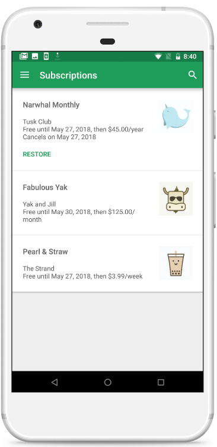
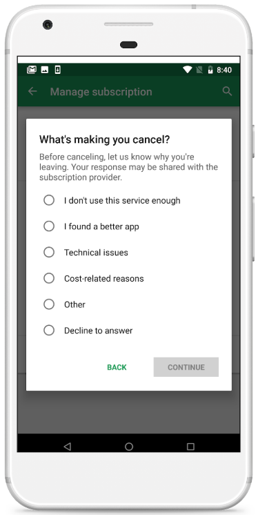
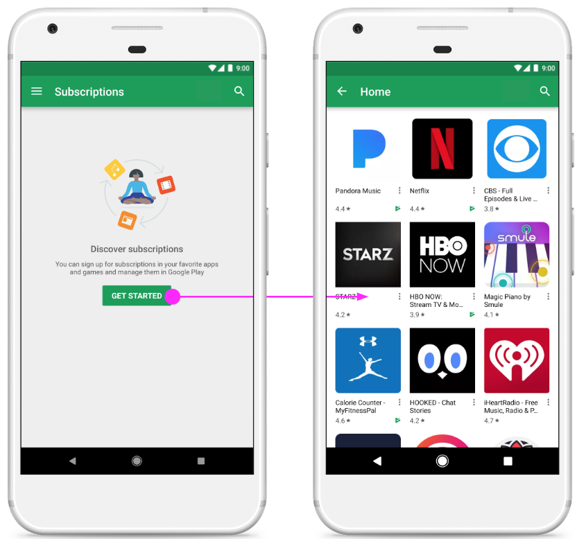

# 使用Google Play的新功能发展并优化您的订阅

原标题：Grow and optimize your subscriptions with new Google Play features  
链接：[https://android-developers.googleblog.com/2018/06/grow-and-optimize-your-subscriptions.html](https://android-developers.googleblog.com/2018/06/grow-and-optimize-your-subscriptions.html)  
作者：Larry Yang和Angela Ying (Google Play产品经理)  
翻译：[arjinmc](https://github.com/arjinmc)  

谷歌Play上的订阅量继续保持居[巨增](https://www.youtube.com/watch?v=RHwtJm3JPEo)，用户数同比增长超过80％。在[I / O 2018](https://www.youtube.com/watch?v=x1AYelepG6o)，我们宣布了对用户体验的一些改进，以减少订阅注册的障碍，并提供更多工具让您按自己的方式管理业务。

## 更多的用户订阅

尽管用户从订阅中获得了很多价值，但我们的研究表明，他们担心被订阅时“陷入”，而无法取消或担心他们会失去多少钱，从而阻碍用户注册为您的订阅应用程序。为了解决这些担忧，我们最近推出了一个新的<strong>订阅中心</strong>，这是一个供用户管理他们在Google Play上的订阅的一站式商店。

  

通过订阅中心，用户可以：

* 查看所有订阅以查看详细信息和状态
* 管理和更新付款方式，包括设置备用付款方式
* 续订订阅
* 恢复已取消的订阅
* 取消订阅

此外，如果用户取消订阅，我们现在会触发<strong>取消调查</strong>，以便为开发者提供有关用户为何取消的反馈。目前，您可以通过查询我们的[服务器端API](https://developers.google.com/android-publisher/api-ref/purchases/subscriptions)来查看取消调查中的数据。

  

新订阅中心还有一个空白状态的“入门”链接，可让用户通过策划和本地化收藏发现订阅应用。

  

随着订阅中心的启动，我们还推出了新的<strong>深层链接</strong>，您可以使用这些链接指导用户通过电子邮件或网络管理您的应用的订阅。要实施，请使用软件包名称和SKU构建深层链接，然后将深层链接添加为应用中任意位置的按钮或链接。查看[Android Developers网站](https://developer.android.com/google/play/billing/billing_subscriptions#deep-links-manage-subs)以获取更多信息。

## 为你打造更多控制

除了为用户创造更好的体验之外，我们还推出了新的工具，可让您<strong>更灵活地管理业务</strong>。我们听到最多的功能之一就是价格变化。即将推出，您可以轻松要求用户通过Google Play控制台接受价格更改，而无需设置全新的SKU。Google Play会通过电子邮件，推送通知和应用内消息向用户通知更改，如果用户尚未同意续订日期，我们将取消其订阅。如果您有兴趣参与早期使用计划，请[在此注册](https://docs.google.com/forms/d/1gKKtPHZsqzkUffbJGOM_DNMnr0a3N1_1dxXAbnUhGmM/edit)。

我们在I / O上推出的其他功能可帮助您更好地管理订购业务，其中包括：

* [升级订阅而不更改用户的到期日期](https://developer.android.com/google/play/billing/billing_subscriptions#set-proratation-mode)
* 从Play管理中心发放部分退款
* 退款特定的订购续订，而不仅仅是最新的
* 使用订单ID与服务器端API
* 通过Google Play开发者API使用[退款API](https://developers.google.com/android-publisher/api-ref/orders/refund)

除了[更快的测试续订](https://android-developers.googleblog.com/2018/01/faster-renewals-for-test-subscriptions.html)和[灵活的介绍定价](https://twitter.com/GooglePlayDev/status/964182774742769665)之外,我们在今年早些时候宣布了。

为了轻松实现所有这些，请确保您使用的是[Google Play Billing Library](https://developer.android.com/google/play/billing/billing_java_kotlin)，它在I / O上发布了[1.1版](https://developer.android.com/google/play/billing/billing_library_releases_notes)。帐单库是AIDL文件顶部的抽象层，当您在下次编译应用程序时更新构建依赖项文件时，会自动获取API更新。只有通过账单库才能使用相同的到期日进行价格更改和升级/降级。未来的发布也将是这种情况。

## 对每个人更好

我们坚信，通过构建卓越的用户体验，我们构建了高质量的用户群。通过为您提供工具和洞察力以更好地管理您的业务，您可以灵活地为您的业务和客户做最好的事情。
