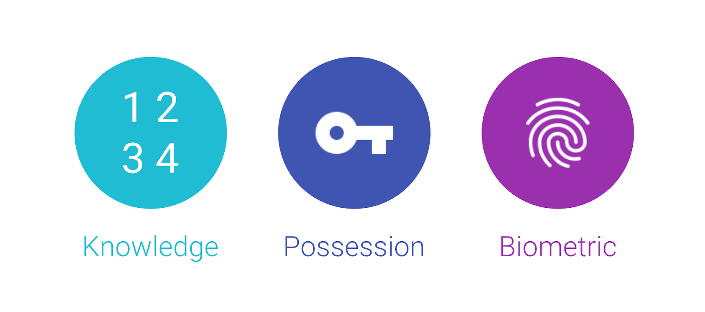
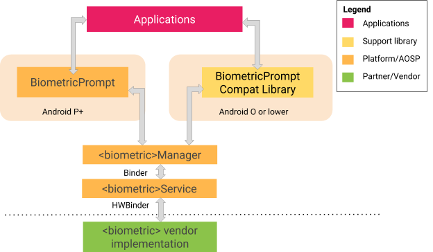
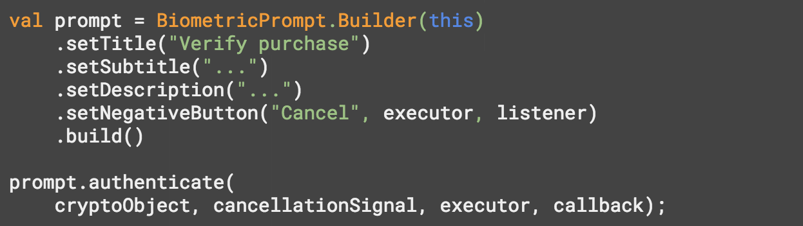

# Android P中更好的生物识别技术

原标题：Better Biometrics in Android P  
链接：[https://android-developers.googleblog.com/2018/06/better-biometrics-in-android-p.html](https://android-developers.googleblog.com/2018/06/better-biometrics-in-android-p.html)  
作者：Vishwath Mohan (安全工程师)  
翻译：[arjinmc](https://github.com/arjinmc)  

为了保证用户的安全，大多数应用程序和设备都具有身份验证机制，或者证明自己是你的方式。这些机制分为三类：了解因素，拥有权因素和生物特征因素。<strong>了解因素</strong>会要求你知道的东西（比如个人识别号码或密码），<strong>拥有权</strong>因素要求你拥有某些东西（如令牌发生器或安全密钥），<strong>生物识别因素</strong>要求你提供某些东西（如你的指纹，虹膜或脸部）。

  

生物识别认证机制正变得越来越流行，并且很容易明白其中的原因。它们比输入密码更快，比携带单独的安全密钥更容易，并且它们可以防止基于了解因素的身份验证最常见的陷阱之一 - [肩上冲浪](https://en.wikipedia.org/wiki/Shoulder_surfing_(computer_security))（译者备注：自愿授权自己的东西公开给服务商）的风险。

随着越来越多的设备采用生物识别技术来保护人们的隐私信息，我们正在通过以下方式改进基于生物识别技术的Android P身份验证：

* 定义一个更好的模型来衡量生物特征安全性，并使用它来功能上限制较弱的身份验证方法。
* 为开发者提供通用平台提供的入口点，将生物识别身份验证集成到其应用程序中。

## 更好的生物识别安全模型

目前，生物识别解锁使用从机器学习（ML）中借鉴的两个度量来量化其性能：错误接受率（FAR）和错误拒绝率（FRR）。

在生物特征识别的情况下，FAR会测量生物特征模型偶然地将不正确的输入归类为属于目标用户的频率 - 也就是说，另一个用户被错误识别为合法设备所有者的频率。同样，FRR测量生物特征模型偶然将用户的生物特征分类为不正确的频率 - 也就是说，合法设备所有者多久必须重新尝试其身份验证。第一个是安全问题，第二个是可用性问题。

当应用于随机输入样本时，这两个度量标准在衡量给定ML（或生物特征）模型的准确度和精度方面做处理。但是，由于这两个度量都不考虑主动攻击者作为威胁模型的一部分，因此他们没有提供有关其抗攻击弹性的非常有用的信息。

在Android 8.1中，我们[引入了两个新的度量标准](https://source.android.com/security/biometric/)，在威胁模型中更明确地说明攻击者：欺骗接受率（SAR）和冒充者接受率（IAR）。正如他们的名字所示的那样，这些衡量标准衡量的是攻击者可以轻松绕过生物认证协议。欺骗是指使用已知良好的录音（例如重放录音或使用人脸或指纹图片），而冒名者接受意味着成功模仿其他用户的生物特征（例如试图听起来或看起来像目标用户）。

## 强vs弱生物特征识别

我们使用[SAR / IAR指标](https://source.android.com/security/biometric/#metrics)来将生物认证机制分类为强或弱。SAR / IAR的7％或更低的生物识别认证机制为强类，高于7％的任何认证机制属于弱类。为什么选择7％？大多数指纹实现的SAR / IAR指标约为7％，这也是适合其他模式的标准。随着生物识别传感器和分类方法的改进，未来可能会降低此阈值。

这种二进制分类是对不同实现提供的安全范围的轻微过分简化。然而，它为我们提供了一种可扩展的机制（通过分层认证模型），根据它们构成的整体风险，适当地确定整个生态系统中不同生物识别实现的功能和限制。

尽管生物识别技术的强弱都将被允许解锁设备，但生物识别技术薄弱：

* 要求用户重新输入主要的PIN，图案，密码或强大的生物识别功能，以便在4小时不活动窗口（如留在桌面或充电器上）后解锁设备。这是对强弱类生物特征识别强制实施72小时超时的补充。
* 即将推出的[BiometricPrompt API（生物特征识别)](https://developer.android.com/reference/android/hardware/biometrics/BiometricPrompt)不支持，这是一种用于应用程序开发者的通用API，用于以模式不可知的方式安全地对设备上的用户进行身份验证。
* 无法验证付款或参与涉及KeyStore身份验证绑定密钥的其他交易。
* 必须向用户显示一条警告，说明在启用生物特征之前使用生物特征的风险。

这些措施旨在减弱生物识别技术，同时降低未授权访问的风险。

## BiometricPrompt API
从Android P开始，开发者可以使用[BiometricPrompt API](https://developer.android.com/reference/android/hardware/biometrics/BiometricPrompt)将生物识别身份验证集成到他们的应用程序中，并采用设备和生物识别方式。BiometricPrompt仅展示强大的模式，因此开发者可以确保其应用程序运行的所有设备具有一致的安全级别。还为运行Android O及更早版本的设备提供支持库，允许应用程序在更多设备上利用此API的优势。

这里是BiometricPrompt的高级架构。

  

API旨在易于使用，允许平台选择合适的生物特征进行身份验证，而不是强制应用程序开发者自行实施此逻辑。以下是一个开发者如何在应用中使用它的例子：

  

## 结论

生物识别技术有可能简化和加强我们对我们数字身份的认证方式，但前提是它们的安全设计，准确测量并以隐私保护方式实施。

我们希望Android能够在所有这三个方面都做到。因此，我们将安全的设计原则，更多攻击者感知的测量方法以及通用易用的生物识别API相结合，使开发者能够以简单，一致和安全的方式集成身份验证。

致谢：本文是与Jim Miller合作开发而发表