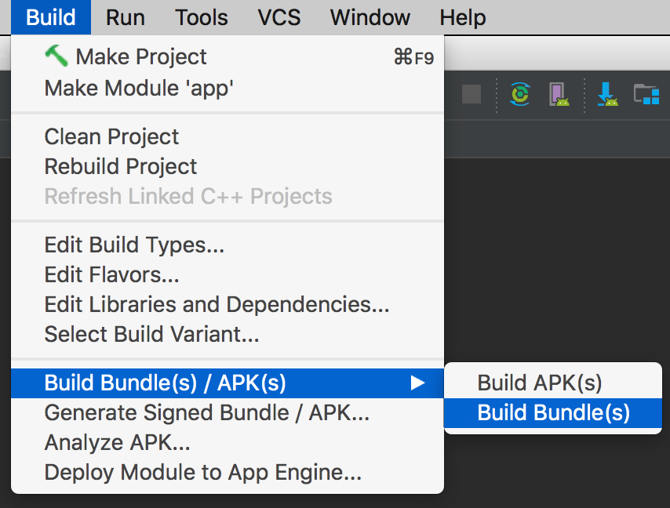
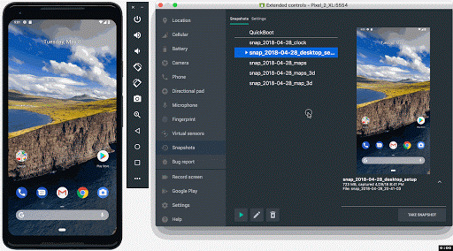
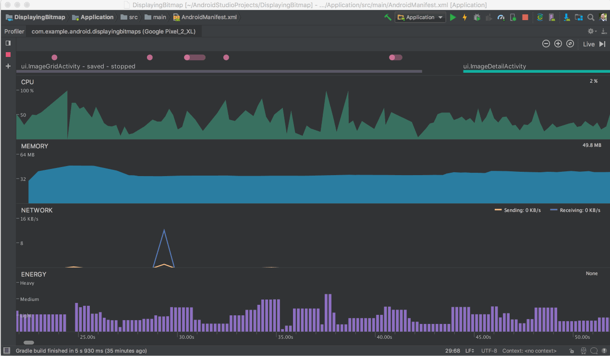

# Android Studio 3.2 测试版

原标题：Android Studio 3.2 Beta  
链接：[https://android-developers.googleblog.com/2018/06/android-studio-3-2-beta.html](https://android-developers.googleblog.com/2018/06/android-studio-3-2-beta.html)  
作者：[Jamal Eason](https://www.google.com/+JamalEason) (Android产品经理)  
翻译：[arjinmc](https://github.com/arjinmc)    

从今天开始，您可以[下载](https://developer.android.com/studio/preview/)Android Studio 3.2 Beta。在Google I / O 2018预览版中，官方Android IDE的最新版本专注于帮助您了解围绕Google I / O推出的所有新功能 - [Android JetPack](http://developer.android.com/jetpack)，[Android P开发者预览版本](https://developer.android.com/preview/)和新的[Android App Bundle](http://d.android.com/appbundle)格式。在Android Studio 3.2中还有其他一些令人兴奋的新功能来加速您的应用开发，例如模拟器快照和Energy Profiler。

随着Android Studio的使用从1.0版本开始增长了3.5年，我们也越来越痴迷质量。我们继续投资于质量，因为我们知道数百万应用程序开发者几乎每天都会在Android Studio中花时间，并需要一套可靠的工具。完成Android Studio 3.2后，稳定性，构建时间和其他质量工作将成为我们下一个版本的主要关注点。我们也不想等，所以我们已经做了检查来解决[内存泄漏](https://twitter.com/androidstudio/status/1004800015481561088)和性能问题，并修复了超过450个错误。感谢您继续提供反馈，并请继续提供，以便我们专注于下一版Android Studio中您最关心的领域。如果想要试用最新功能并评估质量改进，可以[下载](https://developer.android.com/studio/preview/)发布频道上测试版的Android Studio。

## Android Studio 3.2有什么

基于Android Studio 3.2 的[canary发布](https://android-developers.googleblog.com/2018/05/android-studio-3-2-canary.html)，Beta版本包括：

* <strong>Android App Bundle支持</strong> - [Android App Bundle](http://d.android.com/appbundle)是一种新的发布格式，它使用Google Play的动态传递，它提供了一个更小的优化APK，其中只包含特定设备所需的资源。在没有任何代码更改的情况下，您可以通过导航到<strong>Build → Build Bundle / APK</strong> 或<strong>Build → Generate Signed Bundle / APK</strong>来充分利用Android App Bundle的应用程序大小节省。

  
<small>构建Android应用程序包</small>

* <strong>模拟器快照</strong> - 使用Android Studio 3.2，您可以在任何模拟器状态下创建快照，然后在2秒内启动快照。您可以使用所需的应用程序，数据和设置预先配置Android虚拟设备（AVD）快照，然后重复回到同一快照。[了解更多](https://developer.android.com/studio/preview/features/#emulator_improvements)。

  
<small>Android模拟器快照</small>

* <strong>能量分析器</strong> - 性能分析器套件中新增的[能量分析器](https://developer.android.com/studio/profile/energy-profiler.html)可以帮助您了解您的应用对Android设备的能量影响。您现在可以查看系统组件估计的能源使用情况，并检查可能导致电池消耗的后台事件。

<small>能源分析器</small>

查看以下列出的开发流程和[canary博客](https://android-developers.googleblog.com/2018/05/android-studio-3-2-canary.html)所列出的所有主要功能的完整说明：

#### 开发
* 导航编辑器
* AndroidX重构
* 样本数据
* Material Design(材料设计)更新
* Android Slice
* CMakeList编辑
* 什么是新的助理
* 新的Lint(关联)检查
* Intellij平台更新

#### 构建

* Android应用程序包
* D8 Desugaring编译器
* R8优化器

#### 测试
* Android模拟器快照
* Android模拟器中的屏幕记录
* 虚拟场景Android模拟器相机
* ADB连接助手

#### 优化

* 能量分析器
* 系统跟踪
* 分析器会话
* 自动CPU记录
* JNI引用跟踪

## Google I / O大会2018

随着Android Studio 3.2在谷歌I / O 2018上的发布，Android Studio团队还展示了一系列关于Android Studio的会议。观看以下视频以查看最新功能并获取有关如何使用Android Studio的提示和技巧：

* [Android开发工具有哪些新功能](https://youtu.be/WxAZk7A7OkM)

给Android应用程序开发者Android Studio最近的所有功能概述。本次会议包括演示和相关功能的演示，以加速开发者关于最新Android API的工作流程。

* [Android构建系统的新功能](https://youtu.be/N5xONyp69eU)

深入了解Android构建系统的新功能。

* [ConstraintLayout和Android Studio设计工具的新特性](https://youtu.be/ytZteMo4ETk)

本会议将介绍ConstraintLayout 2.0中的新功能以及Android Studio设计工具中添加的最新功能，重点介绍如何有效利用它们进行设计，原型设计和构建图形用户界面应用程序。

* [使用Android Studio分析器提高应用性能](https://youtu.be/O5V9ZSL0BsM)

本演讲演示如何使用Android Studio Profiler诊断和解决与您的应用程序有关的性能问题。它涵盖了如何使用CPU，内存，网络性能分析器以及突出显示新功能的示例。

* [在Android Studio中使用编译器的最佳实践](https://youtu.be/gGOOkk2y_Ss)

本会议深入讨论了Android中使用的各种编译器所发生的情况：Java 8语言特性解析，新的dexer（D8）和shrinker（R8），以及在Android上使用的Kotlin编译器所做的工作。

* [Android Jetpack：使用导航控制器管理UI导航](https://youtu.be/8GCXtCjtg40)

本会议讨论了如何使用Android Studio中的导航编辑器，XML或Java API来定义导航图，以及如何简化对应用程序的导航以及处理深度链接。

## 下载和反馈

从测试版频道[下载页面](https://developer.android.com/studio/preview/)下载最新版本的Android Studio 3.2 。如果您使用的是旧版Android Studio，请确保您已更新至Android Studio Beta 1或更高版本。如果您还想维护稳定版本的Android Studio，则可以同时运行Android Studio的稳定版本和Beta版本。[了解更多](https://developer.android.com/studio/preview/install-preview)。

要使用上述Android模拟器功能，请确保至少运行Android Emulator v27.3 +，并通过Android Studio SDK Manager下载。

请注意，为确保我们保持产品质量，默认情况下，您在导航编辑器等canary频道中看到的一些功能未启用。要打开canary版本通道功能，请转至<strong>File → Settings → Experimental → Editor → Enable Navigation Editor</strong>。

如果您发现bug或问题，请随时[提出问题](https://source.android.com/source/report-bugs#developer-tools)。请在我们的[Google+](https://plus.google.com/103342515830390186255)信息页或[Twitter](https://plus.google.com/103342515830390186255)上与我们联系 - Android Studio开发团队。