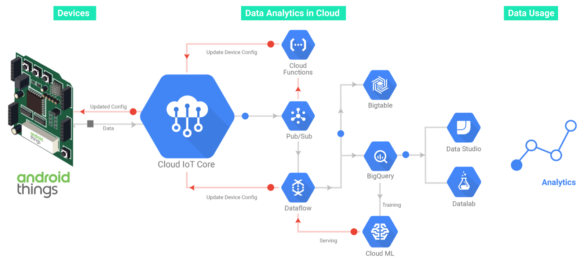

# Android Things的谷歌云物联网核心客户端库

原标题：Android Things client library for Google Cloud IoT Core  
链接：[https://android-developers.googleblog.com/2018/06/android-things-client-library-for.html](https://android-developers.googleblog.com/2018/06/android-things-client-library-for.html)  
作者：Wayne Piekarski (物联网+ 开发者倡导者 [WaynePiekarski](https://google.com/+WaynePiekarski) [@WaynePiekarski](https://twitter.com/waynepiekarski))  
翻译：[arjinmc](https://github.com/arjinmc)  

我们发布了一个客户端库，以便从Android Things设备使用Google Cloud IoT Core。只需几行代码，就可以轻松连接到IoT Core MQTT桥接器，验证设备，发布设备遥测和状态，订阅配置更改以及处理错误和网络中断。

## 什么是Cloud IoT Core（云物联网核心库）？

[Cloud IoT Core](https://cloud.google.com/iot-core/)是Google云端平台上的完全托管服务，可让您轻松安全地连接，管理和摄取来自全球数百万分散设备的数据。Cloud IoT Core与组成Google Cloud IoT平台的其他服务相结合，提供了实时收集，处理，分析和可视化IoT数据的完整解决方案，以支持改进的运营效率，合规性或收入管理。Android Things旨在支持从收集遥测数据到功能强大的计算机视觉，音频处理和机器学习应用程序等所有设备上的所有内容，并使用Cloud IoT Core将数据推送到Google Cloud Platform以进行进一步分析。

  

## 云物联网核心客户端库

Cloud IoT Core客户端库旨在使Android Things开发者能够开始使用几行代码。客户端库处理网络，线程和消息处理，实现身份验证，安全性，错误处理和脱机操作的最佳实践。

Cloud IoT Core维护一个[设备注册表](https://cloud.google.com/iot/docs/concepts/devices#device_registration)，用于跟踪已批准的设备，并且每个设备都使用一个公钥来与服务器进行身份验证。Android Things提供了许多支持安全IoT应用程序的功能，包括支持硬件的[Android Keystore](https://developer.android.com/training/articles/keystore)，可确保加密密钥材料受到保护。客户端库支持RSA和ECC密钥，并实现了用于使用Cloud IoT Core进行身份验证的JSON Web令牌（JWT）的生成。

建立连接后，设备可以将遥测数据发布到[遥测主题](https://cloud.google.com/iot/docs/how-tos/mqtt-bridge#publishing_telemetry_events)中的一个或多个存储桶，并将其内部状态报告给单独的[设备状态主题](https://cloud.google.com/iot/docs/how-tos/config/getting-state)。设备状态旨在存储信息，如软件版本或工作传感器的数量。遥测消息适用于设备的所有其他数据，例如实际的传感器测量值。设备还可以订阅从Cloud IoT Core发布的[配置更改](https://cloud.google.com/iot/docs/concepts/devices#device_configuration)。

由于物联网设备在无线条件较差的现实世界中运行，因此客户端库为处理错误以及稍后缓存和重新发送事件提供了广泛的支持。对于需要自定义脱机行为的开发者，库的队列是可配置的，甚至是可替换的。这提供了有关要保存哪些事件的详细控制以及返回联机时发送它们的顺序。

## Android Things的设备配置和身份验证

Cloud IoT Core客户端库是我们用Android Things设备配置和身份验证的整体愿景的一部分。要了解更多信息，请观看Google I / O 2018发布的视频：

[视频介绍](https://youtu.be/gkjV-TWLkIc)  

## 示例代码

Cloud IoT Core客户端库入门很简单。您可以简单地将以下内容添加到Android Things项目中的build.gradle文件中：

```code
implementation 'com.google.android.things:cloud-iot-core:1.0.0'
```

如果您更愿意自己构建它， 该库也可以在[GitHub](https://github.com/androidthings/cloud-iot-core-androidthings)上以开源形式提供。我们还有一个[示例](https://github.com/androidthings/sensorhub-cloud-iot)，演示如何在Android Things上实现传感器集线器，从连接的传感器收集传感器数据并将它们发布到Google Cloud IoT Pub / Sub主题。

开始在您自己的代码中使用客户端库很容易。以下Kotlin示例演示了如何根据您的项目创建新的配置和客户端。

```code
var configuration = IotCoreConfiguration.Builder().
                         .setProjectId("my-gcp-project")
                         .setRegistry("my-device-registry", "us-central1")
                         .setDeviceId("my-device-id")
                         .setKeyPair(keyPairObject)
                         .build()

var iotCoreClient = IotCoreClient.Builder()
              .setIotCoreConfiguration(configuration)
              .setOnConfigurationListener(onConfigurationListener)
              .setConnectionCallback(connectionCallback)
              .build()

iotCoreClient.connect()
```

接下来，您可以使用以下Kotlin示例发布遥测信息或设备状态。

```code
private fun publishTelemetry(temperature: Float, humidity: Float) {
    // payload is an arbitrary, application-specific array of bytes
    val examplePayload = """{
        |"temperature" : $temperature,
        |"humidity": $humidity
        |}""".trimMargin().toByteArray()
    val event = TelemetryEvent(examplePayload, topicSubpath, TelemetryEvent.QOS_AT_LEAST_ONCE)
    iotCoreClient.publishTelemetry(event)
}

private fun publishDeviceState(telemetryFrequency: Int, enabledSensors: Array<String>) {
    // payload is an arbitrary, application-specific array of bytes
    val examplePayload = """{
        |"telemetryFrequency": $telemetryFrequency,
        |"enabledSensors": ${enabledSensors.contentToString()}
        |}""".trimMargin().toByteArray()
    iotCoreClient.publishDeviceState(examplePayload)
}
```

## 其他资源

您可以在[开发者网站](https://developer.android.com/things)上了解更多关于构建Android Things的信息。有关Cloud IoT Core入门的更多信息，请访问[信息页面](https://cloud.google.com/iot-core/)和[文档](https://cloud.google.com/iot/docs/)。最后，加入Google+上的[Google物联网开发者社区](https://g.co/iotdev)，让我们知道您正在使用Android Things和Cloud IoT Core构建您的项目！