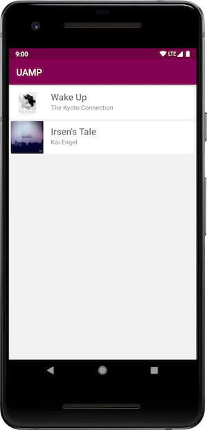

# 新的通用音乐播放器

原标题：A New Universal Music Player  
链接：[https://android-developers.googleblog.com/2018/06/a-new-universal-music-player.html](https://android-developers.googleblog.com/2018/06/a-new-universal-music-player.html)  
作者：Nicole Borrelli (Android开发者，程序工程师）  
翻译：[arjinmc](https://github.com/arjinmc)  

  

在[通用的Android音乐播放器](https://github.com/googlesamples/android-UniversalMusicPlayer)（或“UAMP”）是在GitHub上喜爱的音乐应用开发者提供超过9,500名star和3000个fork。自UAMP首次发布以来，Android开发已发生重大变化。ExoPlayer已经改进，架构组件被引入，Kotlin成为Android开发者的一流语言。

我们决定整合我们心爱的音乐应用的现代功能的最佳方式是重写UAMP。

UAMP v2是从Kotlin开始建造的。UI是围绕ViewModels和LiveData构建的。播放，特别是与MediaSessionCompat的集成，通过利用ExoPlayer的[MediaSession](https://medium.com/google-exoplayer/the-mediasession-extension-for-exoplayer-82b9619deb2d)扩展极大地简化了。

我们还添加了一堆由[The Kyoto Connection](http://freemusicarchive.org/music/The_Kyoto_Connection/)和[Kai Engel](http://freemusicarchive.org/music/Kai_Engel/)创作的新歌。

UAMP v1还有一些尚未集成到新代码中的功能。缺少的功能包括带有Leanback库的Android TV和通过Google Cast进行远程播放。尽管v2中尚未包含这些功能，但我们希望尽快向您展示新的更新。旧代码将继续[v1 branch](https://github.com/googlesamples/android-UniversalMusicPlayer/tree/v1)在GitHub上提供，因此请查看如何在音乐应用中使用这些功能。

我们希望您对下一步要添加的功能提供反馈。我们正在考虑离线播放，改进与Android Auto的集成，并[将Jetpack的即将推出的导航组件](https://developer.android.com/topic/libraries/architecture/navigation/)用于用户界面。我们将针对功能和改进创建GitHub问题，以帮助您告诉我们哪些是最重要的。去[对这些功能的投票](https://github.com/googlesamples/android-UniversalMusicPlayer/issues)，让我们知道我们应该集中我们的努力。

我们还希望邀请您打开pull修复bug和功能的请求。查看[贡献过程](https://github.com/googlesamples/android-UniversalMusicPlayer/blob/master/CONTRIBUTING.md)获取更多信息。

从[GitHub](https://github.com/googlesamples/android-UniversalMusicPlayer)获取代码！