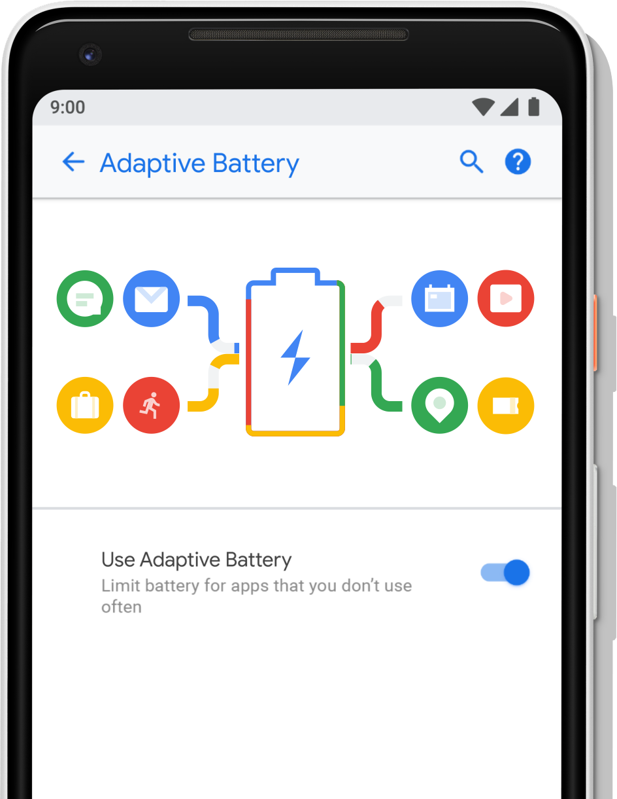
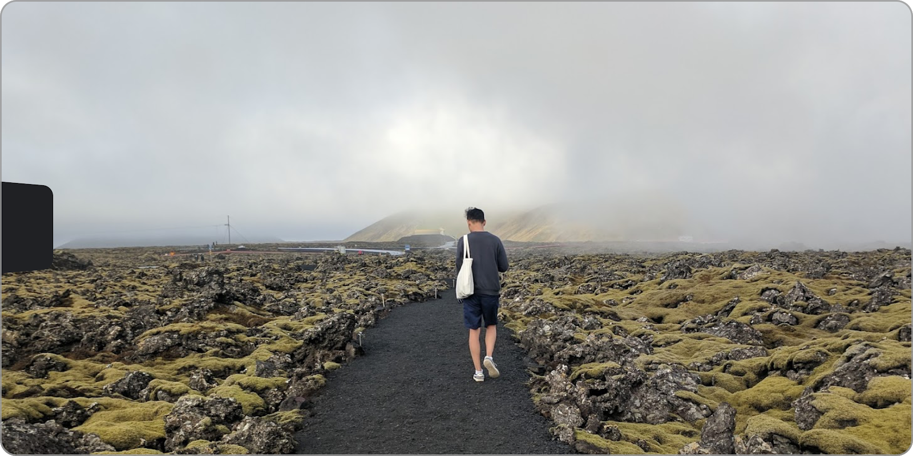
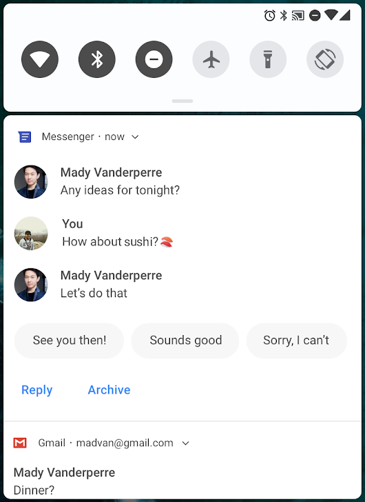
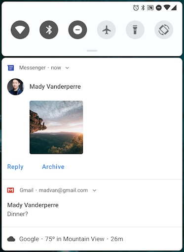
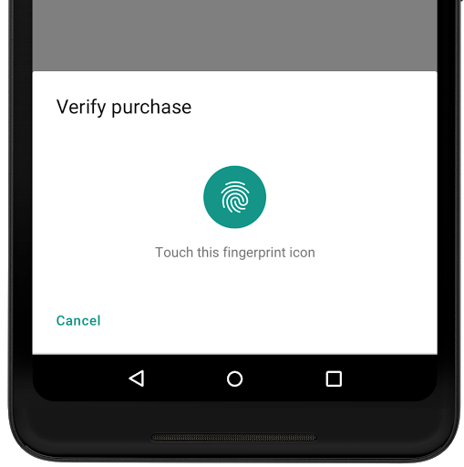
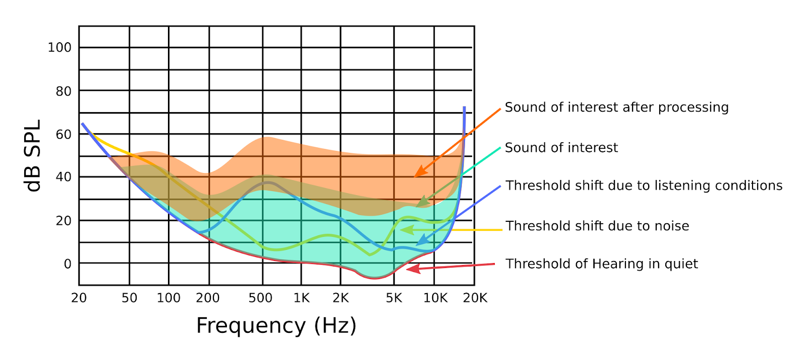
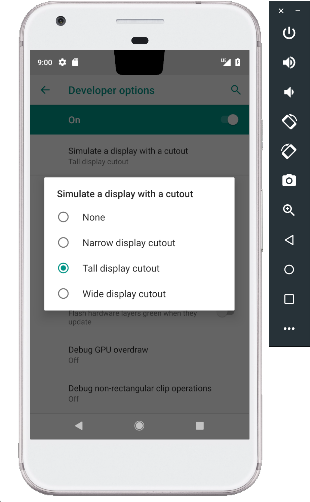

# Android P Beta 2和最终的API！

原标题：Android P Beta 2 and final APIs!  
链接：[https://android-developers.googleblog.com/2018/06/android-p-beta-2-and-final-apis.html](https://android-developers.googleblog.com/2018/06/android-p-beta-2-and-final-apis.html)  
作者：Dave Burke (工程副总裁)  
翻译：[arjinmc](https://github.com/arjinmc)  

在四周前的Google I / O上，我们发布了[Android P的第一个测试版本](https://android-developers.googleblog.com/2018/05/whats-new-in-android-p-beta.html)，将AI作为操作系统的核心，专注于智能和简单的体验。

我们在主题演讲中讨论了一些Android的最新功能，并在突破期间深入讨论了开发者API。如果你错过了直播，请务必查看[Android论坛的完整播放列表](https://www.youtube.com/watch?v=Hzv5-R9XLTc&list=PLWz5rJ2EKKc9Gq6FEnSXClhYkWAStbwlC)。

今天，我们发布了Android P Beta 2，这是一个包含<strong>最终Android P API</strong>，最新系统映像和最新开发者工具的更新程序，可帮助你准备好在夏季晚些时候发布消费者版本。

通过在[这里注册](https://www.google.com/android/beta)，你可以在Pixel设备上获得Android P Beta 2 。如果你已经注册并在Pixel设备上收到Android P Beta 1，则会自动获得Beta 2的更新。参与[Android P Beta计划](https://android.com/beta)的合作伙伴将在未来几周内更新其设备。

## 使用Android P功能和API增强你的应用

Android P Beta 2是我们即将推出的Android P平台的最新更新，包括最终的API（API级别28）以及官方SDK。你可以立即开始使用Android P功能和API进行构建。以下是我们希望你尝试的一些内容 - 请参阅更多[功能概述](https://developer.android.com/preview/features)。

## 以机器学习为核心

  
<small>自适应电池图像</small>

我们与[DeepMind](https://deepmind.com/)合作开发了一项我们称之为[自适应电池](https://developer.android.com/preview/features/power)的功能，该功能使用机器学习为用户最关心的应用优先考虑系统资源。如果你的应用程序针对[Doze](https://developer.android.com/training/monitoring-device-state/doze-standby#understand_doze)，[应用程序待机](https://developer.android.com/training/monitoring-device-state/doze-standby#understand_app_standby)和[后台限制](https://developer.android.com/about/versions/oreo/background)进行了优化，则自适应电池应该是你的开箱即用。请务必查看[电源文档](https://developer.android.com/preview/features/power)中的详细信息，了解它的工作原理和影响可能在哪里，并测试你的应用程序以确保它们已准备就绪。

[应用Action](http://developer.android.com/guide/actions/)是一种新的方式，可帮助你提高应用的可见度并帮助推动互动。Action利用Android上的机器学习，根据应用程序的语义[意图](https://developers.google.com/actions/reference/built-in-intents)和用户的上下文，在恰当的时间将应用程序呈现给用户。Action适用于Android P和更新版本的平台，并且即将推出，供你开始使用。在[此处注册](https://docs.google.com/forms/d/e/1FAIpQLSfzg7DrFtD8S_tHrYYoWpmsfFzLuduukoQQY6A2AtHsxTHgKg/viewform)，以在操作可用时收到通知。

[Slice(切片)](https://developer.android.com/guide/slices/)是在Google搜索和助手等地方展示丰富模板内容的新方式。它们是互动的，通过[Android Jetpack](https://developer.android.com/jetpack)，它们可以一直兼容KitKat。查看[入门指南](https://developer.android.com/guide/slices/getting-started)以了解如何使用Slice进行构建 - 你可以使用[SliceViewer工具](https://developer.android.com/guide/slices/getting-started#run-the-slice-viewer)查看Slice的外观。随着时间的推移，我们计划扩大Slice可以出现的位置数量，包括其他应用程序中的远程显示。

## 简单，抛光

Android P增加了对显示剪切画面的平台支持，并且我们添加了[新的API](https://developer.android.com/reference/android/view/DisplayCutout.html)让你在最新的屏幕上提供丰富的边缘到边缘的体验。Cutout支持可以无缝地应用于应用程序，系统管理状态栏高度可将你的内容与剪贴画分离。如果你拥有沉浸式的内容，则可以使用[显示截图API](https://developer.android.com/reference/android/view/DisplayCutout.html)检查剪贴画的位置和形状并请求全屏布局环绕它。

所有开发者都应该查看[文档](https://developer.android.com/preview/features#cutout)以了解如何管理剪切区域并避免可能影响应用程序的常见兼容性问题。请确保在[Android P Beta设备](https://developer.android.com/preview/devices/)的显示设备上测试你的应用。

  
<small>沉浸式的内容应用程序可以在具有显示截图的设备上全屏显示内容。</small>

如果你的应用使用消息通知，请利用[MessagingStyle](https://developer.android.com/preview/features#notifications)中的更改，使通知更加有用且可操作。你现在可以显示对话，附上照片和贴纸，甚至建议智能的回复。你很快就可以使用[ML工具包](https://developers.google.com/ml-kit/)为你的应用程序生成智能回复建议。

  
<small>MessagingStyle通知与对话和智能答复[左]，图像和贴纸[右]。</small>

## 安全

  

通过一系列用于身份验证的生物识别传感器，我们使各种传感器类型和应用的体验更加一致。Android P引入了一个系统管理的对话框来提示用户任何支持的生物特征身份验证类型。应用程序不再需要构建自己的对话框 - 而是使用[BiometricPrompt API](https://developer.android.com/reference/android/hardware/biometrics/BiometricPrompt)显示标准系统对话框。除了指纹（包括显示内传感器）之外，API还支持人脸和虹膜身份验证。

如果你的应用程序正在绘制自己的指纹验证对话框，则应尽快切换到使用[BiometricPrompt API](https://developer.android.com/reference/android/hardware/biometrics/BiometricPrompt)。

## 更多

如果你的应用使用设备摄像头，请尝试新的[多摄像头API](https://developer.android.com/reference/android/hardware/camera2/CameraMetadata.html#REQUEST_AVAILABLE_CAPABILITIES_LOGICAL_MULTI_CAMERA)，使你可以从两个或更多物理摄像头同时访问流。在具有双摄像头的设备上，你可以创建单个摄像头无法实现的创新功能 - 例如无缝缩放，散景和立体视觉。你可以立即开始使用任何提供双摄像头的[Android P Beta设备](https://developer.android.com/preview/devices)。

音频应用程序可以使用[动态处理API](https://developer.android.com/reference/android/media/audiofx/DynamicsProcessing)访问多级多频段动态处理效果，以修改Android设备发出的音频，并根据收听者的偏好或环境条件对其进行优化。

  

查看[Android P功能概述](https://developer.android.com/preview/features)以获取新功能和API的完整列表。

## 开始几个简单的步骤

  

首先，<strong>让你的应用程序兼容</strong>，并让你的用户无缝过渡到Android P.只需在[Android P Beta设备](https://developer.android.com/preview/devices)或[模拟器](https://developer.android.com/studio/run/managing-avds.html)上安装你当前的Google Play应用程序并进行测试 - 应用程序应运行并且看起来很棒，并尽可能处理Android P [正确更改所有应用程序的行为](https://developer.android.com/preview/behavior-changes)。在你做出必要更新后，我们建议你立即发布到Google Play，而不必更改应用的平台定位。

如果你没有受[支持的设备](https://developer.android.com/preview/devices)，请记住你可以在[Android模拟器上设置](https://developer.android.com/preview/setup-sdk.html#run-emulator)Android虚拟设备作为你的测试环境。如果你最近没有尝试过模拟器，你会发现它速度非常快，在6秒内启动，甚至可以让你对下一代屏幕进行建模 - 例如长屏幕和带显示屏的屏幕。

接下来，尽快<strong>将你的应用的targetSdkVersion更新为28</strong>，以便你的应用的Android P用户受益于该平台的最新安全性，性能和稳定性功能。如果你的应用已根据[Google Play即将推出的政策](https://android-developers.googleblog.com/2017/12/improving-app-security-and-performance.html)定位API 26+ ，那么更改为目标28应该是一个小小的跳跃。

<strong>测试你的应用程序以使用非SDK接口</strong>并减少对它们的依赖 也很重要。正如[前面所提到的](https://android-developers.googleblog.com/2018/02/improving-stability-by-reducing-usage.html)，在Android的P我们开始一个渐进的过程，以限制对选定的非SDK接口。注意logcat警告，强调直接使用受限的非SDK接口并尝试新的StrictMode方法[detectNonSdkApiUsage()](https://developer.android.com/reference/android/os/StrictMode.VmPolicy.Builder#detectNonSdkApiUsage())以编程方式捕获访问。在可能的情况下，你应该转而使用Android SDK或NDK中的公共等价物。如果没有符合你使用情况的公开API，请[告诉我们](https://issuetracker.google.com/issues/new?component=328403&template=1027267)。

准备就绪后，<strong>深入Android P</strong>并了解[新功能和API](https://developer.android.com/preview/api-overview.html)以扩展你的应用。要使用新API进行构建，只需将<strong>官方API 28 SDK</strong>和工具下载到Android Studio 3.1中，或使用最新版本的[Android Studio 3.2](https://developer.android.com/preview/setup-sdk.html#get-studio)。然后将你的项目的compileSdkVersion和targetSdkVersion更新到API 28。

有关详细信息和文档，请访问[Developer Preview网站](https://developer.android.com/preview/index.html)。还可以查看[此视频](https://youtu.be/LBBqTd6uOd4)和[Google I / O Android播放列表](https://www.youtube.com/watch?v=Hzv5-R9XLTc&list=PLWz5rJ2EKKc9Gq6FEnSXClhYkWAStbwlC)，了解更多有关Android P面向开发者的新功能。

## 发布到Google Play Alpha版，测试版或生产渠道

从今天开始，你可以发布针对或针对API 28编译的APK更新。在预览期间向Google Play发布更新后，你可以将更新推送给用户，以测试现有设备（包括运行Android P Beta 2的设备）的兼容性。

为了确保你的更新应用在Android P以及旧版本上运行良好，一种常见策略是使用[Google Play的测试版测试功能](https://developer.android.com/distribute/engage/beta.html?utm_campaign=android_launch_npreview_061516&utm_source=anddev&utm_medium=blog)，从少数用户组（包括Android P Beta 2用户）获得及早反馈，然后分阶段推出生产。

## 如何获得Android P Beta 2

对于Pixel设备，你可以将设备[注册到Android Beta程序](https://google.com/android/beta)中，然后你将自动接收Android P Beta 2的更新。如果你已经注册并收到测试版1，请立即注意更新。参与[Android P Beta计划](https://android.com/beta)的合作伙伴将在未来几周内更新其设备。

你可以在[android.com/beta](https://android.com/beta)上看到支持的合作伙伴和Pixel设备的完整列表。对于每个设备，你都可以找到规范和指向制造商专用站点的下载，支持和报告问题的链接。

感谢你们的所有反馈。在今年夏天晚些时候我们正在努力向消费者发布消息时，请继续分享[反馈或请求](https://developer.android.com/preview/feedback.html)。随意使用我们的热点列表来解决[平台问题](https://issuetracker.google.com/issues/new?component=190602&template=1024208)，[应用程序兼容性问题](https://issuetracker.google.com/issues/new?component=190602&template=1024202)和[第三方SDK问题](https://issuetracker.google.com/issues/new?component=190602&template=1024212)。

我们期待在Android P上看到你的应用！