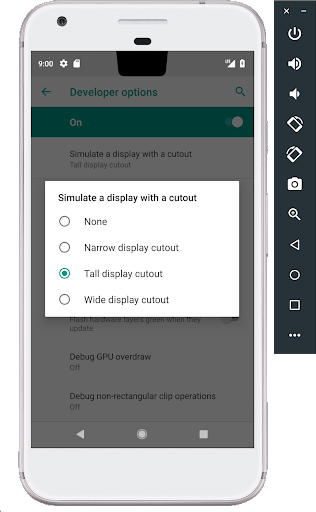

# Android P Beta 3现已推出

原标题：Android P Beta 3 is now available  
链接：[https://android-developers.googleblog.com/2018/07/android-p-beta-3-is-now-available.html](https://android-developers.googleblog.com/2018/07/android-p-beta-3-is-now-available.html)  
作者：Dave Burke (工程副总裁)  
翻译：[arjinmc](https://github.com/arjinmc)  

今天，我们将推出Android P的Beta 3，这是我们今年Android P开发者预览版中的下一个里程碑。由于开发者API已经在[之前的更新](https://android-developers.googleblog.com/2018/06/android-p-beta-2-and-final-apis.html)中完成，Beta 3现在使我们非常接近将在今年夏季晚些时候发布的Android P最终版本中看到的内容。

Android P Beta 3包含最新的bug修复和稳定性和渲染优化，以及2018年7月的安全更新。这是一个很好的方法来测试你的应用程序，以确保它们在最终版本之前就绪。试一试Beta 3，[让我们知道您的想法](https://developer.android.com/preview/feedback/)！

通过[在这里注册](https://www.google.com/android/beta)，您可以在Pixel设备上获得Android P Beta 3 。如果您已经注册并在Pixel设备上收到Android P Beta 2，您将自动获得Beta 3的更新。未来几周，参与[Android P Beta计划](https://android.com/beta)的合作伙伴也将更新他们的设备到Beta 3。

## 此更新中包含什么内容？

今天的预览版更新包括Pixel设备和[Android模拟器](https://developer.android.com/studio/run/managing-avds.html)的Beta 3系统映像，以及Android Studio构建工具的更新，包括[D8](https://android-developers.googleblog.com/2017/08/next-generation-dex-compiler-now-in.html)作为独立工具。Beta 3是Android的早期发布候选版本，具有接近最终系统行为和官方Android P API（API级别28）。

随着Beta 3的系统映像和更新的构建工具，你已经得到了你需要测试你的应用程序或将其与Android P特性扩展这些支持像[多摄像头的支持](https://developer.android.com/preview/features#camera)，[显示屏切口](https://developer.android.com/reference/android/view/DisplayCutout)，[增强了通知](https://developer.android.com/preview/features.html#notifications)，[ImageDecoder](https://developer.android.com/reference/android/graphics/ImageDecoder.html)，[TextClassifier](https://developer.android.com/reference/android/view/textclassifier/TextClassifier)，和[很多其他内容](https://developer.android.com/preview/features)。在您的测试中，请确保考虑应用程序[备用存储区](https://developer.android.com/preview/features/power)，[隐私限制](https://developer.android.com/preview/behavior-changes#privacy-changes-all)以及[对非SDK接口的限制](https://developer.android.com/preview/restrictions-non-sdk-interfaces)。

## 从几个简单的步骤开始

  

首先，<strong>让您的应用兼容</strong>，并让您的用户无缝过渡到Android P.只需在[Android P Beta设备](https://developer.android.com/preview/devices)或[模拟器](https://developer.android.com/studio/run/managing-avds.html)上安装您当前的应用程序并进行测试 - 该应用程序应运行并且看起来很棒，并处理Android P [行为改变](https://developer.android.com/preview/behavior-changes)得当。在您进行任何必要的更新后，我们建议您立即发布到Google Play而不更改应用的平台定位。

如果您[没有支持的设备](https://developer.android.com/preview/devices)，请记住，您可以在Android模拟器上为您的测试[设置Android虚拟设备环境](https://developer.android.com/preview/setup-sdk.html#run-emulator)。如果您最近没有尝试过模拟器，您会发现它非常快，在6秒内启动，甚至可以让您为下一代屏幕建模 - 例如长屏幕和带有显示屏切口的屏幕。

接下来，<strong>尽快将应用的targetSdkVersion更新</strong>为28，这样您应用的Android P用户就可以从该平台的最新安全性，性能和稳定性功能中受益。如果您的应用已根据[Google Play即将推出的政策](https://android-developers.googleblog.com/2017/12/improving-app-security-and-performance.html)改为API 26+ ，那么更改为定位API 28应该是一个小小的跳跃。当您更改api版本时，请确保您的应用支持所有适用的[行为更改](https://developer.android.com/preview/behavior-changes#p-apps)。

<strong>测试您的应用程序以使用非SDK接口</strong>并减少对它们的依赖也很重要。如[最近所通知的](https://android-developers.googleblog.com/2018/06/an-update-on-non-sdk-restrictions-in.html)，Android P限制对选定的非SDK接口的访问。观察logcat警告，突出显示直接使用受限制的非SDK接口，并尝试新的StrictMode方法[detectNonSdkApiUsage()](https://developer.android.com/reference/android/os/StrictMode.VmPolicy.Builder#detectNonSdkApiUsage())以编程方式捕获访问。在可能的情况下，您应该转向使用Android SDK或NDK中的公共等效项。如果没有符合您的用例的公共API，请[告诉我们](https://issuetracker.google.com/issues/new?component=328403&template=1027267)。

准备就绪后，<strong>深入Android P</strong>并了解可在应用中使用的[新功能和API](https://developer.android.com/preview/api-overview.html)。要使用新API构建，只需将官方API 28 SDK和工具下载到Android Studio 3.1，或使用最新版本的[Android Studio 3.2](https://developer.android.com/preview/setup-sdk.html#get-studio)。然后将项目的compileSdkVersion和targetSdkVersion更新为API 28。

有关详细信息和文档，请访问[开发者预览版网站](https://developer.android.com/preview/index.html)。还可以查看[此视频](https://youtu.be/LBBqTd6uOd4)和[Google I / O Android播放列表](https://www.youtube.com/watch?v=Hzv5-R9XLTc&list=PLWz5rJ2EKKc9Gq6FEnSXClhYkWAStbwlC)，了解更多有关Android P面向开发者的新功能。

## 发布到Google Play Alpha版，测试版或生产渠道

只要准备就绪，即可发布针对API 28编译的<strong>APK更新</strong>或可选择定位API 28.在预览期间向Google Play发布更新后，您可以将更新推送给现有用户，以测试其设备上的兼容性。

为了确保您的更新应用在Android P以及旧版本上运行良好，一个常见策略是使用[Google Play的beta测试功能](https://developer.android.com/distribute/engage/beta.html?utm_campaign=android_launch_npreview_061516&utm_source=anddev&utm_medium=blog)。通过beta测试，您可以从一小组用户（包括Beta 3用户）获得早期反馈，然后分阶段进行生产。

## 下一步是什么？
感谢您到目前为止的所有[反馈和请求](https://developer.android.com/preview/feedback.html)。在今年夏天晚些时候我们正在努力向消费者发布消息时，请继续分享反馈或请求。随意使用我们的列表来解决[平台问题](https://issuetracker.google.com/issues/new?component=190602&template=1024208)，[应用程序兼容性问题](https://issuetracker.google.com/issues/new?component=190602&template=1024202)和[第三方SDK问题](https://issuetracker.google.com/issues/new?component=190602&template=1024212)。

此外，Android工程团队将于<strong>7月19日11：30-1 PM（太平洋时间）</strong>在r / androiddev上主持Reddit AMA以解答有关Android P的技术问题。在接下来的几周内留意r / androiddev上的公告。我们期待着解决您的问题！