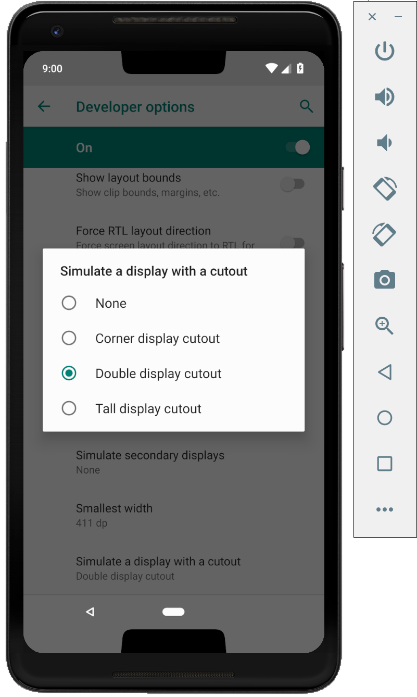

# 最终预览版更新,官方Android P即将推出！

原标题：Final preview update, official Android P coming soon!  
链接：[https://android-developers.googleblog.com/2018/07/final-preview-update-official-android-p.html](https://android-developers.googleblog.com/2018/07/final-preview-update-official-android-p.html)  
作者：Dave Burke (工程副总裁)  
翻译：[arjinmc](https://github.com/arjinmc)  

Android P即将到来！当我们对新平台进行最后润色时，今天我们将为您带来Android P Beta 4。

Beta 4是我们在今年夏天晚些时候推出官方Android P平台之前的最后预览版里程碑。借此机会测试您的应用并发布更新，以确保您为过渡到Android P的用户提供出色的体验！

## 这个更新里有什么？

今天的Beta 4更新包括具有最终系统行为的发布候选版本以及自[Beta 2](https://android-developers.googleblog.com/2018/06/android-p-beta-2-and-final-apis.html)以来可用的官方Android P API（API级别28）。它包含了为即将到来的官方Android P版本及时完成测试所需的一切。

## 让您的应用为Android P做好准备

  

随着消费者版本即将推出，<strong>测试您的应用与Android P的兼容性</strong>非常重要。只需在[Android P Beta设备](https://developer.android.com/preview/devices)或[模拟器](https://developer.android.com/studio/run/managing-avds.html)上安装Google Play中的当前应用即可。在处理流程时，请确保您的应用程序运行并且看起来很棒，并且它可以正确处理Android P [行为更改](https://developer.android.com/preview/behavior-changes)。

还要注意在您的应用中使用非SDK接口。Android P限制对所选非SDK接口的访问，因此您应该减少对它们的依赖。有关详情 请参阅我们[最近的帖子](https://android-developers.googleblog.com/2018/06/an-update-on-non-sdk-restrictions-in.html)。

在您进行任何必要的更新后，我们建议您立即发布到Google Play而不更改应用的平台目标(target)。这可让您在使用Android P API和目标功能增强应用时，确保为Android P用户提供出色的体验。

## 使用Android P功能和API增强您的应用程序

当你准备好，<strong>深入到Android的P</strong>和了解[新功能和API](https://developer.android.com/preview/api-overview.html)，你可以在你的应用程序使用，如[多摄像头的支持](https://developer.android.com/preview/features#camera)，[显示cutout](https://developer.android.com/reference/android/view/DisplayCutout)，[增强通知](https://developer.android.com/preview/features.html#notifications)，[ImageDecoder](https://developer.android.com/reference/android/graphics/ImageDecoder.html)，[TextClassifier](https://developer.android.com/reference/android/view/textclassifier/TextClassifier)，和[其他新功能](https://developer.android.com/preview/features)。

要使用新API构建，只需将官方API 28 SDK和工具下载到Android Studio 3.1，或使用最新版本的[Android Studio 3.2](https://developer.android.com/preview/setup-sdk.html#get-studio)。然后将项目的compileSdkVersion和targetSdkVersion更新为API 28.更改目标后，请确保您的应用支持所有适用的[行为更改](https://developer.android.com/preview/behavior-changes#p-apps)。

一旦您准备好，就<strong>发布您的APK更新</strong>，这些更新是针对API 28编制的，或者是可选择的目标。一个常见的策略是使用[Google Play的beta测试功能](https://developer.android.com/distribute/engage/beta.html?utm_campaign=android_launch_npreview_061516&utm_source=anddev&utm_medium=blog)从一小组用户那里获得早期反馈，然后进行上演推广到生产。

访问[Developer Preview站点](https://developer.android.com/preview/index.html)以获取详细信息和文档。另请参阅[此视频](https://youtu.be/LBBqTd6uOd4)和[Google I / O Android播放列表](https://www.youtube.com/watch?v=Hzv5-R9XLTc&list=PLWz5rJ2EKKc9Gq6FEnSXClhYkWAStbwlC)，了解开发者有关Android P中的新功能的更多信息。

## 我如何获得Beta 4？

这很简单 - 您可以通过[这里注册](https://www.google.com/android/beta)在Pixel设备上获得Android P Beta 4 。如果您已加入我们的Android Beta计划，您很快就会自动获得Beta 4更新。与往常一样，Pixel设备的可下载系统映像也可用。参与[Android P Beta计划](https://android.com/beta)的合作伙伴也将在未来几周内将其设备更新至Beta 4。

## 下一步是什么？

请继续关注即将推出的官方Android P发布！您可以在此期间继续分享您的[反馈或需求](https://developer.android.com/preview/feedback.html)，并随时使用我们的热门列表来解决[平台问题](https://issuetracker.google.com/issues/new?component=190602&template=1024208)，[应用程序兼容性问题](https://issuetracker.google.com/issues/new?component=190602&template=1024202)和[第三方SDK问题](https://issuetracker.google.com/issues/new?component=190602&template=1024212)。

感谢您的反馈，感谢您参与我们最近在[r/androiddev上Reddit AMA](https://www.reddit.com/r/androiddev/comments/8xspo7/were_on_the_engineering_team_for_android_p_ask_us/)的所有人！