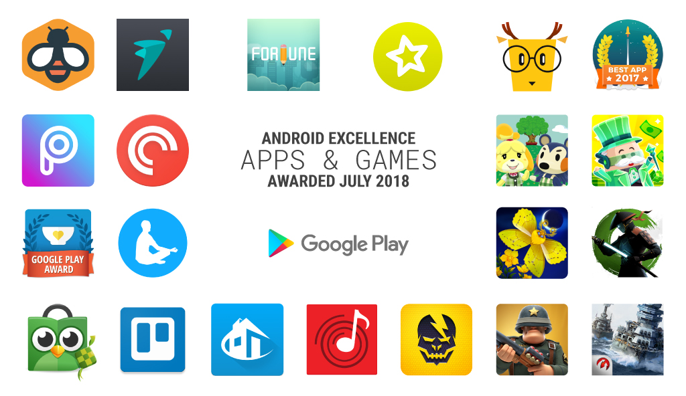

# 恭喜Google Play新上的Android Excellence应用和游戏

原标题：Congrats to the new Android Excellence apps and games on Google Play  
链接：[https://android-developers.googleblog.com/2018/07/congrats-to-new-android-excellence-apps.html](https://android-developers.googleblog.com/2018/07/congrats-to-new-android-excellence-apps.html)  
作者：Kacey Fahey (Google Play开发者营销部门)  
翻译：[arjinmc](https://github.com/arjinmc)  

加入我们，祝贺在Google Play上进入Android卓越计划的最新[应用](https://play.google.com/store/apps/topic?id=campaign_editorial_3002b4f_android_excellence_apps&hl=en)和[游戏](https://play.google.com/store/apps/topic?id=campaign_editorial_3002b50_android_excellence_games&hl=en)。这一系列多样化的应用和游戏以其高品质，出色的用户体验和强大的技术性能而闻名。无论您是对深入学习还是新语言感兴趣，或者正在寻找有关蝴蝶或战舰的游戏，我们都很高兴能够深入了解这些新系列。

  

查看我们的一些突出突出的应用。

* [Beelinguapp](https://play.google.com/store/apps/details?id=com.david.android.languageswitch&e=-EnableAppDetailsPageRedesign)：通过这款独特的应用学习新语言。阅读并聆听您正在学习的语言的并排文本，同时遵循您的语言作为参考。
* [Fortune City](https://play.google.com/store/apps/details?id=com.fourdesire.fortunecity&e=-EnableAppDetailsPageRedesign)：如果您正在寻找一个有趣的应用程序来帮助管理您的个人财务，请了解财富城如何在您建立一个繁荣的大都市时教授良好的预算习惯。
* [ShareTheMeal](https://play.google.com/store/apps/details?id=org.sharethemeal.app&e=-EnableAppDetailsPageRedesign)：通过手机上的一个水龙头喂养有需要的孩子，或者使用世界粮食计划署的这个应用程序，与朋友一起创建一个与饥饿斗争的团队。

用这些突出的游戏测试你的技能

* [Animal Crossing™：Pocket Camp](https://play.google.com/store/apps/details?id=com.nintendo.zaca&e=-EnableAppDetailsPageRedesign)：当您收集物品来装饰和建造您的终极梦想营地时，扮演营地经理的角色。与动物交流，建立友谊，并邀请您最喜欢的动物过一段有趣的时光。
* [Cash，Inc.](https://play.google.com/store/apps/details?id=com.alegrium.cong2&e=-EnableAppDetailsPageRedesign):在这个有趣的游戏中成为您商业帝国的大老板。努力工作，加入商业精英社区，成为最有名的金钱大亨。
* [Shadowgun Legends](https://play.google.com/store/apps/details?id=com.madfingergames.legends&e=-EnableAppDetailsPageRedesign)：在一个史诗般的故事活动中拯救人类免受外星入侵者的影响，该活动在4个不同的星球上进行超过200次任务。一路上，定制你的角色，与朋友合作，成为Shadowgun Universe的名人。

查看Android Excellence应用和游戏的完整列表。

<strong>新的Android Excellence应用</strong>  
[Beelinguapp](https://play.google.com/store/apps/details?id=com.david.android.languageswitch&e=-EnableAppDetailsPageRedesign)  
[BTFIT](https://play.google.com/store/apps/details?id=com.btfit&e=-EnableAppDetailsPageRedesign)  
[Fortune City](https://play.google.com/store/apps/details?id=com.fourdesire.fortunecity&e=-EnableAppDetailsPageRedesign)  
[Letras.mus.br](https://play.google.com/store/apps/details?id=com.studiosol.player.letras&e=-EnableAppDetailsPageRedesign)  
[LingoDeer](https://play.google.com/store/apps/details?id=com.lingodeer&e=-EnableAppDetailsPageRedesign)  
[Memrise](https://play.google.com/store/apps/details?id=com.memrise.android.memrisecompanion&e=-EnableAppDetailsPageRedesign)  
[PicsArt](https://play.google.com/store/apps/details?id=com.picsart.studio&e=-EnableAppDetailsPageRedesign)  
[Pocket Casts](https://play.google.com/store/apps/details?id=au.com.shiftyjelly.pocketcasts&e=-EnableAppDetailsPageRedesign)  
[ShareTheMeal](https://play.google.com/store/apps/details?id=org.sharethemeal.app&e=-EnableAppDetailsPageRedesign)  
[The Mindfulness App](https://play.google.com/store/apps/details?id=se.lichtenstein.mind.en&e=-EnableAppDetailsPageRedesign)  
[Tokopedia](https://play.google.com/store/apps/details?id=com.tokopedia.tkpd&e=-EnableAppDetailsPageRedesign)  
[Trello](https://play.google.com/store/apps/details?id=com.trello&e=-EnableAppDetailsPageRedesign)  
[VivaReal](https://play.google.com/store/apps/details?id=com.project.vivareal&e=-EnableAppDetailsPageRedesign)  
[Wynk Music](https://play.google.com/store/apps/details?id=com.bsbportal.music&e=-EnableAppDetailsPageRedesign)

<strong>全新Android卓越游戏</strong>  
[Animal Crossing™: Pocket Camp](https://play.google.com/store/apps/details?id=com.nintendo.zaca&e=-EnableAppDetailsPageRedesign)  
[Cash, Inc.](https://play.google.com/store/apps/details?id=com.alegrium.cong2&e=-EnableAppDetailsPageRedesign)  
[Flutter: Starlight](https://play.google.com/store/apps/details?id=com.runawayplay.starlight&e=-EnableAppDetailsPageRedesign)  
[Shadow Fight 3](https://play.google.com/store/apps/details?id=com.nekki.shadowfight3&e=-EnableAppDetailsPageRedesign)  
[Shadowgun Legends](https://play.google.com/store/apps/details?id=com.madfingergames.legends&e=-EnableAppDetailsPageRedesign)  
[War Heroes](https://play.google.com/store/apps/details?id=com.fungames.boomforce&e=-EnableAppDetailsPageRedesign)  
[World of Warships Blitz](https://play.google.com/store/apps/details?id=net.wargaming.wows.blitz&e=-EnableAppDetailsPageRedesign)

在Google Play的[编辑选择](https://play.google.com/store/apps/topic?id=editors_choice)部分中探索其他精彩应用和游戏，并[发现最佳实践](https://developer.android.com/distribute/best-practices/index.html)可帮助您构建优质应用和游戏。