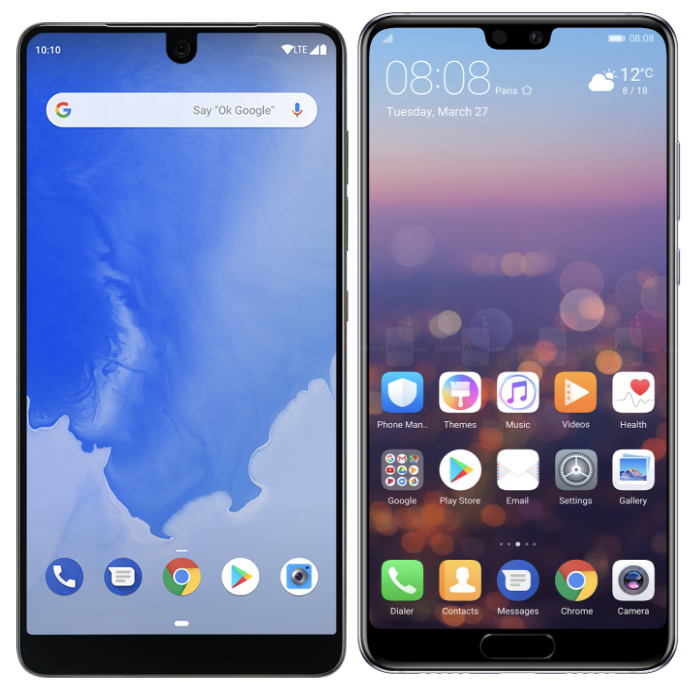
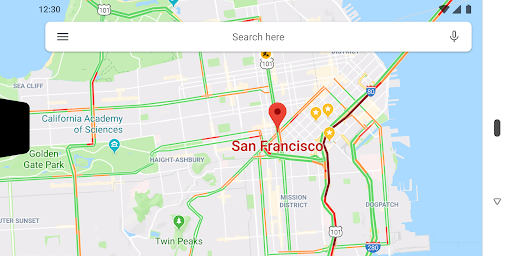
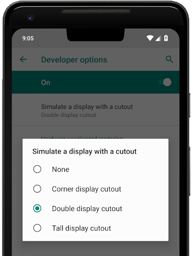
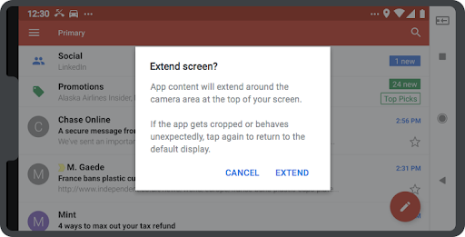

# 支持边对边屏幕上的显示刘海

原标题：Supporting display cutouts on edge-to-edge screens  
链接：[https://android-developers.googleblog.com/2018/07/supporting-display-cutouts-on-edge-to.html](https://android-developers.googleblog.com/2018/07/supporting-display-cutouts-on-edge-to.html)  
作者：Megan Potoski (Android系统UI产品经理)  
翻译：[arjinmc](https://github.com/arjinmc)  

智能手机正在迅速向更小的边框和更大的宽高比发展。在这些设备上，刘海(cutout)是实现边对边体验的流行方式，同时为设备正面的重要传感器提供空间。目前已有11家原始设备制造商推出16款刘海设备，其中包括几款[Android P beta设备](https://developer.android.com/preview/devices/index.html)，还有更多产品正在上市。

这些引人注目的展示为您展示您的应用提供了绝佳的机会。它们还意味着比以往任何时候都更重要的是确保您的应用程序在具有一个或两个显示切口的设备以及具有18：9和更大宽高比的设备上提供始终如一的出色体验。

  
<small>全屏设备示例：Essential PH-1（左）和华为P20（右）。</small>

## 使您的应用与显示刘海兼容

随着许多流行和即将推出的具有显示刘海的设备，您可以做些什么来确保您的应用程序已准备就绪？

好消息是，在大多数情况下，您的应用程序即使在刘海设备上也应该按预期工作。默认情况下，在没有设置特殊标志的纵向模式下，状态栏将调整为至少与剪切块一样高，并且您的内容将显示在下面的窗口中。在横向或全屏模式下，您的应用程序窗口将被设置为letterboxed，以便您的所有内容都不会显示在剪切区域中。

但是，您的应用可能会在某些区域出现刘海设备问题。

* 注意任何类型的状态栏高度硬编码 - 这可能会导致问题。如果可能，使用[WindowInsetsCompat](https://developer.android.com/reference/android/support/v4/view/WindowInsetsCompat)获取状态栏高度。
* 在全屏时，请小心考虑何时使用窗口与屏幕坐标，因为您的应用程序在letterboxed状态时不会占用整个屏幕。例如，如果使用[MotionEvent.getRawX/Y()](https://developer.android.com/reference/android/view/MotionEvent.html#getRawX())获取触摸事件的屏幕坐标，请确保使用[getLocationOnScreen()](https://developer.android.com/reference/android/view/View.html#getLocationOnScreen(int[]))将它们转换为视图的坐标。
* 特别注意全屏模式的进出。

以下是[一些指导原则](https://developer.android.com/guide/topics/display-cutout/#best_practices_for_display_cutout_support)，描述了需要注意的问题以及如何解决这些问题。

## 利用刘海区域

在刘海区域中呈现您的应用内容可以为用户提供更加身临其境的边缘到边缘体验，尤其是视频，照片，地图和游戏等内容。

  
<small>在显示刘海中请求布局的应用程序示例。</small>

在Android P中，我们添加了API，让您可以管理应用使用显示刘海区域的方式，以及检查切口的位置并获取其位置。

您可以使用[layoutInDisplayCutoutMode](https://developer.android.com/reference/android/view/WindowManager.LayoutParams.html#layoutInDisplayCutoutMode)（一种新的窗口布局模式）来控制内容相对于刘海块的显示方式。默认情况下，如果刘海块完全包含在系统栏中，则允许应用程序窗口延伸到刘海区域。否则，窗口布置成使其不与刘海重叠。您还可以将[layoutInDisplayCutoutMode](https://developer.android.com/reference/android/view/WindowManager.LayoutParams.html#layoutInDisplayCutoutMode)设置为始终或永不渲染到刘海块中。如果你想完整的显示，并且不介意一些内容被刘海块遮挡，使用[SHORT_EDGES](https://developer.android.com/reference/android/view/WindowManager.LayoutParams.html#LAYOUT_IN_DISPLAY_CUTOUT_MODE_SHORT_EDGES)模式始终渲染到刘海区是一个很好的选择。

如果要渲染到刘海中，可以使用[getDisplayCutout()](https://developer.android.com/reference/android/view/WindowInsets#getDisplayCutout())来检索具有刘海块的安全插入和边界框的[DisplayCutout(显示刘海)](https://developer.android.com/reference/android/view/DisplayCutout.html)。这些可让您检查内容是否与刘海重叠，并在需要时重新定位。

```code
<style name="ActivityTheme">
  <item name="android:windowLayoutInDisplayCutoutMode">
    default/shortEdges/never
  </item>
</style>
```
<small>用于从Activity的主题设置layoutInDisplayCutoutMode的属性。</small>

对于运行Android 8.1（API 27）的设备，我们还反向移植了Activity主题属性[layoutInDisplayCutoutMode](https://developer.android.com/reference/android/R.attr.html#windowLayoutInDisplayCutoutMode)，以便您可以控制刘海区域中内容的显示。请注意，对运行Android 8.1或更低版本的设备的支持取决于设备制造商。

为了更轻松地跨API级别管理刘海实现，我们还在[AndroidX库](https://developer.android.com/topic/libraries/support-library/androidx-rn)中添加了[DisplayCutoutCompat](https://developer.android.com/reference/androidx/core/view/DisplayCutoutCompat)，现在可以通过SDK管理器获得。

有关显示刘海API的更多信息，请查看[文档](https://developer.android.com/guide/topics/display-cutout/)。

## 使用刘海块测试您的应用程序

  

我们强烈建议您测试应用的所有屏幕和体验，以确保它们在有刘海的设备上运行良好。我们建议使用其中一款具有刘海功能的[Android P Beta设备](https://developer.android.com/preview/devices/index.html)，例如Essential PH-1。

如果您没有设备，还可以在运行Android P或[Android模拟器](https://developer.android.com/preview/setup-sdk.html#run-emulator)的任何设备上使用模拟刘海进行测试。这可以帮助您发现您的应用可能会在具有刘海功能的设备上遇到的任何问题，无论它们是运行Android 8.1还是Android P.

## 在具有显示刘海的设备上会发生什么

Android P引入了对显示刘海的官方平台支持，您可以使用API​​在剪切块内部或外部显示您的内容。为确保一致性和应用程序兼容性，我们正在与我们的设备制造商合作伙伴合作，以满足一些要求。

首先，设备必须确保其刘海不会对应用程序产生负面影响。有两个关键要求：

* 在纵向方向上，如果没有设置特殊标记，状态栏必须至少延伸到刘海的高度。
* 在全屏或横向方向上，整个刘海区域必须是letterboxed状态。

其次，设备在设备的每个短边上最多只能有一个刘海。这意味着：

* 您不会在单个边缘上看到多个刘海，或者在设备上看到多个刘海。
* 您不会在设备的左侧或右侧边缘看到刘海。

在这些限制条件下，设备可以在任何地方放置刘海。

## 特殊模式
某些运行Android 8.1（API级别27）或更早版本的设备可选择支持“特殊模式”，该模式允许用户将带letterboxed的全屏或横向应用扩展到刘海区域。设备通常会通过导航栏中的切换提供此模式，然后在扩展屏幕之前调出确认对话框。

  
<small>提供“特殊模式”的设备允许用户在应用程序支持的情况下，可选择将应用程序扩展到刘海区域。</small>

如果您的应用的targetSdkVersion为27或更高，则可以将Activity主题属性[layoutInDisplayCutoutMode](https://developer.android.com/reference/android/R.attr.html#windowLayoutInDisplayCutoutMode) 设置为在需要时选择退出特殊模式。

## 不要忘记：更大的宽高比！

当您正在进行刘海支持时，也是确保您的应用在18：9或更大宽高比的设备上正常工作，特别是因为这些设备变得越来越普遍，并且可以显示刘海。

我们强烈建议您支持灵活的宽高比，以便您的应用可以充分利用整个显示区域，无论它采用何种设备。您应该以不同的显示比例测试您的应用程序，以确保它正常运行并且看起来很好。

以下是一些[关于屏幕支持的指导](https://android-developers.googleblog.com/2017/12/tuning-your-apps-and-games-for-long.html)，在您开发时要记住这些指南，另请参阅我们[之前关于优化提示的更大宽高比](https://android-developers.googleblog.com/2017/03/update-your-app-to-take-advantage-of.html)的文章。如果您的应用无法适应长屏幕上的宽高比，您可以选择[声明最大宽高比](https://developer.android.com/guide/practices/screens-distribution.html#MaxAspectRatio)以在这些屏幕上请求letterbox。

感谢阅读，我们希望这可以帮助您为所有用户提供愉快的体验，无论他们有什么显示！