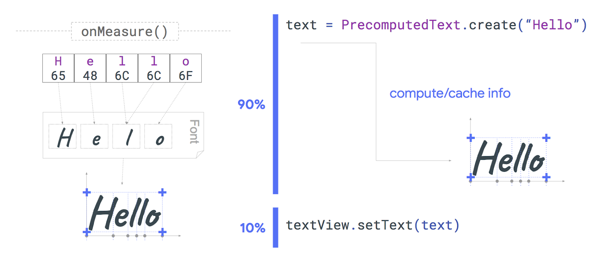
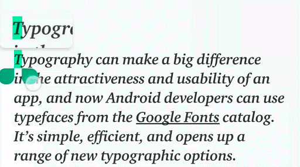
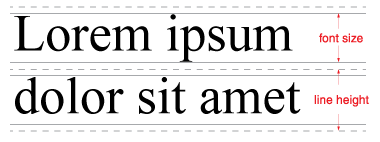
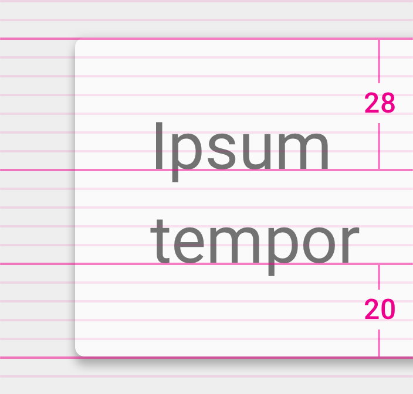

# Android P中文本的新功能

原标题：What's new for text in Android P  
链接：[https://android-developers.googleblog.com/2018/07/whats-new-for-text-in-android-p.html](https://android-developers.googleblog.com/2018/07/whats-new-for-text-in-android-p.html)  
作者：[Florina Muntenescu](https://twitter.com/FMuntenescu) (开发者倡导者)和[Siyamed Sinir](https://twitter.com/siyamed) (Android文本技术主管)  
翻译：[arjinmc](https://github.com/arjinmc)  

在“[Android P Beta中的新功能](https://android-developers.googleblog.com/2018/05/whats-new-in-android-p-beta.html)”中，我们提到了Android中的两个新文本功能。现在[Android P Beta 2和最终的API](https://android-developers.googleblog.com/2018/06/android-p-beta-2-and-final-apis.html)都在这里，现在是时候深入了解文本的新内容。我们知道[TextView](https://developer.android.com/reference/android/widget/TextView)是Android视图系统中最重要的组件之一。这就是我们继续投资于面向开发者和面向用户的功能以及API改进的原因。

## PrecomputedText

显示文本可能很复杂，包含多种字体，行间距，字母间距，文本方向，换行符，连字符等功能。TextView必须做很多工作来测量和布置给定的文本：读取字体文件，查找字形，确定形状，测量边界框以及在内部字缓存中缓存单词。更重要的是，所有这些工作都发生在UI线程上，它可能会导致您的应用程序丢帧。

我们发现测量文本可能占用设置文本所需时间的90％。为了解决这个问题，在Android P和作为[Jetpack](http://d.android.com/jetpack)的一部分，我们引入了一个新的API：[PrecomputedText](https://developer.android.com/reference/android/text/PrecomputedText)。在API 14中使用[PrecomputedTextCompat](https://developer.android.com/reference/androidx/core/text/PrecomputedTextCompat)

PrecomputedText使应用程序能够预先执行文本布局中最耗时的部分，即使在后台线程上，也可以缓存布局结果并返回有价值的测量数据。然后可以设置PrecomputedText.create（CharSequence，params）的创建TextView。有了这个，TextView只完成了大约10％的工作。

  
<small>测量和布局文本所用时间的百分比</small>

```code
// UI thread
val params: PrecomputedText.Params = textView.getTextMetricsParams()
val ref = WeakReference(textView)
executor.execute {
    // background thread
    val text = PrecomputedText.create("Hello", params)
    val textView = ref.get()
    textView?.post {
        // UI thread
        val textViewRef = ref.get()
        textViewRef?.text = text
    }
}
```

## 放大镜

即使使用智能文本选择等功能，精确选择文本也具有挑战性。Android P引入了文本放大镜，以改善用户选择文本的体验。放大镜通过可以在文本上拖动的窗格查看放大文本，帮助用户精确定位光标或文本选择手柄。

  
<small>Android P中的放大文字</small>

我们希望用户在所有应用程序中拥有相同的体验，无论是在自定义小部件中还是在自定义文本呈现期间，因此我们提供了一个[Magnifier](https://developer.android.com/reference/android/widget/Magnifier)小部件，可以应用于附加到窗口的任何视图。放大镜小部件可以提供任何视图或曲面的放大版本，而不仅仅是文本。

放大镜有3种主要方法：显示，更新和消除。例如，您可以在为自定义视图实现onTouchEvent处理时调用这些方法。这将导致放大镜沿着屏幕跟随用户的手指。

```code
fun onTouchEvent(event: MotionEvent): Boolean {
    when (event.actionMasked) {
        MotionEvent.ACTION_DOWN -> 
              magnifier.show(event.x, event.y)
        MotionEvent.ACTION_MOVE -> 
             magnifier.show(event.x, event.y)
        MotionEvent.ACTION_UP -> 
             magnifier.dismiss()
    }
}
```

## Smart Linkify

[Linkify](https://developer.android.com/reference/android/text/util/Linkify)类自API 1存在以来允许使用正则表达式添加文本链接。最重要的是，查找物理地址会旋转WebView实例以生成结果，这会降低请求链接的应用程序的性能。为了使链接解析更准确，特别是对于国际化文本，并减轻WebView导致的性能下降，我们创建了Smart Linkify。可以使用[TextClassifier](https://developer.android.com/reference/android/view/textclassifier/TextClassifier)API 访问Smart Linkify 。

Smart Linkify使用机器学习算法和模型来识别文本中的实体。这提高了所识别实体的可靠性。Smart Linkify可以根据实体类型建议用户可以执行的操作。例如，如果Smart Linkify识别出电话号码，则API会建议诸如发送短信，拨打电话或添加联系人等操作。

  
<small>Android P中的Smart Linkify</small>

要提高应用程序的性能，请将生成和应用链接的工作移至后台线程。

```code
// UI thread
val text: Spannable = ...
val request = TextLinks.Request.Builder(text)
val ref = WeakReference(textView)
executor.execute {
    // background thread
    TextClassifier.generateLinks(request).apply(text)
    val textView = ref.get()
    textView?.post {
        // UI thread
        val textViewRef = ref.get()
        textViewRef?.text = text
    }
}
```

## 行高和基线文本对齐

设计人员有时会为完全与现有TextView属性不匹配的开发者提供布局规范。在Android P和Jetpack中，我们添加了三个属性及其相应的功能，以帮助弥合设计人员和开发者工作方式之间的差距。

### 设置行高

在Android P之前，可以使用<i>lineSpacingExtra
</i>和<i>lineSpacingMultiplier</i>属性控制行之间的间距。但是，设计人员通常会将这些值作为简单的线高提供。出于这个原因，在Android P上，我们添加了[lineHeight](https://developer.android.com/reference/android/widget/TextView.html#attr_android:lineHeight)属性来设置文本的行高：即行的顶部和底部之间的距离（或后续基线之间的距离）。在引擎下，此属性实际上使用和修改现有<i>lineSpacingExtra</i>和<i>lineSpacingMultiplier</i>属性。

  
<small>行高和字体大小的大小</small>

```code
<TextView
    android:layout_height="wrap_content"
    android:layout_width="match_parent"
    android:text="Lorem ipsum dolor sit amet"
    app:lineHeight="50sp"/>

// or in code
TextView.setLineHeight(@Px int)
```    

### 设置基线文本对齐方式

为了控制第一个和最后一个基线与视图边界的距离，我们添加了两个新属性：[firstBaselineToTopHeight](https://developer.android.com/reference/android/widget/TextView.html#attr_android:firstBaselineToTopHeight)和[lastBaselineToBottomHeight](https://developer.android.com/reference/android/widget/TextView.html#attr_android:lastBaselineToBottomHeight)。

<i>firstBaselineToTopHeight</i>：设置TextView的上边界与TextView第一行的基线之间的距离。在引擎下，此属性更新顶部填充。

<i>lastBaselineToBottomHeight</i>：设置TextView的底部边界与TextView的最后一行的基线之间的距离。在引擎下，此属性实际上更新了底部填充。

  
第一个基线到顶部和最后一个基线到底部之间的距离

```code
<TextView
    android:layout_height="wrap_content"
    android:layout_width="match_parent"
    android:text="Lorem ipsum dolor sit amet"
    app:firstBaselineToTopHeight="28sp"
    app:lastBaselineToBottomHeight="20sp"/>

// or in code
TextView.setFirstBaselineToTopHeight(@Px int)
TextView.setLastBaselineToBottomHeight(@Px int)
```

文本在绝大多数应用程序中扮演着重要角色 - 它是应用程序设计语言的重要组成部分。文本由用户使用，甚至呈现emoji表情符号😎。我们将继续研发文本，改善应用用户和开发者的体验。

要了解有关使用文本API的更多信息以及Android P中有关文本的新内容，请查看Google I / O 2018关于“带文字的最佳实践”的演讲：

[视频介绍](https://youtu.be/x-FcOX6ErdI)