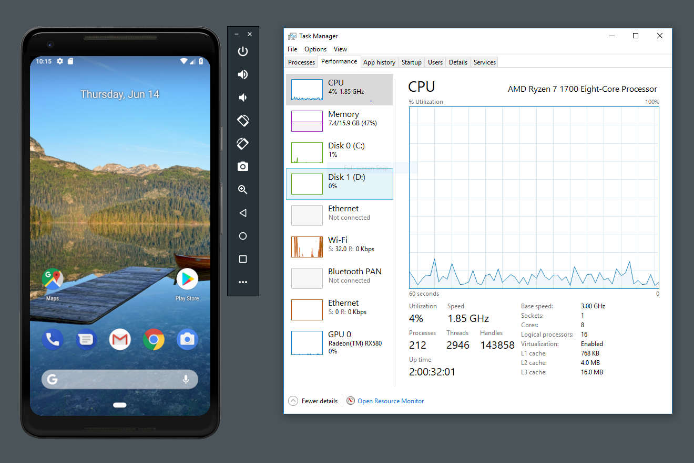
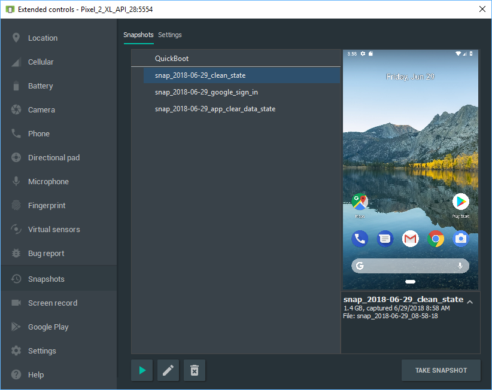
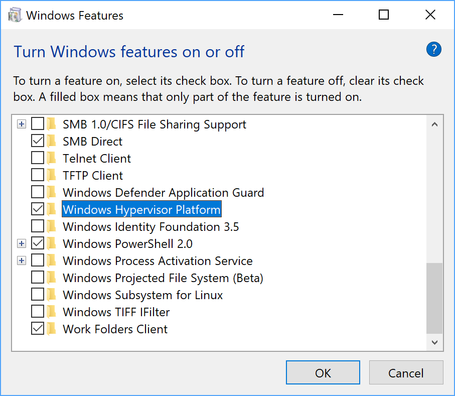

# Android模拟器 - AMD处理器和Hyper-V支持

原标题：Android Emulator - AMD Processor & Hyper-V Support  
链接：[https://android-developers.googleblog.com/2018/07/android-emulator-amd-processor-hyper-v.html](https://android-developers.googleblog.com/2018/07/android-emulator-amd-processor-hyper-v.html)  
作者：[Jamal Eason](https://www.google.com/+JamalEason) (Android产品经理)  
翻译：[arjinmc](https://github.com/arjinmc)  

两年前自Android模拟器的重大改进以来，我们一直专注于提供快速且功能丰富的模拟器，以帮助您为用户构建出色的应用体验。今天，Android模拟器是Android Studio部署的顶级设备 - 超过物理Android设备的2倍。我们很谦虚地听到很多人反馈Android模拟器已经取得了很大进展，但我们还没有止步。

让Android模拟器更快是Android Studio团队的首要任务之一。在过去的几个版本中，我们已经启动了[快速启动](https://android-developers.googleblog.com/2017/12/quick-boot-top-features-in-android.html)和[模拟器快照](https://developer.android.com/studio/run/emulator#snapshots)，可以在2秒内快速启动和恢复模拟器会话。到现在为止，我们的模拟器经验几乎普遍工作在MacOS ® 和Linux计算机。但对于微软的用户®的Windows ®或Microsoft ® Hyper-V的™平台，我们的硬件的Android模拟器加快速度增强只与英特尔合作的电脑®处理器。支持AMD® 处理器和Microsoft Hyper-V管理程序是来自Android开发者社区的两个长期用户请求，我们很高兴通过此Android模拟器更新来解决这些问题。

今天，您可以[下载最新](https://developer.android.com/studio/run/emulator#install)的Android模拟器版本，该版本支持在使用AMD处理器的计算机上运行基于x86的Android虚拟设备（AVD）。这一令人兴奋的更新使Android模拟器更容易被新的Android应用程序开发者访问，这些开发者之前仅限于软件模拟，但现在可以获得硬件加速性能。此外，对于那些你谁使用Hyper-V来运行本地应用程序后端，Android模拟器现在也可以与其他的Hyper-V支持的应用程序共存在Windows ® 10。

由于新的Microsoft [Windows Hypervisor平台（WHPX）](https://docs.microsoft.com/en-us/virtualization/api/) API和Microsoft最近的开源贡献，更多的Android应用程序开发者可以利用Android模拟器中的所有速度改进和功能。

  
<small>Android模拟器在Windows 10上运行的AMD处理器 截图配置方面：华硕ROG Strix公司GL 702ZC，处理器：AMD ® Ryzen ™ 7 1700处理器，芯片组：AMD 5350显卡：AMD ®的Radeon ™ RX580</small>

最初在v27.3.8 Android模拟器canary版本中提供对这些技术的支持，今天我们在稳定版本的频道上发布了这组预览功能（AMD处理器和Hyper-V支持），以获得更多反馈。除了此更新外，我们还为使用英特尔®硬件加速执行管理器（HAXM）的开发者加载模拟器快照添加了额外的速度改进。

## <u>如何使用</u>
### Linux

如果您使用Linux进行Android应用程序开发，Android模拟器将继续为基于 Intel和AMD的计算机使用基于[内核的虚拟机（KVM）虚拟机](https://www.linux-kvm.org/page/Main_Page)管理程序，以实现快速，高性能的虚拟化解决方案。对v27.3.8 Android 模拟器的更新将为您提供新的快照UI以及对性能，可靠性和资源使用的改进。

### macOS

对于OS X v10.10 Yosemite及更高版本，Android模拟器默认使用内置的Hypervisor.Framework，如果[Hypervisor.Framework](https://developer.apple.com/documentation/hypervisor)无法初始化（例如运行时），则回退到使用Intel硬件加速执行管理器（HAXM）在OS X v10.9或更早版本上）。一旦您在macOS上更新到最新的Android模拟器，您还可以访问新的快照UI以及引擎盖性能和可靠性改进。

  
<small>Android模拟器 - 快照扩展控件</small>

## 微软Windows
在基于Intel x86的计算机上，默认情况下Android模拟器将继续使用Intel HAXM。英特尔HAXM是英特尔开发的成熟的[开源](https://github.com/intel/haxm)虚拟机管理程序解决方案。由于英特尔的持续开发，Windows上最快的模拟器性能仍然采用英特尔HAXM。要下载最新的Intel HAXM v7.2.0，请检查Android SDK Manager中的更新。

如果您的计算机中有AMD处理器，则需要满足以下设置要求：

* AMD处理器-推荐：AMD ® Ryzen ™处理器
* Android Studio 3.2 Beta或更高版本 - 通过[Android Studio预览页面](https://developer.android.com/studio/preview/)下载
* Android Emulator v27.3.8 + - 通过[Android Studio SDK Manager](https://developer.android.com/studio/preview/)下载
* x86 Android虚拟设备（AVD） - 创建AVD
* Windows 10与2018年4月更新
* 通过Windows功能启用：“Windows Hypervisor平台”

  
<small>Windows 10中的Windows Hypervisor平台设置</small>

如果您想在基于Intel处理器的计算机上同时使用Hyper-V作为Android模拟器，您还需要与上面列出的相同的Android Studio和Android模拟器版本，但还有其他要求：

* 通过Windows功能启用：“Hyper-V” - 仅适用于Windows 10 专业版 / 教育版 / 企业版
* 英特尔处理器： 支持虚拟化技术（VT-x），扩展页表（EPT）和无限制访客（UG）功能的英特尔®酷睿™处理器。另外，需要在BIOS中启用VT-x。

有关更多设置提示和故障排除详细信息，请查看[文档页面](https://developer.android.com/studio/run/emulator-acceleration)。

同样，对于拥有基于Intel处理器的现有Windows用户，Android模拟器将继续使用更快和推荐的Intel HAXM配置。对于使用AMD处理器的用户以及使用Hyper-V虚拟机管理程序的用户，这应该是开始使用Android模拟器的一个令人兴奋的一步。

## <u>后续步骤和反馈</u>

从Android Studio 3.2 Beta SDK Manager下载最新的Android模拟器，以获取您正在使用的所有受支持平台的最新性能更新。我们将继续投资于每个平台的性能改进，我们期待您的反馈和功能需求。

如果您发现bug或问题，请随时[提出问题](https://source.android.com/source/report-bugs#developer-tools)。在我们的[Google+](https://plus.google.com/103342515830390186255)或[Twitter](http://www.twitter.com/androidstudio)上与我们联系 - Android Studio开发团队。