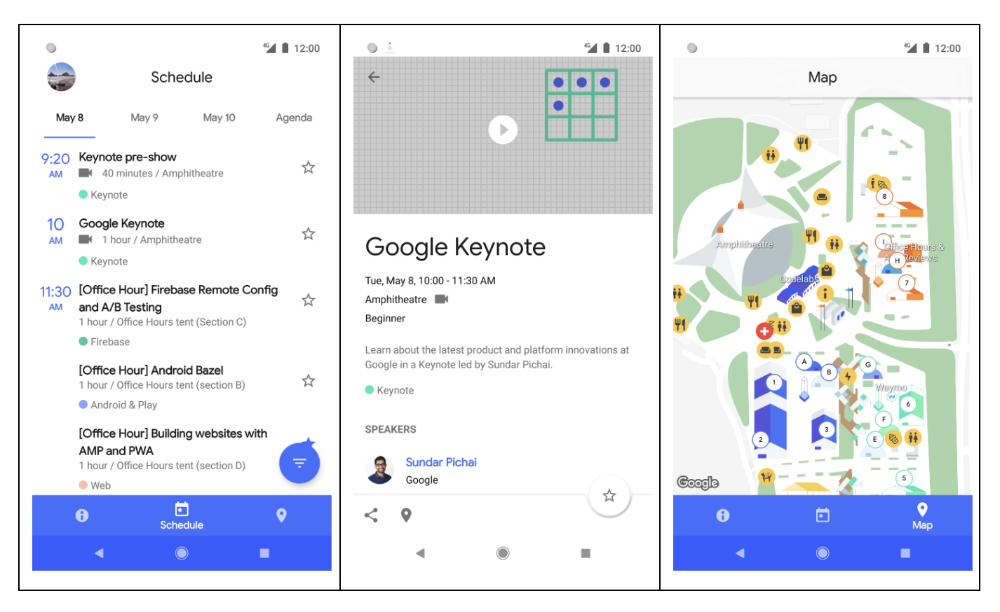
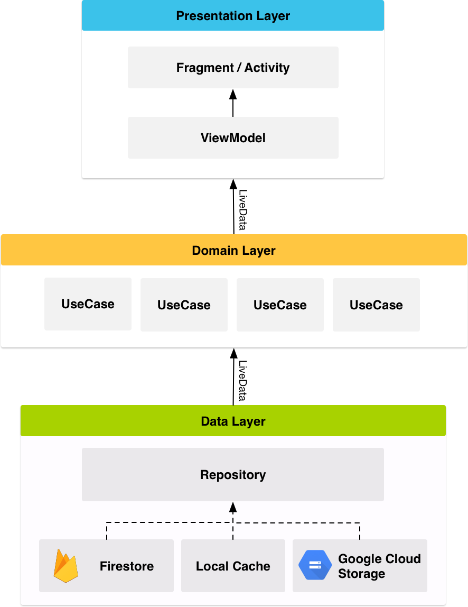

# 谷歌发布Google I/O 2018的Android源码

原标题：Google releases source for Google I/O 2018 for Android  
链接：[https://android-developers.googleblog.com/2018/08/google-releases-source-for-google-io.html](https://android-developers.googleblog.com/2018/08/google-releases-source-for-google-io.html)  
作者：Shailen Tuli, DPE
翻译：[arjinmc](https://github.com/arjinmc)  

今天我们发布适用于Android应用的官方
[Google I / O 2018](https://play.google.com/store/apps/details?id=com.google.samples.apps.iosched&hl=en)的[源代码](https://github.com/google/iosched)。

2018版本构成了对应用程序的全面重写。多年来，该应用程序使用了ContentProvider + SyncAdapter架构。今年，我们使用[Architecture框架](https://developer.android.com/topic/libraries/architecture/)重写了应用程序，并将代码与Android团队目前建立现代应用程序的建议同步。

  

## Architecture

我们遵循[应用程序架构指南](https://developer.android.com/jetpack/docs/guide)中提出的建议，在决定应用程序的体系结构时编写模块化，可测试和可维护的代码。我们将逻辑与Activity和Fragment保持一致，并将其移至[ViewModels](https://developer.android.com/topic/libraries/architecture/viewmodel)。我们使用[LiveData](https://developer.android.com/topic/libraries/architecture/livedata)观察数据，并使用[Data Binding](https://developer.android.com/topic/libraries/data-binding/)库将布局中的UI组件绑定到应用程序的数据源。

应用程序的整体架构可以在此图中汇总：

  

我们使用Repository层来处理数据操作。IOSched的数据来自几个不同的来源 - 用户数据存储在[Cloud Firestore](https://firebase.google.com/docs/firestore/)中（远程或本地缓存中供离线使用），用户首选项和设置存储在SharedPreferences中，约定数据会被远程存储并被提取并存储在内存中供应用程序使用 - 存储库模块负责处理所有数据操作并从应用程序的其余部分抽象数据源。如果我们以后想要将Firestore后端替换为不同的数据源，我们的架构允许我们以这种简洁的方式来做。

我们实现了一个轻量级域层，它位于数据层和表示层之间，并处理UI线程之外的离散业务逻辑。[例子](https://github.com/google/iosched/search?q=UseCase&unscoped_q=UseCase)。

我们使用[Dagger2](https://github.com/google/dagger)进行依赖注入，我们非常依赖[dagger-android](https://google.github.io/dagger/android.html)来抽象样板代码。

我们使用[Espresso](https://developer.android.com/training/testing/espresso/)进行基本的仪器测试，使用JUnit和[Mockito](https://github.com/mockito/mockito)进行单元测试。

## Firebase

随着Firebase平台的成熟，Firebase技术的使用在应用程序中得到了增长。2018版使用以下Firebase组件：

* [Cloud Firestore](https://firebase.google.com/docs/firestore/)是我们所有用户数据的来源（由用户加星标或保留的事件）。Firestore为我们提供了自动同步和无缝管理的离线功能。
* [Firebase Cloud Functions](https://firebase.google.com/docs/functions/)允许我们运行后端代码。预订功能在很大程度上取决于功能检查用户的状态（仅允许与会者进行预订），检查空间可用性以及在Firestore中保留预留状态。
* [Firebase云消息推送](https://firebase.google.com/docs/cloud-messaging/concept-options)让我们通知应用程序有关我们服务器上会议数据的更改。约定数据大多是静态的，但它确实会不时发生变化，特别是在keynote发布会之后。该应用传统上在处理会议数据时使用了ping-and-fetch模型，我们今年保留了这种用法。
* [远程配置](https://firebase.google.com/docs/remote-config/)帮助我们管理应用内常量。在过去的几年中，我们发现自己无法通知用户何时与约定时间表没有直接关系的数据 - WiFi信息，会议班车时间表等 - 意外地发生了变化。远程配置帮助我们以轻量级方式更新这些值。

## Kotlin

我们早期决定从头开始重写应用程序，使其与现代Android架构保持一致。使用Kotlin进行重写是一个简单的选择：我们喜欢Kotlin的表达，简洁和强大的语法; 我们发现Kotlin对安全功能的支持，包括可空性和不变性，使我们的代码更具弹性; 我们利用[Android Ktx](https://developer.android.com/kotlin/ktx)扩展提供的增强功能。

## Material Design

在I / O 2018年，材料设计团队宣布了[Material Theming](https://material.io/design/material-theming/overview.html#material-theming)，为应用程序提供了更强大的定制Material Design的能力，以带来更多的产品品牌。当我们在Material Theming之前推出应用程序时，我们无法使用所有新组件，但我们设法像新的[Bottom App Bar](https://material.io/design/components/app-bars-bottom.html)一样使用嵌入式浮动操作按钮，我们能够融入大量约定的品牌元素。

## 未来的计划

该应用程序的重构使代码与Android关于构建应用程序的建议性建议保持同步，从而产生了更清晰，更易维护的代码库。我们将继续开发应用程序，在JetPack组件可用时加入它们，并找到展示适合应用程序的平台功能的机会。开发者可以跟踪[GitHub](https://github.com/google/iosched)上代码的变化。
