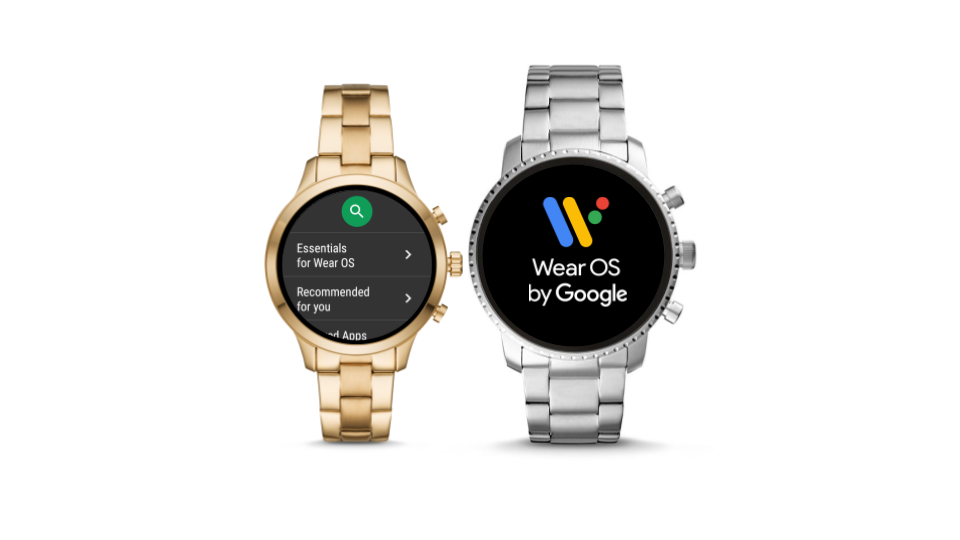

# 更新Wear OS Google Play商店政策以提高应用质量

原标题：Updating Wear OS Google Play Store policy to increase app quality  
链接：[https://android-developers.googleblog.com/2018/08/updating-wear-os-google-play-store.html](https://android-developers.googleblog.com/2018/08/updating-wear-os-google-play-store.html)  
作者：[Hoi Lam](https://twitter.com/hoitab) (Google Wear OS 首席开发者倡导者)  
翻译：  

  

今天，我们宣布了一项新举措，旨在改善Wear应用程序的质量以及在Google Play商店中的展示。自Android Wear 2.0发布以来一直存在的Wear应用审核流程目前是可选的。从以下日期开始，Google Play商店必须在Wear OS上列出应用程序：

* 新装应用：<strong>2018年10月1日</strong>
* 现有Wear应用程序：<strong>2019年3月4日</strong>。

移动应用的审核流程保持不变，与Wear应用审核无关。如果他们未通过Wear应用审核，则不会阻止移动应用更新。

我们希望这个轻量级的应用审核流程能够为用户提供的各种设备提高Wear应用体验的质量。此外，由于Wear应用审核需要屏幕截图，因此这将改善您在Google Play商店中的Wear应用的发现和展示。

请在[这里](https://developer.android.com/docs/quality-guidelines/wear-app-quality)查看完整的审核标准列表。以下是我们在Wear应用评论中看到的常见问题：

* <strong>支持不同的屏幕类型</strong> - 谷歌的Wear OS有圆形和方形屏幕，有些圆形设备也有下巴。建议开发者测试所有屏幕类型。如果物理设备不可用，请使用Google模拟器的Wear OS。
* <strong>Wear OS 谷歌应用程序截图</strong> - 要通过审查，该应用程序需要至少有一个Wear OS应用程序截图。要将预发布的磨损应用保密，Google Play商店不会显示Wear屏幕截图，除非Wear应用正在制作或开放测试中。目前，Google Play商店仅支持在所有制作和测试版本中上传一组屏幕截图。对于现有的Wear应用程序，我们建议开发者在上传新的开放测试或封闭测试磨损应用程序时保持其生产Wear应用程序截图不变。

## 选择发布早期应用预览版

我们了解一些开发者需要在应用程序开发的早期阶段尝试使用Wear应用程序，并且在此阶段进行Wear应用程序审核可能不合适。在这种情况下，开发者有两种选择：

* 将Wear APK手动部署到其用户，或
* 通过[Google Play控制台利用内部测试功能](https://support.google.com/googleplay/android-developer/answer/3131213?hl=en-GB)，开发者可以使用多达100个内部测试帐户进行测试。

请注意，开放测试和封闭测试通道将受到磨损应用程序审核，以帮助预先加载质量保证流程并避免将预览版留在最后一分钟。

感谢您继续支持Google的Wear OS。