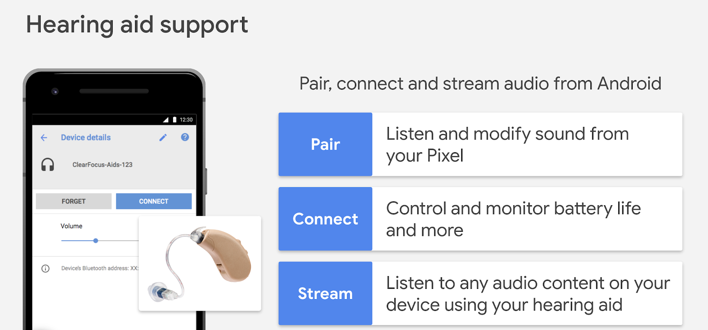

# Android助听器的流媒体支持规范

原标题：Streaming support spec for hearing aids on Android  
链接：[https://android-developers.googleblog.com/2018/08/streaming-support-spec-for-hearing-aids_16.html](https://android-developers.googleblog.com/2018/08/streaming-support-spec-for-hearing-aids_16.html)  
作者：Seang Chau (工程副总裁)  
翻译：[arjinmc](https://github.com/arjinmc)  

  

根据世界卫生组织[标注1](http://www.who.int/news-room/fact-sheets/detail/deafness-and-hearing-loss)，全球约有4.66亿人患有听力损失。到2050年，这一数字预计将增加到9亿人。谷歌正在与GN Hearing合作，为未来版本的Android创建一个新的开放式助听器流支持规范。听力损失的用户将能够连接，配对和监控他们的助听器，以便他们可以大声清晰地听到他们的电话。

助听器用户期望获得高质量，低延迟的体验，同时对电话和助听器电池寿命的影响最小。我们已经发布了新的针对Android智能手机的助听器规范[用于蓝牙低功耗连接导向通道的助听器音频流（ASHA）](https://source.android.com/devices/bluetooth/asha)。ASHA旨在以低延迟对电池寿命产生最小影响，同时为依赖助听器的用户保持高品质音频体验。我们期待不断发展规范，以更好地满足用户的需求。

该规范详细介绍了使用低能耗面向连接的通道实现助听器的配对和连接，网络拓扑，系统架构和系统要求。任何助听器制造商现在都可以为Android构建本机助听器支持。

协议规范可在[此处](https://source.android.com/devices/bluetooth/asha)获得。