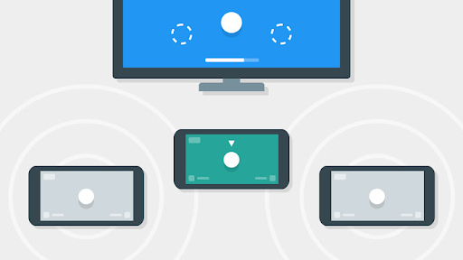
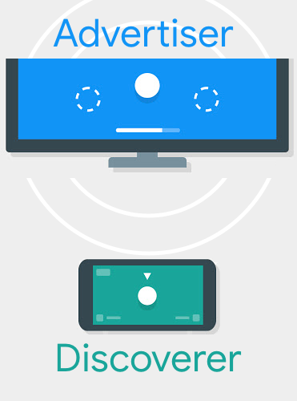
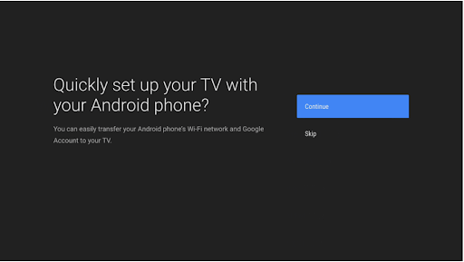
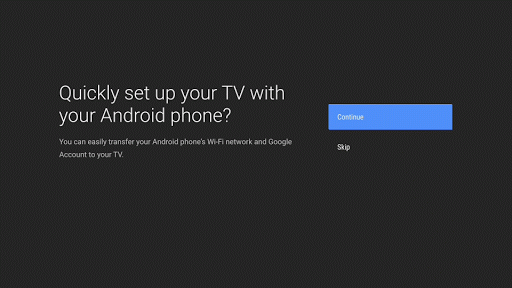
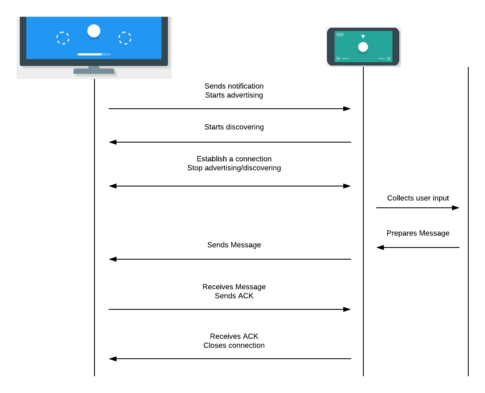
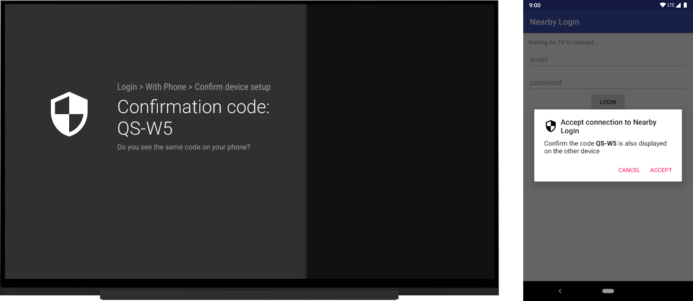

# Android TV的替代输入的方式

原标题：Alternative input methods for Android TV  
链接：[https://android-developers.googleblog.com/2018/08/alternative-input-methods-for-android-tv.html](https://android-developers.googleblog.com/2018/08/alternative-input-methods-for-android-tv.html)  
作者：Benjamin Baxter (开发者倡导者和Bacon鉴赏家)  
翻译：[arjinmc](https://github.com/arjinmc)  

  

所有电视在键盘输入方面也存在同样的问题：使用带遥控器的D-pad对每个字母进行捕获和消化非常麻烦。如果你犯了一个错误，试图纠正它会加剧困难。

[Smart Lock](https://developers.google.com/identity/smartlock-passwords/android/)和[Autofill](https://developer.android.com/guide/topics/text/autofill)等API可以减轻用户的挫败感，但对于某些类型的输入，例如登录，您需要收集使用屏幕键盘的用户难以处理的复杂输入。

使用[Nearby Connections API](https://developers.google.com/nearby/connections/overview)，您可以使用第二个屏幕以较少的麻烦收集用户的输入。

## 近场连接的工作原理
从[文档](https://developers.google.com/nearby/connections/overview)：

“Nearby Connections是一种离线点对点套接字模型，用于基于广告和发现附近设备的通信。

API的使用分为两个阶段：预连接和post连接。

在预连接阶段，广告者宣传自己，而发现者发现附近的广告者并发送连接请求。从发现者到广告者的连接请求启动对称认证流，导致双方独立地接受（或拒绝）连接请求。

在双方接受连接请求之后，建立连接并且设备进入连接post阶段，在此期间双方可以交换数据。

在大多数情况下，电视是广告者，电话是发现者。在下面的示例中，假设的第二个设备是电话。本文中介绍的API和模式不仅限于手机。例如，平板电脑也可以是第二屏幕设备。

  

## 登录示例

有很多次需要键盘输入。验证用户和收集账单信息（如邮政编码和卡上的名称）是常见的情况。此示例处理使用第二个屏幕查看Nearby Connections如何帮助减少麻烦的登录流程。

1.用户在电视上打开您的应用程序，需要登录。您可以显示类似于新电视设置流程的选项屏幕。

  
2.在用户选择使用他们的电话登录后，[电视应该开始广告](https://developers.google.com/nearby/connections/android/discover-devices)并将用户发送到他们的电话上的相关登录应用程序-[应该开始发现](https://developers.google.com/nearby/connections/android/discover-devices)的应用程序。

有多种解决方案可以在手机上打开应用程序。例如，Android TV的设置流程让用户在其移动设备上打开相应的应用程序。开始交接更像是一个用户体验，而不是技术问题。

  

3.手机应用程序应显示广告电视并提示用户[启动连接](https://developers.google.com/nearby/connections/android/manage-connections#initiate_a_connection)。之后（加密 - 请参阅下面的安全注意事项以获取更多相关信息）建立连接，电视可以停止广告，电话可以停止发现。

“使用近场连接几个小时的广告/发现可能会影响设备的电池。虽然这通常不是插入式电视的问题，但它可以用于移动设备，所以要注意一旦它们停止广告和发现不再被需要。”

4.接下来，手机可以开始收集用户的输入。一旦用户输入他们的登录信息，手机应通过安全连接以[BYTES有效载荷](https://developers.google.com/nearby/connections/android/exchange-data#bytes)将其发送到电视。

5.当电视收到消息时，它应该将ACK（使用BYTES有效载荷）发送回电话以确认传送。

6.当手机收到ACK时，它可以安全地[关闭连接](https://developers.google.com/nearby/connections/overview#disconnecting)。

下图总结了事件的顺序：

  

## UX注意事项

近场连接需要位置权限才能发现附近的设备。与您的用户保持透明。告诉他们为什么他们需要在手机上授予位置许可。

由于电视是广告，它不需要位置许可。

## 开始广告：电视的代码

用户选择登录手机后，电视应该开始广告。这是使用Nearby API的一个非常简单的过程。

```code
override fun onGuidedActionClicked(action: GuidedAction?) {
    super.onGuidedActionClicked(action)
    if( action == loginAction ) {
        // Update the UI so the user knows to check their phone
        navigationFlowCallback.navigateToConnectionDialog()
        doStartAdvertising(requireContext()) { payload ->
            handlePayload(payload)
        }
    }
}
```  

当用户单击按钮时，更新UI以告知他们查看他们的手机以继续。请务必提供取消远程登录的方法，并使用笨重的屏幕键盘手动尝试。

此示例使用[GuidedStepFragment](https://developer.android.com/training/tv/playback/guided-step)，但相同的UX模式适用于您选择的任何设计。

广告很简单。您需要提供名称，服务ID（通常是包名称）和`ConnectionLifeCycleCallback(连接生命周期回调)`。

您还需要选择电视和手机都使用的[策略](https://developers.google.com/nearby/connections/strategies)。由于用户可能有多台电视（客厅，卧室等），因此最好使用的策略是P2P_CLUSTER。

然后开始广告。onSuccessListener和onFailureListener告诉您设备是否能够开始广告，但它们并不表示设备已被发现。

```code
fun doStartAdvertising(context: Context) {
    Nearby.getConnectionsClient(context).startAdvertising(
        context.getString(R.string.tv_name),
        context.packageName,
        connectionLifecycleCallback,
        AdvertisingOptions.Builder().setStrategy(Strategy.P2P_CLUSTER).build()
    )
    .addOnSuccessListener {
        Log.d(LoginStepFragment.TAG, "We are advertising!")
    }
    .addOnFailureListener {
        Log.d(LoginStepFragment.TAG, "We cannot start advertising.")
        Toast.makeText(
            context, "We cannot start advertising.", Toast.LENGTH_LONG)
                .show()
    }
}
```                

真正的魔力发生在设备开始启动连接时触发的`connectionLifecycleCallback`中。电视应该接受来自电话的握手（在执行必要的身份验证之后 - 请参阅下面的安全注意事项以获取更多信息）并提供有效负载监听器。

```code
val connectionLifecycleCallback = object : ConnectionLifecycleCallback() {

    override fun onConnectionInitiated(
            endpointId: String, 
            connectionInfo: ConnectionInfo
    ) {
        Log.d(TAG, "Connection initialized to endpoint: $endpointId")
        // Make sure to authenticate using `connectionInfo.authenticationToken` 
        // before accepting
        Nearby.getConnectionsClient(context)
            .acceptConnection(endpointId, payloadCallback)
    }

    override fun onConnectionResult(
        endpointId: String, 
        connectionResolution: ConnectionResolution
    ) {
        Log.d(TAG, "Received result from connection: ${connectionResolution.status.statusCode}")
        doStopAdvertising()
        when (connectionResolution.status.statusCode) {
            ConnectionsStatusCodes.STATUS_OK -> {
                Log.d(TAG, "Connected to endpoint: $endpointId")
                otherDeviceEndpointId = endpointId
            }
            else -> {
                otherDeviceEndpointId = null
            }
        }
    }

    override fun onDisconnected(endpointId: String) {
        Log.d(TAG, "Disconnected from endpoint: $endpointId")
        otherDeviceEndpointId = null
    }
}
```

payloadCallback监听电话发送所需的登录信息。收到登录信息后，不再需要连接。我们稍后将在“结束对话”部分中详细介绍。

## 发现大屏幕：电话的代码

近场连接不需要用户的同意。但是，必须授予位置权限才能使用“附近连接”进行发现以发挥其作用。（它在封面下使用BLE扫描。）
在手机上打开应用程序后，如果尚未在运行Marshmallow及更高版本的设备上授予用户位置权限，则首先提示用户。

授予权限后，开始发现，确认连接，收集凭据，并向电视应用发送消息。

发现就像广告一样简单。您需要一个服务ID（通常是包名称 - 它应该在发现者和广告者上相同，以便彼此看到），名称和`EndpointDiscoveryCallback（端点发现回调)`。与电视代码类似，流程由基于连接状态的回调触发。

```code
Nearby.getConnectionsClient(context).startDiscovery(
        context.packageName,
        mobileEndpointDiscoveryCallback,
        DiscoveryOptions.Builder().setStrategy(Strategy.P2P_CLUSTER).build()
        )
        .addOnSuccessListener {
            // We're discovering!
            Log.d(TAG, "We are discovering!")
        }
         .addOnFailureListener {
            // We were unable to start discovering.
            Log.d(TAG, "We cannot start discovering!")
        }
```

发现者的监听器类似于广告者的成功和失败监听器; 如果启动发现的请求成功，它们会发出信号。

一旦发现广告者，就会触发“EndpointDiscoveryCallback”。您需要跟踪另一个端点，以便知道将有效负载发送给谁，例如：用户的凭据。

```code
val mobileEndpointDiscoveryCallback = object : EndpointDiscoveryCallback() {
    override fun onEndpointFound(
        endpointId: String, 
        discoveredEndpointInfo: DiscoveredEndpointInfo
    ) {
        // An endpoint was found!
        Log.d(TAG, "An endpoint was found, ${discoveredEndpointInfo.endpointName}")
        Nearby.getConnectionsClient(context)
            .requestConnection(
                context.getString(R.string.phone_name), 
                endpointId, 
                connectionLifecycleCallback)
    }

    override fun onEndpointLost(endpointId: String) {
        // A previously discovered endpoint has gone away.
        Log.d(TAG, "An endpoint was lost, $endpointId")
    }
}
```

其中一个设备必须启动连接。由于发现者具有端点发现的回调功能，因此手机可以请求连接到电视。

手机要求提供连接“connectionLifecycleCallback”的连接，该连接与电视代码中的回调对称。

```code
val connectionLifecycleCallback = object : ConnectionLifecycleCallback() {
    override fun onConnectionInitiated(
        endpointId: String,
        connectionInfo: ConnectionInfo
    ) {
        Log.d(TAG, "Connection initialized to endpoint: $endpointId")
        // Make sure to authenticate using `connectionInfo.authenticationToken` before accepting
        Nearby.getConnectionsClient(context)
                .acceptConnection(endpointId, payloadCallback)
    }

    override fun onConnectionResult(
        endpointId: String,
        connectionResolution: ConnectionResolution
    ) {
        Log.d(TAG, "Connection result from endpoint: $endpointId")
        when (connectionResolution.status.statusCode) {
            ConnectionsStatusCodes.STATUS_OK -> {
                Log.d(TAG, "Connected to endpoint: $endpointId")
                otherDeviceEndpointId = endpointId
                waitingIndicator.visibility = View.GONE
                emailInput.editText?.isEnabled = true
                passwordInput.editText?.isEnabled = true

                Nearby.getConnectionsClient(this).stopDiscovery()
            }
            else -> {
                otherDeviceEndpointId = null
            }
        }
    }

    override fun onDisconnected(endpointId: String) {
        Log.d(TAG, "Disconnected from endpoint: $endpointId")
        otherDeviceEndpointId = null
    }
}
```

建立连接后，停止发现以避免此电池密集型操作的运行时间超过所需时间。该示例在建立连接后停止发现，但用户可以在此之前离开activity。请务必在电视和手机上停止onStop()中的发现/广告。

```code
override fun onStop() {
    super.onStop()
    Nearby.getConnectionsClient(this).stopDiscovery()
}
```

就像电视应用程序一样，当您接受连接时，您将提供有效负载回调。回调侦听来自TV应用程序的消息（例如上述ACK）以清除连接。

连接设备后，用户可以使用键盘并通过调用“sendPayload()”将其身份验证信息发送到电视。

```code
fun sendCreditials() {

    val email = emailInput.editText?.text.toString()
    val password = passwordInput.editText?.text.toString()

    val creds = "$email:$password"
    val payload = Payload.fromBytes(creds.toByteArray())
    Log.d(TAG, "sending payload: $creds")
    if (otherDeviceEndpointId != null) {
        Nearby.getConnectionsClient(this)
                .sendPayload(otherDeviceEndpointId, payload)
    }
}
```

## 结束连接

手机将有效负载发送到电视后（登录成功），设备没有理由保持连接状态。电视可以通过简单的关机协议启动断开连接。

电视收到凭证有效载荷后，应向手机发送ACK。

```code
val payloadCallback = object : PayloadCallback() {
    override fun onPayloadReceived(endpointId: String, payload: Payload) {
        if (payload.type == Payload.Type.BYTES) {
            payload.asBytes()?.let {
                val body = String(it)
                Log.d(TAG, "A payload was received: $body")
                // Validate that this payload contains the login credentials, and process them.

                val ack = Payload.fromBytes(ACK_PAYLOAD.toByteArray())
                Nearby.getConnectionsClient(context).sendPayload(endpointId, ack)
            }
        }
    }

    override fun onPayloadTransferUpdate(
        endpointId: String,
        update: PayloadTransferUpdate
    ) {    }
}
``` 

手机应该有一个“PayloadCallback”，它会响应ACK而启动断开连接。这也是重置UI以显示已验证状态的好时机。

```code
private val payloadCallback = object : PayloadCallback() {
    override fun onPayloadReceived(endpointId: String, payload: Payload) {
        if (payload.type == Payload.Type.BYTES) {
            payload.asBytes()?.let {
                val body = String(it)
                Log.d(TAG, "A payload was received: $body")

                if (body == ACK_PAYLOAD) {
                    waitingIndicator.visibility = View.VISIBLE
                    waitingIndicator.text = getString(R.string.login_successful)
                    emailInput.editText?.isEnabled = false
                    passwordInput.editText?.isEnabled = false
                    loginButton.isEnabled = false

                    Nearby.getConnectionsClient(this@MainActivity)
                        .disconnectFromEndpoint(endpointId)
                }
            }
        }
    }

    override fun onPayloadTransferUpdate(
        endpointId: String,
        update: PayloadTransferUpdate
    ) {    }
}
```
         
## 安全考虑

为了安全起见（特别是因为我们发送的是敏感信息，如登录凭据），强烈建议您通过显示代码并让用户确认所连接的两个设备是预期的来验证连接 - 如果没有这个，由近场连接建立的连接已加密但未经过身份验证，并且容易受到中间人攻击。该[文档](https://developers.google.com/nearby/connections/android/manage-connections#authenticate_a_connection)详细介绍了如何验证连接。

  

## 您的应用是否提供第二屏体验？

有很多时候用户需要向电视应用提供输入。Nearby API提供了一种将艰辛的屏幕dpad驱动键盘转移到简单熟悉的手机键盘的方法。

你有什么用例，第二个屏幕可以简化用户的生活？发表评论或发送给我（[@benjamintravels](https://twitter.com/benjamintravels)）或Varun（[@varunkapoor](https://twitter.com/varunkapoor)，近场连接团队负责人）在推文上继续讨论。