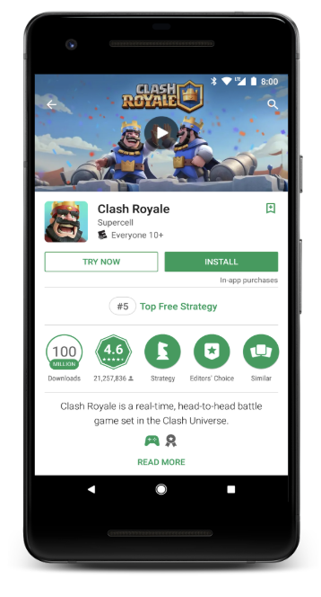

# 简化免安装游戏的开发者体验

原标题：Streamlining the developer experience for instant games  
链接：[https://android-developers.googleblog.com/2018/08/streamlining-developer-experience-for.html](https://android-developers.googleblog.com/2018/08/streamlining-developer-experience-for.html)  
作者：Vlad Zavidovych (软件工程师) 和 Artem Yudin (软件工程师)  
翻译：[arjinmc](https://github.com/arjinmc)  

[Google Play Instant（免安装应用)](https://developer.android.com/topic/google-play-instant/)使用户可以本地体验您的游戏或应用，而无需完成整个安装过程。消除安装麻烦是提高用户参与度，转化率和终身价值的好方法。

今天，我们通过删除URL请求，更容易构建免安装游戏和应用程序。以前，为了发布免安装游戏，您必须为其创建Web目标。该网站还必须通过[意图过滤器](https://developer.android.com/guide/components/intents-filters)和[数字资产链接验证](https://developer.android.com/training/app-links/instant-app-links)连接到免安装游戏。

现在，不再需要为免安装游戏添加基于URL的意图过滤器。人们可以通过Play商店或Play游戏应用中的“立即尝试”按钮，通过[深层链接API](https://developer.android.com/distribute/marketing-tools/linking-to-google-play#Instant)以及将来通过应用广告来访问即时体验。

虽然对于通常没有相应网站的游戏特别有用，但游戏和应用程序开发者都可以使用新的无URL功能。

  

## 如何在不添加URL支持的情况下开发和发布免安装游戏

使用Unity或最新Cocos Creator的游戏开发者只需在设置过程中将URL字段留空即可利用无URL即时游戏。

但是，如果你有自己的游戏引擎或者在C++中从头开始构建你的游戏，请检查AndroidManifest以确保它具有以下intent过滤器声明：

```code
<intent-filter>
   <action android:name="android.intent.action.MAIN" />
   <category android:name="android.intent.category.LAUNCHER" />
</intent-filter>
```

从Android Studio 3.2开始，您可以<strong>创建新的免安装游戏，或转换现有游戏，而无需将URL与其关联</strong>。实际上，这是默认行为。这是一个贯穿整个过程：

1. 首先，请确保您在[此处更新或下载](https://developer.android.com/studio/)Android Studio 3.2或更新版本。确保从Android SDK Manager安装Instant Apps Development SDK 1.3.0或更高版本。

2. 然后从[GitHub](https://github.com/googlesamples/android-instant-apps/tree/master/urlless)下载一个示例免安装应用程序。在Android Studio中，单击 File → New → Import Project… 并导入下载的“urlless”例子。

3. 最后，在完成gradle任务后，单击带有“instantapp”配置的绿色“Run”按钮。

您应该在连接的设备上看到免安装游戏。即时运行时使用[ACTION_MAIN](https://developer.android.com/reference/android/content/Intent.html#ACTION_MAIN)和[CATEGORY_LAUNCHER](https://developer.android.com/reference/android/content/Intent.html#CATEGORY_LAUNCHER)意图过滤器在游戏中找到并启动了入口点活动。

准备好发布示例免安装游戏：

1. 通过替换现有的applicationId，在app / build.gradle文件中为您的示例游戏提供唯一的applicationId - 我们不希望具有相同ID的不同应用程序。
2. 为我们的示例游戏的可安装版本和免安装版本生成已签名的APK。
	* 在Android Studio中，Build→Generate Signed Bundle / APK ...
	* 为“app”和“instantapp”模块选择APK。
3. 在[Play控制台](https://play.google.com/apps/publish)中，创建一个新应用程序，在“App Releases”选项卡下上传APK，然后在“Android Instant Apps”选项卡下上传“instantapp-release.zip”。
	* 必须在免安装应用之前推出可安装的应用。
4. 推出过程对于大多数Android开发者来说可能都很熟悉，但是如果您遇到任何问题，这里是一个[手把手的指南](https://support.google.com/googleplay/android-developer/answer/7381861)。

发布免安装游戏后，人们可以在24小时内或更快的时间通过Play商店中的“立即尝试”按钮访问它。您还可以使用[深层链接API](https://developer.android.com/distribute/marketing-tools/linking-to-google-play#Instant)向您的免安装游戏发送请求：

```code
market://details?id=MY.PACKAGE.NAME&launch=true&referrer=myreferrer
```

<i>MY.PACKAGE.NAME</i> 指的是您在app / build.gradle文件中替换的applicationId。

## 下一步是什么？

随着[Android App Bundle](https://developer.android.com/platform/technology/app-bundle/)的推出，我们很高兴能够进一步简化Google Play Instant的开发者体验。在接下来的几个月里，我们可以通过与您的可安装应用或游戏相同的捆绑包提供免安装应用或游戏的动态功能。敬请关注！

[查看有关Google Play Instant的更多信息](https://developer.android.com/topic/google-play-instant/)，或者随时[向Stack Overflow提问](https://stackoverflow.com/questions/tagged/android-instant-apps)，或向[我们的公开跟踪器报告问题](https://b.corp.google.com/issues?q=componentid:316045)。