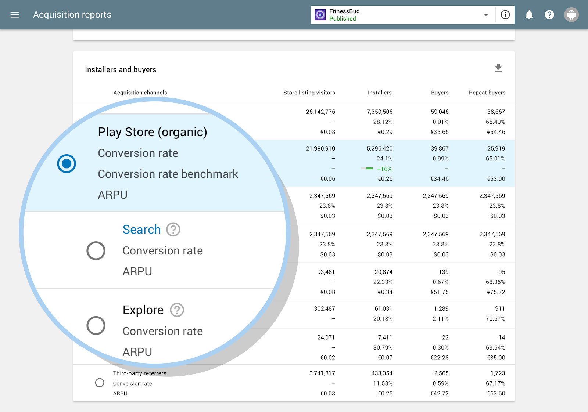
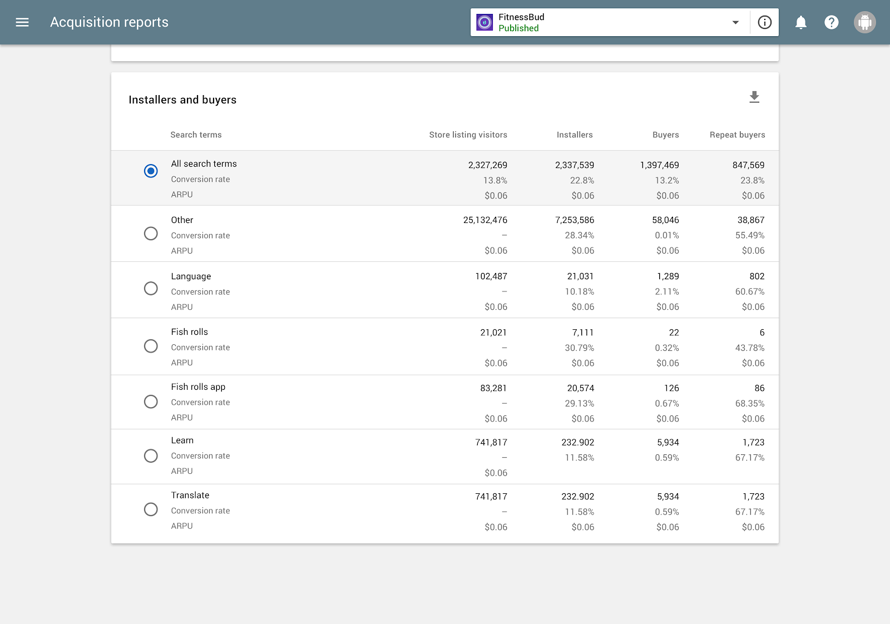
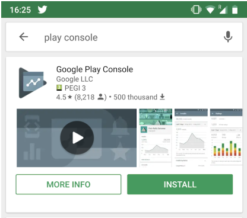

# Google Play控制台上独家新的有效购买洞察

原标题：Exclusive new organic acquisition insights on the Google Play Console  
链接：[https://android-developers.googleblog.com/2018/08/new-organic-acquisition-insights-now.html](https://android-developers.googleblog.com/2018/08/new-organic-acquisition-insights-now.html)  
作者：Tom Grinsted (Google Play产品经理)  
翻译：[arjinmc](https://github.com/arjinmc)  

我们更新了Play控制台购买报告，以便深入了解用户在Play商店中执行哪些操作来发现您的应用。这是超级收费App Store Optimization（ASO）和体验的绝佳方式。

每个开发者想知道的一件事是人们如何发现他们的应用或游戏。Google Play控制台中的用户获取报告是理解这一点的好方法。对于许多应用和游戏来说，一个突出的来源是有效流量 - 它通常是商店列表访问和安装的最大或第二大来源。

有效流量由在导出或搜索Play商店时访问您商店列表的人组成。这些访问者可能会在季节性收藏中找到您的应用，包括特色或搜索特定用例或术语。

直到最近，这种流量已经捆绑在一起，没有数据细分到用户行为中。通过我们的最新更新，我们通过向Google Play控制台引入新的独家购买洞察来改变这种状况。通过这些功能，您可以了解Play商店中的用户如何发现您的应用或游戏。它们揭示了有多少人通过浏览商店来发现您的应用，以及有多少搜索来查找您的应用，甚至是他们使用的搜索字词！

应用商店优化（ASO）对于推动您的自然流量至关重要，此更新使您可以通过更多数据和更好的理解来实现此目标。

## 一个新的数据细分

当您访问用户获取报告时，您会注意到的第一个更改是有机流量被破坏。此细分意味着您可以通过搜索或浏览来查看人们如何到达您的商品详情（不搜索的操作，如浏览主页，访问类别列表或查看相关应用）。

  

这一变化对开发者有直接的好处，使他们的增长团队能够优化采购策略。例如，[Scopely](https://play.google.com/store/apps/dev?id=9028773071151690823)发现：

“从搜索中隔离[探索]，然后深入搜索到整个有机图片。它使我们能够专注于真正重要的购买领域。” Dorothee Pinlet，合伙人副总裁，Scopely

## 点击查看更多

在新的搜索行中，您可以点击查看使用不同搜索字词查找商品列表的人数，以及哪些搜索结果最多。此细分是之前尚未提供的Play商店视图。

  

我们的试点合作伙伴帮助我们在发布之前完善了功能，他们非常满意这些数据如何帮助他们做出更明智的决策。

[Evernote](https://play.google.com/store/apps/developer?id=Evernote+Corporation)发现细分：

“...提供了关于搜索术语在推动安装和保留用户方面的有效性的令人惊讶且可操作的见解。”
May Allen，Evernote产品经理

一些合作伙伴改变了他们的应用内入体验，以突出显示反映推动安装的搜索条件的功能，以更好地满足用户期望。其他人在将其添加到描述中之后，通过在搜索结果中查找其拥护者的名称来评估他们的影响者营销是否具有影响力。

## 更好地涵盖

新的自然数据还包含有关访问Play商店的用户何时看到您的商家信息预览的信息，而不仅仅是访问完整页面的时间。 

  

人们在进行某些搜索时会看到这些预览，例如直接搜索品牌或应用名称。在一些市场中更普遍。这些新信息可让您更清楚地了解人们查看资产的位置。它可以帮助您决定如何优化这些资产，例如确保您的屏幕截图具有影响力。当你这样做时，你已经有了[商店列表实验](https://developer.android.com/distribute/best-practices/grow/store-listing-experiments)。

此更改意味着截至2018年7月30日，您报告的总访问次数和安装次数可能会增加。此增加是因为预览将计入列表视图，之前它们已包含在“没有商品详情访问的安装”类别中。

## 使数据工作

开发者使用有效测试故障，给出了他们喜欢的反馈意见。他们也非常友好地分享他们计划如何使用数据的一些见解。也许这些关于如何使用数据的想法将为您的业务带来一些想法。

一些开发者将通过查看探索和搜索之间的细分来使用这些新数据来评估他们的购买策略。他们将使用此细分来评估探索行为的影响，尤其是在应用程序已在Play商店中展示时。

使用有关热门搜索字词的信息，一些开发者计划更改其应用或游戏的Google Play列表，以更好地反映用户兴趣。此更改涉及调整说明和屏幕截图，以便更直接地绑定到热门搜索字词。

其他人计划使用搜索词信息提供的洞察力来优化他们的应用购买。在这里，他们计划确保新用户谈论与人们在发现他们的应用或游戏时所做的最热门搜索相关的功能，突出并强化好处。

## 总结

我们的团队一直在考虑我们可以构建的工具，以帮助您优化Play商店中应用或游戏的发现和安装。有效故障只是这些工具中的一种，是帮助推动您成功的新方法。最终，您的成功就是我们努力的方向。有效细分可以让您更全面地了解人们如何在Play商店中发现您，从而优化您的商店状态，将更多访问量转化为安装，并为参与用户提供更多安装。