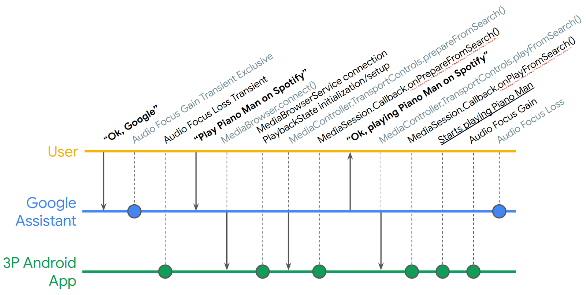
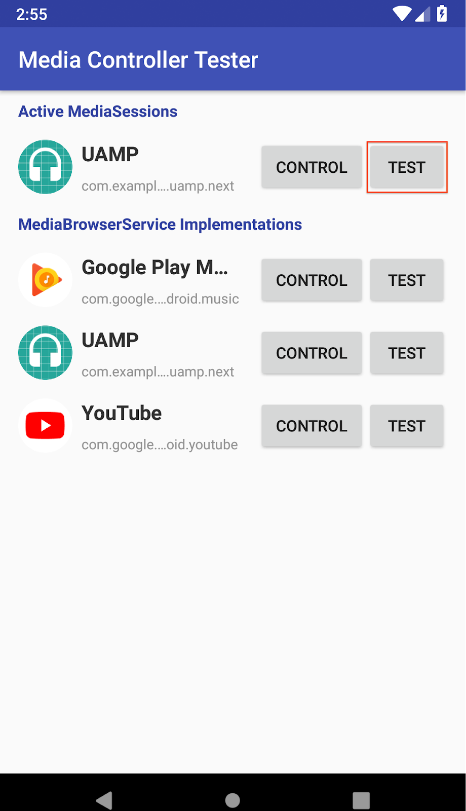
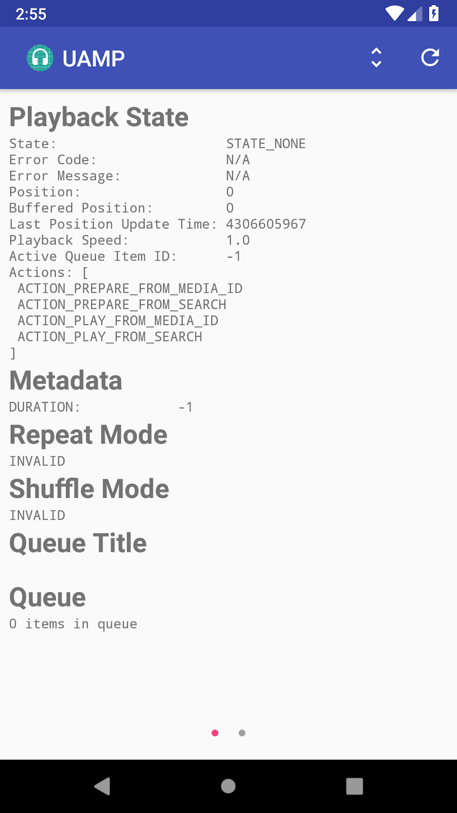
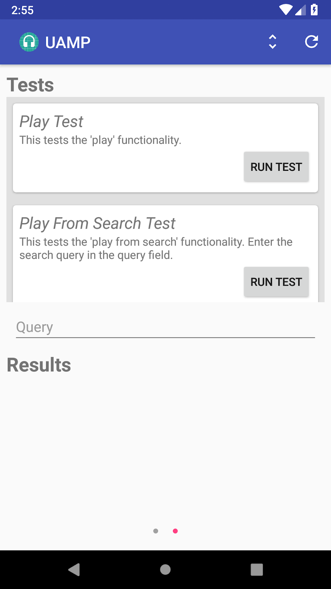
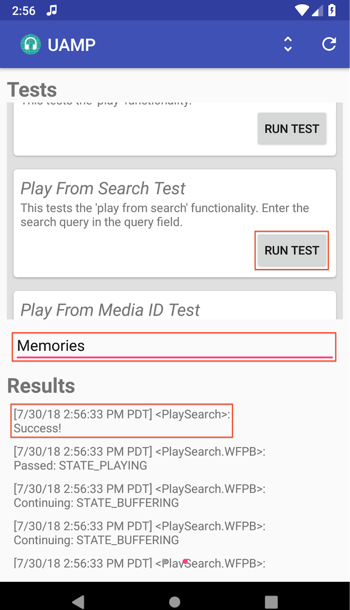
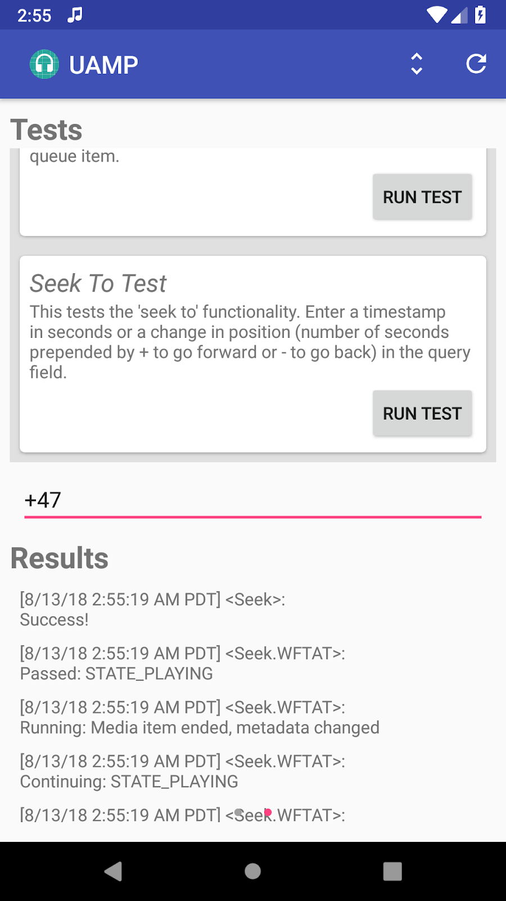
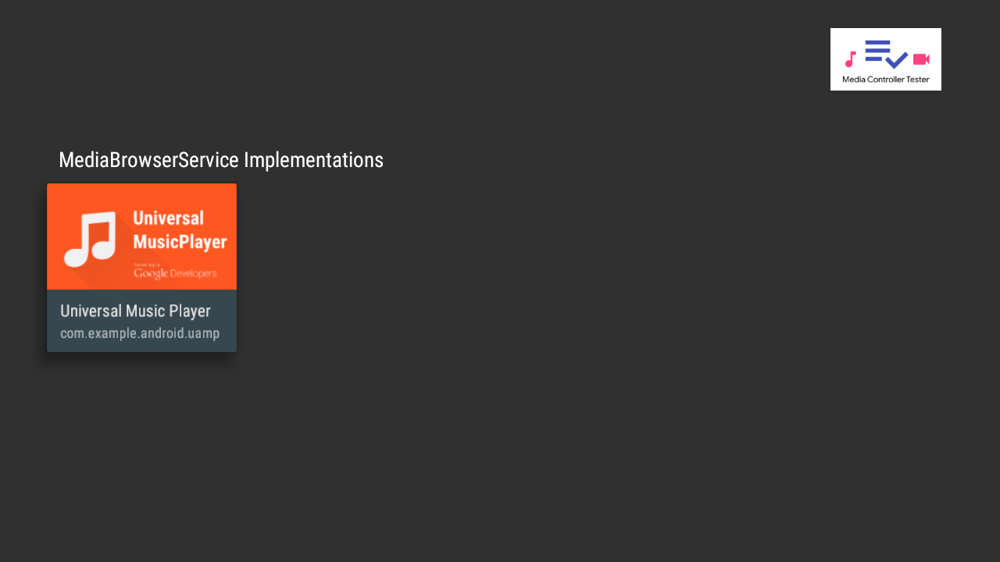
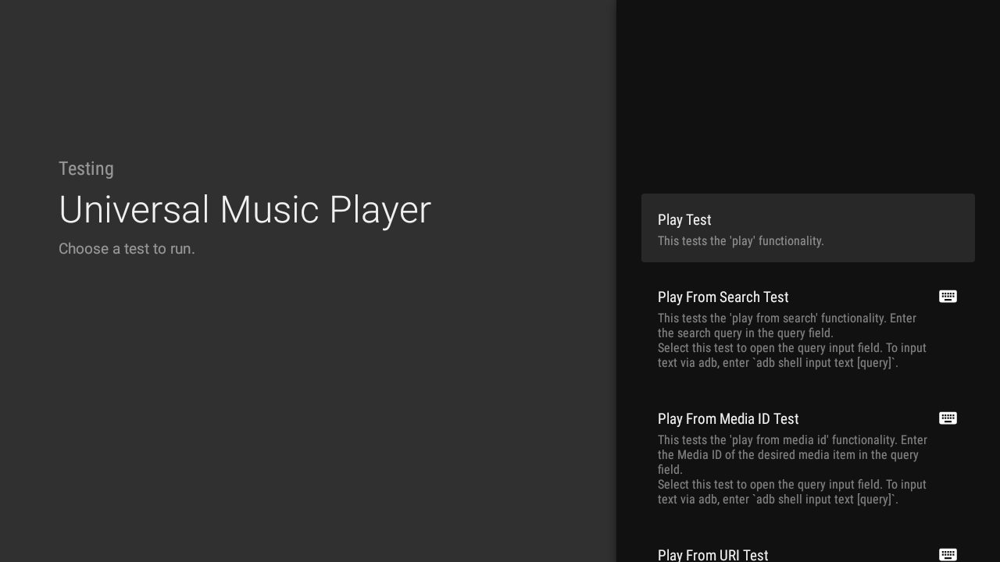
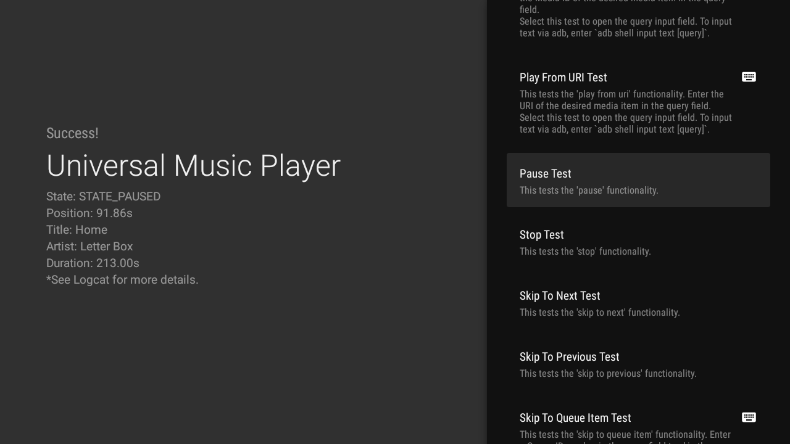

# 在Android上验证您的Google助手多媒体操作集成

原标题：Verifying your Google Assistant media action integrations on Android  
链接：[https://android-developers.googleblog.com/2018/08/verifying-your-google-assistant-media.html](https://android-developers.googleblog.com/2018/08/verifying-your-google-assistant-media.html)  
作者：Nevin Mital (合伙人开发者关系部)  
翻译：[arjinmc](https://github.com/arjinmc)  

[多媒体控制器测试](https://github.com/googlesamples/android-media-controller)（MCT）的应用程序是一个强大的工具，可让您测试Android上的多媒体播放的复杂性，它只是变得更加有用。Android MediaSession API支持多媒体体验，包括通过Android手机，汽车，电视和耳机上的Google助手理进行语音互动。此工具可帮助您验证集成。我们现在添加了一个新的[验证测试框架](https://github.com/googlesamples/android-media-controller/wiki)，可用于帮助自动化QA测试。

MCT旨在与实现多媒体API的应用程序结合使用，例如[通用Android音乐播放器](https://github.com/googlesamples/android-UniversalMusicPlayer)。MCT显示有关媒体应用的MediaController的信息，例如PlaybackState和Metadata，并可用于测试应用间多媒体控件。

多媒体操作生命周期可能很复杂; 即使在一个简单的Play From Search请求中，也有许多中间步骤（下面描述的简化时间线）可能会出现问题。MCT可用于帮助突出显示音乐应用处理MediaController TransportControl请求的任何不一致之处。

  

以前，使用MCT需要大量的手动交互和监控。新的验证测试框架提供了一键式测试，您可以运行这些测试以确保您的媒体应用程序正确响应回放请求。

## 运行验证测试

要在MCT中访问新的验证测试，请单击所需媒体应用旁边的<strong>测试</strong>按钮。

  

下一个屏幕显示有关MediaController的详细信息，例如PlaybackState，Metadata和Queue。右上角的工具栏上有两个按钮：左侧的按钮在可分析和格式化的日志之间切换，右侧的按钮刷新此视图以显示最新当前信息。

  

通过向左滑动，您可以到达验证测试视图，在该视图中，您可以看到已定义测试的可滚动列表，用于输入需要测试的测试的查询的文本字段以及用于显示测试结果的部分。

  

例如，要运行Play From Search Test，您可以在文本字段中输入搜索查询，然后点击<strong>Run Test</strong>按钮。看起来测试成功了！

  

以下是暂停测试（左）和Seek To测试（右）的示例。

  

## Android TV

MCT现在也适用于Android TV！要使您的多媒体应用能够使用Android TV版本的MCT，您的多媒体应用必须具有[MediaBrowserService](https://developer.android.com/reference/android/service/media/MediaBrowserService)。有关如何执行此操作的详细信息，请参阅[这里](https://developer.android.com/guide/topics/media-apps/audio-app/building-a-mediabrowserservice)。

在Android TV上启动MCT后，您将看到已安装的多媒体应用列表。请注意，如果应用程序实现了MediaBrowserService，它将仅显示在此列表中。

  

选择应用程序将转到测试屏幕，该屏幕将在右侧显示验证测试列表。

  

运行测试将使用选定的MediaController信息填充屏幕左侧。有关更多详细信息，请查看Logcat中的MCT日志。

  

需要查询的测试标有键盘图标。单击其中一个测试将打开查询的输入字段。点击<strong>Enter</strong>后，测试将运行。

  

要使文本输入更容易，您还可以使用ADB命令：

```code
adb shell input text [query]
```

请注意，'％s'将在单词之间添加空格。例如，该命令<i>adb shell input text hello%sworld</i>将向输入字段添加文本“hello world”。

## 下一步是什么

MCT目前包括针对以下请求简单的单个多媒体动作测试：

* 播放
* 从搜索播放
* 从媒体ID播放
* 从URI播放
* 暂停
* 停止
* 跳到下一个
* 跳到上一页
* 跳至队列项目
* 找到指定位置

有关如何构建测试以及如何添加更多测试的深入技术，请访问[MCT GitHub Wiki](https://github.com/googlesamples/android-media-controller/wiki/Verification-Tests)。我们很乐意为您提交pull request，其中包含您认为有用的更多测试以及任何错误修复。请务必查看[贡献步骤](https://github.com/googlesamples/android-media-controller/blob/master/CONTRIBUTING.md)以获取更多信息。

查看[GitHub](https://github.com/googlesamples/android-media-controller)上的最新更新！