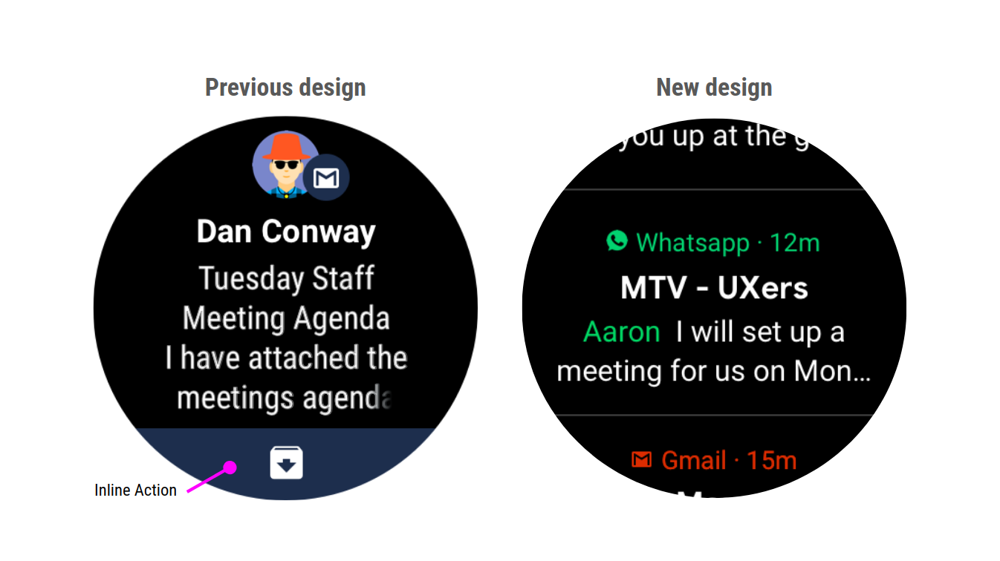

# 充分利用Google Wear OS 重新设计的通知

原标题：Make the most of Notifications with the redesigned Wear OS by Google  
链接：[https://android-developers.googleblog.com/2018/08/make-most-of-notifications-with.html](https://android-developers.googleblog.com/2018/08/make-most-of-notifications-with.html)  
作者：[Hoi Lam](https://twitter.com/hoitab) (Google Wear OS首席开发者倡导者)  
翻译：[arjinmc](https://github.com/arjinmc)  

  

今天我们宣布，[我们正在改进Google的Wear OS设计](https://blog.google/products/wear-os/wear-os-google-health-and-help-are-just-swipe-away)，以帮助您充分利用您的时间 - 更快地访问您的信息和通知。通知可以来自手机通知的自动桥接，也可以由手表上运行的本地Wear应用生成。无论您是电话开发者，Wear应用程序开发者，还是两者兼而有之，您都需要了解有关新通知流的一些信息。

## 新通知流

到目前为止，每个通知都在Wear OS中占据了整个屏幕。虽然这提供了更多空间来包含内联动作等内容，但这也意味着用户花了很长时间来完成所有通知。新通知流更紧凑，可以在同一屏幕上显示多个通知。这意味着用户可以更快地处理他们的通知流。

  

## 这对开发者意味着什么

* <strong>简明的通知内容更为重要</strong>。关于Wear的新未扩展通知将显示最多三行文本。因为这已经是比用户手机上的单行未扩展通知更多的信息，如果您的通知在未扩展的手机上工作，那么在Wear上应该没问题。
* <strong>品牌通知与颜色</strong>。通知的默认标题和图标颜色为白色。开发者现在可以通过使用[setColor](https://developer.android.com/reference/android/support/v4/app/NotificationCompat.Builder.html#setColor(int))自定义标题和图标色调的颜色来传达他们的品牌标识。
* <strong>将不再支持内联操作通知布局</strong>。以前，开发者过去常常[setDisplayIntent](https://developer.android.com/reference/android/support/v4/app/NotificationCompat.Action.WearableExtender.html#setHintDisplayActionInline(boolean))在通知流中膨胀自定义操作。我们发现内联操作布局通常不会考虑设备的外形，并且很难随着Wear OS的通知体验的发展而保持最新。因此，我们将不再在通知中支持此功能。我们的设计团队正在审核是否应在未来版本中包含内联操作。因此，在做出决定之前，我们不会弃用相关的API。我们将在适当的时候更新开发者社区。

与往常一样，[目前的通知最佳实践](https://developer.android.com/distribute/best-practices/engage/rich-notifications#best-practices)仍然适用。特别是，对于消息传递应用程序开发者，我们强烈建议使用[MessagingStyle](https://developer.android.com/training/wearables/notifications/noti-styles#messaging-style)通知并启用设备上的智能回复[setAllowGeneratedReplies](https://developer.android.com/reference/android/support/v4/app/NotificationCompat.Action.Builder#setAllowGeneratedReplies(boolean))。

我们将在下个月开始推出这些更改，因此请关注Google智能手表的Wear OS更新！