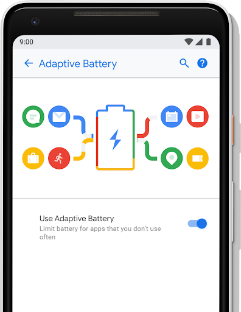
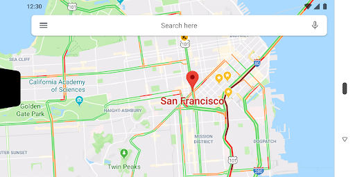
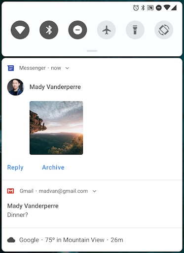
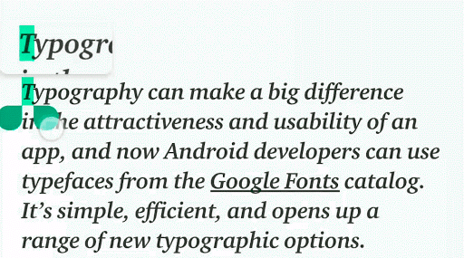
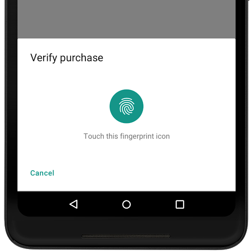
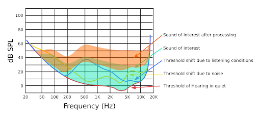
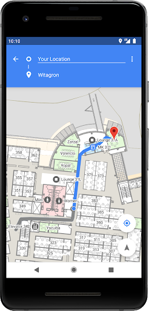
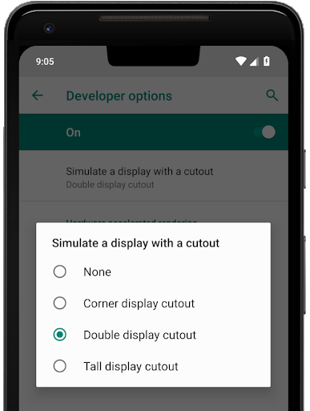

# 介绍Android 9 Pie

原标题：Introducing Android 9 Pie  
链接：[https://android-developers.googleblog.com/2018/08/introducing-android-9-pie.html](https://android-developers.googleblog.com/2018/08/introducing-android-9-pie.html)  
作者：Dave Burke (工程副总裁)  
翻译：[arjinmc](https://github.com/arjinmc)  

经过一年多的开发和早期采用者的数月测试，我们已准备好向全世界推出Android 9 Pie，这是Android的最新版本。

Android 9利用机器学习的强大功能，使您的手机更智能，更简单，并为您量身定制。在[这里](https://blog.google/products/android/introducing-android-9-pie)阅读所有关于新的消费版本特点。对于开发者而言，Android 9包含许多新方法来增强您的应用程序并构建新体验以促进参与。

你给我们提供了大量的反馈意见 - 超过一千个bug和功能需求 - 谢谢！超过140,000人通过Android Beta计划尝试了我们的预览版本，我们的[七家设备制造商合作伙伴](https://android-developers.googleblog.com/2018/05/whats-new-in-android-p-beta.html#androidbeta)也将我们的Beta版带到了他们的旗舰设备上，使全球用户也能提供他们的反馈。

今天我们将源代码推向[Android开源项目（AOSP）](https://source.android.com/)，并开始向全球所有Pixel用户推出Android 9，Android 9将在未来几个月推出更多设备。

我们继续推动Android作为全球开发商建立业务的首要开放平台。借助Android 9 - 以及Google Play中针对应用和[游戏](https://android-developers.googleblog.com/2018/03/our-big-bet-on-mobile-games-at-game.html)的[强大新功能](https://android-developers.googleblog.com/2018/05/io-2018-everything-new-in-google-play.html)， 我们致力于帮助您构建出色的体验，以及在全球范围内安全且经济高效地覆盖和吸引合适的用户。

## 什么是Android 9？

智能智能手机，以机器学习为核心
Android 9可以帮助您的手机在您使用时学习，通过选择您的偏好并自动调整。从帮助用户充分利用电池续航时间到最终需要的所有应用程序的最佳部分，Android 9一直保持运行更顺畅，更长久。

## 自适应电池

  

我们与[DeepMind](https://deepmind.com/)合作开发了一项名为[Adaptive Battery(自适应电池)](https://developer.android.com/preview/features/power)的功能，该功能使用机器学习为用户最关心的应用程序确定系统资源的优先级。如果您的应用程序针对[Doze](https://developer.android.com/training/monitoring-device-state/doze-standby#understand_doze)，[App Standby](https://developer.android.com/training/monitoring-device-state/doze-standby#understand_app_standby)和[Background Limits(后台限制)](https://developer.android.com/about/versions/oreo/background)进行了优化，则自适应电池应该可以立即为您提供良好的工作效果。如果您尚未对应用进行优化，请务必查看[电源文档](https://developer.android.com/preview/features/power)中的详细信息，了解其工作原理。

## Slice

通过在全屏应用体验之外启用参与，[Slice(切片)](https://developer.android.com/guide/slices/)可以帮助用户更快地执行任务。它通过使用UI模板实现此目的，该模板可以在Google搜索应用中以及稍后在Google助手等其他位置显示来自您应用的丰富，动态和互动内容。您可以在[这里](https://developer.android.com/guide/slices/)了解有关构建切片以增强应用的更多信息。

  

## App Action

[App Action](http://developer.android.com/guide/actions/)是一种提高应用和驱动器参与度的新方法。动作利用机器学习，根据应用程序的语义意图和用户的上下文，在恰当的时间将应用程序呈现给用户。

  

我们将在未来几周内分享更多有关注册您的应用以处理一个或多个用户意图的详细信息，以便您的应用可以启用应用action，并在多个Google和Android上显示，以响应用户查询。

## 文本分类器和智能链接

  

我们扩展了用于识别内容或文本输入中的实体的ML模型，以通过[TextClassifier API](https://developer.android.com/reference/android/view/textclassifier/package-summary)支持更多类型，如日期和航班号。智能链接允许您通过[Linkify API](https://developer.android.com/reference/android/text/util/Linkify)利用TextClassifier模型，包括用于快速后续用户操作的丰富选项。智能链接还可以显着提高检测精度和性能。

## 神经网络API 1.1

Android 9增加了[神经网络API](https://developer.android.com/ndk/guides/neuralnetworks/)的更新版本，以扩展Android对加速设备内机器学习的支持。[神经网络1.1](https://developer.android.com/ndk/guides/neuralnetworks/index.html)增加了对9个新操作的支持 - Pad，BatchToSpaceND，SpaceToBatchND，Transpose，Strided Slice，Mean，Div，Sub和Squeeze。利用API的典型方法是通过[TensorFlow Lite](https://www.tensorflow.org/mobile/tflite/)。

## 从手机中获得最大收益 - 更轻松

我们很高兴能让您的智能手机更加智能化。但同样重要的是，该技术会逐渐消失。在Android 9中，我们已经将Android的UI演变为更简单，更易于使用 - 对于开发者而言，这些更改有助于改善用户查找，使用和管理应用的方式。

  

## 新系统导航

Android 9引入了一个我们已经工作了一年多的新系统导航。新设计有助于使Android的多任务处理更加平易近人，并使发现应用程序变得更加容易。您可以从任何地方向上滑动以查看最近使用的应用的全屏预览，只需点按即可跳回到其中一个应用。

## 显示刘海

现在，您的应用程序可以通过Android 9中的[显示刘海支持](https://developer.android.com/guide/topics/display-cutout/)充分利用最新的边缘到边缘屏幕。对于大多数应用程序，支持显示刘海是无缝的，系统管理状态栏高度以将内容与刘海分离。如果您有沉浸式内容，则可以使用[显示刘海API](https://developer.android.com/reference/android/view/DisplayCutout.html)检查刘海的位置和形状，并请求围绕它的全屏布局。为了帮助开发和测试，我们添加了一个开发者选项，可以在任何设备上模拟多个剪切形状。

  
<small>具有沉浸式内容的应用可以在具有显示刘海的设备上全屏显示内容。</small>

## 通知和智能的回复

Android 9使通知更有用，更具可操作性。消息应用程序可以利用新的[MessagingStyle API](https://developer.android.com/preview/features#notifications)来显示对话，附加照片和贴纸，甚至建议智能回复。您很快就可以使用[ML Kit](https://developers.google.com/ml-kit/)为您的应用生成智能回复建议。

  
<small>
MessagingStyle通知与对话和智能回复[左]，图像和贴纸[右]。</small>

## 文字放大镜

  

在Android 9中，我们添加了一个[放大镜小部件](https://developer.android.com/reference/android/widget/Magnifier)，以改善用户选择文本的体验。放大镜小部件允许用户通过可拖动窗格查看缩放文本来精确定位光标或文本选择手柄。您可以将其附加到附加到窗口的任何视图，以便您可以在自定义窗口小部件或自定义文本呈现期间使用它。在[放大镜小部件](https://developer.android.com/reference/android/widget/Magnifier)也可以提供任何看法或表面，而不仅仅是文本的放大版本。

查看我们[最近的博客文章](https://android-developers.googleblog.com/2018/07/whats-new-for-text-in-android-p.html)，了解有关此功能和其他文本功能的更多信息，例如[PrecomputedText](https://developer.android.com/reference/android/text/PrecomputedText)和行高和基线文本对齐。

## 用户的安全和隐私

### 生物识别提示

  

通过一系列用于身份验证的生物识别传感器，我们使各种传感器类型和应用的体验更加一致。Android 9引入了一个系统管理的对话框，以提示用户任何支持的生物识别身份验证类型。应用程序不再需要构建自己的对话框 - 而是使用[BiometricPrompt API](https://developer.android.com/reference/android/hardware/biometrics/BiometricPrompt)显示标准系统对话框。除指纹（包括显示内传感器）外，API还支持Face和Iris身份验证。

如果您的应用程序正在绘制自己的指纹身份验证对话框，则应尽快切换到使用[BiometricPrompt API](https://developer.android.com/reference/android/hardware/biometrics/BiometricPrompt)。有关更多信息，请参阅[此帖子](https://android-developers.googleblog.com/2018/06/better-biometrics-in-android-p.html)。

### 受保护的确认

Android 9引入了[Android Protected Confirmation](https://developer.android.com/preview/features/security#android-protected-confirmation)，它使用可信执行环境（TEE）来保证用户显示和确认给定的提示字符串。只有在用户确认成功后，TEE才会签署提示字符串，应用程序可以验证该字符串。

### 加强对私钥的保护

我们已经将StrongBox添加为新的[KeyStore](https://developer.android.com/reference/java/security/KeyStore)类型，为在防篡改硬件中提供密钥存储以及隔离CPU，RAM和安全闪存的设备提供API支持。您可以设置密钥是否应受[KeyGenParameterSpec](https://developer.android.com/reference/android/security/keystore/KeyGenParameterSpec)使用StrongBox安全芯片保护。

### DNS over TLS

Android 9增加了对TLS上DNS的内置支持，如果网络的DNS服务器支持，则自动将DNS查询升级到TLS。用户可以在网络和Internet设置中的新私有DNS模式下管理DNS over TLS行为。执行自己的DNS查询的应用程序可以使用新的API [LinkProperties.isPrivateDnsActive()](https://developer.android.com/reference/android/net/LinkProperties#isPrivateDnsActive())来检查DNS模式。更多在[这篇文章](https://android-developers.googleblog.com/2018/04/dns-over-tls-support-in-android-p.html)中。

### 默认情况下为HTTPS

作为将所有网络流量从明文（未加密的HTTP）转移到使用TLS（HTTPS）保护的网站的更大努力的一部分，我们正在更改[网络安全配置](https://developer.android.com/training/articles/security-config.html)的默认值以阻止所有明文流量。您现在需要通过TLS建立连接，除非您明确选择明确特定域的明文。在[这里](https://android-developers.googleblog.com/2018/04/protecting-users-with-tls-by-default-in.html)查看详细信息。

### 基于编译器的安全缓解措施

在Android 9中，我们扩展了编译器级缓解的使用，通过运行时检测危险行为来强化平台。控制流完整性（CFI）技术有助于防止代码重用攻击和任意代码执行。在Android 9中，我们极大地扩展了媒体框架和其他安全关键组件（如NFC和蓝牙）中的CFI使用。在使用LLVM构建时，我们还在Android公共内核中引入了CFI内核支持。

我们还扩展了对Integer溢出消毒剂的使用，以缓解内存损坏和信息泄露漏洞。我们已经确定了具有过去漏洞或处理复杂不受信任输入的库中的清洁剂的优先级，例如libui，libnl，libmediaplayerservice等。有关详细信息，请参阅[此帖
](https://android-developers.googleblog.com/2018/06/compiler-based-security-mitigations-in.html)。

### 用户隐私

Android 9以多种新方式保护隐私。系统现在限制从空闲的应用程序访问麦克风，摄像头和所有[SensorManager](https://developer.android.com/reference/android/hardware/SensorManager.html#getSensors())传感器。当应用程序的UID处于空闲状态时，麦克风会报告空音频，而传感器会停止报告事件。您的应用使用的相机已断开连接，如果应用尝试使用它们，则会生成错误。在大多数情况下，这些限制不应为现有应用引入新问题，但我们建议您从应用中删除这些请求。

Android 9还允许用户通过将其<i>build.serial</i>置于[READ_PHONE_STATE](https://developer.android.com/reference/android/Manifest.permission.html#READ_PHONE_STATE)权限之后来控制对平台标识符的访问。要访问build.serial标识符，您应该使用[Build.getSerial()](https://developer.android.com/reference/android/os/Build.html#getSerial())方法。

在[这里](https://developer.android.com/about/versions/p/android-9.0-changes-all#privacy-changes-all)阅读有关所有隐私更改的更多信息。

## 相机，音频和图形方面的全新体验

### 多摄像头API和其他相机更新

使用Android 9，您现在可以在支持多摄像头API的设备上同时打开来自[两个或更多物理摄像头](https://developer.android.com/reference/android/hardware/camera2/CameraMetadata.html#REQUEST_AVAILABLE_CAPABILITIES_LOGICAL_MULTI_CAMERA)的流。在具有双前置或双后置摄像头的设备上，您可以创建仅使用单个摄像头无法实现的创新功能，例如无缝变焦，散景和立体视觉。API还允许您调用逻辑或融合的摄像机流，以自动在两个或更多摄像机之间切换。

相机中的其他改进包括新的[会话参数](https://developer.android.com/reference/android/hardware/camera2/params/SessionConfiguration.html)，有助于减少初始捕获期间的延迟，以及Surface共享，让相机客户端可以处理各种用例，而无需停止和启动相机流。我们还添加了基于显示的[闪存支持](https://developer.android.com/reference/android/hardware/camera2/CameraMetadata.html#CONTROL_AE_MODE_ON_EXTERNAL_FLASH)和访问[OIS时间戳](https://developer.android.com/reference/android/hardware/camera2/CaptureResult.html#STATISTICS_OIS_TIMESTAMPS)的 API，以实现应用级图像稳定和特效。

### HDR VP9视频和HEIF图像压缩

Android 9增加了对HDR VP9 Profile 2的内置支持，因此您现在可以在支持HDR的设备上为用户提供支持HDR的电影。

我们很高兴能在平台上添加[HEIF](https://developer.android.com/reference/android/media/MediaFormat.html#MIMETYPE_IMAGE_ANDROID_HEIC)（heic）图像编码。HEIF是一种流行的照片格式，可以改善压缩以节省存储和网络数据。借助Android 9设备上的平台支持，您可以轻松地从后端服务器发送和使用HEIF图像。确保您的应用与此数据格式兼容以进行共享和显示后，请在应用中尝试将HEIF作为图像存储格式。您可以使用[ImageDecoder](https://developer.android.com/reference/android/graphics/ImageDecoder.html)或[BitmapFactory](https://developer.android.com/reference/android/graphics/BitmapFactory.html)进行jpeg-to-heic转换以从jpeg获取位图，您可以在AndroidX库中使用[HeifWriter](https://developer.android.com/reference/androidx/heifwriter/HeifWriter.html)从YUV字节缓冲区，Surface或Bitmap写入HEIF静止图像。

### 使用动态处理增强音频

在[动态处理API](https://developer.android.com/reference/android/media/audiofx/DynamicsProcessing)允许你使用一个新的音频效果进行隔离特定频率和更低的响亮或增加柔软的声音，以提高您的应用程序的音质。例如，您可以改善在嘈杂，遥远或声学上具有挑战性的环境中安静地说话的人的声音。API允许您访问多级，多频段动态处理效果，包括预均衡器，多频段压缩器，后均衡器和链接限制器。

  

### 用于位图和drawable的ImageDecoder

一个[ImageDecoder](https://developer.android.com/reference/android/graphics/ImageDecoder) API为您提供了一个更简单的方法来解码图像，位图或绘图资源。您可以从字节缓冲区，文件或URI创建位图或drawable。API提供了优于BitmapFactory的几个优点，包括支持精确缩放，对硬件存储器的单步解码，支持解码中的后处理以及动画图像的解码。你可以在[这里](https://developer.android.com/preview/features#decoding-images)阅读更多。

## 连通性和位置

### Wi-Fi RTT用于室内定位

  

Android 9允许您通过对IEEE 802.11mc Wi-Fi协议（也称为Wi-Fi往返时间（RTT））的平台支持，在您的应用中构建室内定位功能。在启用了硬件支持，位置许可和位置的Android 9设备上，您的应用可以使用[RTT API](https://developer.android.com/reference/android/net/wifi/rtt/package-summary.html)来测量到附近Wi-Fi接入点（AP）的距离。设备不需要连接到AP以使用RTT，并且为了保持隐私，只有电话能够确定距离，而不是AP。

知道到3个或更多AP的距离，您可以计算设备位置，精度为1到2米。有了这种精确度，您就可以支持室内导航等用例; 精细的基于位置的服务，例如消除歧义的语音控制（例如'打开此灯'）; 和基于位置的信息（例如'此产品是否有特别优惠？'）。

### JobScheduler中的数据成本敏感度

[JobScheduler](https://developer.android.com/reference/android/app/job/JobScheduler.html)是Android的核心服务，可帮助您管理计划任务或跨[Doze](https://developer.android.com/training/monitoring-device-state/doze-standby.html#understand_doze)，[App Standby](https://developer.android.com/training/monitoring-device-state/doze-standby.html#understand_app_standby)和[后台限制](https://developer.android.com/about/versions/oreo/background.html)工作。在Android 9中，JobScheduler可以更好地为用户处理与网络相关的作业，并协调运营商单独提供的网络状态信号。现在，作业可以声明其估计的数据大小，信号预取，并指定详细的网络要求 - 运营商可以将网络报告为拥塞或未计量。然后，JobScheduler根据网络状态管理工作。例如，当网络拥塞时，JobScheduler可能会推迟大型网络请求。未计量时，它可以运行预取作业以改善用户体验，例如预取标题。

### 开放用于NFC支付和安全交易的移动API

Android 9为Android添加了[GlobalPlatform Open Mobile API](https://www.globalplatform.org/)的实现。在支持的设备上，应用程序可以使用[OMAPI API](https://developer.android.com/reference/android/se/omapi/package-summary.html)访问安全元素（SE）以启用智能卡支付和其他安全服务。硬件抽象层（HAL）提供底层API，用于枚举各种可用的安全元素（eSE，UICC和其他）。

## 应用程序的性能

### ART表现

Android 9通过ART运行时为所有应用程序带来性能和效率改进。我们扩展了ART对执行配置文件的使用，以优化应用程序并减少已编译应用程序代码的内存占用空间。ART现在使用配置文件信息进行DEX文件的设备重写，在一系列流行应用程序中减少高达11％。我们希望这些与系统DEX内存使用量的减少和应用程序的更快启动时间密切相关。

### 针对Kotlin进行了优化

Kotlin是[Android上的第一语言](https://developer.android.com/kotlin/index.html)，如果你还没有尝试过，你应该这样做！我们在Android中对Kotlin做出了持久的承诺，并继续扩大支持，包括优化Kotlin代码的性能。在Android 9中，您将看到这项工作的第一个成果 - 我们改进了几个编译器优化，特别是那些目标循环，以提取更好的性能。我们还将继续与JetBrains合作，优化Kotlin生成的代码。只需将Android Studio的Kotlin插件保持最新，即可获得所有最新的Kotlin性能改进。

今天，我们还发布了Android 9-API 28 SDK（第6版）的更新，其中包含一些最常用的API中的可空性注释。我们将在即将发布的帖子中提供有关此内容的更多详情。

### 现代Android

作为Android 9的一部分，我们正在对Android及其上运行的应用程序进行现代化改造，这是我们在安全性，性能和稳定性方面进行深入，持续投资的一部分。

正如我们[去年](https://android-developers.googleblog.com/2017/12/improving-app-security-and-performance.html)宣布的那样，Google Play将要求所有应用更新在2018年11月之前定位Android Oreo（[targetSdkVersion](https://developer.android.com/guide/topics/manifest/uses-sdk-element.html#target) 26或更高版本）。与此相符，如果您的应用面向早于Android 4.2（API级别17）的平台，则用户需要安装那天之后它会看到一个警告对话框。以下是迁移时获得帮助和支持的[资源清单](https://developer.android.com/distribute/best-practices/develop/target-sdk.html) - 我们期待看到您的应用从现代Android中获得最大收益。

## 让您的应用为Android 9做好准备！

  

从今天开始向Pixel用户推出Android 9，以及在未来几个月内推出其他设备，尽快测试应用程序的兼容性非常重要。只需在运行Android 9 的设备或[模拟器](https://developer.android.com/studio/run/managing-avds.html)上安装Google Play中的当前应用。在完成流程时，请确保您的应用运行并且看起来很棒，并且它可以正确处理Android 9的[行为更改](https://developer.android.com/about/versions/p/android-9.0-changes-all)。

还要注意在您的应用中使用非SDK接口。Android 9限制对所选非SDK接口的访问，因此您应该减少对它们的依赖。有关详细信息，请参阅[最近的帖](https://android-developers.googleblog.com/2018/06/an-update-on-non-sdk-restrictions-in.html)。

在您进行任何必要的更新后，我们建议您立即发布到Google Play。无需更改应用的平台定位。这可让您在使用Android 9 API和定位功能增强应用时，确保为Android 9用户提供出色的体验。

## 使用Android 9功能和API增强您的应用程序

准备就绪后，深入了解Android 9并使用Android 9中的[新功能和API](https://developer.android.com/preview/api-overview.html)进行构建。

要开始使用，只需将官方API 28 SDK以及最新的工具和模拟器映像下载到Android Studio 3.1中，或使用最新版本的[Android Studio 3.2](https://developer.android.com/preview/setup-sdk.html#get-studio)。然后将项目的compileSdkVersion和targetSdkVersion更新为API 28.更改target后，请确保您的应用支持所有适用的[行为更改](https://developer.android.com/about/versions/p/android-9.0-changes-28)。

只要您准备好，请将您的APK更新发布到Google Play。一个常见的策略是使用[Google Play的beta测试功能](https://developer.android.com/distribute/engage/beta.html?utm_campaign=android_launch_npreview_061516&utm_source=anddev&utm_medium=blog)从一小组用户那里获得早期反馈，然后分阶段推广到生产。

访问[Android 9站点](https://developer.android.com/preview/index.html)以获取详细信息和开发者文档。另请参阅[这个视频](https://youtu.be/LBBqTd6uOd4)和[Google I / O Android播放列表](https://www.youtube.com/watch?v=Hzv5-R9XLTc&list=PLWz5rJ2EKKc9Gq6FEnSXClhYkWAStbwlC)，了解有关Android 9开发者新功能的更多信息。

## 设备更新正向你接近

从今天开始，Android 9的无线更新将开始向Pixel手机推出。参与索尼移动，小米，HMD Global，Oppo，Vivo，OnePlus和Essential以及所有符合条件的Android One设备的Beta计划的设备将在今年秋季结束时收到此更新！我们还与其他许多合作伙伴合作，今年推出或升级Android 9设备。

与往常一样，Pixel设备的系统映像[可用](https://developers.google.com/android/images)于手动闪存和下载。如果您正在寻找Android 9的源码，你会发现在[Android开源项目库](https://source.android.com/)下Android的9个分支[这里](https://android.googlesource.com/?format=HTML)。

## 下一步是什么？

现在我们已经发布正式版本，我们将开发者预览版结束。我们很快就会针对新问题关闭开发者预览版问题跟踪器，因此如果您有反馈，请随时在AOSP问题跟踪器中针对Android 9 [提交新问题](https://issuetracker.google.com/issues/new?component=190923&template=841312)。

再次感谢参与Android 9开发者预览版和公共测试版的众多开发者和早期采用者。您的贡献对于使Android 9平台成为开发者和消费者的理想选择至关重要。