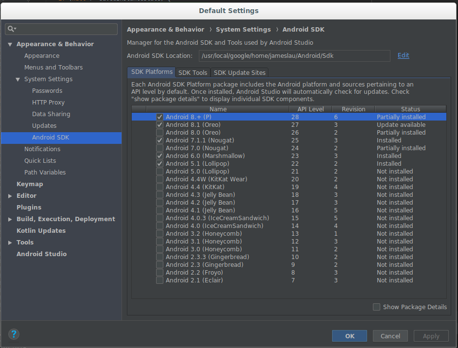
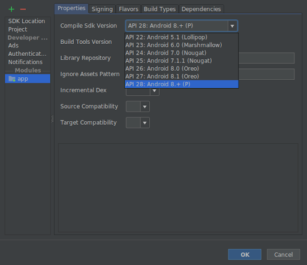
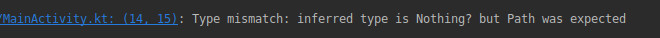
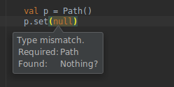
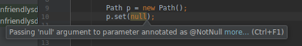
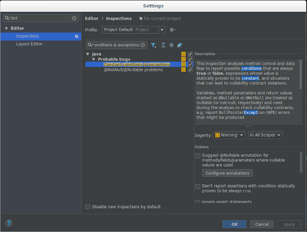

# Android Pie SDK现在更加适合Kotlin

原标题：Android Pie SDK is now more Kotlin-friendly  
链接：[https://android-developers.googleblog.com/2018/08/android-pie-sdk-is-now-more-kotlin.html](https://android-developers.googleblog.com/2018/08/android-pie-sdk-is-now-more-kotlin.html)  
作者：James Lau([@jmslau](https://twitter.com/jmslau)) (产品经理)  
翻译：[arjinmc](https://github.com/arjinmc)  

使用Java编程语言时，最常见的陷阱之一是尝试访问空引用的成员，从而导致NullPointerException抛出。Kotlin通过将可空和不可空类型放到类型系统中来提供保护。这有助于消除代码中的NullPointerException并提高应用的整体质量。当Kotlin代码调用用Java编程语言编写的API时，它依赖于那些API中的可空性注释来确定每个参数和返回类型的可为空性。未注释的参数和返回类型被视为[平台类型](http://kotlinlang.org/docs/reference/java-interop.html#null-safety-and-platform-types)，这削弱了Kotlin的null安全保证。

作为[昨天Android 9宣布](https://android-developers.googleblog.com/2018/08/introducing-android-9-pie.html)的一部分，我们还发布了一个新的Android SDK，其中包含一些最常用API的可空性注释。当您的Kotlin代码调用SDK中的任何带注释的API时，这将保留null安全保证。即使您使用的是Java编程语言，您仍然可以在Android Studio通过使用这些注释来捕获违反可空性约束的行为。

## <u>不是一个突破性的变化</u>

通常，Kotlin中的违反可空性约束会导致编译错误。但是为了确保新注释的API与您现有的代码兼容，我们使用Kotlin编译器团队提供的内部机制来标记最近注释的API。最近注释的API只会产生警告而不是来自Kotlin编译器的错误。您需要使用Kotlin 1.2.60或更高版本。

我们的计划是让新添加的可空性注释仅产生警告，并将严重性级别提高到下一年的Android SDK中的错误。目标是为您提供足够的时间来更新代码。

## <u>如何使用“Kotlin-friendly”SDK</u>

要开始使用，请转到Android Studio中的<strong>Tools > SDK Manager</strong>。在左侧菜单中选择<strong>Android SDK</strong>，并确保SDK平台选项卡已打开。

  
<small>使用Android Studio中的SDK Manager安装API 28修订版6</small>

检查Android 8. +（P）并单击“确定”。这将安装<strong>Android SDK Platform 28修订版6</strong>（如果尚未安装）。之后，将项目的编译SDK版本设置为API 28，以开始使用带有可空性注释的新Android Pie SDK。

  
<small>使用“项目结构”对话框将项目的“编译Sdk版本”更改为API 28</small>

如果Android Studio中的Kotlin插件尚未更新，您可能还需要更新它。<strong>Tools > Kotlin > Configure Kotlin Plugin Updates</strong>，确保您的Kotlin插件版本为1.2.60或更高版本。

设置完成后，如果您的任何代码违反Android SDK中的可空性约束，您的构建将开始显示警告。这是一个警告的例子如下所示。

  
<small>当代码违反Android SDK中最近添加的可空性约束时，来自Kotlin编译器的示例警告。</small>

如果您使用不正确地调用Android API可空性，您也会开始在Android Studio的代码编辑器中看到警告。一个例子如下所示。

  
<small>Android Studio警告有关在android.graphics.Path API中将空引用传递给注释为最近非null类型的参数。</small>

## <u>利用Java编程语言的可空性注释</u>

即使您的代码是Java编程语言，您也可以从新的可空性注释中受益。默认情况下，Android Studio会突出显示任何可违反约束的行为，并发出警告，如下所示：

  
<small>Android Studio在使用Java编程语言编写的代码中显示有关违反可空性约束的警告</small>

为确保启用此检查，您可以转到IDE的设置页面并搜索“Constant conditions & exceptions”检查并确保选中该项。

  
<small>使用“设置”下的“检查”页面可确保启用“常量条件和例外(Constant conditions & exceptions)”代码检查。</small>

如果您使用的是Java编程语言，则违反可空性约束将不会产生任何编译器警告或错误。只有在IDE代码检查可用于标记这些问题。

您还可以在整个项目中运行代码检查，并查看汇总结果。单击<strong>Analyze> Inspect Code...</strong>开始。

## <u>下一步是什么</u>

Android SDK API覆盖面非常大，到目前为止我们只注释了一小部分API - 仍然有很多工作要做。在接下来的几个Android SDK版本中，我们将继续为现有的Android API添加可空性注释，并确保注释新的API。

借助Android SDK对“Kotlin的友好”体验，[AndroidX](https://developer.android.com/topic/libraries/support-library/androidx-overview)（[Jetpack](https://developer.android.com/jetpack/)系列的一部分）和[Android KTX](https://developer.android.com/kotlin/ktx)中的可空性注释，我们将继续为使用Kotlin的开发者改进Android API。如果您还没有尝试过Kotlin，我们建议您尝试一下。Kotlin不仅可以使您的代码更简洁，还可以提高应用程序的稳定性。

快乐的Kotlin！
