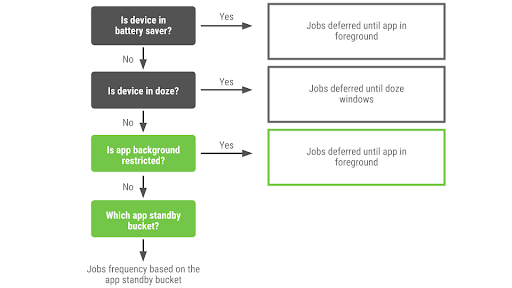

# Android 9 Pie的省电和未来

原标题：Moar Power in Android 9 Pie and the future  
链接：[https://android-developers.googleblog.com/2018/09/moar-power-in-android-9-pie-and-future.html](https://android-developers.googleblog.com/2018/09/moar-power-in-android-9-pie-and-future.html)  
作者：Madan Ankapura (Android产品经理)  
翻译：[arjinmc](https://github.com/arjinmc)  

这是一系列博客文章中的第一篇，其中概述了Android中有关电量的策略和指导。

您的用户非常关心电池 - 如果电池耗尽太快，则意味着他们无法使用您的应用。成为电池电源管理员是您与用户关系的重要组成部分，我们将继续为平台添加功能，帮助您实现这一目标。

作为我们[公布的Play政策](https://android-developers.googleblog.com/2017/12/improving-app-security-and-performance.html)中有关提高应用安全性和性能的一部分，应用的目标API级别必须不超过当前Android版本的一年。保持目标API级别最新将确保应用程序可以利用最新平台版本中提供的安全性和性能增强功能。当您[更新](https://developer.android.com/distribute/best-practices/develop/target-sdk)应用的目标API级别时，评估您的背景和前景需求非常重要，这可能会对功耗和性能产生重大影响。

过去的Android版本包括许多有助于更好地管理电池寿命的功能，例如：

* Android 5.0 Lollipop中的[Job Scheduler](https://developer.android.com/reference/android/app/job/JobScheduler)，允许推迟作业
* Android 6.0 Marshmallow中的[Doze和App Standby](https://developer.android.com/about/versions/marshmallow/android-6.0-changes#behavior-power)会禁用网络访问并暂停同步和后台工作 - 当设备或应用程序长时间未使用时。
* Android 7.0 Nougat中的[Doze改进](https://developer.android.com/about/versions/nougat/android-7.0-changes#doze)，当屏幕关闭而非静止时应用Doze限制的子集。
* Android 8.0 Oreo中的[后台限制](https://developer.android.com/about/versions/oreo/android-8.0-changes#back-all)，可防止后台服务和限制位置更新。

在[Android 9 Pie](https://developer.android.com/about/versions/pie/)中，我们基于以下三个原则进行了进一步的改进：

1. 开发者希望构建出色的应用程序
2. 应用需要节能
3. 用户不希望被烦扰去配置应用程序的设置

这意味着操作系统需要更智能并适应用户偏好，同时改善设备的电池寿命。为了满足这些需求，我们引入了[App Standby Buckets](https://developer.android.com/topic/performance/appstandby)，[后台限制](https://developer.android.com/topic/performance/background-optimization#bg-restrict)和改进的[Battery Saver](https://developer.android.com/about/versions/pie/power#battery-saver)。请在运行Android 9 Pie的设备上启用这些功能来测试您的应用。

Battery Saver和Doze在设备级别上运行，而Adaptive Battery（由Deepmind ML型号驱动的[app standby buckets](https://developer.android.com/about/versions/pie/power#buckets)）和[后台限制](https://developer.android.com/topic/performance/background-optimization#bg-restrict)在每个应用程序的基础上运行。下图有助于了解计划的工作何时运行。

  

当您将应用更新为目标Oreo或更高版本时，请查看此核对[清单](https://developer.android.com/distribute/best-practices/develop/target-sdk)并按照下表进行后台工作处理。

目前使用	| 移植到Oreo
---|---
JobScheduler | [JobScheduler](https://developer.android.com/topic/performance/scheduling#js)
Firebase JobDispatcher | [Firebase JobDispatcher](https://developer.android.com/topic/performance/scheduling#fjd)
Background Service | [Jobscheduler](https://developer.android.com/topic/performance/scheduling#js)
Foreground Service | [Foreground Service](https://developer.android.com/guide/components/services#Foreground) 包含停止服务的操作

注意：当WorkManager API变得稳定时，我们将为大多数这些用例推荐[WorkManager](https://developer.android.com/topic/libraries/architecture/workmanager)

考虑到应用程序开发者投资于正确的设计模式和架构的重要性，我们建议采用以下策略：

1. 在用户积极使用应用程序时执行所需的工作
2. 使在后台完成的任何工作/任务可以推迟
3. 使用前台服务但在通知中提供操作，以便用户可以停止前台服务

类似地，其他OS原图（如警报，网络和FCM消息）也具有开发者文档中有关[电源管理限制的约束](https://developer.android.com/topic/performance/power/power-details)。您可以通过[Google I / O演示](https://youtu.be/kGWT99eMgyM?t=1s)，[DevByte](https://www.youtube.com/watch?v=yVGKOHtYwsA&)和其他[电源优化](http://d.android.com/power)开发者文档了解有关这些功能的更多信息。

我们将在未来几周内发布一系列设计模式指南。敬请关注。

致谢：本系列博客文章与Android Framework和DevRel团队联合合作。
