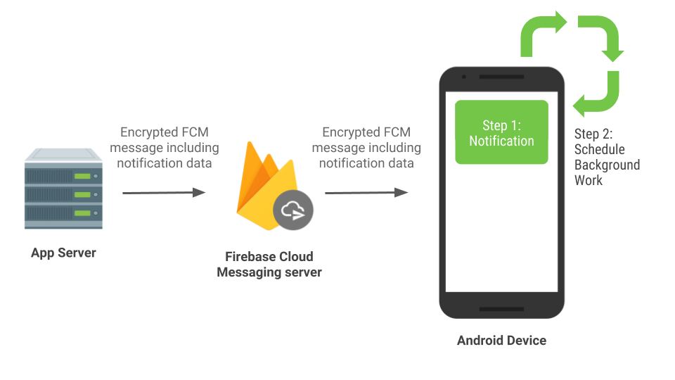
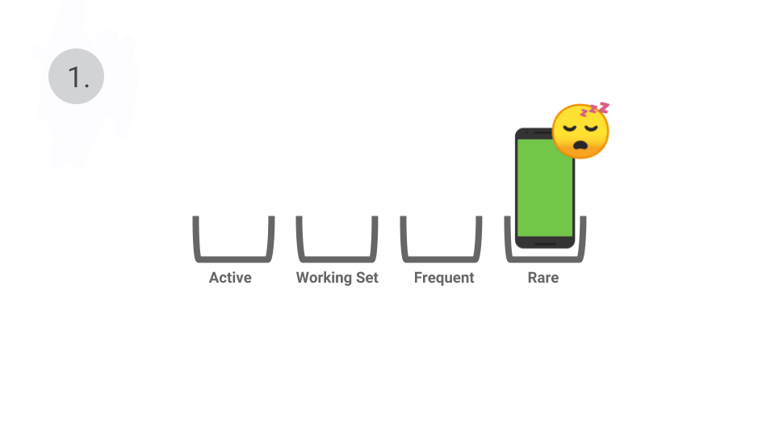

# 使用FCM通知您的用户

原标题：Notifying your users with FCM  
链接：[https://android-developers.googleblog.com/2018/09/notifying-your-users-with-fcm.html](https://android-developers.googleblog.com/2018/09/notifying-your-users-with-fcm.html)  
作者：Jingyu Shi (开发者倡导者，Devrel合伙人)  
翻译：[arjinmc](https://github.com/arjinmc)  

这是一系列博客文章中的第二篇，其中概述了Android中关于电源的策略和指导。

通知是一个功能强大的渠道，可用于保持应用的用户连接和更新。Android提供[Notification API](https://developer.android.com/guide/topics/ui/notifiers/notifications)以在设备上创建和发布通知，但这些通知通常由外部事件触发并从您的应用服务器发送到您的应用。

在这篇博文中，我们将解释何时以及如何生成这些远程通知，以便及时更新用户并最大限度地减少电池消耗。

## 使用FCM进行远程通知

我们建议使用[Firebase云消息传递](https://firebase.google.com/docs/cloud-messaging/)（FCM）向Android设备发送远程通知。FCM是一种免费的跨平台消息传递解决方案，每天可靠地提供数千亿条消息。它主要用于发送远程通知并通知客户端应用程序数据可用于同步。如果您仍然使用[Google云消息传递](https://developers.google.com/cloud-messaging/gcm)（GCM）或[C2DM](https://developers.google.com/android/c2dm/)库（两者都已弃用），则需要[升级](https://firebase.googleblog.com/2018/04/time-to-upgrade-from-gcm-to-fcm.html)到FCM！

您可以选择两种类型的FCM消息：

* [通知消息](https://firebase.google.com/docs/cloud-messaging/concept-options#notifications)，它简化了通知处理，默认情况下具有高优先级。
* [数据消息](https://firebase.google.com/docs/cloud-messaging/concept-options#data_messages)，用于在客户端应用程序中处理FCM消息时。

您可以在数据消息上将优先级设置为[高或正常](https://firebase.google.com/docs/cloud-messaging/concept-options#setting-the-priority-of-a-message)。您可以在Firebase博客上的这篇[博客](http://firebase.googleblog.com/2018/09/handle-fcm-messages-on-android.html)中找到有关FCM消息和消息处理的更多信息。

FCM经过优化，可与Android电源管理[功能](https://developer.android.com/power/#features)配合使用。使用适当的消息优先级和类型可以帮助您及时联系到您的用户，还有助于节省电池电量。在此博客文章中了解有关电源管理功能的更多信息：“[P中的节能和未来](https://android-developers.googleblog.com/2018/09/moar-power-in-android-9-pie-and-future.html?linkId=56731552)”。

## 要通知与否？

您发送的所有通知都应该结构合理，可操作，并为您的用户提供及时和相关的信息。我们建议您遵循[这些通知准则](https://material.io/design/platform-guidance/android-notifications.html)，并避免向用户发送垃圾邮件。没有人愿意被无关或结构不合理的通知分心。如果您的应用行为如此，您的用户可能会阻止通知甚至卸载您的应用。

在[材质设计文档](https://material.io/design/platform-guidance/android-notifications.html)中[当不使用通知](https://material.io/design/platform-guidance/android-notifications.html#usage)的部分的通知，突出显示了你不应该把你的用户的通知的情况。例如，普通优先级FCM数据消息的常见用例是告知应用程序何时准备好同步内容，这不需要用户交互。同步应该在后台安静地进行，不需要通知，您可以使用[WorkManager](https://developer.android.com/topic/libraries/architecture/workmanager) [标注1]或[JobScheduler](https://developer.android.com/reference/android/app/job/JobScheduler) API来安排同步。

## 首先发布通知

如果要发送远程通知，则应始终在收到FCM消息后尽快发布通知。在发布通知之前添加任何其他网络请求将导致某些用户的通知延迟。如果处理不当，可能根本看不到通知，请参阅下面的“避免后台服务”部分。

**
⚠️避免在发布通知之前添加任何其他网络请求
**

另请注意，根据设备的状态，用户操作和应用行为，一个或多个省电功能可能会限制应用的后台工作。因此，您的应用程序的作业和闹钟可能会延迟，并且可能会限制其访问网络的能力。

出于所有这些原因，为了确保及时发送通知，您应该在收到FCM消息之前，在网络提取或调度作业等任何其他工作之前，立即显示通知。

## FCM消息有效负载是您的朋友

要在收到FCM消息时发布通知，您应该在FCM消息有效负载中包含通知所需的所有数据。

这同样适用于数据同步 - 我们建议您的应用在FCM有效负载中发送尽可能多的数据，如果需要，在应用打开时加载剩余的数据。在性能良好的网络上，很有可能在用户打开应用程序时同步数据，因此不会向用户显示微调器。如果网络连接不好，将通过FCM有效负载中的内容向用户发送通知，以及时通知用户。然后，用户可以打开应用程序以加载所有数据。

您还可以使用像[Capillary](https://android-developers.googleblog.com/2018/06/project-capillary-end-to-end-encryption.html)这样的库来端到端地加密FCM消息。下图显示了如何处理FCM消息的一般流程。

  

## 需要更多数据？

与FCM消息有效负载一样方便，它具有4KB的最大限制。如果您需要通过图片附件发送丰富通知，或者希望通过保持应用与媒体内容同步来改善用户体验，则可能需要超过4KB的有效负载限制。为此，我们建议将FCM消息与[WorkManager](https://developer.android.com/topic/libraries/architecture/workmanager) [标注1]或[JobScheduler](https://developer.android.com/reference/android/app/job/JobScheduler) API 结合使用。

如果您需要发布富文本的通知，我们建议首先发布通知，其中包含FCM消息中的一些内容。然后安排作业以获取内容的其余部分。作业完成后，如果通知仍处于活动状态，[更新](https://developer.android.com/training/notify-user/managing.html#Updating)通知。例如，您可以在FCM有效内容中包含内容的缩略图或预览，并首先将其发布在通知中。然后安排作业以获取其余的媒体文件。请注意，如果您已从FCM消息处理程序调度作业，则可能在用户启动应用程序时，预定作业尚未完成。你应该优雅地处理这个案子。

简而言之，使用FCM消息有效负载中的数据发布通知并首先更新您的应用内容。如果您仍需要更多数据，则使用[WorkManager](https://developer.android.com/topic/libraries/architecture/workmanager) [标注1】 或[JobScheduler](https://developer.android.com/reference/android/app/job/JobScheduler) API 等API安排作业。

## 避免后台服务

一个常见的缺陷是使用后台服务来获取FCM消息处理程序中的数据，因为系统会根据最近对Google Play政策的更改来[停止后台服务](https://developer.android.com/about/versions/oreo/background#services)（[从2018年末开始，Google Play将需要最低目标API级别](https://developer.android.com/distribute/best-practices/develop/target-sdk)）。

Android 9 Pie还会在打开[电池保护程序](https://developer.android.com/distribute/best-practices/develop/target-sdk)时强制执行[后台服务执行限制](https://developer.android.com/about/versions/oreo/background)。启动后台服务将导致来自普通优先级FCM消息的IllegalStateException。高优先级消息会授予您一个简短的白名单窗口，允许您启动后台服务。但是，通过网络调用启动后台服务将使服务面临系统终止的风险，因为短执行窗口仅用于发布通知。

您应该避免使用后台服务，而是使用[WorkManager](https://developer.android.com/topic/libraries/architecture/workmanager) 1或[JobScheduler](https://developer.android.com/reference/android/app/job/JobScheduler) API代替在后台执行操作。

## 电源和消息优先级

[Android 6 Marshmallow](http://developer.android.com/m)介绍了Doze。FCM经过优化可与Doze配合使用，您可以使用高优先级FCM消息立即通知您的用户。在打盹模式下，普通优先级消息将延迟到维护窗口。这使系统可以在设备空闲时节省电量，但​​仍可确保用户收到时间紧迫的通知。考虑一个即时消息应用程序，它向用户发送消息或来电或来电监控应用程序向用户发送警报通知。这些是可以使用高优先级FCM消息的一些可接受的示例。

此外，[Android 9 Pie](https://developer.android.com/about/versions/pie/)还推出了[App Standby Buckets](https://developer.android.com/about/versions/pie/power#buckets)和[App Restrictions](https://developer.android.com/about/versions/pie/power#buckets)。

下表显示了各种电源管理功能如何影响邮件传递行为。

条件 | 高优先级消息传递 |正常优先级消息传递
--- | --- | ---
应用程序在前台 | 立即，除非应用受限制（见下文） | 立即，除非应用受限制（见下文）
应用程序在后台 | |
设备在[Doze](https://developer.android.com/training/monitoring-device-state/doze-standby)（M +）和Doze“在路上”（N +） | 即时 | 推迟到维护窗口
[App Standby Buckets](https://developer.android.com/about/versions/pie/power#buckets)（P +） | [可能会受到限制](https://developer.android.com/preview/features/power-details) | 没有限制
[应用限制](https://developer.android.com/topic/performance/background-optimization#bg-restrict)（P +） | 删除所有邮件（见下文） | 删除所有邮件（见下文）
[省电](https://developer.android.com/about/versions/pie/power#battery-saver)  | 没有限制	| 没有限制

**
★注意：从2019年1月开始，[应用程序限制（在电池设置中）](https://developer.android.com/topic/performance/background-optimization#bg-restrict)将包含对FCM消息的限制。您可以使用[isBackgroundRestricted](https://developer.android.com/reference/android/app/ActivityManager#isBackgroundRestricted()) API 查看您的应用是否处于受限状态。一旦您的应用处于受限状态，根本不会向应用传递任何FCM消息。这适用于高优先级和普通优先级FCM消息以及应用程序位于前台或后台时。
**

App Standby Buckets根据应用程序的备用存储桶强加不同级别的限制。根据您的应用所属的存储桶，可能存在每天允许发送的高优先级消息数量的上限。达到上限后，任何后续高优先级消息都将降级为普通优先级。请参阅[电源管理限制](https://developer.android.com/topic/performance/power/power-details)中的更多详细信息。

高优先级FCM消息旨在发送涉及用户交互的远程通知或触发操作。只要您始终将高优先级消息用于这些目的，您的高优先级消息将立即发送，并且将立即显示远程通知。此外，当来自高优先级消息的通知导致用户打开您的应用程序时，该应用程序将被提升为活动存储桶，从而使其免于FCM上限。下面的示例显示了在用户点击由高优先级FCM消息触发的通知后，即时消息应用程序移动到活动的存储桶。

  

然而，如果您使用高优先级消息向阻止的通知通道或不涉及用户交互的任务发送通知，则您将面临浪费应用程序桶中分配的高优先级消息的风险。一旦达到上限，您将无法再发送紧急通知。

总之，您应该只使用高优先级FCM消息向用户提供即时，时间紧迫的通知。这样做可确保这些消息和后续高优先级消息能够在不降级的情况下覆盖您的用户。您应该使用普通优先级消息来触发不需要立即执行的事件，例如时间敏感的通知或后台的数据同步。

## 用Android 9测试！

我们强烈建议您使用上述所有电源管理功能[测试](https://developer.android.com/about/versions/pie/power#testing)您的应用。要详细了解如何在代码中处理Android上的FCM消息，请访问Firebase[博客](http://firebase.googleblog.com/2018/09/handle-fcm-messages-on-android.html)。

感谢您帮助推动生态系统向前发展，制作更好的Android应用，并节省用户的电量！

致谢：此博客文章与FCM和Android团队联合合作。

标注1 [WorkManager](https://developer.android.com/topic/libraries/architecture/workmanager)的是后台处理建议的解决方法,一旦它的[稳定](https://developer.android.com/jetpack/docs/release-notes)则开始使用。

