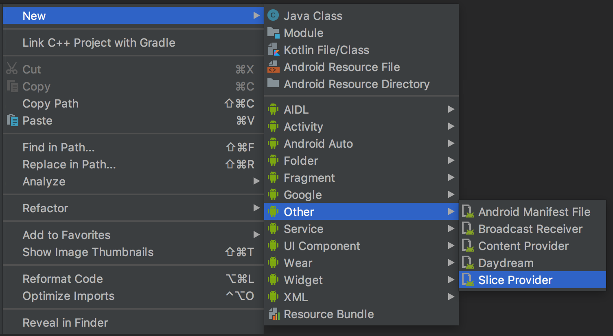
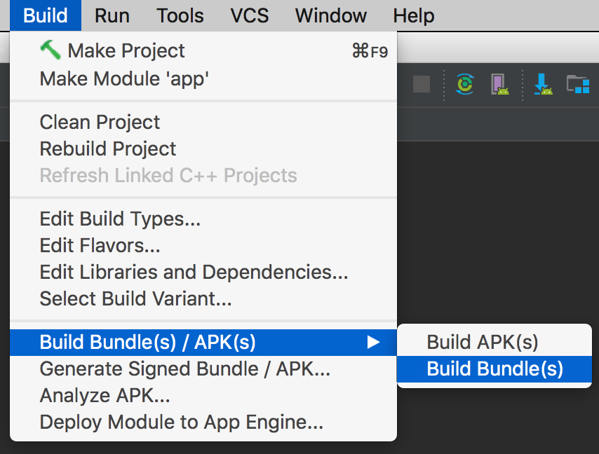
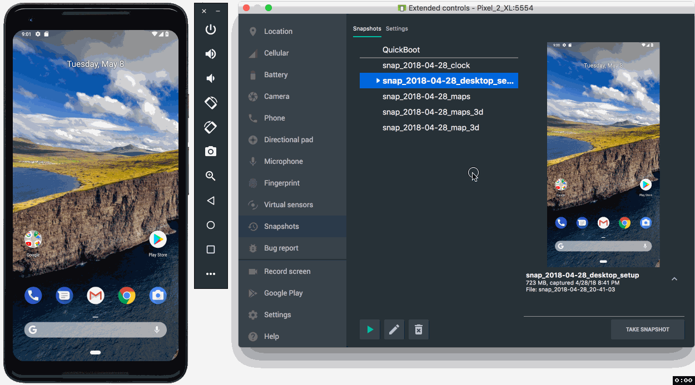

# Android Studio 3.2

原标题：Android Studio 3.2  
链接：[https://android-developers.googleblog.com/2018/09/android-studio-32.html](https://android-developers.googleblog.com/2018/09/android-studio-32.html)  
作者：[Jamal Eason](https://www.google.com/+JamalEason) (Android产品经理)  
翻译：[arjinmc](https://github.com/arjinmc)  

今天，Android Studio 3.2可供[下载](https://developer.android.com/studio/)。Android Studio 3.2是应用开发者切入最新[Android 9 Pie](https://developer.android.com/about/versions/pie/)版本并构建新[Android App bundle](https://developer.android.com/platform/technology/app-bundle/)的最佳方式。自从在[Google I / O '18上宣布Android Studio](https://android-developers.googleblog.com/2018/05/android-studio-3-2-canary.html)更新以来，我们已经改进并完善了20多项新功能，并致力于提高Android Studio 3.2稳定版本的质量。

每个开发者都应该使用Android Studio 3.2过渡到使用新的应用程序发布格式[Android App Bundle](https://developer.android.com/platform/technology/app-bundle/)。只需极少的工作，您就可以使用Android Studio生成应用程序包。将应用包捆绑到Google Play后，您可以向用户分发较小的优化应用。[早期采用者](https://youtu.be/flU42CTF3MQ?t=9m24s)已经看到应用程序大小节省了11％到64％的应用程序包比传统的APK应用程序大小。

您不想错过的另一个功能是Energy Profiler。这个新的分析器为您提供了一组工具，可以帮助您诊断和改善应用程序的能源影响。更好的设备电池寿命是最重要的用户请求之一，使用Android Studio 3.2中的Energy Profiler，您可以确保您的应用在合适的时间使用适量的能量，从而改善设备电池寿命。

最后，您还应该查看新的Android Emulator Snapshots功能。通过使用此功能，您可以快速拍摄模拟器当前状态的快照，其中包括屏幕的当前状态，应用程序和设置。您可以在2秒内恢复或启动到您的模拟器快照。对于任何寻求超快启动时间或寻求在可预测的Android环境中运行测试的应用程序开发者，Android Emulator Snapshots是一款适用于应用程序开发的游戏更改功能

除了这些主要功能之外，Android Studio 3.2还有20个新功能以及许多引擎盖下的质量改进。通过使用Android Studio 3.2，您还可以开发最新技术，从[Android Jetpack](https://developer.android.com/jetpack/)到最新的Android人工智能（AI）API和[Android Slices](https://developer.android.com/guide/slices/)。

感谢那些对[canary](https://android-developers.googleblog.com/2018/05/android-studio-3-2-canary.html)和[beta](https://android-developers.googleblog.com/2018/06/android-studio-3-2-beta.html)版本提供早期反馈的人。您的反馈有助于我们改进Android Studio 3.2的质量和功能。如果您已为下一个稳定版本做好准备，并希望使用一组新的生产力功能，则可以[下载](https://developer.android.com/studio/)Android Studio 3.2 以便开始使用。

以下是Android Studio 3.2中的新功能的完整列表，由主要开发者流程组织。

## 开发

* <strong>Slices支持</strong> - Slice是一种通过在Google搜索建议和Google智能助理中显示应用内容来利用内置Android AI功能的新方法。Android Studio 3.2有一个内置模板，可帮助您使用新的Slice Provider API扩展您的应用程序以及新的lint检查，以确保您在构建Slice时遵循最佳实践。要使用，请右键单击项目文件夹，然后导航到<strong>New → Other → Slice Provider</strong>。[了解更多](https://developer.android.com/guide/slices/)。

  
<small>Slice Provider模板</small>

* <strong>示例数据</strong> - 此功能允许您使用占位符数据来帮助设计应用程序。这将帮助您可视化依赖于运行时数据的布局。您可以通过布局编辑器中的弹出窗口添加内置示例数据以填充视图，例如RecyclerViews，ImageViews和TextViews。[了解更多](https://developer.android.com/studio/write/layout-editor#sample-data)。
* <strong>材料设计更新</strong> - 当您开始从Android设计支持库迁移到新的[MaterialComponents](https://www.material.io/develop/android/docs/theming-guide/)应用程序主题和库时，Android Studio 3.2将允许您访问新的和更新的小部件，如BottomAppBar，按钮，卡片，文本字段，新字体样式和更多。[了解更多](https://www.material.io/develop/android/docs/getting-started/)。
* <strong>CMakeList编辑支持</strong> - 对于那些在他们的应用程序中使用C / C++的人，Android Studio更好地支持CMake。在此版本的Android Studio 3.2中，代码完成和语法突出显示现在适用于常见的[CMakeList构建脚本](https://developer.android.com/studio/projects/configure-cmake)命令。
* <strong>什么是新助手</strong> - Android Studio 3.2有一个新的助手面板，在更新后会自动打开，以通知您IDE的最新更改。您也可以通过导航到<strong>Help→Android Studio</strong>中的新功能打开面板 。
* <strong>AndroidX重构支持</strong> - Android Jetpack的一个组件是引入Android扩展库（AndroidX）作为Android支持库的替代品。要将[AndroidX添加到新项目](https://developer.android.com/topic/libraries/support-library/androidx-overview#new-project)，您只需要添加<i>android.useAndroidX=true</i>到您的<i>gradle.properties</i>文件中。此外，Android Studio 3.2还有一个新的内置重构操作，可帮助您的项目迁移新的命名空间和依赖项。此外，如果您有任何尚未迁移到AndroidX名称空间的Maven依赖项，Android Studio构建系统也会自动转换这些项目依赖项。[了解更多](https://developer.android.com/topic/libraries/support-library/androidx-overview)。
* <strong>IntelliJ平台更新</strong> - Android Studio 3.2包含IntelliJ 2018.1.6平台版本。此IntelliJ版本为数据流分析，调试，新检查，内联外部注释，部分Git提交以及更多内容添加了许多改进。[了解更多](https://www.jetbrains.com/idea/whatsnew/#v2018-1)。
* <strong>Kotlin更新</strong> - Android Studio 3.2捆绑了Kotlin 1.2.61，支持Kotlin友好的Android 9 Pie SDK。[了解更多](https://android-developers.googleblog.com/2018/08/android-pie-sdk-is-now-more-kotlin.html)。

## 构建
* <strong>Android App Bundle（应用程序包）</strong> - Android应用程序包是一种新的应用程序发布格式，旨在帮助您向用户提供较小的APK并减少应用程序的下载大小。Google Play的新应用服务模型称为动态传送，可处理您的应用包，为每个用户的设备配置生成并提供优化的APK，因此他们只下载运行您的应用所需的代码和资源。使用Android Studio 3.2或通过[命令行](https://d.android.com/studio/build/building-cmdline#build_bundle)，您可以轻松地将代码构建为应用程序包，并根据语言，屏幕密度和ABI获得较小APK的优势，而无需更改应用程序代码。[了解更多](https://developer.android.com/guide/app-bundle/)。

  
<small>构建Android应用程序包</small>

* <strong>D8 Desugaring</strong> - 在某些情况下，新的Java语言功能需要新的字节码和语言API。但是，较旧的Android设备可能不支持这些功能。Desugaring允许您在构建过程中使用旧的字节码和语言API替换旧设备上的这些功能。默认情况下，Android Studio 3.2会启用D8 desugaring，现在您可以在定位旧设备时使用大多数最新语言更改。
* <strong>R8优化器</strong> - 从Android Studio 3.2开始，我们开始转换为使用R8替代ProGuard来优化和缩小Java语言字节码。R8仍处于试验阶段，因此我们不建议使用R8发布您的应用程序，但现在是给Android Studio团队提供早期反馈的好时机，以便我们可以在R8完全取代ProGuard之前进行任何调整。[了解更多](https://r8.googlesource.com/r8)。

## 测试

* <strong>模拟器快照</strong> - 最新版本的Android模拟器允许您创建模拟器当前状态的快照，然后启动并在2秒内切换到任何快照。基于Android Emulator [Quickboot](https://android-developers.googleblog.com/2017/12/quick-boot-top-features-in-android.html)功能，Android快照可以更快地保存和加载此稳定版本，因为它具有引擎盖下的速度增强功能。在测试和开发您的应用程序时，Android快照允许您使用您想要的预设，应用程序，数据和设置预先配置Android虚拟设备（AVD）快照，并重复返回到同一快照。[了解更多](https://developer.android.com/studio/run/emulator#snapshots)。

  
<small>Android模拟器快照</small>

* <strong>微软®的Hyper-V™支持</strong> - 现在可以运行在Android模拟器上的Windows ® 10的[计算机具有Hyper-V启用](https://android-developers.googleblog.com/2018/07/android-emulator-amd-processor-hyper-v.html)。英特尔HAXM仍然是最快的Android模拟器体验的默认管理程序。但是，由于Microsoft最近的开源贡献以及新的Windows Hypervisor Platform（WHPX）API的添加，Android Emulator可以与其他Hyper-V支持的应用程序（如本地虚拟机）共存，使用新的Hyper-V支持。[了解更多](https://developer.android.com/studio/run/emulator-acceleration#vm-windows)。
* <strong>AMD ®处理器支持</strong> - AMD处理器目前在Android模拟器在Windows 10以前支持运行Android模拟器只限于运行Windows时降低软件仿真，但谁拥有AMD处理器的开发者现在可以有硬件加速性能。[了解更多](https://android-developers.googleblog.com/2018/07/android-emulator-amd-processor-hyper-v.html)。
* <strong>Android模拟器中的屏幕录制</strong> - 您现在可以使用Android模拟器中的新屏幕录制功能在任何Android API级别上录制屏幕和音频。在过去，物理Android设备上的屏幕录制仅适用于Android 4.4 KitKat（API 19）及更高版本，没有音频，Android Emulator支持有限。使用最新的Android模拟器（v28.0。+），您不再受此限制。作为额外的奖励，有一个内置的转换输出到GIF和WebM。您可以通过Android Emulator扩展控件面板，命令行和[Android Studio](https://developer.android.com/studio/debug/am-video)触发新的屏幕录制功能。 [了解更多](https://developer.android.com/studio/run/emulator#screen_recording)
* <strong>适用于Android模拟器的虚拟场景摄像头</strong> - Android模拟器中的新虚拟场景摄像头可帮助您开发用于构建增强现实体验的Google平台ARCore。模拟器经过校准，可与ARC应用程序的ARCore API配合使用，还可以注入虚拟场景位图图像。虚拟场景摄像机还可以用作常规的[HAL3兼容](https://source.android.com/devices/camera/camera3)摄像机。[了解更多](https://developers.google.com/ar/develop/java/emulator)。
* <strong>ADB连接助手</strong> - Android Studio 3.2有一个新的助手系统，可帮助解决Android ADB设备连接问题。ADB Connection Assistant将指导您完成将Android设备连接到开发计算机的常见故障排除步骤。您可以从“运行”对话框中触发助手，也可以导航到<strong>Tool → Connection Assistant</strong>。[了解更多](https://developer.android.com/studio/run/device#assistant)。

## 优化

* <strong>Energy Profiler</strong> - 电池寿命是许多手机用户关注的主要问题，您的应用可能会比您意识到的更多地影响电池续航时间。Android Studio性能分析器套件中的新Energy Profiler可帮助您了解应用在Android设备上的能源影响。您现在可以可视化系统组件的估计能耗，并检查可能导致电池消耗的后台事件。要使用能量分析器，请确保您已连接到运行Android 8.0 Oreo（API 26）或更高版本的Android设备或模拟器。[了解更多](https://developer.android.com/studio/profile/energy-profiler.html)。

  
<small>Energy Profiler</small>

* <strong>系统跟踪</strong> - CPU Profiler中的新系统跟踪功能允许您检查应用程序如何以细粒度的细节与系统资源交互。检查线程状态的准确时间和持续时间，可视化CPU瓶颈在所有核心中的位置，并添加自定义跟踪事件以进行分析。要使用系统跟踪，请开始分析应用程序，单击CPU Profiler，然后选择<strong>System Trace</strong>记录配置。[了解更多](https://developer.android.com/studio/profile/cpu-profiler#configurations)。
* <strong>Profiler会话</strong> - 我们现在自动将Profiler数据保存为“会话”，以便稍后在Android Studio打开时重新访问和检查。我们还添加了导入和导出CPU记录和堆转储的功能，以便以后使用其他工具进行分析或检查。[了解更多](https://developer.android.com/studio/profile/android-profiler#sessions)。
* <strong>自动CPU记录</strong> - 您现在可以使用[Debug API](https://developer.android.com/studio/profile/cpu-profiler#debug-api)自动记录CPU活动。将应用程序部署到设备后，探测器会在应用程序时自动开始记录CPU活动调用[startMethodTracing(String tracePath)](https://developer.android.com/reference/android/os/Debug#startMethodTracing(java.lang.String))，并在应用程序停止记录调用[stopMethodTracing()](https://developer.android.com/reference/android/os/Debug#stopMethodTracing())。同样，您现在还可以通过在运行配置中<strong>开始记录方法跟踪</strong>选项来启用，自动开始记录应用启动时的CPU活动。[了解更多](https://developer.android.com/studio/profile/cpu-profiler#trace-startup)。
* <strong>JNI参考跟踪</strong> - 对于那些在Android应用程序中拥有C / C++代码的人，Android Studio 3.2现在允许您在Memory Profiler中检查JNI代码的内存分配。只要将应用程序部署到运行Android 8.0 Oreo（API 26）及更高版本的设备，就可以从JNI引用深入查看分配调用堆栈。要使用该功能，请启动内存探查器会话，然后从“实时分配”下拉菜单中选择JNI堆。[了解更多](https://developer.android.com/studio/profile/memory-profiler#jni)。

回顾一下，最新的Android Studio 3.2 canary包括以下新功能：

### 开发
* AndroidX重构
* 示例数据
* 材料设计更新
* Android Slice
* CMakeList编辑
* 什么是新助手
* 新的Lint检查
* Intellij平台更新
* Kotlin更新

### 构建

* Android App Bundle
* D8 Desugaring
* R8优化器

### 测试
* Android模拟器快照
* Android模拟器中的屏幕记录
* 虚拟场景Android模拟器相机
* AMD处理器支持
* Hyper-V支持
* ADB连接助手

### 优化
* Energy Profiler
* 系统跟踪
* Profiler会话
* 自动CPU记录
* JNI参考跟踪

查看[发布说明](https://developer.android.com/studio/releases/#3-2-0)以获取更多详细信息。

## 入门
从[下载页面](https://developer.android.com/studio/)下载最新版本的Android Studio 3.2 。如果您使用的是以前的Android Studio canary，请务必更新至Android Studio Canary 14或更高版本。如果您想维护稳定版本的Android Studio，您可以同时运行稳定版本和Canary版本的Android Studio。[了解更多](https://developer.android.com/studio/preview/install-preview)。

要使用上述Android Emulator功能，请确保您至少运行Android Emulator v28.0.7+,可通过Android Studio SDK Manager下载。

我们感谢您对自己喜欢的事情以及您希望看到的问题或功能的任何反馈。请注意，为了保持较高的产品质量，默认情况下，稳定版本通道中未启用您在早期版本通道中看到的一些功能（例如[导航编辑器](https://developer.android.com/topic/libraries/architecture/navigation/navigation-implementing#Set-up)）。如果您发现bug或问题，请随时[提出问题](https://source.android.com/source/report-bugs#developer-tools)。在我们的[Google+](https://plus.google.com/103342515830390186255)或[Twitter](http://www.twitter.com/androidstudio)上与我们联系 - Android Studio开发团队。
