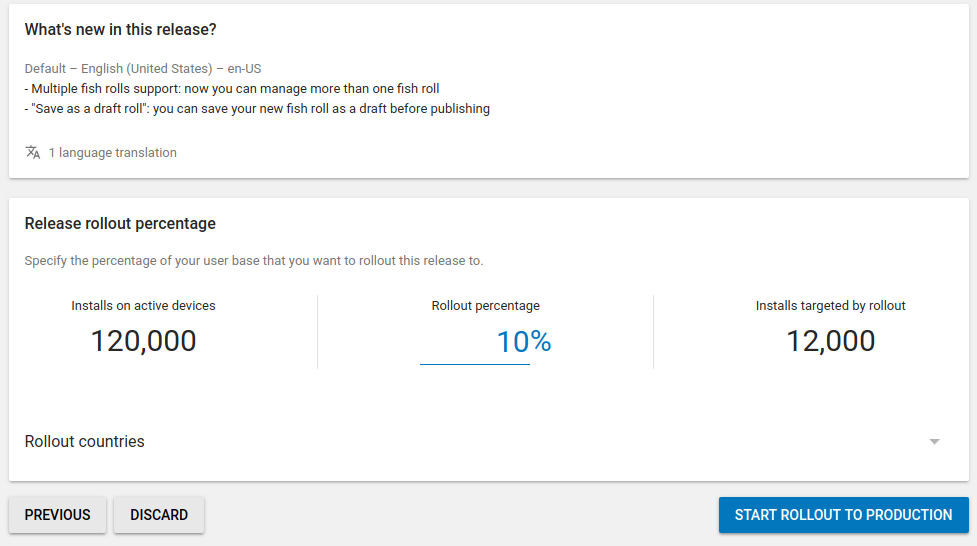

# 分阶段发布让您为用户快速，安全，定期地提供新功能

原标题：Staged releases allow you to bring new features to your users quickly, safely and regularly.  
链接：[https://android-developers.googleblog.com/2018/09/staged-releases-allow-you-to-bring-new.html](https://android-developers.googleblog.com/2018/09/staged-releases-allow-you-to-bring-new.html)  
作者：Peter Armitage (Google Play软件工程师)  
翻译：[arjinmc](https://github.com/arjinmc)  

当您的团队的辛勤工作最终落入您的用户手中时，发布新版本的应用程序是一个激动人心的时刻。但是，发布也可能具有挑战性 - 您希望在不引入性能优化或错误的情况下让现有用户满意。在[今年的Google I / O](https://www.youtube.com/watch?v=Thp9_KVSZ1Y)中，我们讨论了分阶段发布，这是Google发布应用程序版本的重要部分，允许您通过将新版本的应用程序提供给您的应用程序的一小部分来管理新版本的固有风险用户。然后，您可以增加此分数，因为您可以确信新版本按预期工作。我们很高兴今天开始上演的版本将可用于测试轨道以及生产轨道。

我们将仔细研究分阶段版本的工作原理，以及如何将它们用作发布过程的一部分。

  

## 分阶段发布的优点

分阶段发布的第一个好处是它只会将一小部分用户暴露给新版本。如果新版本包含bug，则只有少数人会因此而感到不便。这比一次向所有用户发布新版本要安全得多。

另一个好处是，如果您发现bug，您可以暂停推出，防止任何新用户下载该版本。相反，他们将收到以前的版本。

这些功能可以减轻推出新版本的许多不确定性。这将允许您更频繁地执行此操作。[我们鼓励更频繁地发布服务器版本](https://landing.google.com/sre/book/chapters/release-engineering.html)，因为它减少了每个版本之间的更改次数，使您可以更轻松地进行测试和故障排除。同样的原则适用于应用程序，但在大多数用户升级到最新版本之前会有延迟。

## 分阶段发布作为正常发布过程的一部分

让我们看一下拥有100,000个用户的应用程序的典型发布流程。

1. 每个星期一，开发者都会从通过自动测试的最新版代码构建新版本的应用程序。他们将新版本推向Google Play的[内部测试轨道](https://support.google.com/googleplay/android-developer/answer/3131213#internal_test)，他们的QA团队立即开始手动测试。他们发现的任何bug都可以修复，并且可以构建新版本并推送它们以便重新检查。
2. 周二，如果QA团队批准了最新版本，它可以升级到应用程序的<strong>alpha轨道</strong>。公司的所有员工都选择了测试。将新版本推送到[alpha轨道](https://support.google.com/googleplay/android-developer/answer/3131213#closed_beta)后，员工可以下载新版本。他们可以手动执行此操作，也可以[启用自动更新](https://support.google.com/googleplay/answer/113412?hl=en-GB)，在这种情况下，他们可能会在几个小时内更新。
3. 周三，如果该版本没有报告问题，他们可以将发布推广到<strong>生产轨道并开始推出更新占比10％</strong>。这意味着10,000名用户将有机会升级。有些人会立即升级，有些人会等待。首先接收应用程序的用户中有10％是随机选择的，用户将每周随机选择。
4. 周四，开发者会检查Play控制台查看他们的<strong>崩溃报告</strong>，Android重要信息和反馈。如果这些看起来都很好，他们可以将推出增加到100％。所有用户都可以升级到新版本。
5. 周五，开发商不会改变任何事情，以确保周末无压力！

## 适用于大型应用和小型应用

有些应用程序刚刚开始，虽然没有QA团队，但仍然值得在发布之前在几个不同的设备上测试应用程序。开发者没有为员工用户提供跟踪，而是添加了他们的朋友和家人，如果他们发现问题，他们可以联系他们。

当应用程序变大并使用开放测试轨道时，它可能有5,000个测试人员。这些测试人员不会在Play商店中提供公众反馈，但可以[直接向开发者](https://medium.com/googleplaydev/a-guide-to-the-google-play-console-1bdc79ca956f)提供反馈。如果这个应用程序有100万用户，他们可能会首先释放到1％，然后是10％，然后是100％。

一旦应用程序变得非常受欢迎，它可能有超过100,000个测试人员。在这种情况下，开发者现在可以在他们的测试轨道上进行分阶段发布。

## 如何从问题中恢复过来

发生bug，如果您发现新版本有问题，您可能想要暂停发布。这将阻止用户通过首次升级或安装来获取新版本。但是，那些已经获得新版本的人不会降级。

如果问题不在应用程序本身，而是在应用程序与之通信的服务器上，则最好在服务器中修复问题，然后恢复发布。恢复它允许一部分用户再次访问新版本。这是在停止之前能够下载该版本的同一组用户。

如果问题出现在应用程序中，您将不得不修复它并发布新版本。或者，您可以选择使用更高版本的代码重建以前的版本。然后，您可以开始分阶段发布到先前版本所使用的同一组用户。

## API支持

所有[Play Console API v3](https://developers.google.com/android-publisher/tracks#staged_rollouts)都支持分阶段发行版。将发布标记为“inProgress”并将一小部分人口设置为目标。例如，要开始分阶段发布到5％：

```code
{
  "releases": [{
      "versionCodes": ["99"],
      "userFraction": 0.05,
      "status": "inProgress"
  }]
}
```  

或者，如果您使用UI发布，它将建议一个分数。

## 接下来是什么？

我们希望您发现这些功能非常有用，并利用Google Play来成功更新它们。如果您对分发应用程序的其他一些优秀工具感兴趣，[查看I / O 2018会议](https://www.youtube.com/playlist?list=PLWz5rJ2EKKc9Gq6FEnSXClhYkWAStbwlC)，并了解有关测试轨道和分阶段更新的更多信息。